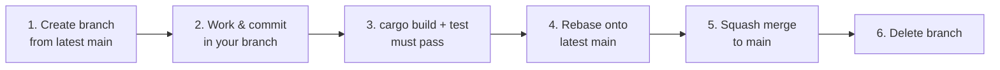

# SiHankor Document Style Guide

## Agent Startup Convention

Agent 启动后第一件事是调用 `sihankor_project_brief` 获取上下文，以工具调用替代人工复述。

## Session Summary Convention

Agent 在会话结束前必须产出 session summary（或声明"无产出"），存为 `docs/knowledge/session-summaries/YYYYMMDD-HHMMSS-summary.sih.md`。若会话无任何 commit 或治理决策，直接写入 `outcome: 无产出`。V-G-SS01 规则会自动检查最近摘要新鲜度（> 24 小时未写则 warn）。

## Branch Convention — Multi-Session Parallel Development

This project uses three or more agent sessions simultaneously. A simple branch protocol prevents write conflicts and merge overhead.

**Before starting any work, read this section. Your session must follow these rules.**

### Branch naming

```
{topic}-{short-description}
```

Examples: `chain-5-fix`, `trail-mcp-tool`, `doc-archive-cleanup`, `dsr-2-metrics`.

### Workflow



### Rules

1. **One session, one branch.** Each agent session creates its own branch at start. Branch name reflects the session's task topic.
2. **Start from main.** `git checkout main && git pull && git checkout -b {topic}-{name}`
3. **Commit prefixes.** Use `fix:`, `feat:`, `docs:`, `refactor:`, `test:` prefixes (conventional commit style) so other sessions can scan commit history.
4. **Build gate before merge.** `cargo build` and `cargo test --all-targets` must pass before merging. No exceptions.
5. **Rebase, not merge from main.** If main has advanced since your branch was created: `git rebase main`. Do not use `git merge main`.
6. **Squash merge to main.** One linear commit per branch topic. No merge commits.
7. **Delete branch after merge.** Non-negotiable. Stale branches accumulate noise.
8. **If you see a branch conflict:** notify the user (moc). Do not resolve conflicts between agent branches without human oversight.
9. **Before starting work, verify file boundaries.** Run `git diff --stat main...HEAD` and confirm your files don't overlap with other active branches. If another branch is working on the same file, stop and report to the user.
10. **Commit or stash before switching branches.** Any `git checkout` must be preceded by `git stash` or `git commit`. Never switch branches with a dirty working tree — other sessions may overwrite uncommitted work.

### Emergency: need to stop work

If a session is interrupted before completing its work:

- Commit all changes with a clear `WIP:` prefix
- Push the branch
- The next session or the user will decide whether to continue or discard

## Character Constraints

- Use only ASCII characters and CJK characters. Do not use emojis or other non-ASCII symbols.
- Replace em-dash (U+2014) with fullwidth colon (U+FF1A) when the em-dash acts as a connector between Chinese words or clauses. Example: `A：：B` -> `A：B`.
- Replace middle dot (U+00B7) with ASCII hyphen `-`.
- Replace left curly quote (U+201C) and right curly quote (U+201D) with straight double quotes `"`.
- Replace right arrow (U+2192) with `->` and left arrow (U+2190) with `<-`.
- Replace not-equal sign (U+2260) with `!=`.
- Permitted CJK punctuation: U+3001, U+3002, U+FF0C, U+FF1A, U+FF1B, U+FF08, U+FF09, U+300A, U+300B, U+300C, U+300D.
- Apply all character replacement rules **only to main narrative text**. Do not modify content inside code fences, Mermaid blocks or frontmatter.
- If a character cannot be converted to standard ASCII or CJK characters without altering the original meaning, retain the original character only when necessary and add a brief note for this exception. Do not create arbitrary replacements.

## Structure Constraints

- Horizontal rules (`---`) are prohibited in the main body. Horizontal rules may only be used as opening and closing delimiters for frontmatter.
- Use level-2 headings (`##`) for section separation; do not use horizontal rules.
- Tables are limited to a maximum of 3 columns. Split wide tables into bullet lists or subsections.
- All fenced code blocks must specify a valid language tag: `mermaid`, `text`, `yaml`, `json`, `rust`.
- Empty fenced code blocks are not allowed. Every code block must contain a valid language tag and actual content.
- If a fenced code block has an unsupported language tag or contains no content, convert it to a valid code block with one of the permitted languages listed above. If conversion is not feasible, remove the code block and describe its content with plain text.
- ASCII art diagrams are prohibited. Use Mermaid `flowchart` for all flowcharts, relationship diagrams and structural diagrams.

## Typography Constraints

- Use bold (`**`) solely for term definition statements and highlighted numeric values. Do not apply bold to regular body text or examples.
- Keep each list item concise and limited to one single concept. Use paragraphs instead of bullet points for lengthy content.
- Do not create deeply nested lists; the maximum nesting level is 2.

## Frontmatter

Frontmatter must be valid YAML wrapped between `---` delimiters. Mandatory fields: `id`, `stage`. The `---` delimiters for frontmatter are the only permitted horizontal rules across all documents.

### Field Definitions

| Field        | Required                         | Format                                       | Description                                                                                                                                                                                                              |
| ------------ | -------------------------------- | -------------------------------------------- | ------------------------------------------------------------------------------------------------------------------------------------------------------------------------------------------------------------------------ |
| `id`         | all                              | `YYMMDD-HHMM[-NNN]-语义短名`                 | Unique document identifier. Date and time (YYMMDD-HHMM) with mandatory hyphen separator, followed by a semantic short name. Example: `240602-0900-on-sihankor`                                                           |
| `stage`      | all                              | `1/3`, `2/3`, `3/3`, `0/<successor-id>`, `X` | Document lifecycle stage. spec/proposal/decision/reference: governance confidence. note: lifecycle maturity (same encoding). Stage value `0/<successor-id>` encodes successor id directly ： no separate successor field. |
| `upstream`   | spec/proposal/decision/reference | document id                                  | Governance authorization source (single value). Notes: optional. Root docs point to own id.                                                                                                                              |
| `decided-by` | decision only                    | human identifier                             | Who decided this decision. Only allowed in decisions/ directory.                                                                                                                                                         |
| `verified`   | note only                        | `YYMMDD`                                     | Date the note's insight was last confirmed as valid.                                                                                                                                                                     |

`type` field is abolished. Document identity (nature) is determined by directory: `specs/` -> spec, `proposals/` -> proposal, `decisions/` -> decision, `reference/` -> reference, `knowledge/notes/` -> note, `knowledge/trails/` -> trail.

### Directory Structure

| Directory           | Nature    | Stage         | Description                                                             |
| ------------------- | --------- | ------------- | ----------------------------------------------------------------------- |
| `specs/`            | spec      | 1/3->2/3->3/3   | System definitions: what the system is                                  |
| `proposals/`        | proposal  | 1/3->2/3->3/3   | Change proposals: what we propose to change                             |
| `decisions/`        | decision  | 2/3->3/3       | Decision records (ADR): why we chose this                               |
| `reference/`        | reference | typically 3/3 | Reference standards: what terms mean                                    |
| `knowledge/notes/`  | note      | 1/3->2/3->3/3   | Practice insights: what we learned. Stage expresses lifecycle maturity. |
| `knowledge/trails/` | trail     | 1/3->2/3->3/3   | Intent turning points and direction shifts                              |
| `knowledge/drafts/` | ：         | none          | Idea fragments, not .sih.md                                             |
| `archive/`          | ：         | X or 0        | Deprecated documents                                                    |

Full governance rules: see `docs/specs/philosophy/On-SiHankor-Canon.sih.md`

## Mermaid Diagrams

- Adopt `flowchart` for all flow and relationship diagrams.
- Keep node labels brief. Use `<br/>` for line breaks within labels.
- Keep edge labels under 10 characters in length.

## SiHankor MCP Tools Convention

When calling any `mcp__sihankor__*` tool, announce the call explicitly before the tool invocation. Use the phrase **"Calling SiHankor..."** followed by the specific tool name and purpose. This makes SiHankor tool usage visible in the conversation flow.

Example:

```
Calling SiHankor: validate_sihmd to check document compliance.
```

All SiHankor tool names start with `mcp__sihankor__`. Every tool response includes a `[SiHankor]` content marker and every tool description is prefixed with `[SiHankor]` for easy identification in the tool list.
