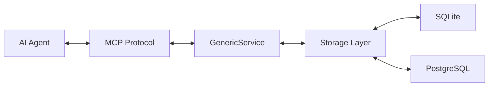

# SiHankor

司衡 -- 代码工程收敛治理引擎

## 概述

SiHankor（司衡）是一个面向文档治理、认知分析与合规验证的治理引擎。它通过 MCP（Model Context Protocol）暴露治理能力接口，供 AI Agent 调用，实现对工程文档的结构化管理与自动化治理。

"司"意为职能管理，"衡"意为度量与平衡。司衡承认治理自身的不完备性，是一个持续收敛的治理系统。

## 架构

项目采用 Rust 实现，核心架构分为以下层次：

- **文档层** -- 管理带有 frontmatter（id/type/stage）的结构化文档
- **状态机层** -- 定义文档的生命周期状态转换
- **存储层** -- 默认使用 SQLite，支持切换至 PostgreSQL
- **服务层** -- 通过 MCP 协议暴露工具接口，以 stdio 作为传输层



## 快速开始

### 构建

```bash
cargo build --release
```

### 运行

```bash
cargo run
```

服务启动后通过标准输入/输出与 MCP 客户端通信。

## 技术栈

| 组件     | 选型                       |
| :------- | :------------------------- |
| 语言     | Rust 2024 edition          |
| 运行时   | Tokio（异步运行时）        |
| MCP 框架 | rmcp 1.7.0                 |
| 序列化   | serde / serde_json         |
| 存储     | SQLite（默认）/ PostgreSQL |

## 项目结构

```text
sihankor/
  src/
    main.rs                # 入口，启动 MCP 服务器
    common/
      generic_service.rs   # 泛型服务层实现
      mod.rs
  docs/
    specs/                 # 规范文档
    decisions/             # 决策记录
    proposals/             # 提案
    glossary/              # 术语表
    notes/                 # 笔记
    plan/                  # 规划
    reference/             # 参考资料
```

## 文档规范

项目文档遵循 SiHankor 文档风格指南：

- 仅使用 ASCII 字符和 CJK 字符
- 每个文档需包含 frontmatter（id/type/stage）
- 使用 Mermaid 流程图代替 ASCII 艺术图
- 表格不超过 3 列

## 许可

MIT
