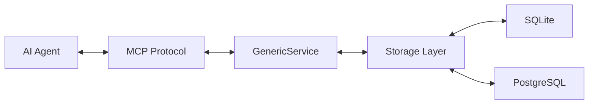

# SiHankor

司衡 -- 代码工程收敛治理引擎

## 概述

SiHankor（司衡）是一个面向文档治理、认知分析与合规验证的治理引擎。它通过 MCP（Model Context Protocol）暴露治理能力接口，供 AI Agent 调用，实现对工程文档的结构化管理与自动化治理。

"司"意为职能管理，"衡"意为度量与平衡。司衡承认治理自身的不完备性，是一个持续收敛的治理系统。

## 架构

项目采用 Rust 实现，核心架构分为以下层次：

- **文档层** -- 管理带有 frontmatter（id/stage/upstream）的结构化文档
- **状态机层** -- 定义文档的生命周期状态转换
- **存储层** -- 默认使用 SQLite，支持切换至 PostgreSQL
- **服务层** -- 通过 MCP 协议暴露工具接口，以 stdio 作为传输层



## 快速开始

### 构建

```bash
cargo build --release
```

### 运行

```bash
cargo run
```

服务启动后通过标准输入/输出与 MCP 客户端通信。

## 技术栈

| 组件     | 选型                       |
| :------- | :------------------------- |
| 语言     | Rust 2024 edition          |
| 运行时   | Tokio（异步运行时）        |
| MCP 框架 | rmcp 1.7.0                 |
| 序列化   | serde / serde_json         |
| 存储     | SQLite（默认）/ PostgreSQL |

## 项目结构

```text
sihankor/
  src/
    main.rs                # 入口，启动 MCP 服务器
    bin/rebuild_index.rs   # 离线索引重建 CLI
    core/
      models.rs            # Stage, Frontmatter, Document, Violation
      database.rs          # SihDatabase trait + SQLite 后端
      parser.rs            # Markdown + frontmatter 解析
      validator.rs         # 六域 13 规则验证
      indexer.rs           # 文档发现与索引管道
      orchestrator.rs      # 管道编排
    mcp_server/
      governance.rs        # 6 个治理 MCP 工具
  docs/
    specs/
      philosophy/          # 哲学五论（3/3）
      engineering/         # 工程规范 + 方向路线图
    decisions/             # 决策记录
    proposals/             # 变更提议
    reference/             # 参照标准
    knowledge/
      notes/               # 实践洞察
      drafts/              # 构思碎片
  .sih/                    # 引擎数据 + 配置（不入 Git）
```

## 文档规范

项目文档遵循 SiHankor 文档风格指南：

- 仅使用 ASCII 字符和 CJK 字符
- 每个文档需包含 frontmatter（id/stage/upstream），nature 由目录推断
- 使用 Mermaid 流程图代替 ASCII 艺术图
- 表格不超过 3 列

### 术语映射

传统工程术语到 SiHankor 正名的对应：

| 传统术语 | SiHankor | 说明 |
|----------|----------|------|
| plan / roadmap | specs/engineering/ | 方向规约，定义系统将如何成为 |
| RFC / 方案对比 | proposals/ | 变更提议，决议后关闭 |
| task / sprint | 文档内部内容 | 不独立成 nature |

### 新读者引导

首次接触司衡，按以下路径建立心智模型：

**核心概念**（每项 5 分钟）：

| 概念 | 一句话 | 深入学习 |
|------|--------|----------|
| **nature** | 文档身份，由目录推断（spec/proposal/decision/reference/note），不在 frontmatter 声明 | [Canon $6.2](docs/specs/philosophy/On-SiHankor-Canon.sih.md) |
| **stage** | 文档生命周期：1/3 起草 -> 2/3 审查中 -> 3/3 定稿。note 有 stage | [Canon $5](docs/specs/philosophy/On-SiHankor-Canon.sih.md) |
| **upstream** | 决策上游链，每个文档声明「谁授权了我」 | [Conventions $4](docs/specs/engineering/SiHankor-Document-Conventions.sih.md) |
| **frontmatter** | 文档元数据（id/stage/upstream），引擎解析和验证的入口 | [Conventions $4](docs/specs/engineering/SiHankor-Document-Conventions.sih.md) |

**推荐阅读顺序**：

1. [司衡总纲](docs/specs/philosophy/On-SiHankor.sih.md) ： 司衡信什么
2. [司衡道论](docs/specs/philosophy/On-SiHankor-Tao.sih.md) ： 六层脉络
3. [司衡法论/Canon](docs/specs/philosophy/On-SiHankor-Canon.sih.md) ： 文档治理规则
4. [文档约定](docs/specs/engineering/SiHankor-Document-Conventions.sih.md) ： 怎么写文档
5. [引擎路线图](docs/specs/engineering/SiHankor-Engine-Roadmap.sih.md) ： 接下来做什么

## 许可

MIT
