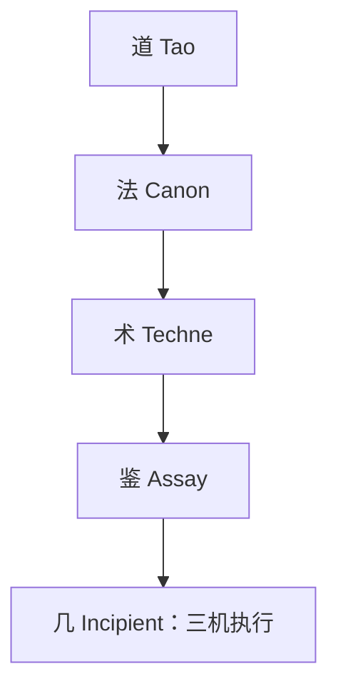

# Techne：术层编排工具规格

## 一、道：术层定位

术(Techne)是司衡四阶段中的执行编排层。其本体性质：

- 术不是机：：不做推理、不做决策、不做验证。iCL/iWW/iCT 是规则驱动的自治推理，Techne 是编排执行的工具集
- 术不在几层：：不用 i- 前缀。Techne 是层名，和 Tao、Canon、Assay 同级
- 术是器：：每个工具是一条编排流水线，串联已有三机完成特定任务

在六层脉络中的位置：



术在三机之上编排，不嵌入三机内部。每个 Techne 工具调用多个 MCP 端点，组合为完整的执行流程。

## 二、法：编排规则

### 2.1 工具命名

```text
mcp__sihankor__{verb}_{noun}_plan
```

无 i- 前缀。动名结构表达编排意图。示例：`generate_document_plan`、`review_progression_plan`。

### 2.2 编排约定

- 每个工具先调 iCL 认知上下文，再调 iWW 生成策略，最后拼装结构化蓝图
- 工具不执行文件写入、不修改数据库、不改变文档状态
- 工具产出是**蓝图**(Plan)，由 Agent 执行实际动作
- 蓝图包含明确的成功标准和回退步骤

### 2.3 蓝图结构

所有 Techne 工具产出的 Plan 共享统一外层：

```json
{
  "plan_id": "唯一标识",
  "plan_type": "generate | review | chain | audit",
  "created_at": "ISO 8601",
  "context": {
    "target_doc": { "id": "...", "title": "...", "nature": "...", "stage": "..." },
    "governance_position": { "role_in_chain": "...", "upstream_chain": ["..."] },
    "relation_graph": { "references": ["..."], "conflicts": ["..."], "gaps": ["..."] }
  },
  "steps": [
    { "order": 1, "action": "...", "tool": "mcp__sihankor__...", "expected_output": "..." }
  ],
  "template": { "...": "..." },
  "constraints": ["措辞约束", "引用约束"],
  "success_criteria": ["校验通过条件"],
  "revert_steps": "回退说明"
}
```

## 三、术：工具清单

### 3.1 generate_document_plan

编排文档生成。调用链：

```text
iCL(analyze_document) → iWW(propose_decision) → 拼装 GenerationPlan
```

输入：
- `target_nature`：目标文档类型(spec/proposal/decision/note/reference)
- `upstream_id`：上游文档 id（可选，root 文档不填）
- `topic_hint`：主题提示（Agent 提供，帮助 iCL 定位上下文）

输出：`GenerationPlan`，包含：
- 建议的文档 id 格式
- frontmatter 字段及约束值
- 内容大纲（节标题 + 每节要覆盖的要点）
- 必须引用的文档列表
- 措辞约束（基于目标 stage）
- iCL 发现的冲突/缺口，新文档需回应

### 3.2 review_progression_plan

编排文档审阅与 stage 推进。调用链：

```text
iCL(analyze_document) → iWW(propose_decision) → iCT(verify_decision) → 拼装 ProgressionPlan
```

输入：
- `doc_id`：待审文档 id

输出：`ProgressionPlan`，包含：
- 当前 stage 与目标 stage
- 每条发散的修复步骤
- 引用更新清单
- stage 推进的前置条件
- 五法检验结果及需人工确认项

### 3.3 governance_chain_plan

编排治理链依赖操作。调用链：

```text
iCL(analyze_document) → 扩展 resolve_chain → 拼装 ChainPlan
```

输入：
- `doc_id`：目标文档 id

输出：`ChainPlan`，包含：
- 上游链状态（已 ratify / 缺失 / stage 不匹配）
- 下游文档影响分析
- 操作顺序（先修上游，再推进目标，最后更新下游引用）
- 每个操作的 affected_documents

### 3.4 code_audit_plan

编排代码与治理文档一致性检查。调用链：

```text
search_docs(关键概念) → iCL(analyze_document 对每份匹配文档) → 拼装 AuditPlan
```

输入：
- `concept_hint`：要检查的概念或关键词

输出：`AuditPlan`，包含：
- 涉及文档清单
- 每份文档的治理声明 → 代码实现的映射检查点
- 不一致清单
- 修复建议及优先级

## 四、鉴：自检

### 4.1 顺因

术层工具的投入来自法(iWW)的决策——没有 iWW 的 DecisionProposal 就没有 generate 的蓝图。因果方向：法决策 → 术执行，不反向。

### 4.2 有度

首批实现 `generate_document_plan` 一个工具。不一口气实现全部——每个工具独立验证后按需推进。

### 4.3 知止

术不越过三机边界：不修改 iCL 的 Cognition 结构，不篡改 iWW 的 DecisionProposal，不替代 iCT 的 Verification。术只编排调用顺序和拼装输出。

术不写入文件、不修改数据库。Agent 对蓝图有最终执行权。

### 4.4 损补

填补道→法→鉴之间缺失的执行编排层。已有工具不受影响。

### 4.5 顺势

规格 stage 1/3，匹配首次实现阶段的开放性。首批工具 `generate_document_plan` 完成后晋升 2/3，全部工具就位后晋升 3/3。

## DEPS

- 260616-1800-techne-orchestration-decision
  - 术层编排工具设计决策
- 260613-1728-sihankor-onomastic-philosophy
  - 命名哲思：Techne 定义、层前缀规则
- 260613-1650-sihankor-mind-design
  - Mind 设计规范：iCL/iWW/iCT 输入输出接口

## SEE-ALSO

- 240610-1030-on-sihankor-canon
  - 法论：编排工具的合法操作边界
