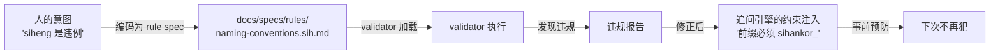

# 司衡自我进化路径：从工具到自治治理运行时

> 2026-06-22，一次自我进化实战中暴露的核心洞察。司衡的 validator 验证了自己的 proposal，发现了字符违规和命名冲突——这恰好证明了司衡的自我进化闭环。本文记录方法论、架构推演和工程路径。

## 一、核心发现

### 1.1 道四的工程实证

司衡验证自己 proposal 的过程中，暴露出三类 bug：

| Bug               | validator 能否发现   | 根因                       |
| ----------------- | -------------------- | -------------------------- |
| -> 和 ::          | 能（有 C-04 规则）   | 生成前没有约束注入         |
| 代码块无语言标签  | 能（有 G-05 规则）   | 同上                       |
| `siheng` 旧名残留 | **不能**（无此规则） | validator 的规则是硬编码的 |

结论：**validator 的盲区就是追问引擎的盲区。** 要防未编码的违规，validator 必须能长出新的规则。

### 1.2 自校正闭环

## 二、三层治理定位

通过对 11 个竞品/参考项目的分析，司衡在治理技术栈中占据独特位置：

### 2.1 三档治理

| 档位         | 代表                        | 机制                   |
| ------------ | --------------------------- | ---------------------- |
| 工具建议     | Pocock skills、agent-skills | Agent 可选遵守         |
| 流程锁定     | Superpowers、ouro-loop      | 强制流水线，跳过卡死   |
| **产出验证** | **司衡**                    | 不锁流程，验证产物合规 |

### 2.2 竞品全景

| 层       | 项目                                                             | 与司衡关系                         |
| -------- | ---------------------------------------------------------------- | ---------------------------------- |
| 方法论   | Superpowers (235K*)、agent-skills、Pocock skills                 | 互补：管"怎么做"                   |
| 治理     | CoStrict (4K*)、architect-guardrail、guardrailsai                | 竞争/互补：流程约束 vs 产出验证    |
| 规格驱动 | Spec Kit (114K*)、OpenSpec (56K*)                                | 互补：管"文件结构"，不管"文件合规" |
| 护栏     | ouro-loop、llamafirewall                                         | 互补：拦截坏的，不验证对的         |
| 代码智能 | codegraph (52K*)、codebase-memory-mcp (11K*)、tree-sitter (26K*) | 集成复用                           |

**司衡是唯一做产出治理验证的引擎。**

### 2.3 上游参考系的三个关键发现

来自 Pocock skills 的对照：

- **grilling**（追问）：是司衡缺的第一层。当前 validator 只做事后检查，没有事前约束注入
- **domain-modeling**（领域建模）：司衡的 glossary 是事后合规检查，domain-modeling 是事中术语教练——两者互补
- **handoff**（交接）：对话压缩为交接文档。司衡的"上下文 -> 提示词"是反向操作

来自 Superpowers 的对照：

- **7 阶段强制流水线**：司衡不做流程锁定——因为流程不能保证意图保真，只有验证能
- **subagent-driven-development**：按任务分派子 Agent。司衡若要做 orchestrator，调度方式不同：按 stage 推进而非按 task 推进
- **writing-plans**：要求"每个任务写出完整代码"。这和司衡的"提示词生成器"是同一思想的不同方向

## 三、自我进化的三层设计

### 3.1 规则数据化

当前 validator 规则硬编码在 Rust 源码中。改为数据驱动的两层结构：

| 层       | 内容                                  | 变更方式                                  |
| -------- | ------------------------------------- | ----------------------------------------- |
| 结构规则 | stage、upstream、nature（治理链骨架） | 硬编码，变更需改 Rust 代码                |
| 内容规则 | 禁用字符、命名约定、格式约束          | **数据驱动**：从 `docs/specs/rules/` 读取 |

新规则 = 写一份 rule spec + 走治理链。不改 Rust 代码。

### 3.2 八域能力矩阵

司衡完整愿景包含八个能力域，按差异化程度和优先级分期建设：

| 优先级 | 域                   | 策略                               |
| ------ | -------------------- | ---------------------------------- |
| P0     | 审计溯源（已有）     | 自建                               |
| P0     | 需求收敛（追问引擎） | 自建                               |
| P1     | 迭代自校正           | 自建                               |
| P2     | 架构约束             | 集成词汇 + 自建约束引擎            |
| P2     | 代码检索索引         | 复用 codegraph + tree-sitter       |
| P2     | 流程技能编排         | 集成社区 skill 格式 + 自建调度器   |
| P3     | 安全护栏             | 集成 ouro-loop 风格 + 自建规则引擎 |
| P3     | MCP 工具调度         | 标准 MCP 协议                      |

### 3.3 自我进化的边界

道一禁自动进化：**司衡不能自己决定"应该加什么规则"。**

- **人可以做的**：声明"siheng 是违规命名"→ 写 rule spec
- **司衡可以做的**：加载 rule spec → 执行 → 发现违规 → 注入约束到追问引擎 → 下次事前预防
- **司衡不能做的**：自己决定"应该加一条规则"——意图必须来自人

## 四、当前推进中的提案

| 文档                                           | stage | 内容                                            |
| ---------------------------------------------- | ----- | ----------------------------------------------- |
| `proposals/260622-1325-grilling-engine.sih.md` | 1/3   | 追问引擎设计：元规则驱动的四问模型 + 提示词生成 |

司衡已用自己的 validator 验证了此提案：通过（修正 3 个违规后）。五法检验全 through。

## 五、@limitations

1. **八域矩阵的优先级是建议**，基于差异化程度和竞品成熟度的静态分析，未考虑人力和时间约束
2. **规则数据化设计尚未有详细 spec**，仅停留在架构层面
3. **单案例局限**：司衡验证自己的提案只发生了一次，更多次的自我进化循环能暴露更多规则盲区
4. **竞品分析截止 2026-06-22**，已考虑的项目：Pocock skills、Superpowers、agent-skills、CoStrict、Spec Kit、OpenSpec、ouro-loop、guardrailsai、codegraph 等 15+

## DEPS

- 240602-1000-on-sihankor-assay：鉴论（反推九段式）
- 240610-1030-on-sihankor-canon：法论
- 260613-1650-sihankor-mind-design：Mind 设计规范
- 260618-1000-multi-agent-governance-patterns：多 Agent 协作治理模式元洞察
- 260622-1325-grilling-engine：追问引擎设计提案

## SEE-ALSO

- Pocock skills: <https://github.com/mattpocock/skills>
- Superpowers: <https://github.com/obra/superpowers>
- agent-skills: <https://github.com/addyosmani/agent-skills>
- CoStrict: <https://github.com/zgsm-ai/costrict>
- Spec Kit: <https://github.com/github/spec-kit>
- OpenSpec: <https://github.com/Fission-AI/OpenSpec>
