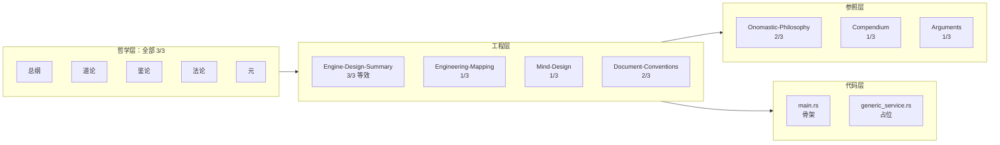
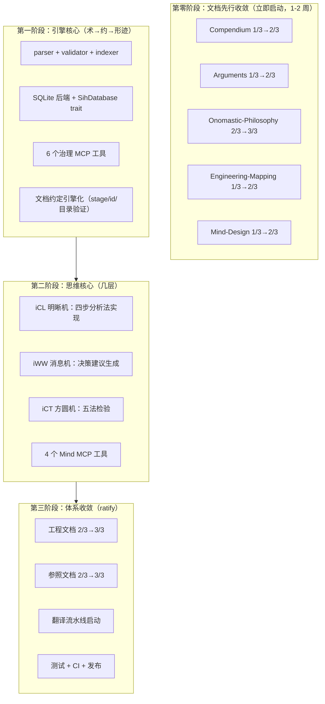
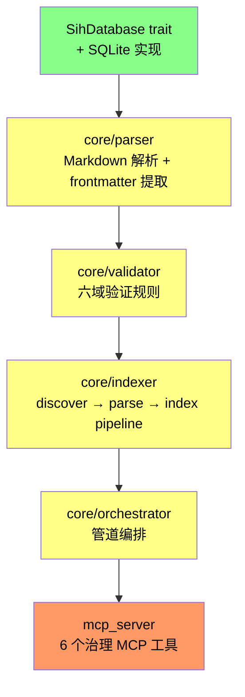
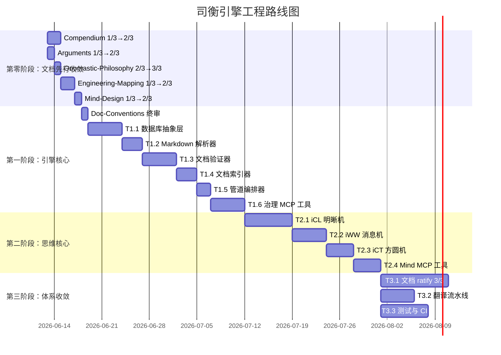

# 司衡引擎下一步方向与任务计划

> 基于当前 docs/ 全部文档与 src/ 代码库的全面审查，生成于 2026-06-13。
> 前置计划：[SiHankor-Legacy-Migration-Plan](./SiHankor-Legacy-Migration-Plan.sih.md)（已完成）。

## 一、当前状态总览

### 1.1 已完成

| 领域        | 内容                                                | 状态               |
| ----------- | --------------------------------------------------- | ------------------ |
| 哲学五论    | 总纲/道论/鉴论/法论/元：全部 3/3                    | 定稿，不可逆       |
| Legacy 迁移 | 21 个 legacy 文件已审计、迁移、删除（L19/L20 保留） | 完成               |
| Rust 骨架   | MCP server 启动 + GenericService 占位工具           | 可运行，无业务逻辑 |
| Mind 设计   | 四步分析法 + 三机流转 + MCP 工具定义                | 1/3，术层设计完成  |
| 工程映射    | 道→法→术→几完整映射 + 三域边界 + 道家调和           | 1/3，映射框架完成  |
| 文档约定    | stage/id/目录/frontmatter/ADR/事件记录              | 2/3，规则体系完整  |

### 1.2 当前 Docs 成熟度矩阵



### 1.3 核心缺口

| #   | 缺口                       | 严重程度 | 阻塞什么                                   |
| --- | -------------------------- | -------- | ------------------------------------------ |
| G1  | 引擎核心模块未实现         | 高       | 所有治理能力：文档验证、索引、搜索、授权链 |
| G2  | Mind 未实现                | 高       | 认知分析、决策建议、合道验证               |
| G3  | SQLite 后端未实现          | 高       | 文档持久化、全文搜索、关系查询             |
| G4  | 工程文档未收敛（1/3, 2/3） | 中       | 工程实践缺乏权威参照                       |
| G5  | 翻译流水线空置             | 低       | 多语言支持                                 |
| G6  | 无测试、无 CI              | 中       | 可靠性保障                                 |

## 二、总体方向：从哲学到引擎

### 2.1 战略判断

哲学五论已定稿。当前的核心矛盾已从"司衡信什么"转向"司衡怎么把信仰变成能工作的代码"。道一的实践推论在此直接适用：**收敛必-为**——文档体系的收敛已经通过哲学重构完成，代码引擎的收敛尚未开始。

引擎的收敛同样遵守道四：引擎自身的规约（设计文档）与实现（Rust 代码）之间必有间隙。引擎不能声称自己"完美实现了司衡哲学"——它只能声称自己"按照当前认知水平，忠实地将哲学工程化"。

### 2.2 文档推进的差异化策略

E4（原 plan 的"实现先于文档 ratify"）将 1/3→2/3（resolve）和 2/3→3/3（ratify）混为一谈。正确的策略应按文档类型区分：

**类别一：可立即推进（不依赖引擎代码）**

这些文档的上游是五论（全部 3/3），内容对齐是纯文档工作：

| 文档                 | 当前 | 目标 | 推进条件                                |
| -------------------- | ---- | ---- | --------------------------------------- |
| Compendium           | 1/3  | 2/3  | 概念定义与五论一致，交叉引用完整        |
| Arguments            | 1/3  | 2/3  | 论证案例与 Tao/Assay/Canon 章节对应完整 |
| Onomastic-Philosophy | 2/3  | 3/3  | 终审命名体系无矛盾，代号全部 ratify     |

**类别二：应作为设计上游先行推进（顺因之法要求）**

这些文档定义了引擎的工程规范。按顺因之法（意图→规范→实现），规范应先行于实现：

| 文档                | 当前 | 目标 | 推进条件                               |
| ------------------- | ---- | ---- | -------------------------------------- |
| Engineering-Mapping | 1/3  | 2/3  | 映射框架完整，可作为引擎实现的设计依据 |
| Mind-Design         | 1/3  | 2/3  | 四步分析法+三机流转+Schema 定义完整    |

Engineering-Mapping 和 Mind-Design 是**规定实现的设计文档**，不是记录实现的说明文档。它们必须先于代码达到 2/3，才能作为引擎实现的权威参照。

**类别三：需引擎实现验证后才能推进**

| 文档                 | 当前 | 目标 | 推进条件                                        |
| -------------------- | ---- | ---- | ----------------------------------------------- |
| Engineering-Mapping  | 2/3  | 3/3  | 引擎实现中验证所有映射项的正确性                |
| Mind-Design          | 2/3  | 3/3  | Mind MCP 工具全部实现并可用                     |
| Document-Conventions | 2/3  | 3/3  | 引擎 validator 完整覆盖所有格式规则             |
| Compendium           | 2/3  | 3/3  | 所有概念定义在引擎中的 glossary 引用无误        |
| Arguments            | 2/3  | 3/3  | 论证案例的交叉引用在引擎 resolve_chain 中可追溯 |

2/3→3/3（ratify）才需要等待实现验证——因为 ratify 意味着"此规范已被实践证明合道"。

### 2.3 三层推进模型



四个阶段对应六层脉络的工程实现顺序，但文档推进贯穿全程：**文档先行收敛（设计上游就位）→ 术/约/形迹（引擎核心）→ 几（思维核心）→ ratify（体系完备）**。顺因之法要求规范先于实现：Engineering-Mapping 和 Mind-Design 必须先达到 2/3 作为设计依据，再用代码实现去验证它们的正确性，最后 ratify。

## 三、第一阶段：引擎核心实现

> 目标：让司衡引擎具备基础的文档治理能力。覆盖术层（工程化展开）、约层（信息压缩）、形迹层（可观测产物）。

### 3.1 模块实现顺序



### 3.2 任务分解

#### T1.1 数据库抽象层（约 3-5 天）

目标：实现 `SihDatabase` trait 与 SQLite 后端。

```rust
#[async_trait]
pub trait SihDatabase: Send + Sync {
    async fn upsert_document(&self, doc: Document) -> Result<()>;
    async fn get_document(&self, id: &str) -> Result<Option<Document>>;
    async fn search_by_type(&self, doc_type: &str) -> Result<Vec<Document>>;
    async fn search_content(&self, query: &str) -> Result<Vec<SearchResult>>;
    async fn resolve_chain(&self, id: &str, depth: u32) -> Result<Vec<ChainNode>>;
}
```

关键交付：

- `SihDatabase` trait 定义
- `SqliteBackend` 实现（rusqlite 或 sqlx）
- 文档表 schema：id, type, stage, title, upstream, content, frontmatter_json, indexed_at
- `search_content` 初始使用 LIKE（为 FTS5 预留接口）

道四提醒：SQLite 后端的搜索准确性不是 100%——LIKE 有固有的召回率限制。预留 FTS5 迁移路径。

#### T1.2 Markdown 解析器（约 2-3 天）

目标：解析 `.sih.md` 文件，提取 frontmatter 和正文区域。

关键交付：

- frontmatter YAML 解析（serde_yaml）
- id/type/stage 必填字段验证
- 正文区域识别（`---` 分隔符之后的内容）
- 解析错误定位到行号

对应文档约定：[Document-Conventions](../specs/engineering/SiHankor-Document-Conventions.sih.md) $二（id格式）、$四（frontmatter字段）。

#### T1.3 文档验证器（约 3-5 天）

目标：实现六域验证规则。

| 域          | 验证内容                                                 | 对应法 |
| ----------- | -------------------------------------------------------- | ------ |
| frontmatter | id/type/stage 必填、格式校验、upstream 对 treatise 必填  | 顺因   |
| structure   | 目录位置与 type 匹配（F-08）、子目录深度 ≤3              | 有度   |
| content     | 字符约束（AGENTS.md）、代码块语言标签、表格列数 ≤3       | 有度   |
| reference   | resolve_ref 指向有效文档、不可引用 1/3 或 X 文档（G-02） | 顺因   |
| lifecycle   | stage 转移合法性、不可逆向（ratify→reopen→ratify 除外）  | 有度   |
| governance  | upstream 链完整、无循环引用、decided-by 签认存在         | 顺因   |

关键交付：

- 每域独立验证函数，返回 `Vec<Violation>`
- `Violation` 含：rule_id, severity（F/G/J）, message, location
- 验证结果与 Document-Conventions 的可追溯映射

对应文档约定：[Document-Conventions](../specs/engineering/SiHankor-Document-Conventions.sih.md) $八（文档风格约束）。

道四提醒：验证器自身不完备——规则有覆盖不到的边界情况。验证"通过"不等于文档没问题。

#### T1.4 文档索引器（约 2-3 天）

目标：discover → parse → index 管道。

关键交付：

- 目录递归扫描（glob），忽略 `.git/`、`target/`、`archived/`
- 解析 → 验证 → 写入 SQLite 的管道
- 增量索引：按文件 mtime 判断是否需要重新解析
- `index_rebuild` MCP 工具：触发全量重建

#### T1.5 管道编排器（约 1-2 天）

目标：将 parser/validator/indexer 串联为可配置管道。

关键交付：

- `PipelineConfig`：控制哪些验证域启用、验证力度
- 管道执行报告：parsed/validated/indexed 计数 + 错误列表
- 作为 `project_status` MCP 工具的数据源

#### T1.6 治理 MCP 工具（约 3-5 天）

目标：实现 6 个治理引擎 MCP 工具。

| 工具             | 职责                   | 输入           | 输出                         |
| ---------------- | ---------------------- | -------------- | ---------------------------- |
| `validate_sihmd` | 验证文档合规性         | 文件路径或内容 | 违规列表 + 通过/不通过       |
| `search_docs`    | 搜索已索引文档         | 查询字符串     | 匹配文档列表                 |
| `get_document`   | 获取文档元数据和结构   | 文档 ID        | 完整 Document 结构           |
| `resolve_chain`  | 追溯授权链（递归 CTE） | 文档 ID + 深度 | upstream 链 + downstream 树  |
| `project_status` | 项目治理概览           | 无             | 文档统计 + stage 分布 + 告警 |
| `index_rebuild`  | 触发全量索引重建       | 无             | 重建报告                     |

关键交付：

- 每个工具有独立的 rust struct 请求/响应类型
- `resolve_chain` 使用 SQLite recursive CTE
- `project_status` 输出按 type/stage 的分布统计

对应设计文档：[Engine-Design-Summary](../specs/engineering/SiHankor-Engine-Design-Summary.md) $五（治理引擎 MCP）。

### 3.3 第一阶段退出标准

- [x] 引擎可解析 docs/ 下所有 `.sih.md` 文件
- [x] 六域验证规则全部实现，至少覆盖 Document-Conventions 中标记为 F（戒）的规则
- [x] SQLite 数据库可存储和查询文档
- [x] 6 个 MCP 工具可在 IDE 中正常调用
- [x] 通过 AGENTS.md 风格约束的自检验（引擎自身的文档合规）

## 四、第二阶段：思维核心（Mind）实现

> 目标：实现几层的三机流转，使引擎具备认知分析和决策建议能力。
> 前置条件：第一阶段完成。

### 4.1 任务分解

#### T2.1 iCL 明晰机（约 5-7 天）

目标：实现四步分析法的前三步。

输入：文档路径/ID 或问题描述。
输出：`Cognition`（治理定位 + 关系图谱 + 发散诊断）。

关键交付：

- 意图定位：读取 type/stage/upstream，确定文档在治理体系中的位置
- 关系照见：基于 SQLite 的引用/重复/冲突/空白四维关系图谱
- 发散诊断：区分意图漂移/引用断裂/重复冗余/良性多角度讨论
- 每个 `Divergence` 必须含 `confidence`（道四要求：分析也是规约，必含不确定性标注）

对应设计文档：[Mind-Design](../specs/engineering/SiHankor-Mind-Design.sih.md) $三（四步分析法）、$四（三机流转）。

#### T2.2 iWW 消息机（约 3-5 天）

目标：从 iCL 的认知产出生成决策建议。

输入：iCL 的 `Cognition`。
输出：`DecisionProposal`（推荐行动 + 多方案对比 + 影响范围 + 理由）。

关键交付：

- 推荐行动枚举：merge | move | rename | archive | no_action | human_review
- 每个建议必须附 `Rationale`（dao_basis + fa_basis——决策的道法根基）
- 多方案对比（至少两个方案）
- `affected_documents`：只列直接下游，不推测间接影响（最小影响面）

#### T2.3 iCT 方圆机（约 3-4 天）

目标：检验 iWW 的决策建议是否合道。

输入：iCL 的 `Cognition` + iWW 的 `DecisionProposal`。
输出：`Verification`（五法逐条检验 + 道层可追溯性）。

关键交付：

- 五法逐条检验：顺因/有度/知止/损补/顺势，每条返回 pass | fail | conditional
- 道层可追溯性：每个决策建议能追溯到具体道/法条款
- 如果 iCT 返回 fail，流转退回到 iWW 重新生成建议
- 连续三次 fail → `human_review_required`

#### T2.4 Mind MCP 工具（约 3-4 天）

目标：实现 4 个 Mind MCP 工具。

| 工具               | 流转阶段    | 用途                           |
| ------------------ | ----------- | ------------------------------ |
| `analyze_document` | iCL         | 单独查看某文档的治理定位和关系 |
| `propose_decision` | iCL→iWW     | 在认知基础上生成决策建议       |
| `verify_decision`  | iCT         | 单独验证已有决策是否合道       |
| `full_analysis`    | iCL→iWW→iCT | 完整三机流转分析               |

关键约束：

- Mind 工具只读：不修改文件，不代替人类做决定
- 输出必含 `limitations` + `self_question`（道四不可绕过）
- `full_analysis` 输出完整 `AnalysisResult` JSON

对应设计文档：[Mind-Design](../specs/engineering/SiHankor-Mind-Design.sih.md) $五（MCP 工具定义）。

### 4.2 Mind 与引擎的集成

Mind 的输出（`AnalysisResult` JSON）通过引擎的写入工具执行。引擎接收 JSON 后：

1. 检查 `verification.overall`：fail → 拒绝执行，标记 human_review
2. conditional → 执行 dry-run，展示受影响文档的具体文本行
3. pass → 执行 `affected_documents` 中描述的操作

引擎不自行判断是否执行——这是三机分权（F-07 原则）的工程体现。

### 4.3 第二阶段退出标准

- [x] 四步分析法可对任意 `.sih.md` 文档产出完整 `Cognition`
- [x] 决策建议含至少两个方案对比 + 道法根基
- [x] 五法检验逐条执行，不可跳过
- [x] 三机流转不可逆序（iCL→iWW→iCT 严格顺序）
- [x] 所有分析输出必含 `@limitations` + `self_question`

## 五、第三阶段：体系收敛

> 目标：将全部工程和参照文档从 2/3 推进至 3/3，启动翻译流水线，建立测试与 CI。
> 前置条件：第一、二阶段基本完成。第零阶段的 1/3→2/3 和 2/3→3/3（Onomastic-Philosophy）已在引擎实现前完成。

### 5.1 文档 ratify（2/3 → 3/3）

以下文档的 2/3→3/3 需要等待引擎实现验证。1/3→2/3 已在第零阶段完成，此处仅列最终 ratify。

| 文档                  | 当前 stage | 目标 stage | 推进条件                                |
| --------------------- | ---------- | ---------- | --------------------------------------- |
| Engineering-Mapping   | 2/3        | 3/3        | 引擎实现中验证所有映射项的正确性        |
| Mind-Design           | 2/3        | 3/3        | Mind MCP 工具全部实现并可用             |
| Document-Conventions  | 2/3        | 3/3        | 引擎的 validator 完整覆盖所有格式规则   |
| Compendium            | 2/3        | 3/3        | 所有概念定义在引擎 glossary 引用中无误  |
| Arguments             | 2/3        | 3/3        | 论证案例的在引擎 resolve_chain 中可追溯 |
| Engine-Design-Summary | 等效 3/3   | 3/3        | 与引擎实际实现同步更新                  |

推进原则：ratify（3/3）意味着"此规范已被实践证明合道"。因此 2/3→3/3 必须在对应的引擎实现完成并通过验证之后。实现 → 验证 → ratify，顺因之法的因果方向。

### 5.2 翻译流水线

目标：启动 glossary 的中英双语翻译流水线。

- `glossary/po/messages.pot`：从 `zh.yml` 自动提取翻译模板
- `glossary/po/en.po`：英文翻译
- 翻译流水线脚本：`sihankor i18n extract` / `sihankor i18n compile`
- 翻译覆盖率检查作为 `project_status` 的一个指标

### 5.3 测试与 CI

目标：建立引擎的测试基础设施。

关键交付：

- 单元测试：parser/validator 每个验证规则的独立测试用例
- 集成测试：使用 docs/ 下的真实文档作为测试 corpus
- CI pipeline：`cargo test` + `cargo clippy` + `cargo fmt --check`
- 测试 corpus 快照：与 insta 集成，防止回归

### 5.4 CLI 与发布

目标：使司衡引擎可通过命令行独立使用。

关键交付：

- `sihankor` CLI 二进制：子命令（validate/index/search/status）
- 配置文件 `.sih/config.yml`
- `cargo install` 可安装
- 版本管理：遵循语义化版本，0.x 阶段承认不完备（道四）

### 5.5 第三阶段退出标准

- [x] 全部 7 个工程/参照文档达到 3/3
- [x] 翻译流水线可用，英文翻译覆盖核心概念（≥50 条）
- [x] 测试覆盖率 ≥60%（核心模块 ≥80%）
- [x] CI 绿色通过
- [x] `cargo install sihankor` 可安装并运行

## 六、任务时间估算



| 阶段                   | 预估工期 | 累计     |
| ---------------------- | -------- | -------- |
| 第零阶段：文档先行收敛 | 4-7 天   | 4-7 天   |
| 第一阶段：引擎核心     | 18-23 天 | 22-30 天 |
| 第二阶段：思维核心     | 15-20 天 | 37-50 天 |
| 第三阶段：体系收敛     | 10-15 天 | 47-65 天 |

> 注：此为单人全职估算。实际工期取决于可用时间、Rust 熟练度、以及与 AI 的协作效率。道四提醒：估算本身也是规约，与实际必有间隙。

## 七、风险与应对

| 风险                     | 影响         | 应对                                                   |
| ------------------------ | ------------ | ------------------------------------------------------ |
| Mind 实现复杂度过高      | 第二阶段阻塞 | 先实现 `analyze_document`（iCL only），降低 MVP 范围   |
| SQLite FTS5 性能不足     | 搜索体验差   | 预留 PostgreSQL 后端切换，SQLite→PG 迁移路径已验证     |
| 设计文档与引擎实现不一致 | 治理体系分裂 | 设计文档（2/3）先行于实现，实现后反向校准文档再 ratify |
| AI 辅助代码质量不可控    | 技术债务累积 | 每个模块完成后立即编写测试，不积累未测代码             |
| 单人项目可持续性         | 长期风险     | 引擎自身成为治理能力的载体后，AI 可参与维护            |

## 八、立即可执行的第一步

当前（2026-06-13）最该做的事，按优先级排列。分为两条并行线：**文档先行收敛**（第零阶段）和**引擎核心启动**（第一阶段）。

### 文档线（第零阶段，立即启动）

1. **Compendium 1/3 → 2/3**：检查每个概念定义与五论的一致性。逐条对照 `_concepts.yml` 中的 `derives-from` 指向，验证定义文本。约 1-2 天。

2. **Arguments 1/3 → 2/3**：检查论证案例与 Tao/Assay/Canon 章节的对应完整性。Legacy 迁移已补入大量内容，当前主要是交叉引用核对。约 1 天。

3. **Onomastic-Philosophy 2/3 → 3/3**：终审命名体系无矛盾。检查所有代号（iCL/iWW/iCT 等）在各文档中一致使用，中文对/英文对/代号三重对齐完整。约 0.5 天。

4. **Engineering-Mapping 1/3 → 2/3**：确保道→法→术→几的映射表完整，三域边界模型清晰，道家调和概念条目齐备。这是引擎实现的设计上游——必须先就位。约 1-2 天。

5. **Mind-Design 1/3 → 2/3**：确保四步分析法、三机流转模型、输出 Schema 定义完整且自洽。这是 Mind 实现的设计上游。约 1 天。

### 引擎线（第一阶段，文档线完成后启动）

1. **Document-Conventions 终审（2/3 维持，为 validator 准备）**：在写 validator 之前，确认"风格约束"的每一条是否可机械判定。不可机械判定的规则标注 `[human-review]`。约 1 天。

2. **T1.1 数据库抽象层**：定义 `SihDatabase` trait + SQLite 实现。约 3-5 天。

3. **T1.2 + T1.3 解析器与验证器**：接口先行，顺序实现。约 5-8 天。

## 九、已决议事项

以下决策基于对全部 docs 和 src 的审查，在生成此计划时一并决议。

| #   | 决策项             | 决议                                                   | 一句话理由                                    |
| --- | ------------------ | ------------------------------------------------------ | --------------------------------------------- |
| E1  | 引擎实现优先级     | 先核心（术/约/形迹）后 Mind（几）                      | 顺因之法：先有执行基础，再有认知节点          |
| E2  | 数据库选型         | SQLite 起步，预留 PG trait 抽象                        | Engine-Design-Summary 已有设计，不重新选型    |
| E3  | Mind MVP 范围      | 先实现 `analyze_document`（iCL only），再补全 iWW/iCT  | 知止之法：不试图一次性实现完整三机            |
| E4a | 文档 1/3→2/3 策略  | 按类型区分：参照类可立即推进，工程类应作为设计上游先行 | 顺因之法：规范先于实现；ratify 才需要实现验证 |
| E4b | 文档 2/3→3/3 策略  | 实现验证后 ratify                                      | ratify = "已被实践证明合道"，需要实现证据     |
| E5  | 测试策略           | 每个模块完成后立即写测试，使用 docs/ 作为测试 corpus   | 损补之法：损技术债务之有余，补可靠性之不足    |
| E6  | 旧版 Python 引擎   | 不迁移，作为参考实现保留在 Git 历史中                  | 知止之法：已知其存在，不重复建设              |
| E7  | F/G/J 法则归属     | 暂不独立成文，在 Engineering-Mapping 中承载            | glm-D1：三道→四道兼容性审查前置               |
| E8  | 三机工程规范       | 暂不独立成文，在 Mind-Design 中承载                    | glm-D2：引擎骨架阶段建规范是空转              |
| E9  | 术语分级与引用标签 | 暂不处理，Conventions 已功能完整                       | glm-D4：运行时按需补充                        |
| E10 | 概念关系可视化     | 暂不处理，纯可读性不影响体系                           | glm-D7：不影响体系完整性                      |

---
