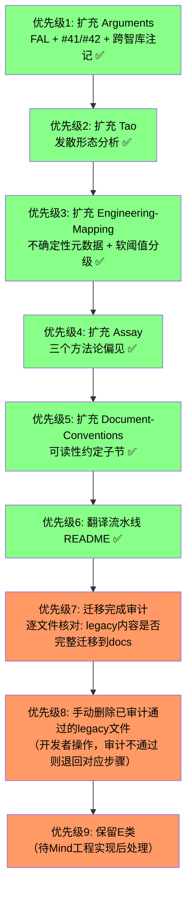

# 司衡文档对齐映射方案

> 将 `legacy/` 中有效信息对齐到 `docs/` 的完整分析与执行计划。
> 生成日期：2026-06-12

## 一、Legacy 文件清单与关键主题

### 1.1 Legacy 全部文件（21个）

| #   | 文件名                                                         | 主题                            | stage   |
| --- | -------------------------------------------------------------- | ------------------------------- | ------- |
| L1  | `sih-doc-readme.md`                                            | 工作区导航 README               | --      |
| L2  | `siheng-meta-20260601-001.sih.md`                              | 司衡元文档 v4.0.0（canonical）  | 3/3     |
| L3  | `decisions-index-20260601-001.sih.md`                          | 决策索引（42+条决策）           | 3/3     |
| L4  | `conceptual-framework-20260602-001.sih.md`                     | 概念框架体系：元/道/法/术系统化 | 2/3     |
| L5  | `elaborate-meta-above-dao-20260602-001.sih.md`                 | 元的追问：四重哲学面相          | 1/3     |
| L6  | `propose-formalize-meta-concept-20260602-001.sih.md`           | 元的正式定义："名而定体"        | 1/3     |
| L7  | `propose-falsify-dao-diverge-converge-20260602-001.sih.md`     | 道一核心命题检验：发散/收敛     | 1/3     |
| L8  | `propose-falsify-dao-understand-20260602-001.sih.md`           | 道三反推验证：代码自晦          | 1/3     |
| L9  | `evaluate-dao-completeness-20260602-001.sih.md`                | 道层完备性系统性评估            | 1/3     |
| L10 | `propose-falsify-daowuwei-20260601-001.sih.md`                 | 五维天道反推验证（FAL）         | 1/3     |
| L11 | `siheng-six-dimensions-philosophy.md`                          | 六维观照哲学（已被证伪）        | --      |
| L12 | `propose-six-dimensions-consistency-check-20260602-001.sih.md` | 六维一致性检查                  | 1/3     |
| L13 | `siheng-architecture-philosophy-20260602-001.sih.md`           | 架构理念："道法自然，人为成事"  | 1/3     |
| L14 | `propose-philosophy-foundation-20260601-001.sih.md`            | 哲学依据体系完备性评估          | 1/3     |
| L15 | `propose-daoharmony-20260601-001.sih.md`                       | 调和道家思想治理建议            | 1/3     |
| L16 | `naming-philosophy-20260531-001.sih.md`                        | 命名哲学总纲                    | propose |
| L17 | `governance-plan-20260602-001.sih.md`                          | 文档治理方案                    | 2/3     |
| L18 | `review-mechanism-20260602-001.sih.md`                         | 内容审核机制                    | 1/3     |
| L19 | `propose-sihankor-mind-20260604-001.sih.md`                    | 思维核心提案                    | 1/3     |
| L20 | `sihankor-mind-meta-20260604-001.sih.md`                       | 思维核心元文档                  | 2/3     |
| L21 | `siheng-mind-20260601-001.md`                                  | 司衡心法（旧版总览）            | --      |

### 1.2 按主题聚类

| 主题群            | 涉及文件        | 核心价值                           |
| ----------------- | --------------- | ---------------------------------- |
| 元（Arche）的发现 | L5, L6          | 元的四重面相梳理、正式命名过程     |
| 道层检验          | L7, L8, L9      | 道一校准、道三反推、道层完备性评估 |
| 五维/六维天道     | L10, L11, L12   | 已被证伪，保留为历史案例           |
| 架构与治理哲学    | L13, L14        | 发散根源分析、哲学依据评估         |
| 道家调和          | L15             | 最小必要干预、软阈值等工程建议     |
| 命名体系          | L16             | 三重对齐、拆字见意、代号规则       |
| 文档治理          | L17, L18        | 格式规范、审核机制                 |
| 思维核心（Mind）  | L19, L20        | 三机流转MCP、六层脉络推导          |
| 旧版总览          | L2, L3, L4, L21 | 已被新docs取代的旧入口             |

## 二、Docs 现有结构概览

```text
docs/
  decisions/
    SiHankor-Philosophy-Arguments.sih.md     [1/3] 论证集
  glossary/
    _concepts.yml                            [概念注册表]
    en.yml                                   [英文映射]
    zh.yml                                   [中文权威定义]
    po/                                      [翻译流水线，空]
  notes/
    Format-Violations.sih.md                 [1/3] 格式违规记录
  proposals/
    SiHankor-Philosophy-Restructure-Plan.sih.md [1/3] 重构计划
  reference/
    SiHankor-Onomastic-Philosophy.sih.md     [2/3] 命名哲思
    SiHankor-Philosophy-Compendium.sih.md    [1/3] 哲学纲要
  specs/
    engineering/
      SiHankor-Document-Conventions.sih.md   [2/3] 文档约定
      SiHankor-Engine-Design-Summary.md      [工程摘要]
      SiHankor-Engineering-Mapping.sih.md    [1/3] 工程映射
    philosophy/
      On-SiHankor.sih.md                     [3/3] 总纲（已完成）
      On-SiHankor-Tao.sih.md                 [3/3] 道论（已完成）
      On-SiHankor-Assay.sih.md               [3/3] 鉴论（已完成）
      On-SiHankor-Canon.sih.md               [3/3] 法论（已完成）
      Arche-The-One-Above-Being.sih.md       [3/3] 元（已完成）
```

标"已完成"者为已定稿（stage 3/3）的核心五论。

## 三、逐文件对齐决策

### 类别A：已覆盖，可废弃

这些 legacy 文件的内容已被 docs 中的对应文件完全吸收并深化，不再有独立保留价值。

**L2** `siheng-meta-20260601-001.sih.md`：废弃。

旧版元文档 v4.0.0。其全部核心内容（立名、六层脉络、公理体系、收敛五法、三机、约系）已被拆分吸收进 docs 五论：`On-SiHankor.sih.md`（总纲）、`On-SiHankor-Tao.sih.md`（道论）、`On-SiHankor-Canon.sih.md`（法论）、`Arche-The-One-Above-Being.sih.md`（元）。新五论在概念精确性（如"收敛必-为"校准）和结构完整性上远超旧版。其 AI 定位段落已经交叉检查，核心判断补入 `Engine-Design-Summary.md` $一和 `Arguments.sih.md` $4.8。

**L21** `siheng-mind-20260601-001.md`：废弃。

旧版"司衡心法"总览。内容与 L2 大量重叠且版本更旧。其结构已被新五论体系取代。唯一的增量信息是八卦表格和四卷结构，但这些在 docs 中已降级为"spec-coding 术内部"概念（见 Canon），不再需要独立承载。

**L4** `conceptual-framework-20260602-001.sih.md`：废弃。

概念框架体系地图。其"概念速览"功能已被 `SiHankor-Philosophy-Compendium.sih.md`（哲学纲要）取代；"全景概念图"已被 `On-SiHankor.sih.md`（总纲）的 Mermaid 图取代；"阅读路径建议"已被各论著自身的导言覆盖。

**L3** `decisions-index-20260601-001.sih.md`：废弃。

旧版决策索引（#01-#42+）。决策是道的发现轨迹——记录的是司衡在演化过程中"如何识别道、如何推导法"的脚印，不是道本身。道是代码工程的因果必然性（被发现的），决策是工程实践中的选择（被发明的）。两者在本体论上有根本区别：道回答"为什么"，决策记录"当时选了哪条路"。

新版已在 `On-SiHankor-Canon.sih.md` 的法论中建立了完整的三阶生命周期和 ADR 签认机制，在 `SiHankor-Document-Conventions.sih.md` 中定义了决策记录的格式。旧索引的历史决策记录中，核心结论已被吸收进五论（如 #41 spec-coding降为术层、#42 AI定位校准）。其 resolve_ref 指向的 `siheng-meta-20260601-001` 本身已废弃——指向已拆除建筑的路标没有保留价值。

保留旧索引作为独立 ADR 集相当于将"史"强行格式化为"法"——把《史记》按维基百科格式改写，有格式正确性无历史质感，且前 37 条决策"原始时序已不可精确恢复"，迁移本身就是有损编码（道四的递归适用）。

**唯一提取**：#41 和 #42 的"道的发现时刻"（用户指出"意图先于代码"不是 spec-coding、"收敛五法从道自然生出"）作为方法论脚注补入 `Arguments.sih.md`，约 3-5 句。这不是迁移决策本身——是在 Arguments 中记录"道被识别的那一刻"。详见执行记录。

**L11** `siheng-six-dimensions-philosophy.md`：废弃。

六维观照哲学。已被鉴论反推九段式系统性证伪（21条子主张，0条幸存）。在 `On-SiHankor-Assay.sih.md` 和 `On-SiHankor-Tao.sih.md` 中作为"五维天道大规模证伪"的历史案例被引用。内容本身不再有迁移价值。

**L12** `propose-six-dimensions-consistency-check-20260602-001.sih.md`：废弃。

六维一致性检查。其核心发现（五维不是道、冲突识别）已被鉴论吸收为案例。

**L1** `sih-doc-readme.md`：废弃。

旧工作区导航 README，指向的文件大部分已废弃或重构。新结构有自明的目录导航。

### 类别B：核心论证已吸收，作为论证集案例补充

这些文件的核心结论已被五论吸收，但它们包含详细的检验过程记录，可作为 `decisions/SiHankor-Philosophy-Arguments.sih.md` 的案例素材。

**L7** `propose-falsify-dao-diverge-converge-20260602-001.sih.md`：合并到 `Arguments`。`[已完成]`

道一校准论证。已补入 $一.2（命题结构精确拆解）：D1-D3 子命题拆解、"天然"三种强度分析、因果必然性 vs 描述性命题区分。弃用 D1-D3 完整检验表格（四维检验表已承载具体检验）。

**L8** `propose-falsify-dao-understand-20260602-001.sih.md`：合并到 `Arguments`。`[已完成]`

道三校准论证。九段式反推的完整过程（U1-U4子主张、最强反证、反例举证）已在 `Arguments` $二中被详尽记录。已补入道层双轴框架（核心矛盾轴 + 因果方向轴）于 $二 开头作为总览，§2.4 精简为一句过渡收束。弃用 U1-U4 完整拆解表格（九段式检验表已覆盖）。

**L10** `propose-falsify-daowuwei-20260601-001.sih.md`：合并到 `Arguments`。

五维天道反推验证（FAL）。21条子主张逐一检验的完整记录（运行之道4条、结构之道4条、演化之道4条、制约之道3条、映射之道5条），四种失效模式归纳。当前 `Arguments` $四仅给出了统计结果（67%证伪/0条幸存）和错维投射表，缺少逐条检验的详细记录。应将FAL的逐维检验过程择要补入 `Arguments` $四。

### 类别C：已吸收但可补充细节到现有 docs

这些文件的核心概念已在 docs 中存在，但有些细节、推导过程或工程建议尚未完全迁移。

**L5** `elaborate-meta-above-dao-20260602-001.sih.md`：已覆盖，无需迁移。

元的四重哲学面相梳理。这是"元"从隐到显过程中的中间产物。其核心内容已被 `Arche-The-One-Above-Being.sih.md` 全面吸收并深化（四元各立一节、命题结构分析、自指检验）。`Arche` 已包含 L5 的全部核心结论，且表述更精确。

**L6** `propose-formalize-meta-concept-20260602-001.sih.md`：已覆盖，无需迁移。

元的正式定义（名而定体）。其五条件框架、统一定义、命名原则均已被 `Arche` 吸收。"在而不名"的六项证据在 `Arche` 中以更精炼的方式重述。

**L13** `siheng-architecture-philosophy-20260602-001.sih.md`：部分补入 `Tao`。`[已完成]`

架构理念。其核心贡献：

- 发散的四种形态（理解/方案/实现/演进）：已补入 `On-SiHankor-Tao.sih.md` $2.1 末尾，"发散的四种形态"子节（8行）
- 发散的条件调节表：已补入 `On-SiHankor-Tao.sih.md` $2.5 实践推论开头（4行），为顺势之法提供道层根基
- 单人发散的论证：决定不补入 Tao（属于反驳回应，非正面定义），如需保留可补入 Arguments
- 收敛三后果（僵化/分裂/消亡）：在道一实践推论中已有对应，基本覆盖

**L9** `evaluate-dao-completeness-20260602-001.sih.md`：已覆盖，无需迁移。

道层完备性评估。其D1-D6六维评估框架的结果已体现在五论中。道层"强完备"判定和五缺口识别在 `On-SiHankor-Tao.sih.md` 和 `Arguments` 中有对应。生产侧/消费侧对称性分析已纳入道三。

**L14** `propose-philosophy-foundation-20260601-001.sih.md`：已覆盖，少量补入 `Arguments`。

哲学依据体系完备性评估。其核心贡献是对各概念的评级和缺陷分析（道A、法B+、三机A-、Spec-Coding B+、公理B、F/G/J B+）。这些评级分析是诊断性文档，其结论已被后续校准工作（道一校准、道三反推、元显性化）所采纳并修正。将其跨智库贡献吸收表中有价值但 docs 中未明确记录的部分（Doub 四公理/五衡法、DS 法层缺位）作为注记写入 `Arguments`，等 `Compendium` 对齐完成后在其中加一句交叉引用指向 Arguments。`[D10]`

**L15** `propose-daoharmony-20260601-001.sih.md`：部分补入 `Engineering-Mapping`。

调和道家思想的治理建议。其六条建议中，部分已在工程体系中实现：

- 最小必要干预：对应 F/G/J 力度体系（已实现）
- 力度曲线：对应顺势之法（已实现）
- 不确定性元数据：`confidence` 字段在 Engine-Design-Summary 中提及但尚未展开
- 软阈值：iCT 的 pass/soft-pass/soft-fail/fail 分级

补入范围：在 `Engineering-Mapping` $七 中补入两个概念条目（不确定性元数据 + 软阈值分级），各约 3-4 行——"是什么"+"对应哪条道/法"+"在工程中体现为什么"。不展开具体配置值（convergence.json 策略、力度曲线情境表等），避免从"映射"滑向"设计规范"。`[D11]`

### 类别D：已迁移到 reference 或 engineering

这些文件的概念已被迁移到 docs 中的对应位置，完整性已核对。

**L16** `naming-philosophy-20260531-001.sih.md`：已迁移到 `reference/SiHankor-Onomastic-Philosophy.sih.md`。

命名哲学总纲。对比后发现：`Onomastic-Philosophy` 已完全吸收并超越了 L16。三重对齐原则、拆字见意（方圆机/消息机/明晰机）、三层命名（哲学名/角色名/工程名）、不可变性：全部在 `Onomastic-Philosophy` 中有更系统、更精确的表述。L16 的子文档索引指向的文件已不再独立存在，其内容被整合进 Onomastic-Philosophy 对应章节。无需迁移。

**L17** `governance-plan-20260602-001.sih.md`：已迁移到 `engineering/SiHankor-Document-Conventions.sih.md`。

文档治理方案。对比后发现：`Document-Conventions` 已系统化吸收了 L17 的核心内容。L17 的阅读引导（前置知识、TL;DR）、生命周期编码（分数设计）、引用标签体系：在 `Document-Conventions` 中有更规范的工程化展开。L17 的"文档和代码同质"论证和通俗化表述风格在 `Document-Conventions` 中被保留。无需迁移。

**L18** `review-mechanism-20260602-001.sih.md`：废弃。`[已完成]`

内容审核机制。其逐文档追踪矩阵绑定于已废弃的 conceptual-framework 设计，具体方法已过时。从中提取了一条原则补入 `On-SiHankor-Canon.sih.md` $2.1 顺因之法的"在治理中的具象"段：归纳合成时必须保持可追溯到原文的 resolve_ref 路径，归纳者的解读不得扭曲原始文档的含义。其余内容不做迁移。

### 类别E：思维核心（Mind）: 特殊处理

**L19** `propose-sihankor-mind-20260604-001.sih.md`：保留在 legacy，待工程实现后迁移。

思维核心提案。根据 `SiHankor-Philosophy-Restructure-Plan.sih.md`："SiHankor Mind 独立文档: 工程实现概念，`src/main.rs` + `Engineering-Mapping` 承载"。当前 Rust 引擎处于骨架阶段，Mind 尚未实现。L19+L20 的内容是工程设计蓝图而非哲学文档。建议：

- 不在本次哲学文档重构中处理
- 待 Rust 引擎实现 Mind MCP server 时，将其设计决策提炼到 `Engineering-Mapping` 或新建 `specs/engineering/SiHankor-Mind-Design.sih.md`
- 当前保留在 legacy，标记为"待工程化"

**L20** `sihankor-mind-meta-20260604-001.sih.md`：同上。

思维核心元文档。处理方式同 L19。其六层脉络展开、公理体系、三机映射的设计是未来工程实现时的权威参考。

## 四、需要修改的 Docs 文件清单

### 4.1 需修改的文件

**文件1**：`decisions/SiHankor-Philosophy-Arguments.sih.md`

修改类型：内容扩充

具体改动：

- $一（道一校准）补充：子命题D1-D3精确拆解、因果必然性vs描述性观察命题区分、天然三种强度分析
- $二（道三校准）补充：生产侧/消费侧结构性不对称更完整论述
- $四（五维归位）补充：FAL逐维检验记录——四个代表性案例（运行/结构/演化/制约/映射各一条），四种失效模式归纳，采用"四短句+分号"格式，约 6 行 `[D2: 摘要+代表性案例]`
- $四 末尾（新增分隔行引导的"历史侧记"）：从决策索引 #41/#42 提取"道的发现时刻"——用户指出"意图先于代码"不是 spec-coding、"收敛五法从道自然生出"的原始记录。嵌入 §四 末尾而非独立成节，约 3-5 句 `[D4: 嵌入末尾]`
- 新增跨智库贡献吸收注记（$四或合适位置）：Doub 四公理/五衡法、DS 法层缺位被纳入论证讨论，相关结论已通过道层校准和法层补全吸收。等 Compendium 对齐完成后在其中加一句交叉引用指向此段落 `[D10: 写入 Arguments]`

**文件2**：`specs/philosophy/On-SiHankor-Tao.sih.md` `[已完成]`

修改类型：内容扩充

具体改动：

- $二（道一）补充：发散的四种形态详述（理解/方案/实现/演进）`[已完成]`
- $二（道一）补充：单人发散的论证 `[决定不补入，属反驳回应]`
- $二（道一）补充：发散条件调节表 `[已完成，精简为4行条件依赖表述]`

**文件3**：`specs/engineering/SiHankor-Engineering-Mapping.sih.md`

修改类型：内容扩充

具体改动：

- $七（道家思想调和）补充：不确定性元数据概念条目（什么是 confidence/impact、对应哪条道/法、工程体现为什么），约 3-4 行 `[D11: 不展开配置值]`
- $七（道家思想调和）补充：软阈值分级概念条目（pass/soft-pass/soft-fail/fail 的定义和触发条件），约 3-4 行 `[D11: 不展开配置值]`

**文件4**：`specs/philosophy/On-SiHankor-Assay.sih.md`

修改类型：内容扩充

具体改动：

- $五（自我指涉）末尾新增子节"三种方法论偏见"：反证偏见、精确性偏见、片断化偏见，说明这些偏见不否定九段式有效性。约 6-8 行 `[D5: 已决 3 维持]`

**文件5**：`specs/engineering/SiHankor-Document-Conventions.sih.md`

修改类型：内容微调

具体改动：

- §八（文档风格约束）末尾新增子节"可读性约定"：TL;DR 模式、前置知识机制、术语首次出现需解释。约 3-5 行，与"格式约束"（引擎可验证）和"可读性约定"（人类自检）区分表述 `[D8: 不独立成文]`

### 4.2 不需新增文件

经过全面对比，docs 现有结构已完整覆盖所有有效信息，不需要创建任何新的 `.sih.md` 治理文档。五论体系（总纲+道论+鉴论+法论+元）+ 命名哲思 + 哲学纲要 + 论证集 + 工程映射 + 文档约定 已经构成了完整的文档体系。

**例外**：`docs/glossary/po/README.md`（非 `.sih.md`，约 5 行纯文本说明，不进入治理链）。详见 D12 决议。

### 4.3 待删除的 Legacy 文件

按类别汇总：

- **A类（已覆盖，直接删除）**：L1, L2, L3, L4, L11, L12, L21（共7个）
- **B类（论证补充后删除）**：L7, L8, L10（共3个）
- **C类（补完后删除）**：L5, L6, L9, L13, L14, L15（共6个；其中L5/L6/L9无需补，可直接删除；L13/L14/L15补充后删除）
- **D类（已迁移，直接删除）**：L16, L17, L18（共3个）
- **E类（保留待工程化）**：L19, L20（共2个）

> **审计前置**：以上所有删除操作均为开发者手动执行。手动删除前必须经过迁移完成审计（优先级5），逐文件确认 legacy 中所有有价值内容已完整迁移至 docs。审计未通过的文件不得删除，退回对应补充步骤。

## 五、执行优先级与推进顺序



> **状态**：P1-P6（内容扩充）全部完成。P7-P9（审计/删除/保留）待开发者手动执行。

## 六、已决议事项

以下 12 项决策已于 2026-06-13 批量决议。执行时参考决议内容，无需再次确认。

| #   | 决策项                  | 决议                                                           | 一句话理由                               |
| --- | ----------------------- | -------------------------------------------------------------- | ---------------------------------------- |
| D1  | Legacy 删除方式         | 直接 rm（Git 可恢复）；删前运行遗漏检测                        | 心理阻力非实际；.archived 等于垃圾不倒掉 |
| D2  | FAL 逐维检验粒度        | 摘要+代表性案例，约 6 行                                       | 已决 7，无需再议                         |
| D3  | Compendium 历史注记时机 | 等 Compendium 对齐完成后处理                                   | 1/3 文档上不做增量写入                   |
| D4  | #41/#42 发现时刻格式    | 嵌入 Arguments §四 末尾，分隔行引导                            | 元叙事不独立成节，打断阅读节奏           |
| D5  | Assay 三个方法论偏见    | 补入 Assay §五 末尾，6-8 行                                    | 已决 3 维持                              |
| D6  | L19/L20 当前动作        | 保留在 legacy，待工程实现后迁移                                | 空白占位违反知止                         |
| D7  | Mind 远期归档位置       | 哲学约束→Engineering-Mapping；运作细节→Engine-Design-Summary   | 边界清晰，不混类                         |
| D8  | 人类可读性规范去向      | Document-Conventions §八 新增子节（3-5 行）                    | 不独立成文，不制造细碎文档生态           |
| D9  | L5/L6/L9 确认删除       | 直接删除，无需再扫                                             | vs-plan 已判过；草稿纸无独立引用价值     |
| D10 | L14 补入范围            | 跨智库贡献注记写入 Arguments，等 Compendium 对齐后交叉引用     | 解除了"等 Compendium"的阻塞              |
| D11 | L15 补入范围            | 两个概念条目各 3-4 行；不展开配置值                            | 映射 vs 设计规范边界不可跨越             |
| D12 | 翻译流水线空文件        | po/ 下新增 README（5 行），说明用途并链接 Document-Conventions | .gitkeep 有可见性无含义                  |

### cc-v2 与 glm-v2 增量决策（2026-06-13 批量决议）

| #   | 决策项                   | cc/glm  | 决议                  | 一句话理由                                        |
| --- | ------------------------ | ------- | --------------------- | ------------------------------------------------- |
| D13 | 1/3 文档写入             | cc-Q1   | A 接受写入            | Arguments是叙事型文档；已决议内容不受1/3限制      |
| D14 | L3 决策索引筛查          | cc-Q2   | A 不筛查              | 决策!=道；前37条时序不可恢复；结论已在五论中      |
| D15 | Tao §2.1 发散四形态覆盖  | cc-Q3   | A 已确认 ✅            | 重读Tao §2.1，\"发散的四种形态\"子节完整存在      |
| D16 | FAL 粒度                 | cc-Q4   | A 10行摘要            | 已执行并验证                                      |
| D17 | "道法自然，人为成事"口号 | cc-Q5   | A 保持现状            | 不让标语喧宾夺主；可随时翻转                      |
| D18 | F/G/J 35条法则归属       | glm-D1  | C 暂不处理            | 三道→四道兼容性审查前置；知止：不预设未实现的规范 |
| D19 | 三机工程规范             | glm-D2  | C 暂不处理            | 已跨映射边界；引擎骨架阶段建规范是空转            |
| D20 | Mind 定位补充确认        | glm-D3  | 保留vs-plan D6/D7立场 | 不在当前阶段决策                                  |
| D21 | 术语分级与引用标签       | glm-D4  | B 暂不处理            | Conventions已功能完整；运行时按需补充             |
| D22 | 三域边界模型             | glm-D5  | C 暂不处理            | Engineering-Mapping已有概念定义；引擎未实现       |
| D23 | 约系(SymBrief/DocBrief)  | glm-D6  | B 暂不处理            | iCL引擎实现细节；空转                             |
| D24 | 概念关系可视化           | glm-D7  | B 暂不处理            | 纯可读性；不影响体系完整性                        |
| D25 | 治理构成性条件论证       | glm-D8  | A 不补入              | 反驳回应非正面定义；vs-plan已决议                 |
| D26 | 速度参考卡格式           | glm-D9  | B 不引入              | AGENTS.md风格约束；GLM自身也不建议                |
| D27 | legacy stage标记更新     | glm-D10 | A 不更新              | 历史快照改标记是形式主义                          |

## 七、执行记录

| 日期       | 项目                        | 操作                                                                    | 涉及文件                                                   |
| ---------- | --------------------------- | ----------------------------------------------------------------------- | ---------------------------------------------------------- |
| 2026-06-12 | L2 AI定位交叉检查           | 补入哲学溯源 + 历史注记                                                 | `Engine-Design-Summary.md` $一, `Arguments.sih.md` $4.8    |
| 2026-06-12 | L13 发散形态+条件调节       | 补入四形态子节 + 条件依赖段                                             | `On-SiHankor-Tao.sih.md` $2.1, $2.5                        |
| 2026-06-12 | L18 内容审核机制            | 废弃；提取原则补入 Canon 顺因段                                         | `On-SiHankor-Canon.sih.md` $2.1                            |
| 2026-06-12 | L7/C1 道一检验              | 补入命题拆解+天然三强度+因果区分                                        | `Arguments.sih.md` $一（新增1.2节，重编号1.2-1.5→1.3-1.6） |
| 2026-06-12 | L8/C2 道三检验              | 补入道层双轴框架论述                                                    | `Arguments.sih.md` $二.4（新增6行，表格之前）              |
| 2026-06-12 | L8/C2 道三检验（修正）      | 双轴框架移至§二开头总览；§2.4精简为过渡句                               | `Arguments.sih.md` $二                                     |
| 2026-06-13 | L3 决策索引                 | 废弃（决策!=道）；提取#41/#42发现时刻为 Arguments 方法论注记            | `Arguments.sih.md` $四末尾（已完成）                       |
| 2026-06-13 | P1-A: FAL 代表性案例        | 五维各一例，5行分号格式，补入 Arguments $四.2                           | `Arguments.sih.md` $四.2~$四.3 之间（已完成）              |
| 2026-06-13 | P1-B: 跨智库注记+D4发现时刻 | D10注记补入$四.8末尾；#41/#42发现时刻以分隔行引导补入$四末尾            | `Arguments.sih.md` $四.8~$五 之间（已完成）                |
| 2026-06-13 | P3: Engineering-Mapping     | 补充两个概念条目：不确定性元数据（$7.5）+ 软阈值分级（$7.6）            | `Engineering-Mapping.sih.md` $七末尾（已完成）             |
| 2026-06-13 | P4: Assay 三种偏见          | 补入反证偏见/精确性偏见/片断化偏见，$5.4                                | `On-SiHankor-Assay.sih.md` $五末尾（已完成）               |
| 2026-06-13 | P5: Document-Conventions    | 补入可读性约定子节 $8.10（TL;DR/前置知识/术语首次解释）                 | `Document-Conventions.sih.md` $八末尾（已完成）            |
| 2026-06-13 | P6: po/README               | 创建 README 说明翻译流水线目录用途                                      | `docs/glossary/po/README.md`（已创建）                     |
| 2026-06-13 | 12 项决策批量决议           | 全部确认。核心变更：D10 目标文档从 Compendium 改为 Arguments            | 见 §六 已决议事项表                                        |
| 2026-06-13 | cc-v2 + glm-v2 决策决议     | cc-v2 Q1-Q5 + glm-v2 D1-D10 合计15项全部决议                            | 见 §六 cc-v2与glm-v2增量决策表                             |
| 2026-06-13 | P7: 迁移完成审计            | 逐文件关键词检测：19个待删文件全部通过                                  | 见 §四.3 待删除清单（审计通过）                            |
| 2026-06-13 | D15 Tao §2.1 核实           | 重读确认：发散的四种形态子节完整存在                                    | `On-SiHankor-Tao.sih.md` §二.1                             |
| 2026-06-13 | P8: 删除 legacy 文件        | rm 19个文件（A/B/C/D类全部），保留 L19/L20 + plan/                      | legacy/ 目录（已完成）                                     |
| 2026-06-13 | P9: Mind 设计规范           | 创建 SiHankor-Mind-Design.sih.md；更新 Engineering-Mapping §八 交叉引用 | `docs/specs/engineering/SiHankor-Mind-Design.sih.md`       |

---

## 附录A：独立审阅记录

本方案的决策过程受益于两份独立的 legacy→docs 对齐审阅：

- **cc-plan.md**（2026-06-12，DeepSeek）：对 21 个 legacy 文件的逐文件处置建议。其增量决策点（Q1-Q5）已提取为 cc-v2-plan.md，决议后纳入本方案 §六。
- **glm-plan.md**（2026-06-12，GLM）：对 docs 工程层缺口（F/G/J 法则、三机规范、Mind 定位等）的系统性识别。其增量决策点（D1-D10）已提取为 glm-v2-plan.md，决议后纳入本方案 §六。

两份审阅均以 docs/ 为单一权威源独立产出，未参考已有 plan 文件。它们的原始版本保留在 `legacy/plan/` 中作为历史记录。

> 注：cc-v2-plan.md 与 glm-v2-plan.md 的决策点已全部决议并纳入本方案 §六 的\"cc-v2 与 glm-v2 增量决策\"表，此处不再重复附录。
