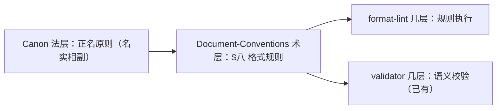

# format-lint：文档格式约束引擎化

## 一、正名：什么是 format-lint

format-lint 是司衡文档格式约束的几层执行机制。它读取 .sih.md 文档，对照 [《文档约定》$八、格式约束](../specs/engineering/SiHankor-Document-Conventions.sih.md#八-格式约束) 中的可验证规则，逐行扫描并输出违规清单。

format-lint 不是 validator。validator 校验的是语义合规（stage 编码合法、upstream 存在、nature 可推断、治理链完整），格式 lint 校验的是字符级表示合规（编码、标点、排版）。

## 二、顺因：治理链中的定位

format-lint 的法源是 Document-Conventions $八，而 Document-Conventions 的法源又是 Canon $二 正名原则（名实相副——文档形式须合其自然）。定位如下：



format-lint 与 validator 并列，同属几层工具。两者分工明确：

| 维度 | validator | format-lint |
|------|-----------|-------------|
| 校验对象 | frontmatter + 语义关系 | 字符 + 行级结构 |
| 法源 | Canon 生命周期规则 + nature 定义 | Document-Conventions $八 |
| 违规类型 | Error/Warning（语义违规） | Error/Warning（格式违规） |
| 已有覆盖 | F-01~J-01（13 条） | 0 条 |

## 三、有度：边界

### 管

- **字符级**：emoji 检测、em-dash `--` (U+2014)、curly quotes、非许可 CJK 标点、非 ASCII 符号
- **行级**：水平线 `---` 在正文中出现、代码块无语言标签（G-05 已有，复用）
- **块级**：表格列数 ≤3（G-04 已有，复用）、列表嵌套深度 ≤2
- **块边界检测**：ASCII 图嫌疑行（连续 ≥3 行的纯 ASCII 图形字符）

### 不管

- 语言风格（主动/被动、句式长度）
- 术语一致性（跨文档 glossary 引用——那是 iCL 的职责）
- 中文分词正确性
- 兼容 AI 编辑工具的本地格式化（如自动 trim trailing whitespace）

### pre-commit hook：默认开启，可关闭

format-lint 安装时默认注册 pre-commit hook。人类通过 `.sih/config.yml` 显式关闭。默认开启的理由来自顺因：格式约束是 kanon 的必然推论，不执行等于无约束。但「可关闭」来自知止：人类对自己仓库的提交决策保有最终权限。

### 中英文混合：管但只提醒

Document-Conventions $8.9 将它定义为「推荐，引擎检测到标记提醒，不阻断」。format-lint 输出 Warning 级别，但永不返回 Error。

## 四、道四：解决的间隙

当前间隙有三：

### 间隙一：AGENTS.md Style Guide 无人执行

AGENTS.md 定义了详尽的格式规则，但它是写给人类编辑参考的手册——没有几层工具强制执行。结果是：

- 编辑器和 AI 助手每次写入文档时产生细微的格式偏差（如 curly quotes 被 smart-paste 机制自动替换、em-dash 被中文输入法输出为 `——` 而非 `：`）。
- 每次审阅周期都需人类逐行比对修复，形成无谓的循环成本。
- 证据：[《编辑器格式与文档格式漂移》](../../knowledge/notes/260616-1745-editor-format-drift.sih.md) note 记录了这一反复现象。

format-lint 将 Style Guide 从「人类手册」变为「引擎可验证」，消除这个循环。

### 间隙二：G-04/G-05 已有，但格式规则不成体系

validator 的 G-04（表格列数）和 G-05（代码块语言标签）覆盖了部分格式约束，但它们散落在语义校验代码中，不对称。新增的 §8.5 字符约束、§8.7 ASCII 图禁止、§8.8 列表深度等在 validator 中无对应规则。

format-lint 将所有格式规则集中在一个模块中，与 validator 保持边界清晰。

### 间隙三：editor-format-drift 的闭合证据

format-lint 的存在本身就是 editor-format-drift note（260616-1745）的道四闭合：note 记录了 gap（编辑器与文档格式之间无自动化校验），format-lint 填上 gap（字符级自动校验）。note 可随 format-lint 实现晋升至 3/3。

## 五、术层实现方案

### 5.1 独立二进制 vs 集成到 engine

| 方案 | 优点 | 缺点 |
|------|------|------|
| A：独立 binary (`sihankor-fmt`) | 边界清晰、可单独 piped、不与 engine 耦合 | 需单独维护两个 binary、共享代码需抽 lib |
| B：集成到 engine 作为子命令 (`sihankor lint --fmt`) | 单 binary、代码复用 | engine 二进制体积增大 |

**推荐方案 A**。理由来自有度之法：format-lint 和 validator 是不同的执行域，不应因实现便利而混淆。独立 binary 符合「法层分离→术层分离→几层分离」的顺因推导——Canon 将格式约束单独列为 L-04，术层（Document-Conventions $八）也将它们与语义规则分开叙述。

### 5.2 规则清单

| 规则 ID | 来源 | 级别 | 说明 |
|---------|------|------|------|
| C-01 | §8.5 | Error | emoji 字符（Unicode Emoji 属性） |
| C-01a | §8.5 | Error | 非 ASCII 非 CJK 非许可标点字符（如 middle dot U+00B7、section sign U+00A7、not-equal U+2260） |
| C-02 | §8.5 | Error | em-dash U+2014 出现在非代码块 |
| C-03 | §8.5 | Error | curly/smart quotes 出现 |
| C-04 | §8.5 | Error | 箭头未使用 ASCII 形式：`→` 应为 `->`，`←` 应为 `<-` |
| C-05 | §8.4 | Error | `---` 出现在正文（非 frontmatter 边界） |
| C-06 | §8.8 | Warning | 列表嵌套超过 2 层 |
| C-07 | §8.7 | Warning | 疑似 ASCII 图：≥3 连续行中，每行以 `|`、`+`、`-`、`/`、`\` 任一字符起始（排除代码块和表格行） |
| C-08 | §8.9 | Warning | 同一段落或标签内混合中英文 |
| C-09 | §8.4 | Error | 代码块未声明有效语言标签（与 validator G-05 等效，format-lint 中独立实现） |
| C-10 | §8.1 | Error | 表格列数 > 3（与 validator G-04 等效，format-lint 中独立实现） |

### 5.3 输出格式

```text
file:line:col: C01 error: emoji found "🔥"
file:line:col: C02 error: em-dash should be fullwidth colon
file:line:col: C08 warning: mixed Chinese/English in token "engine 建议"
```

与常见 lint 工具格式兼容（`file:line:col: code level: message`），便于编辑器集成。

## 六、几层触发

1. **本地手动**：`sihankor-fmt docs/` — 人类在提交前运行
2. **pre-commit hook**（默认开启）：`cargo install sihankor-fmt` 时自动安装 pre-commit hook，在 `git commit` 前自动扫描暂存区涉及的 .sih.md 文件。人类可通过 `.sih/config.yml` 中的 `format.pre_commit: false` 关闭
3. **CI 管道**（未来）：CI workflow 中独立 step，不阻塞 build（format-lint 失败仅 report，不 fail pipeline——这是格式 lint 的知止之法）

## ADR

推进至 3/3（实现完成）。实现见 `src/fmt/` + `src/bin/sihankor-fmt.rs`，决策记录见 [format-lint 设计决策](../decisions/260616-1930-format-lint-decision.sih.md)。

### 审阅修正记录（1/3 审阅）

| # | 发现 | 修正 |
|----|------|------|
| G1 | L-04 实际为引用规则，非格式约束 | upstream 改为 Canonic 正名原则（名实相副） |
| G2 | upstream 指向无因果关联的 plan-semantic-split | upstream 改为 Document-Conventions id（240610-1500-sihankor-document-conventions） |
| D1 | C-01 范围与 C-02/C-03 重叠 | C-01 限定为 emoji，新增 C-01a 覆盖其余非 ASCII 符号 |
| D2 | C-04 Warning 与 §8.5 冲突 | C-04 改为 Error，符合规范原文 |
| D3 | C-10 法源标注 §8.4 应为 §8.1 | 修正来源引用 |
| D4 | 「复用」与独立 binary 矛盾 | 「复用」改为「等效，独立实现」 |
| D5 | C-07 字符集无定义 | 明确为 `|+-/\` 起始行，排除代码块和表格 |
| D6 | C-08「token 内」与 §8.9「段落或标签内」不一致 | 修正为「同一段落或标签内」 |

### decided-by

本提案通过司衡四步分析法从 Canon 和 Document-Conventions 推导产生。方案 A（独立 binary）的选择基于有度之法对格式域与语义域分离的要求。

### DEPS

- [《司衡法论》](../specs/philosophy/On-SiHankor-Canon.sih.md)
- [《文档约定》$八、格式约束](../specs/engineering/SiHankor-Document-Conventions.sih.md#八-格式约束)
- [编辑器格式与文档格式漂移](../../knowledge/notes/260616-1745-editor-format-drift.sih.md)

### SEE-ALSO

- 代码 lint 设计（待独立 proposal）
- CI/CD 管道设计（待独立 proposal）
