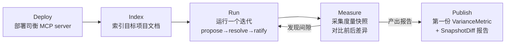

# DSR 周期启动提案

> 在真实项目中部署司衡，用度量管道收集工程验证数据，检验建构之道的工程有效性。

## 一、为什么现在

工程映射三连修复完成后，16 条映射链中 L3/L4 已清零，度量管道（方差/快照/密度/审计/趋势/权衡）全部就绪并通过 MCP 暴露。但所有数据来自司衡自身的文档实践——样本量小、场景单一。

建构主义的道声称"约束力来自工程验证"。当前状态：度量管道存在，但未在真实场景中产生过一份验证报告。

## 二、DSR 是什么

DSR（Dogfood-Self-Review）是司衡在非司衡项目中的部署与实践周期。不是"司衡治理自己的文档"（那叫自我索引），而是"用司衡治理另一个项目的文档"。

一个 DSR 周期包含四个阶段：

## 三、目标项目选择标准

按知止原则，第一个 DSR 项目应满足：

1. **已有 .sih.md 文档**或愿意引入 SiHankor 文档规范
2. **多人协作**——多 agent 场景是司衡的核心使用场景
3. **有迭代周期**——能跑完 propose→resolve→ratify
4. **低风险**——首次 DSR，不应在关键项目上冒进

候选：SiHankor 自身的 `docs/` 目录可作为 DSR-0（已验证，数据已在度量管道中）。DSR-1 应选择外部项目。

## 四、最小可行 DSR-1

| 步骤 | 内容 | 产出 |
|------|------|------|
| 1. 选项目 | 确定目标项目，确认其文档结构 | 项目名 + 文档数 |
| 2. 部署 | cargo build --release，配置 MCP | 可用的 MCP server |
| 3. 索引 | rebuild_index，采集基线快照 | ProjectSnapshot #1 |
| 4. 运行 | 一个治理迭代（至少一个 proposal→decision） | 新文档 + 度量事件 |
| 5. 度量 | variance_metric + snapshot_diff + trend_alignment | 第一份度量报告 |
| 6. 回顾 | 对比前后快照，记录发现 | DSR-1 回顾笔记 |

## 五、度量关注点

DSR-1 应回答以下问题：

1. **方差**：治理介入后，文档违规率是否下降？（variance_metric）
2. **间隙**：规则数与文档数是否同步增长？（snapshot_diff）
3. **趋势**：审查频率是否跟上变更频率？（trend_alignment）
4. **密度**：各文档类型的治理投入是否与风险匹配？（rule_density）
5. **权衡**：决策文档是否记录了背景/决策/后果？（tradeoff_coverage）

## 六、与后续方向的关系

DSR 不阻塞其他方向：
- **方向四（行迹）**：DSR 运行期间可并行设计行迹数据结构
- **方向二（归档）**：随时可做
- **方向一**：已完成

DSR 积累的实践数据将为行迹机制的设计提供经验依据（"什么意图转折需要被记录"来自实践，而非推测）。

## 七、@limitations

1. **样本量**：一个 DSR 周期只有一次前后快照对比，不足以得出统计显著结论。需要多个周期积累。
2. **度量维度**：当前度量管道仅覆盖验证违规维度，架构漂移和字段差异维度未操作化。
3. **外部项目依赖**：DSR-1 的进度依赖目标项目的迭代节奏，不可强行加速。
4. **首次部署风险**：首次在非司衡项目部署 MCP server 可能遇到配置和环境问题。

## DEPS

- 260628-1100-engineering-mapping
  - 工程映射，度量管道的定义来源
  - [工程映射](../specs/engineering/Engineering-Mapping.sih.md)

## SEE-ALSO

- 260628-1600-mapping-fix-trio
  - 三连修复，DSR 的数据基础已诚实化
  - [三连修复](../proposals/260628-1600-mapping-fix-trio.sih.md)
- 260626-1700-dao-as-constructed-design-principles
  - 建构之道，DSR 的哲学动机
  - [道的本体论重构](../knowledge/notes/260626-1700-dao-as-constructed-design-principles.sih.md)
