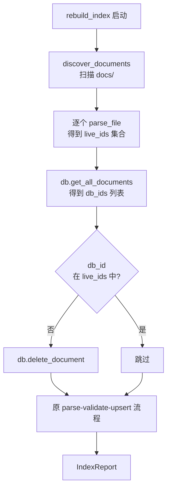

# rebuild_index 孤儿清理 pass 提案

## 一、问题

### 1.1 数据面

当前 `.sih/index.db` 收录 165 篇文档，磁盘上实际存在的 `.sih.md` 文件为 110 篇。多出来的 55 条是索引里的"幽灵条目"，对应早已被替代或删除的旧文件。

| 维度 | 数量 |
| --- | --- |
| 数据库文档总数 | 165 |
| 磁盘实际 `.sih.md` | 110 |
| 多出的幽灵条目 | 55 |
| 幽灵中 stage X | 27 |
| 幽灵中 stage 0/... | 1 |

### 1.2 幽灵的形态

被命中的 id 都属于 2026-05 之前的旧命名方案：

- `sihankor-meta-20260531-001`
- `DESIGN-sihmk-sihankor-doc-parser-20260529-001`
- `origin-of-sihankor-20260531-001`
- `META-status-machine-waning-waxing-20260530-001`
- `sihmd-format-spec-v4`
- `sihmd-engine-implementation-design`

这些文件在 `archive/` 与 `docs/` 都不再存在，索引却把它们保留至今。

### 1.3 后果

`project_status` 输出被污染：64 个 Error 中绝大多数是幽灵条目触发 V-F-03（终态 stage 报错）的结果。`fatal_violations` 列表里混着不存在的 id，CI 阻断判断失去意义。维护者每次都得靠肉眼分辨哪些是"真错"、哪些是"幽灵错"，治理信号被噪音淹没。

### 1.4 根因

`src/core/indexer.rs::rebuild_index` 只 upsert 不 delete。

```rust
for file_path in &files {
    match index_document(db, file_path, validation_config).await {
        ...
        db.upsert_document(doc.clone()).await ...   // 单向写入
    }
}
```

`SihDatabase::delete_document` 接口已存在于 `database.rs:271`，但没有任何调用方在重建流程里使用它。

## 二、方案

### 2.1 核心思路

在 `rebuild_index` 入口处增加一个"孤儿清理 pass"：以磁盘为唯一真相，删除索引中已无对应 `.sih.md` 文件的条目。

### 2.2 判据

**孤儿 = 数据库中存在，但磁盘上找不到对应的 `.sih.md` 文件。**

注意是判"文件不存在"，不判"stage X"也不判"nature unknown"。原因：

- stage X 中混着合法的主动废弃文档（如 `archive/knowledge/notes/260628-2136-...`），按 stage 删会误伤。
- nature unknown 同理，archive 子树里的文档因为父目录不匹配 `infer_nature` 也会落 unknown，按 nature 删会误伤五论等已归档内容。
- 数据库 schema 不存 `file_path` 列，反而**逼我们用 parse 磁盘文件的方式做比对**，比信任一条可能过期的路径字符串更可靠。

### 2.3 流程



### 2.4 数据源

| 数据源 | 用途 | 复用逻辑 |
| --- | --- | --- |
| `discover_documents` | 列举磁盘上所有 `.sih.md` | 复用 `indexer.rs:53` |
| `parser::parse_file` | 从文件得到当前 id | 复用 `indexer.rs:97` |
| `db.get_all_documents` | 取 DB 全量 id | 复用 `database.rs` 既有查询 |
| `db.delete_document` | 清理幽灵条目 | 复用 `database.rs:271`，目前无 caller |

## 三、安全护栏

### 3.1 dry-run 优先

55 条待删中包含形如 `decisions-index-20260601-001` 这种看起来像合法索引文档的 id。直接删风险过高，需要前置一个观察阶段。

CLI 增加 `--prune-dry-run` 标志：

- 仅列举"将删除"的 id 列表，写到 stdout 或指定文件。
- 不动数据库。
- 让维护者 review，必要时从 git history 捞回。

### 3.2 三不删

| 条件 | 处理 |
| --- | --- |
| 文件存在但 stage X | 保留 |
| 文件存在但 nature unknown | 保留 |
| 文件不存在但 stage X | 仍然删（按 2.2 判据） |

### 3.3 输出可审计

清理 pass 在 `IndexReport` 里新增字段：

```rust
pub struct IndexReport {
    pub discovered: usize,
    pub parsed: usize,
    pub indexed: usize,
    pub stale_pruned: usize,       // 新增：本次删除的幽灵条目数
    pub pruned_ids: Vec<String>,   // 新增：被删 id 列表，便于审计
    pub errors: Vec<(String, String)>,
    ...
}
```

`pruned_ids` 是治理审计的最小可追溯单元。任何一次重建都应能在日志里查到删了哪些。

## 四、实现计划

### 4.1 src/core/indexer.rs

修改 `rebuild_index`，约 +30 行：

1. 调用 `discover_documents` 得到 `Vec<PathBuf>`。
2. 遍历调用 `parser::parse_file` 得到 `HashSet<String>` 形式的 live_ids。
3. 调用 `db.get_all_documents` 拿到 db 文档列表。
4. 对差集 `db_ids - live_ids` 调 `db.delete_document`，累计 `stale_pruned` 计数与 `pruned_ids` 列表。
5. 继续执行原有 parse-validate-upsert 流程。

### 4.2 src/bin/rebuild_index.rs

CLI 增加 `--prune-dry-run` 与 `--prune-confirm`：

- 不带任一标志：维持当前行为，不删任何条目（向后兼容）。
- `--prune-dry-run`：执行 pass 但只打印不写库。
- `--prune-confirm`：执行 pass 并真正删除。

文本输出增加一段：

```text
Stale prune (dry-run):
  would_prune: 55
  ids:
    - decisions-index-20260601-001
    - sihankor-meta-20260531-001
    ...
```

### 4.3 测试

- 单元测试：构造一个含幽灵 id 的临时 DB，跑 rebuild_index，断言幽灵被删、合法 X 文档被保留。
- 集成测试：用 `archive/philosophy-v1/` 的实际文件验证 archive 子树不被误伤。

## 五、迁移路径

### 5.1 第一阶段：观察

跑一次 `--prune-dry-run`，把待删清单写到 `knowledge/notes/260629-rebuild-prune-candidates.sih.md`，作为 decision 的输入材料。

### 5.2 第二阶段：决策

由维护者 ratify 候选清单。判定每一条 id：

- 确认历史已替代：从 git log 找 commit，从 working tree 删除或转入 archive。
- 确认是误删目标：标记为"待捞回"。

### 5.3 第三阶段：执行

带 `--prune-confirm` 跑一次 rebuild_index，正式清库。完成后 `project_status` 应当显示文档数从 165 降到 ~110，F 级违规从 64 降到个位数。

## 六、后续

metrics 表同样存在幽灵引用：`IndexCompleted` 与 `ValidationCompleted` 事件的 `doc_id` 字段可能指向已被 prune 的文档。本次不在 MVP 范围，待文档表稳定后另起 proposal 处理。判定逻辑可以共用：

- 清理孤儿文档后再清理孤儿指标。
- 或者一次性扫描时把"孤立 doc_id 集合"传给 metrics pass，一起删。

metrics 表无外键约束，删除不会引发级联问题，但需要在 deletion 前对 metrics 做一次一致性检查（确认 `record_metric` 入口的 doc_id 都是 live 的）。
