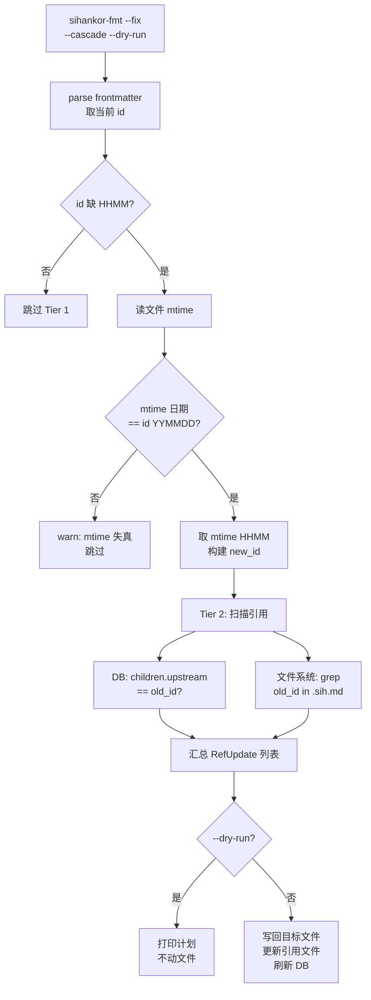

# sihankor-fmt --fix 模式提案

## 一、问题

### 1.1 V-F-01 违规的确定性

V-F-01 校验 `id` 字段格式：`YYMMDD-HHMM[-NNN]-语义短名`。当前 14 条 Fatal 规则中，V-F-01 是唯一一个**修复路径完全确定**的规则：当 `id` 缺少 HHMM 段时，从文件 mtime 取 HHMM 插入即可，不需要人工判断。

其余 Fatal 规则（V-F-03 终态 stage、V-F-04 upstream 缺失、V-F-06 AI 前缀 decided-by）都涉及语义判断，无法自动化。

### 1.2 id 变更的级联效应

`id` 是文档主键，一旦变更会波及：

| 引用通道                    | 存储                    | 影响范围   |
| --------------------------- | ----------------------- | ---------- |
| `upstream` frontmatter 字段 | `documents.upstream` 列 | 所有子文档 |
| DEPS / SEE-ALSO 正文段落    | 文件正文                | 相关文档   |
| 正文内联 id 提及            | 文件正文                | 任意文档   |
| 文件名（约定一致时）        | 文件系统                | 磁盘路径   |

只修 `id` 字段不修引用，会制造**悬空引用**：子文档的 `upstream` 指向不存在的旧 id，`resolve_chain` 断链，`governance_chain_plan` 误报 `not_referenceable`。

### 1.3 现有工具的空白

`sihankor-fmt` 当前是纯诊断工具：`lint_document` 是纯函数，`Violation.fix_suggestion` 是建议文本，没有任何写回逻辑。`src/bin/sihankor-fmt.rs` 接受唯一一个位置参数（路径），无任何标志。

`governance_chain_plan` 已经产出 `downstream_impact`（引用目标 id 的文档列表）与 `operation_order`（fix_upstream / advance_target / update_downstream 三阶段），但只用于展示，没有执行器。

## 二、方案

### 2.1 核心思路：分层修复

`--fix` 分两层，独立可用：

- **Tier 1**：确定性修复。只处理 V-F-01 的 HHMM 缺失，从 mtime 取 HHMM 写入 `id` 字段。不碰引用、不碰文件名、不碰 DB。
- **Tier 2**：级联更新。在 Tier 1 改了 `id` 之后，扫描所有引用旧 id 的位置，批量替换为新 id。可选重命名文件、刷新 DB。

Tier 1 是 Tier 2 的前置；Tier 2 也可单独触发（用于人工改了 id 后修复引用）。

### 2.2 Tier 1：确定性修复

输入：单个 `.sih.md` 文件路径。

判据：`id` 匹配 `^\d{6}-.+$` 但不匹配 `^\d{6}-\d{4}.*`，即有日期但缺 HHMM。

数据源：文件 mtime。取 `Local::now()` 不可靠（agent 可能在文件创建后数小时才跑修复）；取 mtime 反映的是文件落盘时刻，最接近真实创建时间。

**日期一致性校验**：仅当 mtime 的日期与 `id` 的 YYMMDD 一致时才取 HHMM。不一致则跳过并 warn（文件被改过，mtime 已失真）。

### 2.3 Tier 2：级联更新

在 Tier 1 产出 `old_id -> new_id` 映射后，扫描引用：

```text
引用扫描范围：
1. DB: SELECT id FROM documents WHERE upstream = old_id
2. 文件系统: grep old_id docs/ archive/  (限定 .sih.md)
3. DB: db.search_content(old_id)  (复用 governance_chain_plan 的下游发现逻辑)
```

对每个命中的文件，执行字符串替换：

- frontmatter `upstream: old_id` -> `upstream: new_id`
- DEPS / SEE-ALSO 段落内的 `- old_id` -> `- new_id`
- 正文内联 `\bold_id\b` -> `\bnew_id\b`

DB 更新（若 `--cascade-db`）：

- `UPDATE documents SET id = new_id WHERE id = old_id`
- `UPDATE documents SET upstream = new_id WHERE upstream = old_id`
- metrics 表的 `doc_id` 引用不在本期范围（与 rebuild-stale-prune 后续合并处理）

文件重命名（若 `--rename` 且文件名遵循 timestamp-prefix 约定）：

- 仅当文件名以 `YYMMDD` 开头时才重命名，PascalCase 文件名（如 `SiHankor-Philosophy.sih.md`）不动
- 规范 `Document-Conventions.sih.md:129-135` 明确文件名与 id 不强制一致，`--rename` 是可选项

### 2.4 流程



### 2.5 与 governance_chain_plan 的联动

`governance_chain_plan(doc_id)` 产出 `downstream_impact: Vec<DownstreamRef>`，正是 Tier 2 需要的下游文档清单。复用路径：

- `build_chain_plan` 内部调用 `db.search_content(doc_id)` 发现下游，Tier 2 直接复用此查询
- `operation_order` 的 `update_downstream` 阶段描述了应更新的文档列表，`--fix --cascade` 执行该阶段

但存在鸡生蛋问题：`governance_chain_plan` 要求目标 doc 已入 DB，而 V-F-01 违规文档可能未被索引。处理方式：

- Tier 1 先修 `id` 字段（纯文件操作，不依赖 DB）
- Tier 2 用 `db.search_content(old_id)` 找下游（下游文档本身 id 合法，已入 DB，能被搜到）
- 不依赖目标文档自身在 DB 中的存在性

## 三、安全护栏

### 3.1 dry-run 优先

`--cascade` 默认 dry-run，必须显式 `--confirm` 才写盘。与 `rebuild_index --prune-dry-run / --prune-confirm` 一致。

```text
sihankor-fmt --fix --cascade --dry-run docs/proposals/foo.sih.md
# 输出：
# Tier 1: id 260629-foo -> 260629-0131-foo (mtime: 2026-06-29 01:31)
# Tier 2: 3 files reference old id:
#   - docs/decisions/bar.sih.md (upstream field)
#   - docs/proposals/baz.sih.md (DEPS section)
#   - docs/reference/qux.sih.md (inline mention)
# Run with --confirm to apply.
```

### 3.2 确定性边界

`--fix` 只修一种违规：V-F-01 的 HHMM 缺失。不修：

- slug 拼写错误（需要人工判断语义）
- 日期错误（mtime 可能失真，不可信）
- NNN 消歧符缺失（需要碰撞检测，非确定性）

### 3.3 日期一致性校验

mtime 的日期必须与 id 的 YYMMDD 一致。不一致说明文件在创建后被改过，mtime 已不能反映创建时刻，此时 HHMM 不可信。跳过并 warn，留给人工处理。

### 3.4 知止边界

`--fix` **不**做以下事：

- 不修非 V-F-01 的违规（V-F-03 / V-F-04 等需要语义判断）
- 不调用 LLM 或 agent（纯确定性逻辑）
- 不创建新文档（与 `generate_document_plan` 写骨架的方案正交）
- 不处理 metrics 表的 `doc_id` 引用（留给后续 proposal）
- 不删除文件（只改 id 和引用）

## 四、实现计划

### 4.1 src/core/validator.rs

将 `is_valid_id` 改为 `pub`，供 fmt 模块复用。新增：

```rust
/// 判断 id 是否缺 HHMM 段（V-F-01 可自动修复的子集）
pub fn needs_hhmm_fix(id: &str) -> bool {
    let has_date = regex_lite::Regex::new(r"^\d{6}-.+").unwrap();
    let has_time = regex_lite::Regex::new(r"^\d{6}-\d{4}").unwrap();
    has_date.is_match(id) && !has_time.is_match(id)
}
```

约 +10 行。

### 4.2 src/fmt/mod.rs

新增写回逻辑。`lint_document` 保持纯函数不动，新增 `fix_v_f_01`：

```rust
use std::time::SystemTime;

/// 修复单个文档的 V-F-01 违规，返回修复后的内容。
/// 若 id 已合法或无法确定性修复，返回 None。
pub fn fix_v_f_01(content: &str, mtime: SystemTime) -> Option<String> {
    // 1. 解析 frontmatter，定位 id: 行
    // 2. 取当前 id，调用 needs_hhmm_fix
    // 3. 从 mtime 提取 HHMM（需 Local 时区转换）
    // 4. 日期一致性校验
    // 5. 构造 new_id，字符串替换 id: 行
    // 6. 返回新 content
}
```

新增级联扫描：

```rust
pub struct RefUpdate {
    pub file: String,
    pub field: RefField,  // Upstream | Deps | SeeAlso | Inline
    pub old_id: String,
    pub new_id: String,
}

/// 扫描 root 下所有 .sih.md，找出引用 old_id 的位置
pub fn scan_references(old_id: &str, root: &Path) -> Vec<RefUpdate> {
    // 复用 walkdir + 行级 grep
}
```

约 +60 行。

### 4.3 src/bin/sihankor-fmt.rs

扩展参数解析（仍手动，不引入 clap）：

```rust
let mut fix = false;
let mut cascade = false;
let mut dry_run = true;  // --cascade 默认 dry-run
let mut rename = false;
let mut confirm = false;
let mut root = Path::new("docs").to_path_buf();

for arg in &args[1..] {
    match arg.as_str() {
        "--fix" => fix = true,
        "--cascade" => cascade = true,
        "--dry-run" => dry_run = true,
        "--confirm" => { dry_run = false; confirm = true; }
        "--rename" => rename = true,
        s if !s.starts_with("--") => root = Path::new(s).to_path_buf(),
        _ => { eprintln!("unknown flag: {s}"); std::process::exit(2); }
    }
}
```

`--fix` 单独运行：Tier 1，改单文件。`--fix --cascade`：Tier 1 + Tier 2，默认 dry-run。`--fix --cascade --confirm`：执行写入。`--fix --cascade --confirm --rename`：同时重命名文件。

约 +40 行。

### 4.4 时区处理

`SystemTime` 是 UTC，id 中的 HHMM 约定为本地时间（agent 创建文档时所在时区）。需要引入 `chrono` 或 `time` crate 做时区转换。当前 `Cargo.toml` 无此依赖，需新增。

### 4.5 测试

- 单元测试 `fix_v_f_01`：
  - id 缺 HHMM + mtime 日期一致 -> 修复成功
  - id 缺 HHMM + mtime 日期不一致 -> 返回 None
  - id 已合法 -> 返回 None
  - id 完全非法（无日期） -> 返回 None
- 单元测试 `scan_references`：
  - 构造 3 个文件（upstream / DEPS / inline 引用），扫描出 3 条 RefUpdate
- 集成测试：
  - `--fix --cascade --dry-run` 输出计划，不动文件
  - `--fix --cascade --confirm` 写盘后，重新 lint 无 V-F-01 违规

## 五、迁移路径

### 5.1 第一阶段：Tier 1 落地

实现 `fix_v_f_01` 与 `--fix` 标志。手动跑一次 `sihankor-fmt --fix docs/`，修复所有 V-F-01 的 HHMM 缺失。此阶段不动引用，接受暂时的悬空引用（旧 id 已不存在于 frontmatter，但 DEPS / upstream 字段还指向旧 id）。

### 5.2 第二阶段：Tier 2 级联

实现 `scan_references` 与 `--cascade`。对第一阶段修过的文件跑一次 `--fix --cascade --confirm`，批量更新引用。

### 5.3 第三阶段：DB 联动

`--cascade-db` 刷新 `documents.id` / `documents.upstream`。或更简单：改完文件后直接触发 `rebuild_index`，让索引重建。后者复用现有流程，更稳。

## 六、后续

**事前生成方向**：`generate_document_plan` 当前只产出 plan 文本，agent 拿到后仍手写 frontmatter，绕过了工具。下一步让 `generate_document_plan` 直接写 `.sih.md` 骨架到磁盘（正确 frontmatter + 章节标题），agent 只填内容。这样 id 永远不会错，`--fix` 退化为兜底而非主路径。

**metrics 表孤儿引用**：`IndexCompleted` / `ValidationCompleted` 事件的 `doc_id` 字段可能指向被改 id 的文档。与 `rebuild-stale-prune` 提案的后续合并处理。

**文件名一致性规则**：当前规范 `Document-Conventions.sih.md:129-135` 明确文件名与 id 不强制一致。若实践上多数文档都遵循 timestamp-prefix 文件名约定，可考虑新增 V-G 规则校验文件名-id 一致性，但需先在 reference 目录沉淀约定。

## DEPS

- 260616-1930-format-lint-decision
  - 格式校验决策：fmt 工具的存在依据，本提案扩展其能力
- 260629-0131-rebuild-stale-prune
  - 索引孤儿清理提案：本提案的 DB 刷新可复用 rebuild_index 流程
