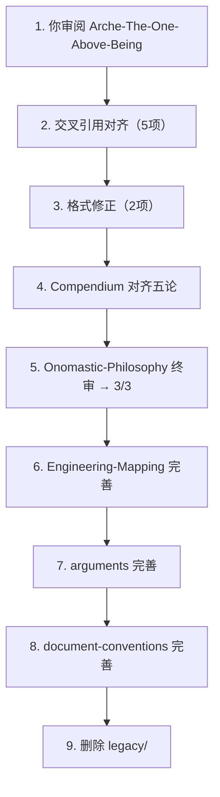

# 司衡哲学文档重构计划

> 从 legacy/ 中提取哲学遗产，在 docs/specs/philosophy/ 下重建完整的论著体系。

## 一、当前状态

### 1.1 已完成

| 文档                               | stage | 状态                                   |
| ---------------------------------- | ----- | -------------------------------------- |
| `On-SiHankor.sih.md`               | 3/3   | 总纲，已定稿                           |
| `On-SiHankor-Tao.sih.md`           | 3/3   | 道论，已定稿                           |
| `On-SiHankor-Assay.sih.md`         | 3/3   | 鉴论，已定稿                           |
| `On-SiHankor-Canon.sih.md`         | 3/3   | 法论，已定稿                           |
| `Arche-The-One-Above-Being.sih.md` | 3/3   | 元，遗产继承完成，待审阅               |
| `Onomastic-Philosophy` $2.2        | —     | 已修正：移除 On-SiHankor-Arche 条目    |
| 全局 siheng→sihankor               | —     | 文件名、id、配置路径、交叉引用全部更新 |

### 1.2 待推进

| 文档                             | 当前 stage | 待完成                   |
| -------------------------------- | ---------- | ------------------------ |
| `Arche-The-One-Above-Being`      | 3/3        | 元，已定稿               |
| `SiHankor-Onomastic-Philosophy`  | 2/3        | 终审命名体系无矛盾 → 3/3 |
| `SiHankor-Philosophy-Compendium` | 1/3        | 与五论对齐后推进         |
| `SiHankor-Engineering-Mapping`   | 1/3        | 哲学→工程映射表对齐      |
| `SiHankor-Philosophy-arguments`  | 1/3        | 论证案例对齐             |
| `Sihankor-Document-Conventions`  | 1/3        | 与 Canon $六对齐         |

## 二、交叉引用对齐清单

| 检查项                                                     | 涉及                  |
| ---------------------------------------------------------- | --------------------- |
| `Compendium` 中元的定义与 `Arche-The-One-Above-Being` 一致 | Compendium → Arche    |
| `On-SiHankor` $三引用 `Arche-The-One-Above-Being`          | On-SiHankor → Arche   |
| `On-SiHankor-Canon` DEPS/SEE-ALSO 路径全部有效             | Canon → 各文档        |
| `Engineering-Mapping` 哲学层映射表覆盖四道四元             | Mapping → Tao/Arche   |
| `arguments` 案例引用指向正确论著章节                       | arguments → Tao/Assay |

## 三、格式修正

| 问题                                 | 文件                                          |
| ------------------------------------ | --------------------------------------------- |
| frontmatter 全角冒号 `：` → 半角 `:` | `Engineering-Mapping`、`Philosophy-arguments` |

## 四、排除项

| 项目                     | 理由                                                     |
| ------------------------ | -------------------------------------------------------- |
| SiHankor Mind 独立文档   | 工程实现概念，`src/main.rs` + `Engineering-Mapping` 承载 |
| 六维观照哲学             | 已被鉴检验证伪（0/21），作为历史案例引用                 |
| legacy/ 中 siheng-* 文档 | 旧文档，重构完成后删除                                   |

## 五、推进顺序

