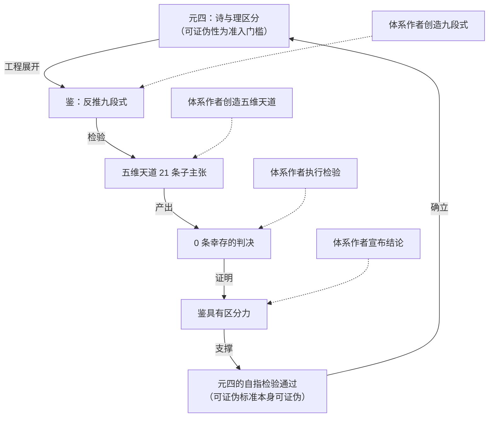

# R2 致命单一攻击：鉴的自证循环

> 本文不审阅体系的全部优点，只寻找一个论点：如果成立，体系的核心主张无法存活。

## 一、目标

攻击对象是司衡体系的**认识论验证结构**，具体而言是以下三环互锁的闭环：

1. 元四（方法论之元）确立"诗与理区分"作为道层准入门槛，并要求自身可证伪
2. 鉴（反推九段式）是元四的工程展开，检验道层主张
3. 鉴的有效性由"五维天道 0/21 幸存"这一事件证明

这三环构成体系的认识论地基。元论称"五维天道的证伪是元四在实践中最具说服力的验证"。鉴论称"它的有效性不依赖于哲学证明，而依赖于工程验证：五维天道 0/21 幸存证明了它具有区分力"。总纲称"反推九段式在五维天道检验中的成功应用，证明了这套方法论确实具有区分力"。

我的核心论点：**这一验证结构是一个无外部锚点的自证闭环。鉴的有效性由鉴自身应用于体系作者自己创造的命题来证明，且没有任何独立于体系的外部裁判确认该证明的结论为真。如果这个闭环成立，体系无法支撑其核心主张"道是被发现的因果必然性"与"鉴具有经证明的区分力"。**

这不是"体系有若干瑕疵"中的一个问题。这是支撑整个认识论权威链的唯一支柱。鉴的区分力未获独立验证 -> 元四的自指检验失去基准 -> 四道的"被发现"地位无从区分于"被发明" -> 法与术的合道性论证失去根基。所有下游问题都收敛到这一个根因。

## 二、致命性论证

### 2.1 验证的唯一证据

司衡体系对鉴（反推九段式）有效性的全部论证，集中在一个事件上：将九段式应用于五维天道 21 条子主张，得到 0 条完好幸存的结果。

体系在四处独立文档中反复援引这一事件作为方法论有效性的唯一实证：

- 鉴论称"司衡方法论的有效性不来自逻辑演绎，而来自它在司衡自身建构中的实际表现"，随后列出四个验证事件，其中五维天道证伪被列为首要证据，结论为"21 条子主张，0 条幸存，证明九段式有区分力"
- 元论称"五维天道的证伪是元四在实践中最具说服力的验证"
- 总纲称"证明了这套方法论确实具有区分力：它不是任意的，它产出有意义的判决"
- 论证集称"0 条完好幸存，这场大规模的自我证伪不是失败，而是司衡方法论成熟的关键标志"

除这一事件外，体系提供的其余"验证"均为同一结构的重复：道一校准（体系自己提出原命题，体系自己用九段式推翻，体系自己宣布校准成功）、道三校准（同样结构）、道四确立（从道二递归推导，仍为体系内部推演）。这些事件共享同一个特征：提出者、检验者、判决者、宣布者都是同一主体。

### 2.2 闭环的精确结构

将这一验证结构展开，可以看到一个明确的循环：

这个循环的关键特征：

- 五维天道由体系作者创造（论证集明确记录其来自 v4.0.0 体系构建过程）
- 九段式由体系作者创造（鉴论明确定位为"被发明并经过验证的检验工具"）
- 检验由体系作者执行
- "0 条幸存"的判决由体系作者宣布
- "证明鉴具有区分力"的结论由体系作者得出

全程没有任何一方满足以下三个条件中的任何一个：未参与创造被检验命题、未参与创造检验方法、其判决可以与体系自身判决相左。

循环的逻辑形式为：鉴有效 -> 五维天道为伪（由鉴判定）-> 鉴有效（因正确判定了五维天道为伪）。这是一个标准的认知循环：方法的有效性由方法自身对其创造者所造命题的判定来证明。

### 2.3 "区分力"不等于"正确性"

体系的核心辩护是：0/21 的结构化输出（67% 被证伪、19% 需校准、14% 需重定位、0% 幸存）证明了九段式"不是任意的"，"产出有意义的判决"。

这一辩护混淆了两个不同性质的概念：

- **区分力**（discriminating power）：方法对不同输入产出不同输出。一枚有偏的硬币也有区分力：它以 70% 概率输出正面、30% 输出反面，对不同输入给出不同判决。
- **正确性**（correctness）：方法的判决与独立于方法的真值相符。这才是"有效性"的真正含义。

体系实际证明的只是区分力（九段式没有把所有主张一概接受或一概拒绝），但声称的是正确性（九段式"正确地"识别了五维天道为伪）。从区分力到正确性，需要一个独立于九段式的真值裁判来确认 0/21 的判决确实为真。这个裁判在体系中不存在。

### 2.4 与已知自指体系的结构对比

体系可能援引自指传统为自身辩护：元四的自我指涉、鉴的自鉴、道四的递归适用，都是"自指"的正当运用。以下通过与四个已知的自指体系做结构对比，证明司衡的自指在结构上与那些被接受的体系有本质区别。

**哥德尔不完备性定理**。哥德尔证明的是形式系统的一种极限：任何足够强的形式系统无法在自身内部证明自身的一致性。关键的结构特征是：定理的证明使用标准算术推理（可被任何数学家独立检验），而被描述的形式系统并不验证自身。哥德尔定理是关于系统的元定理，不是系统对自身的有效性宣告。司衡的结构不同：鉴不是证明鉴的某种极限，而是宣告鉴自身具有区分力这一能力。哥德尔是"从外部证明内部的边界"，司衡是"从内部宣告自身的能力"，二者方向相反。

**波普尔的可证伪性**。波普尔的可证伪性标准本身面临自指问题（可证伪性本身是否可证伪），波普尔对此有自觉。但波普尔从不声称可证伪性的有效性由"将可证伪性应用于波普尔自己的理论且它们幸存"来证明。波普尔在独立的逻辑基础上论证可证伪性：全称命题与存在命题的不对称性使得证实与证伪具有不同的逻辑地位。这一论证不依赖于波普尔对自己以往工作的自我应用。司衡不同：鉴论明确将"五维天道 0/21"列为有效性的首要证据，而非在独立的逻辑或经验基础上论证九段式的可靠性。

**黑格尔的绝对精神**。黑格尔体系是自指的：绝对精神通过哲学体系认识自身。但黑格尔的自指是关于实在之结构的描述性主张，不是关于方法之有效性的证明性主张。黑格尔不说"我的辩证法有效，因为我用它检验了我早期的命题并发现了它们的不足"。黑格尔的辩证法声称描述了思维与现实运动的结构，其有效性论证（无论是否令人信服）指向的是现实本身的结构，不是方法对自产命题的判定。司衡不同：鉴的有效性论证恰恰指向方法对自产命题的判定，而非指向代码工程世界本身的独立结构。

**奎因的整体论**。奎因主张信念之网作为整体面对经验法庭。这一主张本身是信念之网的一部分，因此是自指的。但奎因不通过"将整体论标准应用于我自己以往的理论命题并发现它们不足"来证明整体论有效。奎因在独立的论证基础上提出整体论：理论由经验数据欠决定（underdetermination），因此单个命题无法被孤立地检验。这一论证不依赖于奎因对自己工作的自我应用。

四个体系的共同结构特征：自指要么证明的是极限而非能力（哥德尔），要么在独立逻辑基础上论证而非依赖自我应用（波普尔、奎因），要么是描述性主张而非方法有效性证明（黑格尔）。

司衡的独特之处：它是唯一一个将"方法对方法创造者自产命题的判定"作为方法有效性的首要证据，且不提供任何独立于该自我应用的逻辑论证或经验验证的体系。这一结构差异不是程度之别，而是类别之别。

### 2.5 可接受外部锚点的定义与缺失

为使以上论证不流于"体系没有外部锚点"的空泛指责，需先定义什么构成"可接受的外部锚点"，再论证其缺失为何对哲学层（而非工程层）致命。

**可接受外部锚点的三个条件**：

1. **独立性**：锚点未参与创造被检验的命题，未参与创造检验方法，不受被验证体系的控制。科学实验中的自然现象满足此条件：自然界不参与设计理论，也不参与设计实验方法。
2. **可分歧性**：锚点的裁决可以与体系自身的裁决不同。如果锚点必然同意体系的裁决，它不是独立的。独立同行评审满足此条件：审稿人可能拒绝论文。
3. **可核查性**：锚点的裁决可被体系创造者以外的主体复核。科学实验的可重复性满足此条件：任何具备能力的实验室都可以重做实验。

满足这三条的验证源，才构成"可接受的外部锚点"。注意：这不是要求体系达到科学的全部严格性，而是要求其认识论主张获得与其雄心相称的独立验证。

**司衡体系中外部锚点的缺失**：

逐一检验体系中所有声称的"验证"：

- **五维天道 0/21**：不满足独立性（命题由体系作者创造，方法由体系作者创造，判决由体系作者宣布）。不满足可分歧性（没有独立裁判可以宣布"某条五维天道主张其实为真，九段式误判了"）。不满足可核查性（没有独立第三方复核过 0/21 判决的正确性）。
- **道一校准、道三校准**：与五维天道 0/21 同构，均为自产自检自判。
- **四道的可证伪条件**：四条道各有可证伪条件，但体系明确声明"截至目前，无一被满足"。这意味着四道从未经历过实际的证伪尝试。可证伪条件的存在不等于已检验，正如一把从未上过战场的剑不因"可以用来战斗"就已被证明锋利。可证伪条件是方法论资格，不是有效性证据。
- **法的实践检验**：法论要求法接受"实践检验"（在治理中应用此法后观察效果）。但体系处于文档阶段，引擎尚未完整实现，没有任何系统性经验数据表明违反某条法导致了可观测的治理失效。实践检验是承诺，不是已完成的验证。
- **外部验证文档**（SiHankor-External-Validation）：这是体系声称的"外部验证"。但检视其内容，外部验证者提出的是三个追问（度量问题、主权问题、可证伪条件），体系基于自身道法推演作答。验证的结论是"体系自洽且诚实"，验证的标准被明确界定为"间隙被诚实声明"而非"主张为真"。自洽性检验不是真值检验：一个自洽的体系可以为假（internally consistent fiction can be false）。这份文档验证的是体系的诚实度，不是体系核心主张的真值。

结论：体系中不存在任何满足三条件的外部锚点。全部"验证"要么是自产自检自判的闭环，要么是自洽性检验，要么是尚未兑现的承诺。

**缺失为何对哲学层致命（而非仅工程层）**：

如果缺失仅影响工程效用，那体系作为"有用的工程框架"仍可存活。但体系的核心主张不是"我是一套有用的框架"，而是：

- "道是被发现的因果必然性"（认识论主张：关于知识来源）
- "鉴具有经证明的区分力"（方法论主张：关于方法有效性）
- "认识论内核是一套完整的、可检验的设计原则体系"（体系定位：关于可检验性）

这三条都是哲学层主张，不是工程层主张。哲学层主张需要哲学层验证。在认识论中，一个方法的有效性不能仅由该方法对其创造者所造命题的判定来确立，正如一个法官的公正性不能仅由该法官对自己案件的判决来证明。这不是对司衡的特殊要求，而是对一切认识论主张的一般要求，其根基可追溯至古代怀疑论的"标准问题"（how do you know your criterion is reliable without already using it?）和休谟对归纳的质疑（you cannot justify induction by induction）。

体系可以承认自己"不完备"（元三、道四），但承认不完备不能替代正面主张的验证。体系不是仅仅说"我可能出错"，它明确说"鉴具有区分力，这已被五维天道 0/21 证明"。前者是谦逊，后者是断言。谦逊不需要外部锚点，断言需要。

### 2.6 下游坍塌：为什么这是唯一的根因

表面上看，体系存在多个开放问题。论证集列出了 C1（发现 vs 发明的自证问题）、C2（复杂度悖论）、C4（知止与扩张的矛盾）等高严重性未回应反驳。但这些并非相互独立的问题，它们都指向同一个根因。

**C1（发现 vs 发明）**是自证循环的直接后果。体系声称道是"被发现的"而非"被发明的"，但区分"发现"与"发明"的唯一工具是鉴。如果鉴的有效性是自证循环的，那么"发现"与"发明"的区分就没有可靠工具来执行。体系无法在循环验证的基础上证明自己是在"发现"而非"发明"，正如一个自证公正的法官无法证明自己的判决是"发现法律"而非"发明判决"。

**元四自指检验的空洞化**是自证循环的另一后果。元四的可证伪条件是"如果存在一种不依赖可证伪条件的方法，能持续产出比鉴更可靠的道层判决，则元四被推翻"。但"比鉴更可靠"需要一个已知可靠的鉴作为基准。如果鉴的可靠性本身未被独立验证，那么"比鉴更可靠"是一个以未知为基准的比较，元四的可证伪条件因此空洞化：你无法判断一个替代方法是否"比鉴更可靠"，因为你不知道鉴本身有多可靠。

**道四递归的收敛性论证**同样依赖这一根因。道论提出"信息量递减论证"来回答"道四的递归如何终止"：每一层治理需求严格弱于上一层，递归在有限步内收敛。但这一论证的可靠性依赖于对"信息量"和"治理需求"的度量，而这些度量工具本身就是体系内部构造的，未经独立验证。如果鉴的自证循环不被接受，那么道四递归收敛性的论证也建立在一个未被独立验证的方法论基础之上。

这些下游问题不是各自独立的"瑕疵"，而是同一棵树上的枝叶。根因只有一个：体系的认识论验证是一个无外部锚点的自证闭环。砍断这个根，所有枝叶同时枯萎。

## 三、最佳辩护

在做出判定之前，必须为被攻击对象构建能够找到的最强辩护。以下逐条呈现最强辩护，然后说明攻击为何仍然成立。

### 3.1 辩护一：科学方法同样依赖自我应用

"科学方法的有效性也是通过其自身在科学实践中的表现来证明的。一个理论提出预测，预测被检验，理论被修正或保留。检验方法本身没有被'独立验证'，它是通过其track record（历史记录）被信任的。司衡做的正是同样的事：鉴通过在五维天道检验中的表现建立了自己的track record。"

**这一辩护的强点**：它援引了一个被广泛接受的认知实践（科学方法的自我应用）作为类比，使得司衡的自证看起来不是异类，而是遵循了科学认识论的标准模式。

**攻击为何仍然成立**：科学方法的track record建立在外部锚点之上，而非自我应用之上。科学理论的预测被检验的对象是独立于理论家的自然现象：自然界没有参与设计理论，没有参与设计实验方法，其"裁决"（实验结果）可以与理论的预测不同。这正是 2.5 节定义的三个条件。科学的"自我应用"是方法应用于外部现实，不是方法应用于方法创造者自己创造的命题。司衡的 0/21 事件缺少这一外部现实：五维天道是体系作者自己的造物，九段式是体系作者自己的工具，判决是体系作者自己下的。科学的类比在关键维度上断裂：科学有独立锚点（自然），司衡没有。

### 3.2 辩护二：独立直觉确认了五维天道的诗性

"即使没有九段式，任何有经验的工程师也能独立判断'接口是代码世界的无'是诗意修辞而非因果主张。九段式只是将这种直觉系统化为可操作流程。0/21 的结果与独立工程直觉一致，因此九段式的判决被独立确认了。"

**这一辩护的强点**：它引入了一个看似独立的标准（工程直觉）来确认九段式的判决，使得循环似乎被打破了。

**攻击为何仍然成立**：这一辩护实际上瓦解了鉴的认识论权威，而非拯救了它。如果工程直觉已经能够独立判断哪些主张是诗、哪些是理，那么鉴（九段式）所做的一切不过是将既有直觉形式化。形式化增加的是系统性和可重复性，不是认识论权威。鉴的权威不可能超过它所形式化的直觉的权威。如果直觉是前体系的、未被验证的，那么鉴作为其形式化也是未被验证的。

更深层的问题：如果独立直觉可以确认九段式的判决，那么独立直觉同样可以推翻九段式的判决。体系无法只接受"独立直觉确认九段式"而拒绝"独立直觉推翻九段式"。一旦承认独立直觉是裁判，鉴就降格为直觉的可选形式化工具，而非道层主张的权威准入门槛。体系声称的"鉴具有经证明的区分力"就降格为"鉴与工程直觉一致"，后者是一个远弱的主张。

### 3.3 辩护三：结构化输出本身就是有效性的标志

"一个无效的方法会产生随机分布的结果。九段式在五维天道检验中产出了结构化的结果（67% 证伪、19% 校准、14% 重定位、0% 幸存），并且发现了'五维是五法在五个工程维度上的错维投射'这一结构性结论。随机的方法不会产出结构性发现。"

**这一辩护的强点**：它用一个看似客观的标准（输出的结构化程度）来评估方法，避免了需要独立真值裁判的问题。

**攻击为何仍然成立**：结构化输出证明的是区分力（方法对不同输入给出不同输出），不证明正确性（输出与真值相符）。2.3 节已论证这一区分。一个偏执的怀疑论者对所有命题都给出"证伪"判决，其输出也是"结构化的"（100% 证伪），但我们不会因此认为他的方法是有效的。一个精于诡辩的人可以对他的所有早期作品都找到"致命缺陷"，其输出也是结构化的，但这只证明他善于找茬，不证明他的找茬是正确的。

"结构性发现"同样可以被循环解释：体系先创造了五维天道（五个维度对应五法），然后发现"五维是五法的投射"。这一发现是否为真，取决于五维天道和五法是否真的是独立创造的两个东西。如果五法本身也是体系作者的构造，那么"发现五维是五法的投射"可能只是发现了自己两次构造之间的相似性，而非发现了代码工程世界的客观结构。

### 3.4 辩护四：四道的可证伪条件提供了未来的独立验证

"四道各有精确的可证伪条件：道一被推翻如果发现无需外力即自动收敛的多人项目，道二被推翻如果发现先有代码后有意图的场景，等等。这些条件是向未来开放的独立验证通道。体系不声称已被验证，只声称可被验证。"

**这一辩护的强点**：它将体系从"已被验证"退守到"可被验证"，这是一个更谦逊也更难攻击的立场。波普尔正是以"可证伪性"而非"已被证实"来界定科学性。

**攻击为何仍然成立**：这一退守与体系自身的实际主张相矛盾。体系不是仅仅说"鉴可被验证"，它明确说"鉴具有区分力，这已被五维天道 0/21 证明"。如果退守到"可被验证但尚未被验证"，那么体系必须撤回"鉴具有经证明的区分力"这一断言，而这一断言是总纲、鉴论、元论三处反复做出的核心认识论主张。

此外，四道的可证伪条件本身也可能受循环污染。可证伪条件是由鉴（未经独立验证的方法）设定的。如果鉴不可靠，那么它设定的可证伪条件可能过强（永远不会被触发，使道实际上不可证伪）或过弱（太容易触发，使道的证伪没有意义）。未经独立验证的方法所设定的可证伪条件，其有效性同样是未经独立验证的。一把从未被校准的尺子所刻画的"一米"，不能因为"可以被用来测量"就被认为是准确的。

### 3.5 辩护五：元三的fallibilism已承认一切

"体系通过元三（发现可错）和道四（规约与实现必有间隙）已经承认了自己的不完备。体系从不声称自己已被终极验证，它声称的是'承认不完备但持续收敛'。攻击一个已经承认自己不完备的体系'不完备'，是攻击稻草人。"

**这一辩护的强点**：它将"不完备"转化为体系的设计特征而非缺陷，使得任何关于"验证不足"的攻击看起来都是在攻击体系已经承认的东西。

**攻击为何仍然成立**：元三和道四承认的是"认知可能出错"（fallibilism），不是"方法论有效性未被证明"（unjustified methodology）。这是两个不同层次的声明：

- fallibilism："我的结论可能为假"（关于结论的谦逊）
- 我所攻击的："我的方法已被证明有效"（关于方法的断言）

一个体系可以同时说"我的结论可能为假"（谦逊）和"我的方法已被证明有效"（断言）。前者不使后者免于质疑。恰恰相反：如果方法的有效性是自证循环的，那么"结论可能为假"的谦逊反而应该更深刻地延伸为"方法可能无效"的谦逊，但体系没有做到这一点。体系在结论层面承认fallibilism，在方法层面却声称"已被证明"。

体系的实际立场是：结论可错（元三），但方法有效（鉴论 5.3）。我的攻击针对的是后者。前者不是后者的盾牌。

### 3.6 辩护六：外部验证文档已提供了独立检验

"SiHankor-External-Validation 记录了一次三方协作的外部验证过程：外部验证者提出追问，AI 实例推演，构建者回应。这不是自证，这是外部检验。"

**这一辩护的强点**：它指向一份实际存在的"外部验证"文档，使得"没有外部锚点"的指控看起来与事实不符。

**攻击为何仍然成立**：检视该文档的实际内容，它验证的是自洽性和诚实度，不是核心主张的真值。文档明确界定验证标准为"间隙被诚实声明"而非"零间隙"，结论是"体系自洽且诚实"。一个自洽且诚意的体系仍然可以为假：一个内部一致的虚构可以是诚实的（其作者真诚地相信它）且自洽的（内部无矛盾），但仍然不对应现实。

外部验证者提出的三个追问（度量问题、主权问题、可证伪条件）没有一个是"请独立证明道一为真"或"请独立证明鉴的区分力"。验证者接受体系的框架，在框架内提出追问。这不是对体系核心主张的独立检验，而是在体系内部进行的细化讨论。这与独立裁判审查案件的性质不同：独立裁判会质疑法律本身，而该验证过程在体系设定的法律内讨论案情。

## 四、判定

### 4.1 谁赢

攻击赢。

### 4.2 为什么

最强辩护集合（3.1 至 3.6）尝试了六条路径来打破自证循环或为循环辩护。每一条都在关键维度上失败：

- 辩护一（科学类比）在"外部锚点"维度断裂：科学有独立自然现象作为锚点，司衡没有。
- 辩护二（独立直觉）在"权威降格"维度自我瓦解：如果直觉是裁判，鉴降格为直觉的形式化工具，失去道层准入门槛的权威地位。
- 辩护三（结构化输出）在"区分力 vs 正确性"维度失败：结构化证明区分力，不证明正确性。
- 辩护四（可证伪条件）在"自证方法设定的条件"维度失败：未经独立验证的方法设定的可证伪条件，其有效性同样未经验证。且该辩护与体系"已被证明"的实际主张矛盾。
- 辩护五（fallibilism）在"结论可错 vs 方法有效"的层次混淆上失败：承认结论可错不等于方法已被证明。
- 辩护六（外部验证文档）在"自洽性 vs 真值"维度失败：验证的是自洽与诚实，不是主张为真。

六条辩护没有一条能够为鉴的"经证明的区分力"提供一个独立于自证循环的验证。它们要么引入外部标准但随之使鉴降格（辩护二），要么声称外部验证但实际只验证了自洽性（辩护六），要么将"已被证明"退守为"可被验证"但与体系实际主张矛盾（辩护四）。

### 4.3 致命性的最终确认

致命意味着：如果这个弱点成立，体系的核心主张无法存活。逐一检验体系的三条核心主张：

**核心主张一："道是被发现的因果必然性"。** 如果鉴的有效性是自证循环的，那么区分"发现"与"发明"的工具就不可靠。体系无法在循环验证的基础上证明道是"发现"而非"发明"。这一主张降格为"道是体系作者认为应该被当作因果必然性来对待的命题"，失去了认识论权威。

**核心主张二："鉴具有经证明的区分力"。** 这一直接断言被攻击击中要害。鉴有区分力（产出不同判决），但区分力未被独立证明为正确性。"经证明的区分力"这一表述应修正为"未经独立验证的区分力"。

**核心主张三："认识论内核是一套完整的、可检验的设计原则体系"。** "可检验"有两种解读。如果解读为"原则上可证伪"（falsifiable in principle），则四道的可证伪条件满足此解读，但这一解读过于薄弱：占星术也"原则上可证伪"。如果解读为"已经被检验且经得起检验"（tested and survived），则这一解读不被自证循环所支持，因为自证循环不构成"检验"。"可检验"在两种解读下都无法支撑体系所声称的认识论权威。

### 4.4 体系存活的方式

指出致命弱点不等于宣告体系无价值。体系仍可作为一套工程实践框架存活：它的道、法、术在工程直觉层面是有用的启发式，它的文档治理机制在实操层面是可操作的。但它的存活方式必须从"认识论权威"降格为"工程约定"。

体系当前的自我定位是"一个承认治理自身也不完备的代码工程收敛引擎，其认识论内核是一套完整的、可检验的设计原则体系"。在攻击成立后，这一定位必须修正为"一套基于工程直觉的代码工程治理约定，其有效性尚未获得独立验证，但承认自身不完备并保持开放修正"。

这一修正不是微调，是身份转换：从"被发现的真理体系"到"有待验证的实践框架"。体系的哲学层主张（道是被发现的、鉴有经证明的区分力）无法在自证循环中存活；体系的工程层实践（文档治理、F/G/J 法则、生命周期管理）可以脱离哲学层主张独立存活，但其权威来源从"合道"降格为"合用"。

### 4.5 独立判定标准的声明

本判定未使用体系自身的标准攻击体系。体系自身的标准是"可证伪性"（元四：诗与理区分）。本文使用的独立标准是认识论中的"非循环验证原则"：一个方法的有效性不能仅由该方法对其创造者所造命题的判定来确立。这一原则的根基在于：

- 古代怀疑论的标准问题（Agrippa 的五式之一：循环论证）
- 休谟对归纳的质疑（不能用归纳来证明归纳）
- 现代认识论对基础主义与融贯论的区分（融贯不等于真值，除非融贯系统有外部输入）

这些是体系外部的、独立于司衡哲学的 epistemological 标准。本文据此标准判定：司衡的认识论验证结构是循环的，因此其核心认识论主张未被有效支撑。
