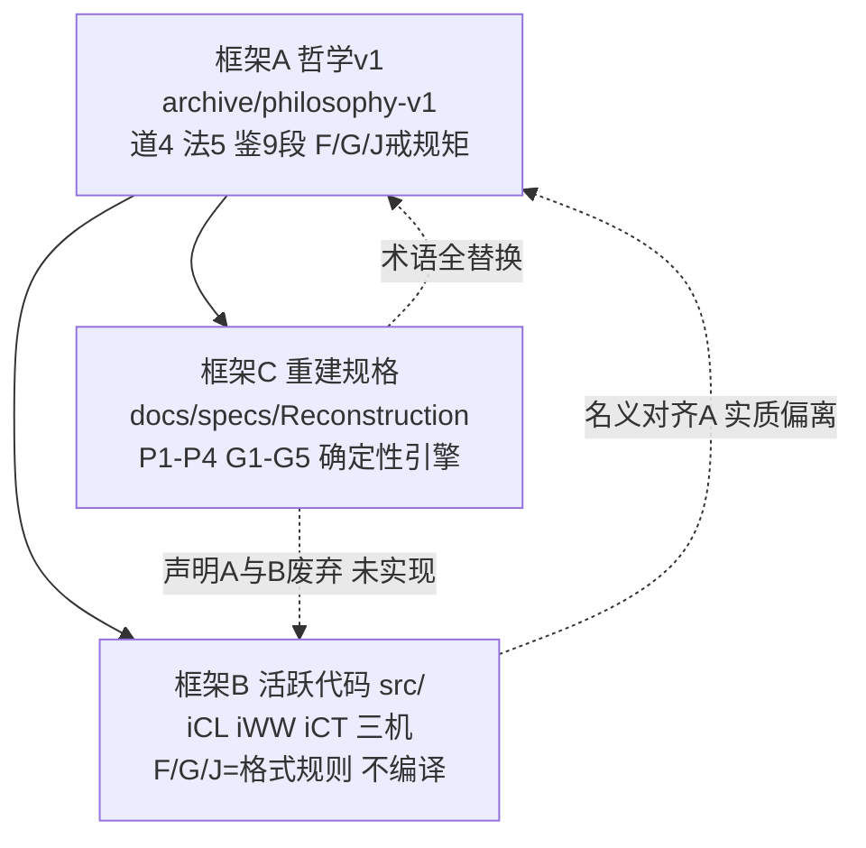

# R4 工程映射审计：司衡哲学到工程落地的降格链路

> 审计对象：哲学层（道/法/鉴）到工程层（代码/流程）的映射链路
> 审计焦点：映射节点上的断裂、降格与语义丢失
> 不审哲学对错，不审代码好坏，只审映射转换过程

## 一、审计范围与证据基线

### 1.1 已审文档

哲学层（`archive/philosophy-v1/`）：Arche-The-One-Above-Being、On-SiHankor、On-SiHankor-Tao、On-SiHankor-Canon、On-SiHankor-Assay、SiHankor-Philosophy-Arguments、SiHankor-Engineering-Mapping、SiHankor-Five-Law-Check-Criteria、SiHankor-Engine-Design-Summary。

工程层（active docs）：`docs/specs/SiHankor-Reconstruction-Spec.md`、`docs/specs/engineering/` 全部四篇、`docs/decisions/` 与 `docs/proposals/` 关键文件。

代码层（`src/`）：`core/validator.rs`、`core/parser.rs`、`core/models.rs`、`core/orchestrator.rs`、`core/database.rs`、`core/kanban.rs`、`mind/icl.rs`、`mind/iww.rs`、`mind/ict.rs`、`mind/grilling.rs`、`mcp_server/governance.rs`、`server/mod.rs`。

### 1.2 审计边界

未审哲学层本身的正确性。未参考 `docs/review-results/`、`docs/review-results-v2/` 及任何外部审阅报告。代码事实以 `cargo check` 实际输出与源码行号为准。

### 1.3 分级定义复述

**L1 完整映射**：哲学概念有精确工程对应，可机械验证，无歧义。**L2 近似映射**：工程对应存在但与原意有偏差，偏差可量化。**L3 降格映射**：哲学概念被简化为字符串/枚举/if-else，原语义丢失。**L4 装饰性映射**：工程实现与哲学概念无实质联系，仅为标签挂载。**L5 无映射**：哲学概念在工程层无任何对应。

## 二、总体诊断：三框架分裂

审计发现的最严重问题不是某条链的局部断裂，而是映射链路同时存在三套互不兼容的框架。三套框架对"道->法->工程"给出了三套不同的映射，且没有任何一套在代码层完整落地。

框架A（已归档）把道映射为"三域边界 + F/G/J 力度梯度"（见 `SiHankor-Engineering-Mapping.sih.md`）。框架B（活跃代码）把道映射为 `dao_trace` 自由文本字符串与 iCL/iWW/iCT 三机流程。框架C（`SiHankor-Reconstruction-Spec.md`，stage 1/3）把道全替换为 P1-P4，并明确声明："`specs/engineering/Engineering-Mapping` 废弃，映射是事后贴标签"（$9）。

三框架分裂的直接后果：任何一条"哲学概念->工程表达"的链都找不到唯一权威对应。审计必须对每条链同时给出"相对A的分级"与"相对C的分级"，因为项目当前以C为方向、却以B为现实。

## 三、致命前置：代码层不可机械执行

在进入逐条链审计前，必须先记录一个使所有"可机械验证"判定失效的前置事实。

`cargo check` 实际输出：**29 个编译错误**，`error: could not compile sihankor (lib) due to 29 previous errors`。根因是 `src/core/models.rs` 把 `Stage` 从元组结构体重构为枚举（`pub enum Stage { Propose, Resolve, Ratify, Deprecated, Superseded(String) }`），但 9 个调用方文件未同步更新，仍在用 `Stage(String)` 构造与 `.0` 字段访问。

受影响文件与典型行：`src/core/parser.rs:97`、`src/core/validator.rs:242,431,455,466,654,659`、`src/mind/icl.rs:60,170,173`、`src/mcp_server/governance.rs:148,170,205,254,264,560,806`、`src/core/database.rs:102,189,231,361`、`src/core/kanban.rs:211,235,241,250,257,265`、`src/server/mod.rs:157,169,283`。

这意味着：validator 的 F/G/J 规则、iCL 的认知分析、iWW 的决策建议、iCT 的五法检验，在当前提交上**全部不可运行**。所有"该规则可机械执行"的声明，在本审计时刻为假。这是工程实现能力不足导致的整体性断裂，不是映射方式错误，但它的效应是使映射链的代码端整段塌陷。后续分级按"若代码可编译时的设计意图"与"当前实际不可执行"双重标注。

## 四、逐条映射链审计

### 4.1 道一（发散自-然，收敛必-为）-> P1: Output Variance Default

哲学层（`On-SiHankor-Tao.sih.md` $二）：道一是复合命题，前件"发散自-然"为描述性，后件"收敛必-为"为规范性。明确指出"必然"在描述性与规范性之间滑动是逻辑断裂。

工程映射声明（`SiHankor-Reconstruction-Spec.md` $2.3）：P1 定义三个可操作代理变量：产出方差、协调覆盖率、治理强度，并给出公式"治理强度与产出方差 x (1 - 协调覆盖率) 成正比"，附证伪条件。P1 自标为 `empirical-hypothesis`（条件性经验假设）。

代码事实：`src/mind/iww.rs:28` 在无发散时把 `dao_basis` 写为字符串 `"道一：发散归向自然收敛"`。`src/mind/ict.rs:407` 把有度失败归因 `"道一（过犹不及）"`。没有任何代码计算产出方差、协调覆盖率或治理强度。

分级：相对C的规格层 **L2**，相对代码层 **L5**。

偏差可量化：P1 把道一的复合命题（描述+规范）压平为单一定量公式，"必-为"的规范性强度被降级为 `design-corollary` 标签。但这是诚实的降级，P1 显式承认自己是"假说不是理论"，且承认"6 个月外部锚点数据收集完成前所有经验声称均为条件性的"（$1.3）。代理变量设计本身是合格的工程化尝试。

根因：部分属哲学概念不可工程化（发散/收敛是趋势概念，只能代理测量），部分属工程实现能力不足（MVP 未实现度量管道）。

### 4.2 道二（意图先于代码）-> P2: Intent Recovery

哲学层（`On-SiHankor-Tao.sih.md` $三）：道二确立因果方向意图->代码。并明确："意图应被显式化"是法层的顺因之法，不是道层本身；道二只说因果在先，不说"必须写成文档"。

工程映射声明（`Reconstruction-Spec` $2.3）：P2 = "代码是意图的有损编码；修改代码前必须恢复意图"，自标 `design-corollary`，具体含义包括"治理应测量编码链长度，作为验证强度需求代理"。

代码事实：`src/mind/grilling.rs` 实现四追问引擎，在文档生成前询问 nature/upstream/stage/范围。这是"意图恢复"的一个可执行流程步骤。但四追问的 `dao_principle` 标签把道二与三法混标：问题0标"道二：意图先于代码"，问题1标"顺因"，问题2标"有度"，问题3标"知止"（`grilling.rs:101-150`）。

代码事实：iCL 的第一步命名为"意图定位"（`src/mind/icl.rs:44`），但实际计算的是 `upstream_chain` 与 `role_in_chain`（治理位置），并不提取或恢复意图。

分级：文档生成侧 **L2**，代码修改侧 **L5**，iCL"意图定位"命名 **L4**。

偏差可量化：追问引擎只覆盖"生成文档前恢复意图"，不覆盖 P2 的核心"修改代码前必须恢复意图"。代码修改场景的意图恢复完全无工程对应。追问引擎把道二与顺因/有度/知止混标，违反哲学层"道二只说因果在先，顺因是法层"的明确区分。

根因：映射方式错误（道法混标、命名越权），可修复。

### 4.3 道三（代码自晦）-> P3: Lossy Encoding

哲学层（`On-SiHankor-Tao.sih.md` $四）：道三=代码自晦，意图必复。经九段式校准，从规范性要求转为工程必要性陈述，信息论依据为 Shannon 1948。

工程映射声明（`Reconstruction-Spec` $2.3）：P3 = "所有编码都是意图的有损编码"，自标 `external-theorem`（外部定理引用，Shannon 1948），不可证伪，是整个体系的外部锚点，P2 与 P4a 从 P3 继承合法性。

代码事实：`src/mind/iww.rs:193-196` 把发散类型映射到道的自由文本：ReferenceBreak->"道三（代码自晦，意图必复）"，Gap->"道三（跨文档关系不可见）"。`src/mind/ict.rs` 无任何有损编码度量。

分级：规格层 **L1**，dao_trace 标签层 **L4**。

P3 是全链最干净的映射：哲学层的信息论声称被诚实地重标为外部定理引用，没有伪操作化，没有添加虚假的可证伪性。审计问题"信息论定理到工程验证步骤的映射是否精确"的答案是：P3 作为定理本不应有机械验证步骤，其不可证伪性是认识论正确的。真正的断裂在代码侧：iWW 把 ReferenceBreak 发散贴上"道三"标签，仿佛道三被操作化了，实际道三从未被操作化。这是装饰性标签挂载。

根因：映射方式错误（把定理当操作化规则贴标签），可修复。Reconstruction-Spec $8.3 已自我诊断 dao_trace 为"开发者凭直觉硬编码的 Option<String>，无验证机制"。

### 4.4 道四（规约与实现必有间隙）-> P4a/P4b: Gap Tautology + Gap Widening

哲学层（`On-SiHankor-Tao.sih.md` $五）：道四=规约与实现必有间隙，治理者也会出错，自指结构。

工程映射声明（`Reconstruction-Spec` $2.3）：P4a=重言式（间隙总存在，P3 递归），P4b=经验假设（间隙随时间扩大，可证伪）。C4 不可免疫，C5 自治理（跨版本一致性检查：同一输入在不同版本输出是否一致）。

代码事实：iCL 的 `find_gaps`（`src/mind/icl.rs:222`）查找的是"被引用文档 id 不在索引中"，即引用断裂，而非"spec 声明意图与代码实现的可验证不一致"。`docs/proposals/260616-1214-gap-entity-definition.sih.md` $四明确承认："engine 尚未实现：gap 的自动化管理（状态流转、proposal 引用校验、闭合验证）在引导阶段由人手动执行"。

代码事实：`mcp_server/governance.rs:486-525` 的 `full_analysis` 从 iCT 的 Fail/Conditional 构建 limitations，是 `@limitations` 的部分实现。跨版本一致性检查（C5）无任何代码。

分级：P4a 规格 **L1**，P4b 验证机制 **L5**，自指检测 **L5**，gap 语义 **L4**。

审计问题"自指结构是否在工程层有对应的检测机制"的答案：无。道四的自指核心（治理规则自身也需被治理、引擎检查自身规则与实践的间隙）在代码层零实现。C5 规定的跨版本一致性检查是自指结构的唯一可能机械对应，但未实现。

关键语义冲突：gap 一词被重载。哲学/规格的 gap 指 spec 与代码的语义间隙；代码 iCL.gap 指引用目标缺失。同名异义，属装饰性标签借用。

根因：自指检测部分属哲学概念不可工程化（需对引擎自身做跨版本差分测试），部分属工程实现能力不足（gap 自动化管理未做，提案已承认）。

### 4.5 收敛五法 -> G1-G5: Guidelines

哲学层（`On-SiHankor-Canon.sih.md`）：收敛五法=顺因、有度、知止、损补、顺势，每法有法层规则。

工程映射声明（`Reconstruction-Spec` $4.3）：G1-G5=Scope Boundary、Causal Alignment、Proportionality、Trade-off Management、Trend Alignment，每条附"独立验证方法"。术语映射：知止->G1、顺因->G2、有度->G3、损补->G4、顺势->G5（$8.2）。

代码事实：`src/mind/ict.rs` 实现五法检验，但检查名仍用旧名"顺因/有度/知止/损补/顺势"，非 G1-G5。各检查的实际机制：

- 顺因（`ict.rs:38`）：用 `desc.to_lowercase().contains(&up.to_lowercase())` 字符串包含判断 action 是否修改上游。R3 引用方向检查标注"skip for MVP"。
- 有度（`ict.rs:120`）：severity 与 action 组合表，仅覆盖 Critical+NoAction 与 Info+Archive 两端，大量组合返回 Conditional/Pass。
- 知止（`ict.rs:177`）：哲学否定检测靠字符串标记数组（"是错误的""不正确""矛盾"等）。`targets_drafts` 为 `const fn -> false`，即 drafts 边界检查是桩。
- 损补（`ict.rs:235`）：依赖 iCL 的 duplicates/gaps，而 iCL 的 duplicate 检测靠标题字符串包含。
- 顺势（`ict.rs:300`）：3/3 措辞检测靠暧昧词数组（"可能""或许"等）。`would_create_cycle` 为 `const fn -> false`，即环检测是桩。

代码事实：G1-G5 的"独立验证方法"（如 G1"治理开销>30%开发时间且方差<25百分位则违反"、G5"测量自上次规则审查以来时间 vs 重大代码变更数"）在代码中零实现。

分级：G1-G5 验证机制 **L5**，iCT 五法检查 **L3**（字符串启发式）+ 两个子规则 **L5**（桩）。

审计问题"每条法的工程验证是否可机械执行"的答案：否。三层否定：（1）代码不编译；（2）即便编译，环检测与 drafts 检测是返回 false 的桩；（3）G1-G5 的独立验证方法是度量协议，完全未实现，代码只有旧五法的启发式版本。

根因：混合。G1-G5 验证方法需数据采集管道（工程实现能力不足）。iCT 把语义治理检查降级为子串匹配（映射方式错误，可修复）。注意 iCT 的五法检查名与 Reconstruction-Spec 的 G1-G5 名不一致，代码仍停留在框架A。

### 4.6 鉴九段式 -> 检验流程

哲学层（`On-SiHankor-Assay.sih.md` $二）：反推九段式=九段：主张提取、概念分析、最强反证构建、反例举证、类比检验、逻辑一致性检验、可证伪条件设定、证伪成功判定、校准建议。前置有六项全通过门槛与诗与理区分。九段式经自指检验定位为"鉴，属于方法论层面"，有效性依赖工程验证（五维天道 0/21 幸存）。

工程映射声明：`Reconstruction-Spec` $8.2 把鉴重定位为"Structured Reflection，不是验证工具，是设计前的概念分析清单"。九段式未被作为工程流程承接。

代码事实：工程层的"检验流程"是 iCL（意图定位/关系照见/发散诊断）-> iWW（决策建议）-> iCT（五法检验）。这是文档治理状态诊断与决策管道，不是主张证伪流程。九段式的九段在代码中零对应。

分级：九段式九段全部 **L5**，iCL/iWW/iCT 与九段式的名义关联 **L4**。

审计问题"九段式声称的检验步骤在工程层是否完整实现"的答案：0/9 实现无任何一段有机械对应。iCL/iWW/iCT 管道与九段式结构无关（3+1+5 的机器管道 != 9 段主张证伪），把二者关联是装饰性借用鉴之名。

根因：哲学概念本身不可工程化。九段式的核心步骤（主张提取、最强反证构建、类比检验、概念范畴判定）需要哲学推理，无法降格为机械检查。Reconstruction-Spec 把鉴重定位为人类概念分析清单是正确诊断。历史上的错误是曾把九段式暗示为可映射到工程检验流程。

### 4.7 F/G/J 力度体系 -> validator 严重级 + Engineering-Mapping

审计问题要求检验三处 F/G/J 是否存在语义冲突。三处定义如下。

**处一，哲学 Engineering-Mapping（框架A）**：F/G/J=戒/规/矩=硬约束/软规范/精确判定。规则举例：F-01=代码只能从 ratify 规范生成、F-02=无上游不得建下游、F-03=require 和 spec 不得混行、F-13=iCL 不读取未声明路径、G-01=propose->resolve 推进时限、G-04=同格 ratify 文档不超 3 个活跃版本。这些是治理/道法规则。

**处二，代码 validator+grilling（框架B）**：F/G/J=`ViolationSeverity{Fatal, Guideline, Judgment}`（`src/core/models.rs:175`）。规则举例：F-01=id 格式、F-03=stage 取值、F-04=upstream 必填、F-05=禁水平线、F-06=decided-by 禁 ai-auto、G-02=合法目录、G-04=表格列数不超过 3 列、G-06=禁 emoji、J-01=列表嵌套不超过 2 层、C-01=字符替换。这些是文档格式规则。

**处三，Reconstruction-Spec（框架C）**：F/G/J 不再使用，替换为"确定性引擎规则类别"（结构/依赖/权限/状态/格式）加认识论分层标签。

四处语义冲突如下。

冲突一，规则 ID 碰撞：F-01 哲学="代码只能从规范生成" vs 代码="id 格式"；F-03 哲学="require 和 spec 不得混行" vs 代码="stage 取值"；G-04 哲学="同格 ratify 不超 3 版本" vs 代码="表格列数不超过 3 列"。同 ID 指向完全无关的规则，分级 **L4**。

冲突二，J 语义反转：哲学 J=矩="精确判定 pass/fail"（强机械判定）；代码 J=Judgment，在 `validator.rs` 的 `to_structured_report` 中定位为"静默项，仅计数，不列明细"（最弱级别）。强判定被反转为最弱记录，分级 **L3**。

冲突三，哲学 F/G/J 治理规则集零实现：F-01（代码只能从规范生成）、F-13（iCL 不读取未声明路径）、G-01（推进时限）、G-04（版本数上限）在代码中无任何实现。语义最接近的 F-02（无上游不得建下游）在代码中被实现，但标为"F-04"，溯源链断裂。哲学 F/G/J 规则集整体分级 **L5**。

冲突四，decided-by 字符串匹配逃逸：validator F-06 仅字面阻断 `decided-by = "ai-auto"`（`src/core/validator.rs`）。而 `docs/decisions/260616-1200-engine-dev-governance-chain-decision.sih.md` 的 frontmatter 写 `decided-by: ai-assist`，通过校验。Reconstruction-Spec $7.1 明确"ai-assist 不是决策者"。规则本意"decided-by 必须是人类"被降级为子串不等式检查，被 `ai-assist` 字面值绕过。分级 **L3**，可证伪的逃逸实例。

审计问题"三处 F/G/J 是否存在语义冲突"的答案：是，严重。ID 碰撞、J 反转、规则集零实现、decided-by 逃逸四项并存。

根因：映射方式错误为主（ID 复用、J 反转、字符串匹配均可修复），工程实现能力不足为辅（治理规则未实现）。

## 五、映射断裂分级汇总

下表仅列各链代码层当前分级（规格层分级见第四节正文）。代码不可编译使多数"可执行"判定归假。

| 映射链 | 代码层分级 | 一句话依据 |
|---|---|---|
| 道一->P1 | L5 | 无任何产出方差/协调覆盖率度量 |
| 道二->P2 文档侧 | L2 | 追问引擎可执行但道法混标 |
| 道二->P2 代码修改侧 | L5 | 修改代码前意图恢复无对应 |
| 道三->P3 规格 | L1 | 外部定理诚实引用无伪操作化 |
| 道三->P3 dao_trace | L4 | 道三标签贴在 ReferenceBreak 上 |
| 道四->P4a 规格 | L1 | 重言式诚实标注 |
| 道四->P4b/自指 | L5 | 跨版本一致性检查零实现 |
| 五法->G1-G5 验证 | L5 | G1-G5 度量协议零实现 |
| 五法->iCT 检查 | L3 | 字符串启发式加两个桩 |
| 九段式->检验流程 | L5 | 0/9 段实现 |
| F/G/J 哲学规则集 | L5 | 治理规则零实现 |
| F/G/J 代码格式规则 | L4 | ID 与哲学碰撞 |
| J 语义 | L3 | 强判定反转为静默记录 |
| decided-by | L3 | 字符串匹配被 ai-assist 逃逸 |

## 六、四个必须回答的问题

### 6.1 映射链路中最大的断裂点在哪里

最大断裂点是第二节所述的三框架分裂，叠加第三节的代码不可编译。三框架分裂使"哲学->工程"不存在唯一映射，Reconstruction-Spec 已声明 Engineering-Mapping 废弃，但代码仍停留在被废弃的框架A结构。代码不可编译（29 错误）使映射链代码端整段塌陷，所有可机械执行声明在审计时刻为假。

若不计元层分裂，单条链的最大断裂是鉴九段式->检验流程（0/9 段实现，且 iCL/iWW/iCT 与九段式结构无关）与 F/G/J 三处语义冲突（ID 碰撞加 J 反转加规则集零实现）。

### 6.2 哪些断裂是哲学概念本身不可工程化导致的

九段式：主张提取、最强反证构建、类比检验需哲学推理，不可降格为机械检查。Reconstruction-Spec 把鉴重定位为人类概念分析清单属正确诊断。

道一的发散/收敛：趋势概念只能代理测量，P1 的代理变量设计已是合理上限。

道四的自指间隙：引擎检查自身规则与实践间隙需跨版本差分测试，部分超出当前工程范围。

道三 P3：作为信息论定理本不应有机械验证步骤，其不可证伪性认识论正确，不属于可工程化对象。

### 6.3 哪些断裂是工程实现能力不足导致的

代码不可编译：Stage 枚举重构未传导至 9 个调用方，29 错误，可修复。

G1-G5 独立验证方法：度量协议需数据采集管道，MVP 未做，可修复。

P4b 跨版本一致性检查与 gap 自动化管理：未实现，提案已承认手动执行，可修复。

iCT 桩函数：`would_create_cycle` 与 `targets_drafts` 返回 false，可修复。

### 6.4 哪些断裂是映射方式错误导致的（可修复）

F/G/J 规则 ID 碰撞：代码复用哲学 ID 指向无关格式规则，应重命名隔离。

J 语义反转：J 应为强精确判定而非静默记录，应重定义。

dao_trace 自由文本：Reconstruction-Spec $8.3 路线A 已给出修复方案，类型系统强制关联规则与 Guideline 编号，不再自由文本。

gap 语义重载：spec 代码间隙与引用断裂同名，应重命名。

iCL"意图定位"命名越权：实际计算治理位置非意图，应改名。

追问引擎道法混标：四追问把道二与顺因/有度/知止混标，应按哲学层区分。

iWW 与 iCT 的道映射不一致：IntentDrift 在 iWW（`iww.rs:193`）映射道二，在 iCT（`ict.rs:407`）映射道一，同一发散类型两处道源冲突，应统一。

core-positioning 道标签错位：`docs/specs/engineering/260622-1400-sihankor-core-positioning.sih.md:85-86` 把道一标为"意图先于代码"（实为道二）、道二标为"编码必有损"（实为道三），应改正。

decided-by 字符串匹配：应以语义判定替代 `!= "ai-auto"` 字面检查。

## 七、可修复性清单

可修复（映射方式错误，改设计即可）：F/G/J ID 隔离、J 重定义、dao_trace 类型强制、gap 重命名、iCL 命名、追问道法区分、iWW/iCT 道源统一、core-positioning 标签修正、decided-by 语义判定。共 9 项。

可修复（工程实现，需投入）：代码编译修复、G1-G5 度量管道、P4b 跨版本检查、gap 自动化、iCT 桩实现。共 5 项。

不可工程化（哲学固有）：九段式机械实现、道一趋势直接测量、道三定理操作化、道四完全自指检测。共 4 项，应如 Reconstruction-Spec 那样诚实降级或退役而非强映射。

## 八、结论

映射链路当前处于"旧框架已废、新框架未建、代码不可运行"的三重悬空状态。最大的可修复问题是映射方式错误类（9 项），最大的不可修复问题是哲学概念固有不可工程化（4 项），最紧迫的工程问题是代码不可编译（使一切可机械验证判定归假）。

Reconstruction-Spec 本身已对多数映射方式错误做出正确诊断（dao_trace 无验证、Engineering-Mapping 是事后贴标签、鉴不是验证工具），但其自身 stage 1/3 且代码未实现，诊断与修复之间仍有完整链路待闭合。本审计确认：从哲学到工程的映射，在当前提交上，没有任何一条链达到 L1 完整映射且可机械执行；唯一达到 L1 的两处（P3 规格、P4a 规格）恰是诚实声明不可操作化的定理与重言式，这本身就是对"映射应是何形态"的启示。
