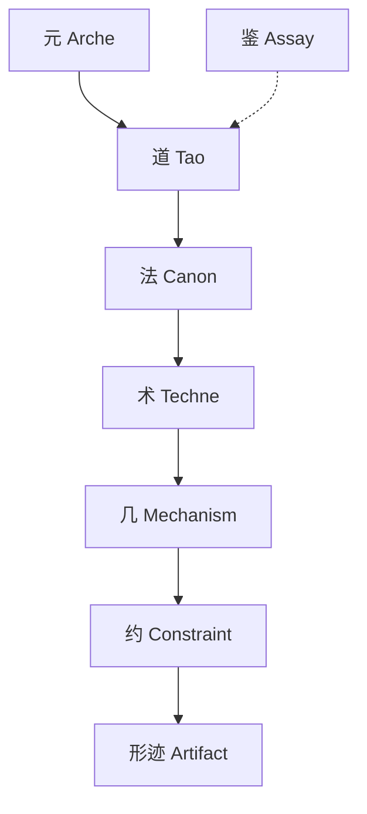
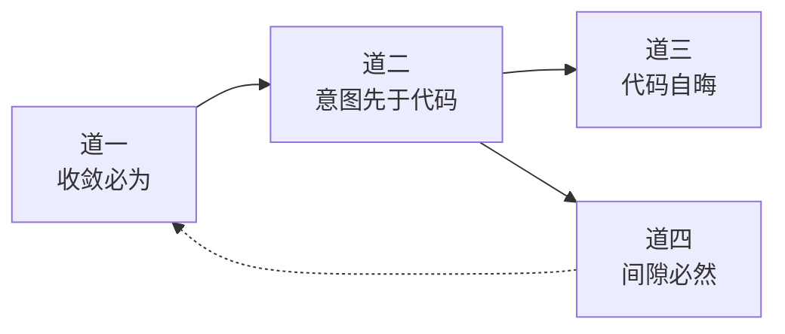
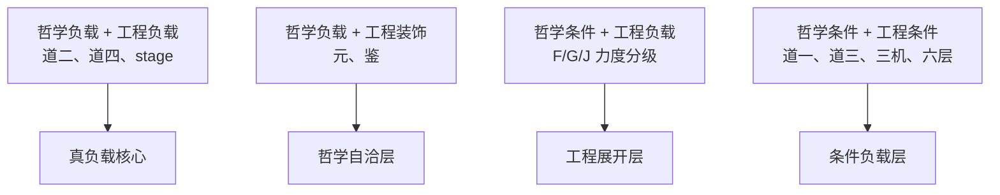
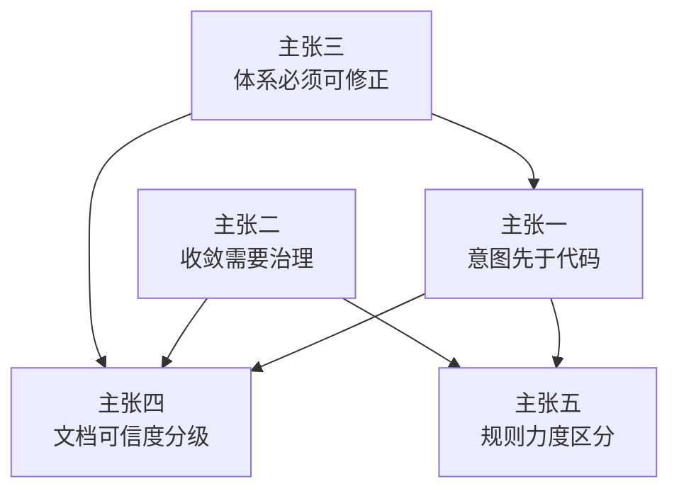

# R5：最小可行体系：司衡体系中什么是负载的，什么是装饰的

## 审阅范围

本次审阅读取 `/Users/moc/projects/SiHankor/sihankor/archive/philosophy-v1/` 目录下全部文档，覆盖 6 篇核心哲学文档（元、道论、法论、鉴论、术论、总纲）、全部工程文档（工程映射、开发治理、引擎设计摘要、Mind 设计、外部验证、五法检验标准、引擎路线图等）及全部决策/提案文档（类型扩展、Legacy 迁移治理、文档迁移模式、格式违规记录等）。

审阅方法为逐层删除测试：从最高层开始，假设删除一个概念或机制，然后判断剩余体系是否仍然构成一个可工作的代码工程治理系统。

## 体系结构概览

司衡体系由以下层次构成：

道的四条主张构成因果链条：

工程治理机制分布在法层以下：文档生命周期（stage）、目录结构、frontmatter 字段、validator 规则（13 条）、MCP 工具（4 个）、三机流转（iCL/iWW/iCT）。

## 逐层删除测试

### 测试 1：删除元（四元体系）

**测试问题**：删除元，道/法/术/鉴仍然成立吗？

**哲学层面分析**：元定义"道之所由立"，即道被发现、被检验、被确立的构成性条件。元包含四项：存在论之元（代码工程世界的实在性）、生成论之元（"自-然"原理）、认识论之元（发现的条件与边界）、方法论之元（"诗与理"的区分）。

删除元后，道本身仍可独立陈述。道的四条主张各有自己的可证伪条件和和实践推论，不依赖元的存在即可表述。法层的方法论原则、术层的工程方法、鉴层的检验方法同样可以独立操作。

但元的缺失导致一个根本问题无法回答：道的合法性来源。道为何可信？道从何处来？为何道的因果必然性值得遵循？元提供了"道之所以被发现"的认识论条件。删除元，道变成一组无来源的断言，体系内部自洽性受损。

**工程层面分析**：元不在任何 validator 规则、MCP 工具、frontmatter 字段或目录结构中被直接引用。元的实践含义（如"治理力度由条件决定"）已由道一的实践推论直接承担。删除元，工程治理的全部可操作功能不受影响。

**判定**：**哲学负载，工程装饰**。元维持哲学体系的内部自洽性（道的合法性来源），但对工程治理可操作性无贡献。

### 测试 2：删除道一

**测试问题**：删除道一，G1（Scope Boundary）还有依据吗？

**哲学层面分析**：道一主张"发散自-然，收敛必-为"，即发散是存在论必然，收敛需要主动治理。这是法层"有度之法"（收敛需要力度）、"知止之法"（收敛需要边界）、"损补之法"（收敛需要损益）、"顺势之法"（收敛需要时机）四法的道层依据。

删除道一，四法失去"为何需要治理"的根本论证。法层变成一组无来源的操作规程，无法解释治理的必要性。

**工程层面分析**：G1（Scope Boundary）即三域边界模型（语义边界域/规范约束域/工程实现域）。其依据是道一的实践推论"发散不可根除，治理必须有边界"。删除道一，三域边界失去哲学依据，但三域边界作为工程实践仍然可操作：边界检查规则可以机械执行，不依赖道一的存在。

F/G/J 力度体系失去"力度应适配场景"的根源，但力度分级本身仍可机械执行：validator 可以继续按 F/G/J 分级报告违规。

**判定**：**哲学负载，工程条件负载**。道一维持法层的合法性，但工程机制（三域边界、力度分级）可独立运作，仅失去合法性论证。

### 测试 3：删除道二

**测试问题**：删除道二，G2（Causal Alignment）还有依据吗？

**哲学层面分析**：道二主张"意图先于代码"，即代码是意图的有损编码，意图到代码的映射存在因果方向。这是顺因之法的直接依据，也是道三（消费侧因果循环）和道四（从道二递归推导）的前提。

删除道二，顺因之法失去依据，道三和道四失去基础。道的因果链条从中间断裂。

**工程层面分析**：G2（Causal Alignment）即 spec-coding 约束和 upstream 溯源机制。其依据是道二的"意图先于代码"。upstream 字段要求每篇文档标注其治理授权来源，形成从根文档到叶文档的溯源链。

删除道二，upstream 溯源机制失去哲学依据。但更关键的是，upstream 字段作为格式要求仍可机械执行（validator 可以检查 upstream 是否存在），但其语义含义消失：为何要溯源？溯源链代表什么？没有道二，upstream 变成一个无意义的格式字段。

spec-coding 约束同样失去依据：为何实现必须先有规范？没有道二，spec-coding 变成一条无理由的流程要求。

**判定**：**真负载**。道二同时承担哲学负载（顺因之法、道三、道四失去基础）和工程负载（upstream 溯源、spec-coding 失去语义依据）。删除道二，工程治理的因果方向约束不再可理解。

### 测试 4：删除道三

**测试问题**：删除道三，意图恢复的工程流程还有依据吗？

**哲学层面分析**：道三主张"代码自晦，意图必复"，即代码无法自表达意图，消费侧必须恢复意图。这构成道的因果循环的消费侧：道二（生产侧）-> 道三（消费侧）。

删除道三，消费侧的因果循环断裂。道二只说"意图先于代码"，但不说"消费时需恢复意图"。意图恢复的必要性无法解释。

**工程层面分析**：道三的工程映射是 iCL（明晰机）的明晰递进机制和 `@意图标注`。iCL 的核心功能是从代码反推意图，这正是道三的工程化。

删除道三，iCL 明晰递进失去依据。但文档治理和 validator 规则不直接依赖道三：frontmatter 检查、stage 推进、目录结构验证都不需要道三。

**判定**：**哲学负载，工程条件负载**。道三维持因果循环的完整性（哲学负载），但对文档治理不负载，仅对 Mind/iCL 功能负载。

### 测试 5：删除道四

**测试问题**：删除道四，体系的自我修正机制还有依据吗？

**哲学层面分析**：道四主张"规约与实现必有间隙"，即规范与实现之间必然存在不一致。这是从道二递归推导的：既然意图到代码有损，那么规范到实现也必有损。道四是体系自我修正机制的认识论基础。

删除道四，体系声称自己可以完备，失去认识论自觉。Reopen（重新打开已定文档）和 Supersede（继承替代）失去依据：为何要重新审视已定文档？为何要允许继承替代？没有道四，这些机制变成不必要的复杂度。

**工程层面分析**：道四的工程映射包括 Reopen/Supersede 机制、`@limitations` 标注、`@deviation` 标注、stage 修正流。这些机制允许文档在被 ratify 后仍可修正。

删除道四，Reopen/Supersede 机制失去依据，`@limitations` 和 `@deviation` 标注失去依据。但主治理流程（propose -> resolve -> ratify）不依赖道四，主流程在道四缺失时仍可工作。

**判定**：**真负载**。道四同时承担哲学负载（自我修正机制失去依据）和工程负载（Reopen/Supersede、`@limitations` 失去依据）。删除道四，体系的修正能力不再可理解，但基础治理流程仍可存活。

### 测试 6：删除鉴（九段式）

**测试问题**：删除九段式，道层的主张还能被检验吗？

**哲学层面分析**：鉴是反推九段式检验方法，用于检验道层主张。九段式包括观察、提问、定义、分辨、主张、推论、可证伪条件、实践推论、边界与局限九个阶段。鉴基于元四的"诗与理"区分，提供将"诗"（直觉洞察）转化为"理"（可检验主张）的操作流程。

删除九段式，道层主张无法被系统检验。道的四条主张虽然已经过 ratify，但如果未来需要发现新道或校准已有道，将没有规程可循。体系的自我校准能力受损。

**工程层面分析**：九段式不在任何 validator 规则、MCP 工具或 frontmatter 字段中被直接引用。validator 的 13 条规则不依赖九段式，MCP 工具的 4 个功能不依赖九段式。九段式主要用于哲学建构阶段，日常治理流程（propose -> resolve -> ratify）不使用九段式。

道层主张已经 ratify，日常治理不重新检验道。删除九段式，日常工程治理功能不受影响。

**判定**：**哲学负载，工程装饰**。鉴维持体系的自我校准能力（哲学负载），但对日常工程治理可操作性无贡献。鉴是条件负载：在新道发现或已有道校准时负载，在日常治理中不负载。

### 测试 7：删除 F/G/J 力度体系

**测试问题**：删除力度分级，validator 还能工作吗？

**哲学层面分析**：F/G/J 是"戒-规-矩"三级力度，是法层"有度之法"和"顺势之法"的工程展开。F（Fatal，戒）对应不可违反的硬约束，G（Guideline，规）对应应遵循的软约束，J（Judgment，矩）对应需判断的弹性约束。

删除 F/G/J，法层的力度分级失去工程载体，但法层原则本身不受影响。

**工程层面分析**：validator 的 13 条规则直接使用 F/G/J 分级。F-01 至 F-07 是 Fatal 级（如 frontmatter 缺失、id 格式错误），G-02 至 G-10 是 Guideline 级（如目录与 type 不匹配、upstream 断链），J-01 是 Judgment 级（如语义边界模糊）。

删除 F/G/J 分级，validator 无法区分规则的严重程度。所有违规变成同一级别，治理系统无法区分"必须修复"和"建议修复"。

但关键问题是：力度分级本身是真负载，还是仅仅是 F/G/J 这套命名是真负载？如果用其他分级方式（如 error/warning/info）替代 F/G/J，validator 仍可工作。F/G/J 的名称来自法层"戒-规-矩"的映射，但 validator 的功能依赖的是分级机制本身，而非具体名称。

**判定**：**工程负载（力度分级机制），条件负载（F/G/J 命名）**。力度分级是真负载：删除后 validator 无法区分违规严重程度。F/G/J 具体命名是条件负载：可由其他分级方案替代，但与法层的映射关系会丢失。

### 测试 8：删除三机体系（iCL/iWW/iCT）

**测试问题**：删除三机分权，治理流程还能工作吗？

**哲学层面分析**：三机（明晰机 iCL、消息机 iWW、方圆机 iCT）是几层的核心实现，提供分析、通信、校验三种功能的分权。三机对应道的不同方面：iCL 对应道三（意图恢复），iWW 对应道二（意图传递），iCT 对应道一和道四（边界与修正）。

删除三机，几层失去实现载体。但六层脉络的其他层（道、法、术）不受影响。

**工程层面分析**：三机是 Mind 的 4 个 MCP 工具的实现架构。Mind 的分析流程基于三机流转：iCL 明晰递进 -> iWW 消息封装 -> iCT 方圆校验。

删除三机分权，Mind 的分析流程无法工作。但引擎核心（parser、validator、indexer）不依赖三机：parser 解析 frontmatter，validator 检查规则，indexer 构建索引，这些功能与三机无关。

三机作为输出结构的逻辑分区是否足够？Mind 设计文档自身在自我质疑中提出：三机分权是否过度设计，是否可以用更简单的结构替代？如果 Mind 的功能简化为"分析 + 输出"，不区分三机，核心功能仍可实现。

**判定**：**条件负载**。三机对 Mind 功能负载（删除后 Mind 无法按当前架构工作），对引擎核心治理不负载（parser/validator/indexer 不依赖三机）。三机分权可由更简单的结构替代，但分析精确性会降低。

### 测试 9：删除六层脉络（道法术几约形迹）

**测试问题**：删除六层，四层（观察/原则/指南/机制）够用吗？

**哲学层面分析**：六层脉络（道 -> 法 -> 术 -> 几 -> 约 -> 形迹）是体系的概念组织结构。道是因果必然性，法是方法论原则，术是工程方法，几是具体机制，约是约束规则，形迹是实现形态。

删除六层，体系结构失去组织。概念之间的层级关系消失，无法定位某个概念属于哪一层。但道的因果必然性、法的方法论原则仍然成立，只是失去组织框架。

四层结构（观察/原则/指南/机制）能否替代？观察对应道的经验基础，原则对应道和法，指南对应术和几，机制对应约和形迹。四层可以覆盖六层的全部内容，但粒度更粗：道和法被合并为"原则"，术和几被合并为"指南"。

**工程层面分析**：六层脉络主要用于概念定位和文档组织。工程实现不严格依赖六层：代码模块（parser/validator/indexer/mind）有自己的组织方式，不按六层划分。validator 规则不引用六层，MCP 工具不引用六层。

但六层脉络在文档体系中承担定位功能：每篇文档属于哪一层，层与层之间的引用关系如何。删除六层，文档的组织逻辑需要替代方案。

**判定**：**哲学负载，工程条件负载**。六层脉络维持体系的概念组织（哲学负载），但工程上可用更少的层替代。四层结构基本够用，但概念精确性降低：道与法的区别、术与几的区别会模糊。

### 测试 10：删除文档生命周期（stage 1/3-3/3）

**测试问题**：删除 stage，治理流程还有意义吗？

**哲学层面分析**：stage 是顺势之法的工程载体，实现文档从提案到决议的生命周期。stage 编码为 1/3（propose）-> 2/3（resolve）-> 3/3（ratify），以及 0/（supersede）和 X（archive）。

删除 stage，顺势之法失去工程载体。文档没有可信度分级，所有文档同等可信。修正机制（Reopen/Supersede）失去载体：没有 stage，无法表达"文档状态变更"。

**工程层面分析**：stage 是治理流程的核心机制。validator 的 F-03（stage 值合法）和 G-08（Stage X 标记）直接依赖 stage。文档引用权限依赖 stage：只有 stage 为 3/3 的文档可被其他文档引用为 upstream。治理流程依赖 stage 推进：propose -> resolve -> ratify 的每一步对应 stage 变更。

删除 stage，以下工程功能失效：

- validator 无法检查文档状态合法性（F-03 失效）
- validator 无法识别已废弃文档（G-08 失效）
- 文档引用权限无法控制（任何文档可被引用，不论是否已验证）
- 治理流程无法推进（无法区分提案、决议、已定文档）
- 修正机制无法表达（Reopen/Supersede 无载体）

**判定**：**真负载**。stage 同时承担哲学负载（顺势之法、修正机制失去载体）和工程负载（validator 多条规则失效、文档引用权限失效、治理流程无法推进）。删除 stage，治理流程失去核心机制，体系不再构成一个可工作的治理系统。

## 负载性判定汇总

以下按"删除对象"列出判定结果。因表格限制为 3 列，拆分为两个子表。

### 哲学负载维度

| 删除对象 | 哲学负载性 | 受损部分 |
|---------|-----------|---------|
| 元 | 真负载 | 道的合法性来源 |
| 道一 | 真负载 | 法层四法依据 |
| 道二 | 真负载 | 顺因之法、道三、道四基础 |
| 道三 | 真负载 | 因果循环消费侧 |
| 道四 | 真负载 | 自我修正机制依据 |
| 鉴 | 真负载 | 道层主张可检验性 |
| F/G/J | 条件负载 | 法层力度分级载体 |
| 三机 | 条件负载 | 几层实现载体 |
| 六层 | 真负载 | 概念组织结构 |
| stage | 真负载 | 顺势之法载体 |

### 工程负载维度

| 删除对象 | 工程负载性 | 受损功能 |
|---------|-----------|---------|
| 元 | 装饰 | 无 |
| 道一 | 条件负载 | 三域边界合法性论证 |
| 道二 | 真负载 | upstream 溯源语义、spec-coding |
| 道三 | 条件负载 | iCL 明晰递进 |
| 道四 | 真负载 | Reopen/Supersede、@limitations |
| 鉴 | 装饰 | 无（日常治理不使用） |
| F/G/J | 真负载 | validator 规则分级 |
| 三机 | 条件负载 | Mind 分析流程 |
| 六层 | 条件负载 | 文档组织定位 |
| stage | 真负载 | 治理流程核心机制 |

## 哲学负载与工程负载的关系

### 核心发现

哲学负载的部分与工程负载的部分不完全重合。两者的关系呈现四种组合：

### 组合一：哲学负载且工程负载（真负载核心）

道二、道四、stage 三者同时承担哲学负载和工程负载。删除任何一个，哲学体系的内部自洽性受损，且工程治理的可操作性受损。

这构成体系的最小不可删除内核。道二提供因果方向，道四提供修正能力，stage 提供治理流程载体。三者共同回答：治理为何有方向（道二）、治理为何可修正（道四）、治理如何推进（stage）。

### 组合二：哲学负载但工程装饰（哲学自洽层）

元和鉴在哲学上负载，但在工程上装饰。删除元，道的合法性来源消失，但工程治理功能不受影响。删除鉴，道层主张不可被系统检验，但日常治理不使用九段式。

这意味着：哲学体系的完备性依赖元和鉴，但工程治理系统的可操作性不依赖它们。一个可以工作的代码工程治理系统，不需要回答"道从哪里来"和"道如何被检验"。

### 组合三：工程负载但哲学条件（工程展开层）

F/G/J 力度分级在工程上负载（validator 核心机制），但在哲学上是法层的工程展开，不是独立的哲学主张。删除 F/G/J 命名，法层原则不受影响，但 validator 无法工作。

力度分级机制本身是真负载，但 F/G/J 这套具体命名是条件负载：可由其他分级方案替代。

### 组合四：哲学条件且工程条件（条件负载层）

道一、道三、三机、六层在哲学和工程上都是条件负载。它们在特定条件下负载，在其他条件下不负载。

道一在"法层合法性追问"条件下负载，在"工程机制机械执行"条件下不负载。道三在"Mind/iCL 功能"条件下负载，在"文档治理"条件下不负载。三机在"Mind 分析流程"条件下负载，在"引擎核心治理"条件下不负载。六层在"概念精确组织"条件下负载，在"工程实现"条件下不负载。

### 核心问题的回答

工程负载的部分是否正好是哲学负载的部分？

答案是否定的。两者存在系统性偏差：

哲学负载但工程不负载的部分（元、鉴）表明：体系在哲学上追求完备性（道从哪里来、道如何被检验），但工程治理系统不需要这种完备性即可工作。

工程负载但哲学不直接负载的部分（F/G/J、stage 的工程编码）表明：工程治理系统有自己独立的需求（规则分级、流程推进），这些需求不直接来自哲学主张，而是来自工程实践本身。

两者重合的部分（道二、道四）表明：哲学负载和工程负载在"因果方向"和"自我修正"两点上交汇。这两点是哲学体系的因果链条的关键节点，也是工程治理系统的核心约束。

## 最小可行体系

如果只保留真负载部分，删除全部装饰和条件负载，司衡的最小可行内核由以下 5 条核心主张构成。其中主张一、三、四、五严格对应工程真负载；主张二提取道一的实践推论（"治理力度应适配场景"）作为主张五的合法性基础保留，道一的本体论论证（"发散自-然"）不保留。

**主张一：意图先于代码，因果方向不可逆。** 代码是意图的有损编码，治理必须维持从意图到代码的可追溯链。upstream 溯源链是这一主张的工程载体，spec-coding 是其流程约束。删除此主张，治理系统失去因果方向，upstream 变成无意义字段。

**主张二：治理力度应适配场景，收敛需要主动干预。** 此主张是道一的实践推论，为力度分级提供合法性。治理不是可选的辅助手段，不同场景需要不同力度的约束。删除此主张，力度分级（主张五）失去"为何需要分级"的解释，但力度分级机制本身仍可机械执行。此主张在工程上为条件负载，因作为主张五的合法性基础而保留。

**主张三：规约与实现必有间隙，体系必须可修正。** 规范与实现之间必然存在不一致，体系承认自身不完备。Reopen/Supersede 机制和 `@limitations` 标注是这一主张的工程载体。删除此主张，体系失去修正能力，已定文档无法被重新审视。

**主张四：文档可信度必须分级，只有经验证的文档可被引用。** 文档生命周期（stage 1/3 -> 2/3 -> 3/3）是治理流程的核心机制。stage 为 3/3 的文档才可被其他文档引用为 upstream。删除此主张，治理流程无法推进，文档引用权限无法控制。

**主张五：治理规则必须有力度区分，不同违规有不同后果。** validator 的规则按 Fatal/Guideline/Judgment 三级分级，区分"必须修复"和"建议修复"。删除此主张，所有违规变成同一级别，治理系统无法区分严重程度。

### 最小可行体系的边界

以上 5 条主张构成的最小可行内核，能够支撑以下工程治理功能：

- 文档生命周期管理（propose -> resolve -> ratify）
- 文档引用权限控制（仅 ratify 文档可被引用）
- 因果溯源链维护（upstream 链）
- 规则验证与分级报告（validator 的 F/G/J 规则）
- 修正机制（Reopen/Supersede）

以下功能在最小可行内核中不可用，但工程治理的核心流程不依赖它们：

- 道的合法性来源论证（元）
- 道层主张的系统检验（鉴九段式）
- 意图恢复的分析流程（道三、三机、Mind）
- 概念精确组织（六层脉络）
- 道一的本体论论证（"发散自-然"的哲学论证，其工程实践推论已保留于主张二）

这些功能在完整体系中负载，但在最小可行内核中可被省略，不影响工程治理系统的可工作性。

### 依赖结构图

主张一（因果方向）是其余主张的基础：主张三的修正机制依赖因果方向的识别，主张四的文档分级依赖溯源链的完整性，主张五的规则验证依赖因果方向约束。主张二（收敛需要治理）提供治理的必要性论证，与主张一共同支撑力度分级和文档分级。主张三（可修正性）闭环回到主张一：修正机制的目的是维持因果方向的完整性。

## 审阅结论

司衡体系中，真负载集中在三条因果链条的节点（道二、道四）和两个工程机制（stage、力度分级）。这五者共同构成最小可行内核，删除任何一个都会导致至少一个工程治理功能不再可操作。

元、鉴、六层脉络在哲学上负载，但在工程上装饰。它们维持哲学体系的内部自洽性和概念完备性，但对工程治理可操作性无直接贡献。

道一、道三、三机在特定条件下负载。道一在法层合法性追问时负载，道三在 Mind 功能时负载，三机在分析流程时负载。这些条件负载部分在完整体系中不可或缺，但在最小可行内核中可被省略。

哲学负载与工程负载的交汇点在"因果方向"（道二）和"自我修正"（道四）两点。这两点是哲学因果链条的关键节点，也是工程治理系统的核心约束。体系的其他部分要么仅服务于哲学自洽性（元、鉴），要么仅服务于工程操作性（F/G/J、stage 编码），要么在特定条件下才负载（道一、道三、三机、六层）。
