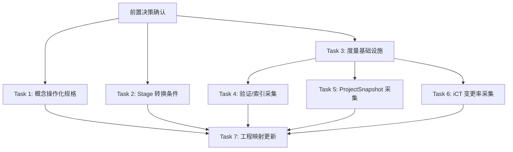

# 司衡工程补全实施计划

> **For agentic workers:** REQUIRED SUB-SKILL: Use superpowers:subagent-driven-development (recommended) or superpowers:executing-plans to implement this plan task-by-task. Steps use checkbox (`- [ ]`) syntax for tracking.

**Goal:** 将司衡工程映射中的 L5 断裂逐一补全为 L2-L3 可工作状态，同时建立概念操作化文档作为哲学到工程的方法论桥梁。

**Architecture:** 采用"概念操作化先导 -> 度量基础设施 -> 指标管道补全"三层推进。每层产出既可独立交付，又为下层提供基础。度量采集采用"事件即采集点"模式：治理操作本身携带度量产出，无需独立扫描流程。

**Tech Stack:** Rust, SQLite (rusqlite), 现有司衡代码库

---

## 前置决策

以下决策阻塞后续任务，必须在启动前确认：

### 决策 1：度量采集架构

- 选项 A：独立 metrics 表（在现有 documents 表之外新增度量表，存储历史度量记录）
- 选项 B：嵌入现有流程（在 validate_document/index_document 调用中顺带产出度量，存入新的 metrics 表）
- 选项 C：纯快照（只存储当前状态的聚合计数，不存历史，不做趋势分析）
- **推荐: A + B 结合。** 新增 metrics 表存储历史记录，采集逻辑嵌入现有治理流程。选项 C 无法支持道四b（间隙随时间增大）的验证。

### 决策 2：概念操作化文档的范围

- 选项 A：全覆盖（14 条映射链全部操作化）
- 选项 B：仅 L5（只操作化当前零实现的 8 条 L5 链）
- 选项 C：仅道层（只操作化道一/道四b，作为法层的上游基础）
- **推荐: B。** L1/L2 已经有工程对应，操作化的边际收益低。L3 的操作化可在后续迭代中完成。L5 的 8 条是当前最需要的。

### 决策 3：操作化规格的文档形式

- 选项 A：独立文档（创建 `docs/specs/engineering/Construct-Operationalization.sih.md`）
- 选项 B：扩展工程映射文档（在现有 Engineering-Mapping.sih.md 中增加操作化章节）
- **推荐: A。** 独立文档避免工程映射文档膨胀，且操作化规格有独立的生命周期和 stage。

---

## 文件结构

### 新建文件

```text
docs/specs/engineering/
  Construct-Operationalization.sih.md     # 概念操作化规格（Task 1 产出）

src/core/
  metrics.rs                              # 度量模型定义 + MetricsCollector struct（Task 3 产出）
```

### 修改文件

```text
src/core/models.rs                        # Stage 转换条件补全（Task 2）
src/core/database.rs                      # 新增 metrics 表 + 查询方法（Task 3）
src/core/indexer.rs                       # 嵌入度量采集点（Task 4）
src/core/validator.rs                     # 嵌入度量采集点（Task 4）
src/core/mod.rs                           # 导出 metrics 模块（Task 3）
src/mind/ict.rs                           # 顺势变更率采集（Task 6）
```

---

## Phase 0: 概念操作化先导（零代码）

### Task 1: 概念操作化规格

**Files:**
- Create: `docs/specs/engineering/Construct-Operationalization.sih.md`

**Depends on:** 无

**Subagent Prompt:**

```text
你的任务是为司衡体系创建概念操作化规格文档。

## 背景

司衡的哲学层已完成严谨化重构（认识论标签、外部锚定声明）。但哲学概念到工程实现的映射存在大面积 L5 断裂（零实现）。在动手写度量代码之前，需要先为每个需要工程化的道/法指定"操作化论证" -- 为什么选这个指示器、它能否忠实反映构念含义、效度威胁是什么。

方法论来源：概念操作化（Operationalization，Bridgman 1927, Cronbach & Meehl 1954），在心理学和社会科学中用于将抽象构念转化为可度量变量。

## 必读文件

1. 工程映射文档：/Users/moc/projects/SiHankor/sihankor/docs/specs/engineering/Engineering-Mapping.sih.md
2. 道论：/Users/moc/projects/SiHankor/sihankor/docs/specs/philosophy/Tao-On-Natural-Convergence.sih.md
3. 法论：/Users/moc/projects/SiHankor/sihankor/docs/specs/philosophy/Canon-On-Governance-Principles.sih.md
4. SPEC：/Users/moc/projects/SiHankor/sihankor/docs/specs/SiHankor-Reconstruction-Spec.md

## 任务

为以下 8 条 L5 断裂链创建操作化规格。每条链必须包含六个要素：

### 要素模板

1. **构念定义**：哲学陈述 + 适用边界（从道论/法论引用）
2. **提议指示器**：可度量的具体变量（1-3 个）
3. **操作化假设**：为什么这个指示器能反映构念（逻辑论证，非断言）
4. **效度威胁**：这个指示器可能在什么条件下扭曲构念含义
5. **降格声明**：当前 L 级别和局限性，以及操作化后的目标 L 级别
6. **验证路径**：什么证据能升级 L 级别

### 8 条断裂链

#### 链 1：道一 -> 产出方差度量
- 构念：发散自-然，收敛必-为
- 可参考的指示器：文档风格不一致率、架构漂移率、同类型文档间字段差异度
- 注意：产出方差的度量对象是"文档/代码产出"，不是"运行时性能"

#### 链 5：道四b -> 跨版本一致性检查
- 构念：治理与实践的间隙随时间增大，且增大速率与规则数量正相关
- 可参考的指示器：同一文档在不同时间点的验证结果差异、规则数量时序
- 注意：需要时间序列数据

#### 链 6：知止 -> G1 Scope Boundary 度量管道
- 构念：治理投入与产出方差成正比
- 可参考的指示器：规则密度（规则数/文档数）、治理开销占比
- 注意：依赖链 1 的产出方差数据

#### 链 8：有度 -> G3 Proportionality 规则数审计
- 构念：规则数量和严格度与风险成正比
- 可参考的指示器：各治理区域的规则数分布、Fatal 级规则占比
- 注意：规则数统计可直接从 validator 规则定义中获取

#### 链 9：损补 -> G4 Trade-off Management 权衡文档
- 构念：每条治理决策涉及权衡
- 可参考的指示器：规则是否有成本-收益记录、规则增删比率
- 注意：这是一个文档化要求，需要定义什么样的记录算"权衡文档"

#### 链 10：顺势 -> G5 Trend Alignment 变更率追踪
- 构念：治理力度应随项目演进
- 可参考的指示器：规则审查频率 vs 代码变更频率的比值
- 注意：需要时间序列数据

#### 链 11：鉴九段式 -> 检验流程
- 构念：constructed-framework，反推检验工具
- 可参考的指示器：暂缓（当前决定），不操作化
- 注意：此链的处置是"暂缓"，操作化规格只记录"暂不操作化"的理由

#### 链 14 补充：decided-by 路径覆盖
- 构念：decided-by 必须是人类标识符
- 可参考的指示器：decided-by 覆盖率（有 decided-by 的 decision 占比）
- 注意：当前 L2，不是 L5，但路径覆盖不完整。作为补充操作化

## 格式约束（AGENTS.md 规范）

- 仅使用 ASCII 字符和 CJK 字符，不使用 emoji 或其他非 ASCII 符号
- em-dash（U+2014）替换为全角冒号（U+FF1A）
- 正文禁止使用水平线（---），水平线仅用于 frontmatter 分隔符
- 使用二级标题（##）分节
- 表格不超过 3 列
- 代码块必须指定语言标签
- 粗体（**）仅用于术语定义和突出数值
- 列表项保持简洁，最多 2 级嵌套

## frontmatter 格式

```yaml
---
id: 260628-1600-construct-operationalization
stage: 1/3
upstream: 260628-1100-engineering-mapping
---
```

## 产出

保存到：
/Users/moc/projects/SiHankor/sihankor/docs/specs/engineering/Construct-Operationalization.sih.md

## 禁止

- 不得修改任何现有文件
- 不得参考 docs/review-results/ 中的任何文件
- 不得指定具体的代码实现（这是操作化规格，不是工程规格）
- 不得声称某个指示器"完美"反映构念（所有操作化都有降格）
```

- [ ] **Step 1: 确认前置决策**
- [ ] **Step 2: 将上述 prompt 发送给子 agent**
- [ ] **Step 3: 用户审阅操作化规格**
- [ ] **Step 4: Commit**

```bash
cd /Users/moc/projects/SiHankor/sihankor
git add docs/specs/engineering/Construct-Operationalization.sih.md
git commit -m "docs: add construct operationalization spec for L5 mapping chains"
```

---

## Phase 1: 基础设施（2 任务并行）

### Task 2: Stage 转换条件补全

**Files:**
- Modify: `src/core/models.rs`
- Modify: `src/core/validator.rs`
- Test: `tests/integration_test.rs`

**Depends on:** 无

**Subagent Prompt:**

```text
你的任务是补全司衡项目的 Stage 枚举转换条件。

## 背景

Stage 枚举有 5 种状态：Propose(1/3)、Resolve(2/3)、Ratify(3/3)、Deprecated(X)、Superseded(0/id)。

当前问题：`is_valid()` 恒返回 true，无转换条件校验。V-F-03 规则调用 `doc.stage.is_valid()` 检查 stage 合法性，但因恒 true，此规则实际无校验效果。状态机存在但转换条件不完整。

## 必读文件

1. models.rs：/Users/moc/projects/SiHankor/sihankor/src/core/models.rs
2. validator.rs：/Users/moc/projects/SiHankor/sihankor/src/core/validator.rs（搜索 is_valid 调用点）
3. 测试：/Users/moc/projects/SiHankor/sihankor/tests/integration_test.rs

## 任务

### 2.1 补全 `can_transition_to` 方法

在 Stage 枚举上新增方法：

```rust
/// 检查从当前 stage 是否可以转换到目标 stage
/// 返回 Ok(()) 表示允许，Err 描述不允许的原因
pub fn can_transition_to(&self, target: &Stage) -> Result<(), String> {
    match (self, target) {
        // 相同 stage 无需转换
        (a, b) if a == b => Err("same stage".into()),
        // Propose -> Resolve: 允许
        (Stage::Propose, Stage::Resolve) => Ok(()),
        // Resolve -> Ratify: 允许
        (Stage::Resolve, Stage::Ratify) => Ok(()),
        // Propose -> Ratify: 允许（跳过 Resolve）
        (Stage::Propose, Stage::Ratify) => Ok(()),
        // Resolve -> Propose: 允许（Reopen）
        (Stage::Resolve, Stage::Propose) => Ok(()),
        // Ratify -> Resolve: 允许（Reopen）
        (Stage::Ratify, Stage::Resolve) => Ok(()),
        // Ratify -> Propose: 允许（Reopen，但应触发警告）
        (Stage::Ratify, Stage::Propose) => Ok(()),
        // 任何 -> Deprecated: 允许
        (_, Stage::Deprecated) => Ok(()),
        // 任何 -> Superseded: 允许
        (_, Stage::Superseded(_)) => Ok(()),
        // Deprecated/Superseded -> 其他: 不允许
        (Stage::Deprecated, _) => Err("deprecated stage cannot transition".into()),
        (Stage::Superseded(_), _) => Err("superseded stage cannot transition".into()),
    }
}
```

注意：当前不实现强制转换检查（没有 governance 工具会触发转换）。此方法仅提供查询能力，供未来治理工具使用。

### 2.2 补全 `is_valid` 方法

`is_valid` 保持恒 true，但在文档中说明原因：Stage 枚举的 5 种状态都是合法状态，"不合法"的情况（如非法字符串"4/3"）已在 `from_str` 中通过返回 None 处理。

如果 `from_str` 未覆盖某些情况，补全 `from_str` 的 match（如当前 Superseded 的匹配可能不完整）。

### 2.3 新增测试

在 models.rs 的 `#[cfg(test)]` 模块中新增测试（如果不存在则创建）：

```rust
#[cfg(test)]
mod tests {
    use super::*;

    #[test]
    fn test_can_transition_propose_to_resolve() {
        assert!(Stage::Propose.can_transition_to(&Stage::Resolve).is_ok());
    }

    #[test]
    fn test_can_transition_resolve_to_ratify() {
        assert!(Stage::Resolve.can_transition_to(&Stage::Ratify).is_ok());
    }

    #[test]
    fn test_can_transition_ratify_to_resolve_reopen() {
        assert!(Stage::Ratify.can_transition_to(&Stage::Resolve).is_ok());
    }

    #[test]
    fn test_cannot_transition_from_deprecated() {
        assert!(Stage::Deprecated.can_transition_to(&Stage::Propose).is_err());
    }

    #[test]
    fn test_cannot_transition_from_superseded() {
        assert!(Stage::Superseded("new".into()).can_transition_to(&Stage::Propose).is_err());
    }

    #[test]
    fn test_same_stage_no_transition() {
        assert!(Stage::Propose.can_transition_to(&Stage::Propose).is_err());
    }

    #[test]
    fn test_from_str_roundtrip() {
        let cases = [("1/3", Stage::Propose), ("2/3", Stage::Resolve), ("3/3", Stage::Ratify), ("X", Stage::Deprecated)];
        for (s, expected) in cases {
            assert_eq!(Stage::from_str(s), Some(expected));
        }
        // Superseded
        assert_eq!(Stage::from_str("0/new-id"), Some(Stage::Superseded("new-id".into())));
        // Invalid
        assert_eq!(Stage::from_str("4/3"), None);
        assert_eq!(Stage::from_str(""), None);
    }
}
```

## 约束

- 修改前必须先读取文件内容
- 不得破坏编译
- 不得删除任何现有测试
- 保持 `is_valid()` 恒 true（不改变其行为）
- 不实现强制转换检查（仅提供查询方法）

## 项目路径

/Users/moc/projects/SiHankor/sihankor

## 验证

完成后执行 cargo check 和 cargo test，输出结果作为完成证据。
```

- [ ] **Step 1: 将上述 prompt 发送给子 agent**（与 Task 3 并行）
- [ ] **Step 2: 验证 cargo check 零错误**
- [ ] **Step 3: 验证 cargo test 全部通过**
- [ ] **Step 4: Commit**

```bash
cd /Users/moc/projects/SiHankor/sihankor
git add src/core/models.rs
git commit -m "feat: add Stage::can_transition_to method and from_str tests"
```

---

### Task 3: 度量基础设施（metrics 表 + MetricsCollector）

**Files:**
- Create: `src/core/metrics.rs`
- Modify: `src/core/database.rs`
- Modify: `src/core/mod.rs`

**Depends on:** 无

**Subagent Prompt:**

```text
你的任务是为司衡项目创建度量基础设施。

## 背景

司衡需要采集治理指标来验证哲学主张（如道一"产出方差"可证伪条件需要度量数据）。当前项目没有任何度量采集基础设施。需要创建 metrics 表和度量采集模型。

## 必读文件

1. 数据库：/Users/moc/projects/SiHankor/sihankor/src/core/database.rs（理解现有 schema 和 SihDatabase trait）
2. 模型：/Users/moc/projects/SiHankor/sihankor/src/core/models.rs
3. 模块组织：/Users/moc/projects/SiHankor/sihankor/src/core/mod.rs

## 任务

### 3.1 创建 `src/core/metrics.rs`

定义度量模型和采集器：

```rust
use chrono::{DateTime, Utc};
use serde::{Deserialize, Serialize};

/// 度量事件类型
#[derive(Debug, Clone, PartialEq, Eq, Serialize, Deserialize)]
pub enum MetricEvent {
    /// 文档验证完成
    ValidationCompleted {
        doc_id: String,
        nature: String,
        stage: String,
        fatal_count: usize,
        guideline_count: usize,
        judgment_count: usize,
        passed: bool,
    },
    /// 文档索引完成
    IndexCompleted {
        doc_id: String,
        nature: String,
    },
    /// Stage 转换
    StageTransition {
        doc_id: String,
        from_stage: String,
        to_stage: String,
    },
    /// 项目快照（规则数、文档数等聚合）
    ProjectSnapshot {
        total_docs: usize,
        total_rules: usize,
        docs_by_stage: Vec<(String, usize)>,
        docs_by_nature: Vec<(String, usize)>,
        fatal_violations_total: usize,
    },
}

/// 存储在数据库中的度量记录
#[derive(Debug, Clone, Serialize, Deserialize)]
pub struct MetricRecord {
    pub id: i64,
    pub event_type: String,
    pub payload_json: String,
    pub created_at: String,
}
```

不要实现 MetricsCollector struct（YAGNI）。度量记录的写入通过扩展 SihDatabase trait 来完成。

### 3.2 扩展数据库 schema

在 `database.rs` 的 `initialize_schema` 中新增 metrics 表：

```sql
CREATE TABLE IF NOT EXISTS metrics (
    id              INTEGER PRIMARY KEY AUTOINCREMENT,
    event_type      TEXT NOT NULL,
    payload_json    TEXT NOT NULL,
    created_at      TEXT NOT NULL DEFAULT (datetime('now'))
);

CREATE INDEX idx_metrics_type      ON metrics(event_type);
CREATE INDEX idx_metrics_created   ON metrics(created_at);
```

### 3.3 扩展 SihDatabase trait

在 trait 中新增 3 个方法：

```rust
/// 记录一条度量事件
async fn record_metric(
    &self,
    event_type: &str,
    payload_json: &str,
) -> Result<(), DatabaseError>;

/// 查询指定类型度量事件的最近 N 条
async fn query_metrics(
    &self,
    event_type: &str,
    limit: usize,
) -> Result<Vec<MetricRecord>, DatabaseError>;

/// 查询 ProjectSnapshot 类型的最近快照
async fn get_latest_snapshot(&self) -> Result<Option<MetricRecord>, DatabaseError>;
```

### 3.4 在 SqliteBackend 中实现

```rust
async fn record_metric(&self, event_type: &str, payload_json: &str) -> Result<(), DatabaseError> {
    let conn = self.conn.lock().map_err(|_| DatabaseError::NotInitialized)?;
    conn.execute(
        "INSERT INTO metrics (event_type, payload_json, created_at) VALUES (?1, ?2, datetime('now'))",
        params![event_type, payload_json],
    )?;
    Ok(())
}

async fn query_metrics(&self, event_type: &str, limit: usize) -> Result<Vec<MetricRecord>, DatabaseError> {
    let conn = self.conn.lock().map_err(|_| DatabaseError::NotInitialized)?;
    let mut stmt = conn.prepare(
        "SELECT id, event_type, payload_json, created_at FROM metrics WHERE event_type = ?1 ORDER BY created_at DESC LIMIT ?2"
    )?;
    let rows = stmt.query_map(params![event_type, limit as i64], |row| {
        Ok(MetricRecord {
            id: row.get(0)?,
            event_type: row.get(1)?,
            payload_json: row.get(2)?,
            created_at: row.get(3)?,
        })
    })?;
    let mut results = Vec::new();
    for row in rows {
        results.push(row?);
    }
    Ok(results)
}

async fn get_latest_snapshot(&self) -> Result<Option<MetricRecord>, DatabaseError> {
    let mut records = self.query_metrics("ProjectSnapshot", 1).await?;
    Ok(records.pop())
}
```

### 3.5 导出模块

在 `src/core/mod.rs` 中添加 `pub mod metrics;`。

### 3.6 测试

在 metrics.rs 底部添加 `#[cfg(test)] mod tests`：

```rust
#[cfg(test)]
mod tests {
    use super::*;
    use crate::core::database::SqliteBackend;
    use crate::core::database::SihDatabase;

    #[tokio::test]
    async fn test_record_and_query_metrics() {
        let db = SqliteBackend::open_in_memory().unwrap();
        
        // 记录一条度量
        let payload = r#"{"test": true}"#;
        db.record_metric("TestEvent", payload).await.unwrap();
        
        // 查询
        let records = db.query_metrics("TestEvent", 10).await.unwrap();
        assert_eq!(records.len(), 1);
        assert_eq!(records[0].event_type, "TestEvent");
        assert_eq!(records[0].payload_json, payload);
    }

    #[tokio::test]
    async fn test_query_empty_metrics() {
        let db = SqliteBackend::open_in_memory().unwrap();
        let records = db.query_metrics("NonExistent", 10).await.unwrap();
        assert!(records.is_empty());
    }

    #[tokio::test]
    async fn test_latest_snapshot_empty() {
        let db = SqliteBackend::open_in_memory().unwrap();
        let snapshot = db.get_latest_snapshot().await.unwrap();
        assert!(snapshot.is_none());
    }
}
```

## 约束

- 修改前必须先读取文件内容
- 不得破坏编译
- 不得删除任何现有测试
- 不实现 MetricsCollector struct（YAGNI，后续任务需要时再加）
- 不修改任何现有数据库表结构

## 项目路径

/Users/moc/projects/SiHankor/sihankor

## 验证

完成后执行 cargo check 和 cargo test，输出结果作为完成证据。
```

- [ ] **Step 1: 将上述 prompt 发送给子 agent**（与 Task 2 并行）
- [ ] **Step 2: 验证 cargo check 零错误**
- [ ] **Step 3: 验证 cargo test 全部通过**
- [ ] **Step 4: Commit**

```bash
cd /Users/moc/projects/SiHankor/sihankor
git add src/core/metrics.rs src/core/database.rs src/core/mod.rs
git commit -m "feat: add metrics infrastructure (metrics table + MetricEvent + SihDatabase extensions)"
```

---

## Phase 2: 度量采集管道（3 任务并行）

### Task 4: 验证/索引流程嵌入度量采集

**Files:**
- Modify: `src/core/indexer.rs`
- Modify: `src/core/validator.rs`

**Depends on:** Task 3（metrics 基础设施）

**Subagent Prompt:**

```text
你的任务是在司衡的验证和索引流程中嵌入度量采集点。

## 背景

Task 3 已创建 metrics 表和 SihDatabase::record_metric 方法。现在需要在现有的验证和索引流程中调用 record_metric，使治理操作本身携带度量产出。

采集模式：事件即采集点。每次 validate_document 和 index_document 调用时，顺带产出一条度量记录。

## 必读文件

1. indexer.rs：/Users/moc/projects/SiHankor/sihankor/src/core/indexer.rs
2. validator.rs：/Users/moc/projects/SiHankor/sihankor/src/core/validator.rs
3. metrics.rs：/Users/moc/projects/SiHankor/sihankor/src/core/metrics.rs
4. database.rs：/Users/moc/projects/SiHankor/sihankor/src/core/database.rs（确认 record_metric 签名）

## 任务

### 4.1 在 validator.rs 中嵌入 ValidationCompleted 采集

在 validate_document（或 validate 内部的顶层函数，即产出 violations 列表的函数）的返回之前，插入度量采集逻辑：

1. 统计 violations 列表中的 Fatal/Guideline/Judgment 数量
2. 构造 MetricEvent::ValidationCompleted 的 JSON payload
3. 调用 db.record_metric("ValidationCompleted", &payload_json)

注意：validate_document 的函数签名需要能够访问 db。检查当前函数是否已经有 db 参数。如果没有，不要修改函数签名（保持最小侵入），而是在调用方（如 indexer.rs 的索引管道中）采集。

### 4.2 在 indexer.rs 中嵌入 IndexCompleted 和 ValidationCompleted 采集

在 indexer 的索引管道中（解析 -> 验证 -> 入库的流程），在验证完成后和入库完成后分别采集：

1. **ValidationCompleted**：如果 validator 返回 violations，统计并记录
2. **IndexCompleted**：记录文档 id 和 nature

### 4.3 确认MetricEvent 序列化

确认 MetricEvent 枚举可以正确序列化为 JSON（Serialize derive）。如果需要，使用 serde_json::to_string。

### 4.4 测试

在验证和索引的现有测试中，确认：
1. 采集逻辑不会导致测试失败
2. 采集逻辑不会产生副作用（如测试中的内存数据库应该也能正确记录 metrics）
3. 不需要为采集逻辑本身写专门的测试（它是嵌入式的，通过现有测试覆盖）

## 约束

- 修改前必须先读取文件内容
- 不得破坏编译
- 不得改变 validate_document 的函数签名（除非 db 参数已经存在）
- 不得改变验证的业务逻辑
- 度量采集失败不应阻断主流程（用 unwrap_or 记录忽略错误，或 match 忽略）

## 项目路径

/Users/moc/projects/SiHankor/sihankor

## 验证

完成后执行 cargo check 和 cargo test，输出结果作为完成证据。
```

- [ ] **Step 1: 确认 Task 3 已完成**
- [ ] **Step 2: 将上述 prompt 发送给子 agent**（与 Task 5、Task 6 并行）
- [ ] **Step 3: 验证 cargo check 零错误**
- [ ] **Step 4: 验证 cargo test 全部通过**
- [ ] **Step 5: Commit**

```bash
cd /Users/moc/projects/SiHankor/sihankor
git add src/core/indexer.rs src/core/validator.rs
git commit -m "feat: embed metric collection in validate and index pipelines"
```

---

### Task 5: ProjectSnapshot 采集（MCP governance 概览扩展）

**Files:**
- Modify: `src/mcp_server/governance.rs`

**Depends on:** Task 3（metrics 基础设施）

**Subagent Prompt:**

```text
你的任务是在司衡的 MCP governance 概览工具中嵌入 ProjectSnapshot 采集。

## 背景

governance.rs 中的 governance overview 工具已经调用了 count_documents、count_by_stage、count_by_nature 来生成文本报告。Task 3 已创建 metrics 表和 SihDatabase::record_metric 方法。现在需要在概览生成时顺带记录一个 ProjectSnapshot 到 metrics 表。

## 必读文件

1. governance.rs：/Users/moc/projects/SiHankor/sihankor/src/mcp_server/governance.rs
2. metrics.rs：/Users/moc/projects/SiHankor/sihankor/src/core/metrics.rs
3. database.rs：/Users/moc/projects/SiHankor/sihankor/src/core/database.rs

## 任务

1. 在 governance overview 生成逻辑中，在生成文本报告之前：
   a. 收集 total_docs、total_rules（validator 中的规则总数）、docs_by_stage、docs_by_nature、fatal_violations_total
   b. 构造 MetricEvent::ProjectSnapshot 的 JSON payload
   c. 调用 db.record_metric("ProjectSnapshot", &payload_json)
2. total_rules 的计算：统计 validator.rs 中所有以 V-F/V-G/V-J 开头的 rule_id 数量。可以直接硬编码常量（当前是 14 条），也可以在 validator 中提供一个函数来获取。选择最小侵入的方案。

注意：ProjectSnapshot 是"低频高价值"度量（每次调用概览时记录一次），不需要高频采集。

## 约束

- 修改前必须先读取文件内容
- 不得破坏编译
- 不得改变 governance overview 的输出格式
- 采集失败不应阻断概览生成

## 项目路径

/Users/moc/projects/SiHankor/sihankor

## 验证

完成后执行 cargo check 和 cargo test，输出结果作为完成证据。
```

- [ ] **Step 1: 确认 Task 3 已完成**
- [ ] **Step 2: 将上述 prompt 发送给子 agent**（与 Task 4、Task 6 并行）
- [ ] **Step 3: 验证 cargo check 零错误**
- [ ] **Step 4: 验证 cargo test 全部通过**
- [ ] **Step 5: Commit**

```bash
cd /Users/moc/projects/SiHankor/sihankor
git add src/mcp_server/governance.rs
git commit -m "feat: embed ProjectSnapshot metric collection in governance overview"
```

---

### Task 6: 顺势变更率采集（iCT 扩展）

**Files:**
- Modify: `src/mind/ict.rs`

**Depends on:** Task 3（metrics 基础设施）

**Subagent Prompt:**

```text
你的任务是在司衡的 iCT（方圆机）中嵌入变更率相关度量采集。

## 背景

iCT 对 DecisionProposal 执行五法检验。Task 3 已创建 metrics 表和 SihDatabase::record_metric 方法。顺势之法（G5 Trend Alignment）的验证方法要求追踪"规则审查频率 vs 代码变更频率的比值"。在 iCT 执行检验时，可以顺带采集这个比值。

## 必读文件

1. ict.rs：/Users/moc/projects/SiHankor/sihankor/src/mind/ict.rs
2. types.rs：/Users/moc/projects/SiHankor/sihankor/src/mind/types.rs
3. metrics.rs：/Users/moc/projects/SiHankor/sihankor/src/core/metrics.rs

## 任务

1. 理解 iCT 的 verify 方法签名和调用方式。确认 iCT 是否能访问 SihDatabase。
2. 如果 iCT 能访问 db：
   a. 在 verify 方法中，在五法检验完成后，查询 metrics 表中最近的 ValidationCompleted 记录数（作为代码变更频率的代理）
   b. 查询最近的 ProjectSnapshot 记录（包含规则总数）
   c. 构造一条度量事件，记录"审查次数/变更次数"比值
   d. 调用 db.record_metric
3. 如果 iCT 不能访问 db：
   a. 不修改 iCT 的函数签名
   b. 在 ict.rs 中添加注释，说明"此处应采集顺势变更率，但需要 db 访问，待后续重构时补全"
   c. 不实现采集逻辑

选择最小侵入的方案。

## 约束

- 修改前必须先读取文件内容
- 不得破坏编译
- 不得改变 iCT 的验证业务逻辑
- 不得修改 iCT 的函数签名（除非 db 参数已经存在）
- 采集失败不应阻断检验流程

## 项目路径

/Users/moc/projects/SiHankor/sihankor

## 验证

完成后执行 cargo check 和 cargo test，输出结果作为完成证据。
```

- [ ] **Step 1: 确认 Task 3 已完成**
- [ ] **Step 2: 将上述 prompt 发送给子 agent**（与 Task 4、Task 5 并行）
- [ ] **Step 3: 验证 cargo check 零错误**
- [ ] **Step 4: 验证 cargo test 全部通过**
- [ ] **Step 5: Commit**

```bash
cd /Users/moc/projects/SiHankor/sihankor
git add src/mind/ict.rs
git commit -m "feat: embed trend alignment metric collection in iCT verification"
```

---

## Phase 3: 工程映射更新（1 任务）

### Task 7: 更新工程映射文档

**Files:**
- Modify: `docs/specs/engineering/Engineering-Mapping.sih.md`

**Depends on:** Task 2, Task 3, Task 4, Task 5, Task 6 全部完成

**Subagent Prompt:**

```text
你的任务是更新司衡的工程映射文档，反映工程补全后的 L 级别变化。

## 背景

Phase 1-2 的工程补全任务已完成：
- Task 2: Stage 转换条件补全（can_transition_to 方法）
- Task 3: 度量基础设施（metrics 表 + MetricEvent）
- Task 4: 验证/索引流程嵌入度量采集（ValidationCompleted, IndexCompleted）
- Task 5: ProjectSnapshot 采集
- Task 6: 顺势变更率采集（iCT 扩展）

需要更新 Engineering-Mapping.sih.md 中受影响映射链的 L 级别。

## 必读文件

1. 当前工程映射：/Users/moc/projects/SiHankor/sihankor/docs/specs/engineering/Engineering-Mapping.sih.md
2. 操作化规格：/Users/moc/projects/SiHankor/sihankor/docs/specs/engineering/Construct-Operationalization.sih.md
3. models.rs：/Users/moc/projects/SiHankor/sihankor/src/core/models.rs（确认 can_transition_to 存在）
4. database.rs：/Users/moc/projects/SiHankor/sihankor/src/core/database.rs（确认 metrics 表和 trait 扩展）
5. indexer.rs：/Users/moc/projects/SiHankor/sihankor/src/core/indexer.rs（确认度量采集嵌入）
6. governance.rs：/Users/moc/projects/SiHankor/sihankor/src/mcp_server/governance.rs（确认 ProjectSnapshot 采集）

## 任务

更新工程映射文档中以下链的 L 级别和描述：

1. **链 13（stage 生命周期 -> 状态机）**：从 L2 更新为 L1 或保持 L2，更新描述说明 can_transition_to 方法已实现
2. **链 1（道一 -> 产出方差度量）**：如果 ValidationCompleted 采集已实现，从 L5 更新为 L4（有数据采集但方差计算逻辑未实现），说明当前状态
3. **链 5（道四b -> 跨版本一致性检查）**：如果 ProjectSnapshot 采集已实现，说明有基础数据但跨版本比较逻辑未实现
4. **链 10（顺势 -> G5 Trend Alignment）**：如果 Task 6 在 iCT 中嵌入了变更率采集，更新描述
5. **映射链总览表**：更新 L 级别汇总

如果某个任务的实际实现状态与预期不同（如 Task 6 发现 iCT 无法访问 db 而只添加了注释），如实记录。

## 格式约束

- 仅使用 ASCII 字符和 CJK 字符
- 正文禁止使用水平线（---），水平线仅用于 frontmatter 分隔符
- 表格不超过 3 列
- 粗体（**）仅用于术语定义和突出数值

## 产出

直接修改文件：/Users/moc/projects/SiHankor/sihankor/docs/specs/engineering/Engineering-Mapping.sih.md

## 禁止

- 不得删除任何章节
- 不得参考 docs/review-results/ 中的任何文件
- 不得虚报 L 级别（必须基于实际代码状态）
```

- [ ] **Step 1: 确认 Task 2-6 全部完成**
- [ ] **Step 2: 将上述 prompt 发送给子 agent**
- [ ] **Step 3: 用户审阅更新后的映射**
- [ ] **Step 4: Commit**

```bash
cd /Users/moc/projects/SiHankor/sihankor
git add docs/specs/engineering/Engineering-Mapping.sih.md
git commit -m "docs: update engineering mapping L-levels after Phase 1-2 completion"
```

---

## 执行依赖图



## 并行执行计划

| 批次 | 任务 | 并行度 |
| ---- | ---- | ---- |
| Phase 0 | Task 1 | 1（文档，零代码） |
| Phase 1 | Task 2 + Task 3 | 2（代码，互相独立） |
| Phase 2 | Task 4 + Task 5 + Task 6 | 3（代码，均依赖 Task 3） |
| Phase 3 | Task 7 | 1（文档，依赖全部） |

总任务数：7。预计 4 批执行，每批 1-3 个子 agent 并行。
