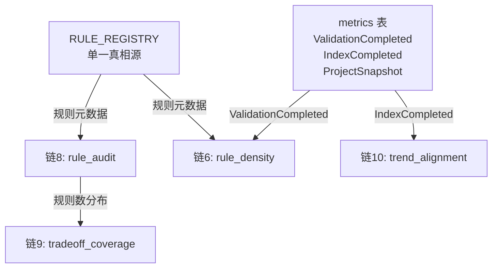

# L5 度量管道补全设计

> 本文档定义 4 条 L5 映射链（链6/8/9/10）的工程实现设计，将法层 G1/G3/G4/G5 的度量管道从 L5 升级到 L2。设计基于概念操作化规格（260628-1600-construct-operationalization）的指示器定义，复用已有的 metrics 基础设施。

## 设计原则

本设计从司衡哲学原则推导出三个架构决策，而非从工程便利性出发。

### 决策一：度量计算与 iCT 检验解耦

iCT 的五法检验是针对单个 proposal 的即时检验（同步、无状态），而 G1-G5 的度量指示器是时间窗口的聚合统计。将时序聚合注入即时检验，在语义上混淆了"单次判定"与"趋势度量"两个层次。

顺势（G5）的变更率比要求"积累 3 个月数据后计算滑动窗口"，这是事后分析，不是单次检验的输入。因此链10的变更率比不嵌入 `check_shunshi`，而是作为独立 MCP 工具暴露。iCT 的 `verify` 签名不需要改动。

### 决策二：4 个独立 MCP 工具

遵循 `variance_metric` 和 `snapshot_diff` 的模式，每条链一个独立工具。每个工具对应一个独立的哲学构念的操作化指示器。合并工具会模糊构念边界，违反有度（G3）的"度"的分化原则：不同治理域的风险不同，度量手段也应分化。

### 决策三：规则注册表作为单一真相源

在 `validator.rs` 中创建 `RULE_REGISTRY` 常量数组，每条规则声明 `rule_id`、`severity`、`domain`、`description`。`RULE_COUNT` 从硬编码常量改为 `RULE_REGISTRY.len()` 的派生值。

顺因（道二）要求"意图先于代码"。规则作为治理的基本单元，其元数据（治理域、严格度）是规则的意图，应该显式声明而非隐含在控制流中。当前 `RULE_COUNT = 14` 是裸常量，注册表使其成为派生值，消除手动同步点。

## 规则注册表设计

### 结构定义

注册表条目复用已有的 `ValidationDomain` 枚举（Frontmatter/Structure/Content/Reference/Lifecycle/Governance），不引入新概念。

```rust
pub struct RuleRegistryEntry {
    pub rule_id: &'static str,
    pub severity: ViolationSeverity,
    pub domain: ValidationDomain,
    pub description: &'static str,
}

pub const RULE_REGISTRY: &[RuleRegistryEntry] = &[
    // 14 条规则，按 rule_id 排序
];

pub const RULE_COUNT: usize = RULE_REGISTRY.len();
```

### 幽灵规则处理

当前 validator 中有 14 条实际发射 violation 的规则（V-F-01 到 V-J-01），另有 2 条声明了 ID 但不实际发射的规则：V-G-07（"1/3 文档不可被引用"，注释说明在 reference 域内嵌检查）和 V-G-10（"upstream 自指向检查"，测试验证不发射 violation）。

注册表只包含实际发射 violation 的 14 条规则。V-G-07 和 V-G-10 的 ID 在代码注释中保留，但它们是"概念规则"而非"工程规则"，未来实现时再加入注册表。这避免给链8的规则数统计引入"有声明但无实际检查"的幽灵规则，导致 Fatal 占比等指标失真。

### 14 条规则的治理域归属

基于代码中每条规则的实际检查对象分类。

| 治理域 | 规则 |
| ---- | ---- |
| Frontmatter | V-F-01, V-F-03, V-F-04 |
| Structure | V-F-05, V-G-02, V-G-03, V-G-04, V-G-05, V-G-06, V-J-01 |
| Reference | V-G-08 |
| Governance | V-F-06, V-F-07, V-G-09 |

## 度量计算设计

### 数据依赖

遵循操作化规格的依赖图，链6依赖链1数据，链10依赖链5数据，链9依赖链8数据。链8独立。



### 链8（有度/G3）：rule_audit

输入为 `RULE_REGISTRY`（静态），计算为纯函数，不查数据库。

```rust
pub struct RuleAuditMetric {
    pub total_rules: usize,
    pub rules_by_domain: Vec<(String, usize)>,
    pub rules_by_severity: Vec<(String, usize)>,
    pub fatal_ratio: f64,
    pub domain_distribution: Vec<(String, usize)>,
}
```

`fatal_ratio = Fatal 规则数 / total_rules`。操作化规格中的"各治理区域规则数分布"对应 `rules_by_domain`，"Fatal 级规则占比"对应 `fatal_ratio`。

### 链6（知止/G1）：rule_density

输入为 `RULE_REGISTRY` + `query_metrics("ValidationCompleted", limit)` + `db.count_by_nature()`。

```rust
pub struct RuleDensityMetric {
    pub total_rules: usize,
    pub total_docs: usize,
    pub overall_density: f64,
    pub density_by_nature: Vec<(String, f64)>,
    pub variance_by_nature: Vec<(String, f64)>,
    pub correlation_note: String,
}
```

`overall_density = total_rules / total_docs`。`density_by_nature` 中每个 nature 的密度 = total_rules / 该 nature 文档数（规则当前不按 nature 分配，故所有 nature 共享同一规则池，密度差异仅反映文档分布）。`variance_by_nature` 取自链1的 `avg_fatal_by_nature`。`correlation_note` 是文本说明，因为规则数不足以做统计相关性检验（只有 6 个 nature），诚实声明"样本不足，需积累数据"。

### 链9（损补/G4）：tradeoff_coverage

输入为 `db.get_all_documents()` + `db.query_metrics("ProjectSnapshot", limit)`。

```rust
pub struct TradeoffCoverageMetric {
    pub total_decisions: usize,
    pub adr_covered: usize,
    pub adr_coverage_rate: f64,
    pub rule_changes_note: String,
}
```

`adr_coverage_rate` 通过扫描 decision 文档的正文，检测是否包含 `## 背景`、`## 决策`、`## 后果` 三个 Markdown 二级标题（标题下方有非空内容）。`rule_changes_note` 诚实声明"规则增删比率需累积 ProjectSnapshot 历史数据，当前不可计算"。

### 链10（顺势/G5）：trend_alignment

输入为 `db.query_metrics("ValidationCompleted", limit)` + `db.query_metrics("IndexCompleted", limit)`。

```rust
pub struct TrendAlignmentMetric {
    pub validation_count: usize,
    pub index_count: usize,
    pub review_change_ratio: f64,
    pub window_start: String,
    pub window_end: String,
    pub interpretation_note: String,
}
```

`review_change_ratio = validation_count / index_count`。操作化规格指出这个比值"接近 1 表示审查与变更同步"。`interpretation_note` 诚实声明"仅覆盖时势维度，地势与人势维度未操作化"。

### 数据不足指示器的诚实处理

链6的 `correlation_note`、链9的 `rule_changes_note` 都返回明确的"数据累积中"文本，不返回空值或假数据。这遵循道四a的间隙声明原则：显式声明度量能力的边界，而非掩盖不足。

## MCP 工具暴露

遵循 `variance_metric` 和 `snapshot_diff` 的既有模式，4 个新工具在 `governance.rs` 中注册。每个工具的查询窗口统一为 100 条记录，与链1/链5一致。

| MCP 工具 | 数据源 | 窗口 |
| ---- | ---- | ---- |
| `rule_audit` | RULE_REGISTRY | 静态 |
| `rule_density` | RULE_REGISTRY + ValidationCompleted + count_by_nature | 100 条 |
| `tradeoff_coverage` | get_all_documents + ProjectSnapshot | 全量 + 100 条 |
| `trend_alignment` | ValidationCompleted + IndexCompleted | 各 100 条 |

每个工具配一个 `format_*` 辅助函数，将结构体格式化为人类可读文本，与 `format_variance_metric`、`format_snapshot_diff` 的模式一致。

## 工程映射 L 级别更新

4 条链从 L5 升级到 L2。更新 `Engineering-Mapping.sih.md` 中对应章节，补充代码引用。

| 链 | 当前 L | 目标 L |
| ---- | ---- | ---- |
| 链6 (知止/G1) | L5/L3 | L2/L3 |
| 链8 (有度/G3) | L5/L3 | L2/L3 |
| 链9 (损补/G4) | L5/L3 | L2/L3 |
| 链10 (顺势/G5) | L5/L2 | L2/L2 |

总览表中 4 条链的第一 L 级别从 L5 升级到 L2，L5 总数减少 4，L2 总数增加 4。L4 维持不变（链3 的 dao_trace 仍为 L4，本次不涉及）。

## 测试策略

每条链的计算函数配单元测试（纯函数测试，与 `test_compute_variance_basic` 模式一致），MCP 工具配集成测试（内存数据库测试，与 `test_record_and_query_metrics` 模式一致）。注册表配一个完整性测试：验证 `RULE_REGISTRY.len()` 等于实际 violation 发射点的数量。

## 文件变更范围

| 文件 | 变更类型 | 内容 |
| ---- | ---- | ---- |
| `src/core/validator.rs` | 修改 | 新增 RuleRegistryEntry + RULE_REGISTRY |
| `src/core/metrics.rs` | 修改 | 新增 4 个计算函数 + 4 个输出结构 |
| `src/mcp_server/governance.rs` | 修改 | 注册 4 个新 MCP 工具 |
| `docs/specs/engineering/Engineering-Mapping.sih.md` | 修改 | 4 条链 L 级别更新 |

不新增文件，不改动 iCT（`src/mind/ict.rs`），不改动数据库 schema（metrics 表已满足需求）。
