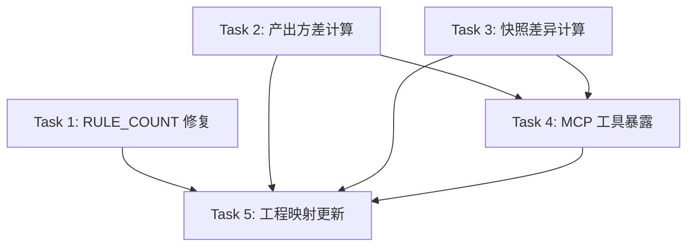

# 司衡指标计算实施计划

> **For agentic workers:** REQUIRED SUB-SKILL: Use superpowers:subagent-driven-development (recommended) or superpowers:executing-plans to implement this plan task-by-task. Steps use checkbox (`- [ ]`) syntax for tracking.

**Goal:** 将道一（产出方差）和道四b（跨版本一致性）从 L4 升级为 L2，实现指标计算逻辑和 MCP 查询接口，使可证伪条件可触发。

**Architecture:** 在 metrics.rs 中新增指标计算模块，从已采集的 ValidationCompleted 和 ProjectSnapshot 历史记录中聚合计算产出方差指标和跨版本快照差异。通过新增 MCP 工具暴露指标查询能力。

**Tech Stack:** Rust, SQLite (rusqlite), serde_json, 现有司衡代码库

---

## 前置决策

### 决策 1：指标计算的位置

- 选项 A：在 metrics.rs 中新增计算函数（纯函数，输入 MetricRecord 列表，输出指标结果）
- 选项 B：在 database.rs 中新增 SQL 聚合查询（在数据库层做聚合）
- 选项 C：新建 src/core/analytics.rs 独立分析模块
- **推荐: A。** 指标计算逻辑与度量模型放在一起，保持内聚。SQL 聚合对 JSON payload 字段无能为力（payload 是 JSON 字符串，需要应用层反序列化）。独立模块对当前规模过度设计。

### 决策 2：MCP 工具暴露方式

- 选项 A：新增两个独立 MCP 工具（query_variance_metric, query_snapshot_diff）
- 选项 B：扩展现有 project_status 工具，附加指标信息
- 选项 C：新增一个通用 query_metric 工具，参数化指标类型
- **推荐: A。** 两个指标的输入参数和返回结构差异大，合并会导致接口复杂。独立工具符合单一职责。

### 决策 3：ProjectSnapshot.total_rules 硬编码修复

- 选项 A：在 validator.rs 中新增 `pub fn rule_count() -> usize` 函数，动态统计规则数
- 选项 B：保持硬编码，在指标计算中忽略 total_rules 字段
- **推荐: A。** 链 5 的"规则数量时序"指示器依赖此字段。硬编码 14 会在规则增减时失真。修复代价小（一个函数）。

---

## 文件结构

### 新建文件

无（指标计算逻辑加入现有 metrics.rs）

### 修改文件

```text
src/core/metrics.rs                          # 新增指标计算函数 + 指标结果 struct
src/core/validator.rs                        # 新增 rule_count() 函数
src/mcp_server/governance.rs                 # 修复 total_rules 硬编码 + 新增 2 个 MCP 工具
docs/specs/engineering/Engineering-Mapping.sih.md  # 更新链 1/5 的 L 级别
```

---

## Phase 1: 基础设施修复（1 任务）

### Task 1: validator rule_count + ProjectSnapshot 修复

**Files:**
- Modify: `src/core/validator.rs`
- Modify: `src/mcp_server/governance.rs`

**Depends on:** 无

**Subagent Prompt:**

```text
你的任务是修复司衡项目中 ProjectSnapshot.total_rules 硬编码为 14 的问题。

## 背景

governance.rs 中的 project_status 方法在构造 ProjectSnapshot 时，total_rules 硬编码为 14。这会在规则增减时失真。需要从 validator 动态获取规则总数。

## 必读文件

1. validator.rs：/Users/moc/projects/SiHankor/sihankor/src/core/validator.rs
2. governance.rs：/Users/moc/projects/SiHankor/sihankor/src/mcp_server/governance.rs

## 任务

### 1.1 在 validator.rs 中新增 rule_count 函数

在 validator.rs 中新增一个公共函数，返回当前定义的规则总数。规则定义在 validate_document 函数内部，每条规则用 ViolationSeverity（Fatal/Guideline/Judgment）标记。

实现方案：在 validate_document 函数中，规则是按顺序检查的。最简单的方案是在 validator.rs 顶部定义一个常量：

```rust
/// 当前 validator 中定义的规则总数（V-F/V-G/V-J 规则）
/// 每次增删规则时需要同步更新此常量
pub const RULE_COUNT: usize = 14;
```

然后在 governance.rs 中使用 `crate::core::validator::RULE_COUNT` 替代硬编码的 14。

如果当前规则数不是 14，先统计实际规则数再填入常量。统计方法：在 validate_document 函数中搜索所有创建 Violation 的位置，每处对应一条规则。

### 1.2 修复 governance.rs 中的硬编码

找到 project_status 方法中构造 ProjectSnapshot 的位置，将 `total_rules: 14` 改为 `total_rules: crate::core::validator::RULE_COUNT`。

### 1.3 测试

确认现有测试仍然通过。不需要新增专门测试（常量值在 cargo test 中通过编译验证）。

## 约束

- 修改前必须先读取文件内容
- 不得破坏编译
- 不得删除任何现有测试
- 不要用动态计数（运行时遍历规则列表），用编译期常量

## 项目路径

/Users/moc/projects/SiHankor/sihankor

## 验证

完成后执行 cargo check 和 cargo test，输出结果作为完成证据。
```

- [ ] **Step 1: 将上述 prompt 发送给子 agent**
- [ ] **Step 2: 验证 cargo check 零错误**
- [ ] **Step 3: 验证 cargo test 全部通过**
- [ ] **Step 4: Commit**

```bash
cd /Users/moc/projects/SiHankor/sihankor
git add src/core/validator.rs src/mcp_server/governance.rs
git commit -m "fix: replace hardcoded total_rules with RULE_COUNT constant"
```

---

## Phase 2: 指标计算（2 任务并行）

### Task 2: 产出方差指标计算

**Files:**
- Modify: `src/core/metrics.rs`

**Depends on:** 无（不依赖 Task 1）

**Subagent Prompt:**

```text
你的任务是在司衡的 metrics.rs 中实现产出方差指标计算。

## 背景

链 1（道一 -> 产出方差度量）的操作化规格定义了三个指示器。当前 ValidationCompleted 事件已采集了每次文档验证的 fatal/guideline/judgment 计数和通过状态。需要从历史 ValidationCompleted 记录中聚合计算产出方差指标。

## 必读文件

1. metrics.rs：/Users/moc/projects/SiHankor/sihankor/src/core/metrics.rs
2. database.rs：/Users/moc/projects/SiHankor/sihankor/src/core/database.rs（确认 query_metrics 返回 MetricRecord 列表）
3. 操作化规格：/Users/moc/projects/SiHankor/sihankor/docs/specs/engineering/Construct-Operationalization.sih.md（链 1 部分）

## 任务

### 2.1 新增指标结果 struct

在 metrics.rs 中新增：

```rust
/// 产出方差指标结果
#[derive(Debug, Clone, Serialize, Deserialize)]
pub struct VarianceMetric {
    /// 统计窗口内的文档总数
    pub total_docs: usize,
    /// 通过验证的文档比例 (0.0-1.0)
    pub pass_rate: f64,
    /// 平均 Fatal 违规数
    pub avg_fatal_count: f64,
    /// 平均 Guideline 违规数
    pub avg_guideline_count: f64,
    /// Fatal 违规数的标准差（产出方差的直接度量）
    pub fatal_count_stddev: f64,
    /// 按 nature 分组的通过率
    pub pass_rate_by_nature: Vec<(String, f64)>,
    /// 按 nature 分组的平均 Fatal 违规数
    pub avg_fatal_by_nature: Vec<(String, f64)>,
    /// 统计窗口起始时间
    pub window_start: String,
    /// 统计窗口结束时间
    pub window_end: String,
}
```

### 2.2 新增计算函数

```rust
/// 从 ValidationCompleted 历史记录计算产出方差指标
/// 输入：MetricRecord 列表（event_type 应为 "ValidationCompleted"）
/// 输出：聚合后的方差指标
pub fn compute_variance_metric(records: &[MetricRecord]) -> VarianceMetric {
    // 反序列化每条记录的 payload_json 为 ValidationCompleted 事件
    // 过滤掉反序列化失败的记录
    // 聚合计算：
    //   - total_docs = 记录数
    //   - pass_rate = passed=true 的比例
    //   - avg_fatal_count = fatal_count 的平均值
    //   - avg_guideline_count = guideline_count 的平均值
    //   - fatal_count_stddev = fatal_count 的总体标准差
    //   - pass_rate_by_nature = 按 nature 分组的通过率
    //   - avg_fatal_by_nature = 按 nature 分组的平均 fatal_count
    //   - window_start = 最早记录的 created_at
    //   - window_end = 最晚记录的 created_at
    // ...
}
```

实现注意事项：
- 使用 serde_json::from_str 反序列化 payload_json。由于 MetricEvent 是枚举，需要先反序列化为 MetricEvent，然后匹配 ValidationCompleted 变体。或者定义一个辅助 struct 只包含 ValidationCompleted 的字段，直接反序列化 payload_json。
- 推荐使用辅助 struct 方案（更简洁）：

```rust
#[derive(Deserialize)]
struct ValidationCompletedPayload {
    doc_id: String,
    nature: String,
    stage: String,
    fatal_count: usize,
    guideline_count: usize,
    judgment_count: usize,
    passed: bool,
}
```

- 标准差计算：总体标准差（除以 N，不是 N-1），因为这是描述性统计不是推断性统计
- 按 nature 分组：使用 std::collections::HashMap 聚合，然后转为 Vec<(String, f64)>
- 空记录处理：如果 records 为空，返回全零的 VarianceMetric

### 2.3 测试

在 metrics.rs 的 `#[cfg(test)] mod tests` 中新增测试：

```rust
#[test]
fn test_compute_variance_empty() {
    let records: Vec<MetricRecord> = vec![];
    let metric = compute_variance_metric(&records);
    assert_eq!(metric.total_docs, 0);
    assert_eq!(metric.pass_rate, 0.0);
}

#[test]
fn test_compute_variance_basic() {
    let records = vec![
        MetricRecord {
            id: 1,
            event_type: "ValidationCompleted".into(),
            payload_json: r#"{"doc_id":"d1","nature":"spec","stage":"1/3","fatal_count":0,"guideline_count":2,"judgment_count":1,"passed":true}"#.into(),
            created_at: "2026-06-27 10:00:00".into(),
        },
        MetricRecord {
            id: 2,
            event_type: "ValidationCompleted".into(),
            payload_json: r#"{"doc_id":"d2","nature":"spec","stage":"2/3","fatal_count":1,"guideline_count":0,"judgment_count":0,"passed":false}"#.into(),
            created_at: "2026-06-27 11:00:00".into(),
        },
        MetricRecord {
            id: 3,
            event_type: "ValidationCompleted".into(),
            payload_json: r#"{"doc_id":"d3","nature":"decision","stage":"3/3","fatal_count":0,"guideline_count":1,"judgment_count":0,"passed":true}"#.into(),
            created_at: "2026-06-27 12:00:00".into(),
        },
    ];
    let metric = compute_variance_metric(&records);
    assert_eq!(metric.total_docs, 3);
    assert!((metric.pass_rate - 2.0/3.0).abs() < 0.001);
    assert!((metric.avg_fatal_count - 1.0/3.0).abs() < 0.001);
    // fatal_counts = [0, 1, 0], mean = 1/3, variance = ((0-1/3)^2 + (1-1/3)^2 + (0-1/3)^2) / 3 = 2/9
    // stddev = sqrt(2/9) = 0.4714...
    assert!((metric.fatal_count_stddev - (2.0/9.0_f64).sqrt()).abs() < 0.001);
    // by_nature: spec has 2 docs, 1 passed -> 0.5; decision has 1 doc, 1 passed -> 1.0
    let spec_pass_rate = metric.pass_rate_by_nature.iter().find(|(k, _)| k == "spec").map(|(_, v)| *v).unwrap();
    assert!((spec_pass_rate - 0.5).abs() < 0.001);
    let decision_pass_rate = metric.pass_rate_by_nature.iter().find(|(k, _)| k == "decision").map(|(_, v)| *v).unwrap();
    assert!((decision_pass_rate - 1.0).abs() < 0.001);
    assert_eq!(metric.window_start, "2026-06-27 10:00:00");
    assert_eq!(metric.window_end, "2026-06-27 12:00:00");
}

#[test]
fn test_compute_variance_ignores_invalid_payload() {
    let records = vec![
        MetricRecord {
            id: 1,
            event_type: "ValidationCompleted".into(),
            payload_json: r#"{"doc_id":"d1","nature":"spec","stage":"1/3","fatal_count":0,"guideline_count":2,"judgment_count":1,"passed":true}"#.into(),
            created_at: "2026-06-27 10:00:00".into(),
        },
        MetricRecord {
            id: 2,
            event_type: "ValidationCompleted".into(),
            payload_json: r#"invalid json"#.into(),
            created_at: "2026-06-27 11:00:00".into(),
        },
    ];
    let metric = compute_variance_metric(&records);
    assert_eq!(metric.total_docs, 1); // 只计有效记录
    assert_eq!(metric.pass_rate, 1.0);
}
```

## 约束

- 修改前必须先读取文件内容
- 不得破坏编译
- 不得删除任何现有测试
- 指标计算是纯函数，不依赖数据库（输入是 MetricRecord 列表）
- 不引入新的外部依赖

## 项目路径

/Users/moc/projects/SiHankor/sihankor

## 验证

完成后执行 cargo check 和 cargo test，输出结果作为完成证据。
```

- [ ] **Step 1: 将上述 prompt 发送给子 agent**（与 Task 3 并行）
- [ ] **Step 2: 验证 cargo check 零错误**
- [ ] **Step 3: 验证 cargo test 全部通过**
- [ ] **Step 4: Commit**

```bash
cd /Users/moc/projects/SiHankor/sihankor
git add src/core/metrics.rs
git commit -m "feat: add variance metric computation from ValidationCompleted records"
```

---

### Task 3: 跨版本快照差异计算

**Files:**
- Modify: `src/core/metrics.rs`

**Depends on:** 无（不依赖 Task 1）

**Subagent Prompt:**

```text

你的任务是在司衡的 metrics.rs 中实现跨版本快照差异计算。

## 背景

链 5（道四b -> 跨版本一致性检查）的操作化规格定义了两个指示器：跨版本验证结果差异和规则数量时序。当前 ProjectSnapshot 事件已采集了每次 governance overview 调用时的项目快照。需要比较两次快照的差异。

## 必读文件

1. metrics.rs：/Users/moc/projects/SiHankor/sihankor/src/core/metrics.rs
2. database.rs：/Users/moc/projects/SiHankor/sihankor/src/core/database.rs（确认 query_metrics 和 get_latest_snapshot）
3. 操作化规格：/Users/moc/projects/SiHankor/sihankor/docs/specs/engineering/Construct-Operationalization.sih.md（链 5 部分）

## 任务

### 3.1 新增快照差异 struct

在 metrics.rs 中新增：

```rust
/// 跨版本快照差异
#[derive(Debug, Clone, Serialize, Deserialize)]
pub struct SnapshotDiff {
    /// 前一次快照时间
    pub previous_time: String,
    /// 后一次快照时间
    pub current_time: String,
    /// 文档数变化（当前 - 前次）
    pub docs_delta: i64,
    /// 规则数变化（当前 - 前次）
    pub rules_delta: i64,
    /// 各 stage 文档数变化
    pub docs_by_stage_delta: Vec<(String, i64)>,
    /// 各 nature 文档数变化
    pub docs_by_nature_delta: Vec<(String, i64)>,
    /// Fatal 违规总数变化
    pub fatal_violations_delta: i64,
    /// 间隙信号：规则数是否增长（true = 增长，支持道四b）
    pub rules_grew: bool,
    /// 间隙信号：文档数是否增长（true = 增长，可能扩大治理间隙）
    pub docs_grew: bool,
}
```

### 3.2 新增计算函数

```rust
/// 比较两次 ProjectSnapshot 的差异
/// 输入：两条 MetricRecord（event_type 应为 "ProjectSnapshot"）
/// 输出：差异结果
/// 如果任一记录的 payload_json 无法反序列化，返回 None
pub fn compute_snapshot_diff(previous: &MetricRecord, current: &MetricRecord) -> Option<SnapshotDiff> {
    // 反序列化两条记录的 payload_json
    // 使用辅助 struct：
    #[derive(Deserialize)]
    struct ProjectSnapshotPayload {
        total_docs: usize,
        total_rules: usize,
        docs_by_stage: Vec<(String, usize)>,
        docs_by_nature: Vec<(String, usize)>,
        fatal_violations_total: usize,
    }
    // 比较：
    //   - docs_delta = current.total_docs as i64 - previous.total_docs as i64
    //   - rules_delta = current.total_rules as i64 - previous.total_rules as i64
    //   - docs_by_stage_delta: 遍历 current 的 stage 列表，减去 previous 中对应 stage 的数量
    //   - docs_by_nature_delta: 同上
    //   - fatal_violations_delta = current - previous
    //   - rules_grew = rules_delta > 0
    //   - docs_grew = docs_delta > 0
    // ...
}
```

实现注意事项：
- docs_by_stage_delta：需要合并 previous 和 current 的所有 stage key，对每个 key 计算 current - previous（不存在的视为 0）
- 使用 HashMap 聚合后转为 Vec<(String, i64)>，按 key 排序确保结果确定性
- 空列表处理：如果某一方为空，所有 key 的 delta 为另一方的负值或正值

### 3.3 新增便捷查询函数

```rust
/// 从数据库查询最近的两次快照并计算差异
/// 需要传入 SihDatabase 引用
/// 如果不足两条快照，返回 Ok(None)
pub async fn compute_latest_snapshot_diff(
    db: &dyn SihDatabase,
) -> Result<Option<SnapshotDiff>, DatabaseError> {
    let records = db.query_metrics("ProjectSnapshot", 2).await?;
    if records.len() < 2 {
        return Ok(None);
    }
    // query_metrics 按 created_at DESC 排序，所以 records[0] 是最新的，records[1] 是前一次
    Ok(compute_snapshot_diff(&records[1], &records[0]))
}
```

注意：这个函数需要 `use crate::core::database::{SihDatabase, DatabaseError}`。确认这些类型在 metrics.rs 中可访问（可能需要 use 语句）。

### 3.4 测试

在 metrics.rs 的 `#[cfg(test)] mod tests` 中新增测试：

```rust
#[test]
fn test_snapshot_diff_basic() {
    let prev = MetricRecord {
        id: 1,
        event_type: "ProjectSnapshot".into(),
        payload_json: r#"{"total_docs":10,"total_rules":14,"docs_by_stage":[["1/3",5],["2/3",3],["3/3",2]],"docs_by_nature":[["spec",6],["decision",4]],"fatal_violations_total":2}"#.into(),
        created_at: "2026-06-27 10:00:00".into(),
    };
    let curr = MetricRecord {
        id: 2,
        event_type: "ProjectSnapshot".into(),
        payload_json: r#"{"total_docs":12,"total_rules":14,"docs_by_stage":[["1/3",6],["2/3",4],["3/3",2]],"docs_by_nature":[["spec",7],["decision",5]],"fatal_violations_total":1}"#.into(),
        created_at: "2026-06-27 12:00:00".into(),
    };
    let diff = compute_snapshot_diff(&prev, &curr).unwrap();
    assert_eq!(diff.docs_delta, 2);
    assert_eq!(diff.rules_delta, 0);
    assert_eq!(diff.fatal_violations_delta, -1);
    assert!(!diff.rules_grew);
    assert!(diff.docs_grew);
    // stage 1/3: 6-5=1, 2/3: 4-3=1, 3/3: 2-2=0
    let stage_1 = diff.docs_by_stage_delta.iter().find(|(k, _)| k == "1/3").map(|(_, v)| *v).unwrap();
    assert_eq!(stage_1, 1);
    let stage_3 = diff.docs_by_stage_delta.iter().find(|(k, _)| k == "3/3").map(|(_, v)| *v).unwrap();
    assert_eq!(stage_3, 0);
}

#[test]
fn test_snapshot_diff_invalid_payload() {
    let prev = MetricRecord {
        id: 1,
        event_type: "ProjectSnapshot".into(),
        payload_json: r#"invalid"#.into(),
        created_at: "2026-06-27 10:00:00".into(),
    };
    let curr = MetricRecord {
        id: 2,
        event_type: "ProjectSnapshot".into(),
        payload_json: r#"{"total_docs":12,"total_rules":14,"docs_by_stage":[],"docs_by_nature":[],"fatal_violations_total":0}"#.into(),
        created_at: "2026-06-27 12:00:00".into(),
    };
    assert!(compute_snapshot_diff(&prev, &curr).is_none());
}

#[test]
fn test_snapshot_diff_new_nature() {
    let prev = MetricRecord {
        id: 1,
        event_type: "ProjectSnapshot".into(),
        payload_json: r#"{"total_docs":10,"total_rules":14,"docs_by_stage":[["1/3",10]],"docs_by_nature":[["spec",10]],"fatal_violations_total":0}"#.into(),
        created_at: "2026-06-27 10:00:00".into(),
    };
    let curr = MetricRecord {
        id: 2,
        event_type: "ProjectSnapshot".into(),
        payload_json: r#"{"total_docs":12,"total_rules":14,"docs_by_stage":[["1/3",12]],"docs_by_nature":[["spec",10],["decision",2]],"fatal_violations_total":0}"#.into(),
        created_at: "2026-06-27 12:00:00".into(),
    };
    let diff = compute_snapshot_diff(&prev, &curr).unwrap();
    // decision 是新出现的 nature
    let decision_delta = diff.docs_by_nature_delta.iter().find(|(k, _)| k == "decision").map(|(_, v)| *v).unwrap();
    assert_eq!(decision_delta, 2);
    let spec_delta = diff.docs_by_nature_delta.iter().find(|(k, _)| k == "spec").map(|(_, v)| *v).unwrap();
    assert_eq!(spec_delta, 0);
}
```

## 约束

- 修改前必须先读取文件内容
- 不得破坏编译
- 不得删除任何现有测试
- compute_snapshot_diff 是纯函数，不依赖数据库
- compute_latest_snapshot_diff 依赖 SihDatabase trait（通过引用传入）
- 不引入新的外部依赖

## 项目路径

/Users/moc/projects/SiHankor/sihankor

## 验证

完成后执行 cargo check 和 cargo test，输出结果作为完成证据。
```

- [ ] **Step 1: 将上述 prompt 发送给子 agent**（与 Task 2 并行）
- [ ] **Step 2: 验证 cargo check 零错误**
- [ ] **Step 3: 验证 cargo test 全部通过**
- [ ] **Step 4: Commit**

```bash
cd /Users/moc/projects/SiHankor/sihankor
git add src/core/metrics.rs
git commit -m "feat: add snapshot diff computation from ProjectSnapshot records"
```

---

## Phase 3: MCP 工具暴露（1 任务）

### Task 4: 新增 MCP 指标查询工具

**Files:**
- Modify: `src/mcp_server/governance.rs`

**Depends on:** Task 2 + Task 3（指标计算函数）

**Subagent Prompt:**

```text
你的任务是在司衡的 MCP governance 模块中新增两个指标查询工具。

## 背景

Task 2 和 Task 3 已在 metrics.rs 中实现了 compute_variance_metric 和 compute_latest_snapshot_diff 函数。需要通过 MCP 工具暴露这些指标查询能力，使外部 agent 可以查询产出方差和跨版本快照差异。

## 必读文件

1. governance.rs：/Users/moc/projects/SiHankor/sihankor/src/mcp_server/governance.rs
2. metrics.rs：/Users/moc/projects/SiHankor/sihankor/src/core/metrics.rs（确认 compute_variance_metric 和 compute_latest_snapshot_diff 的签名）
3. database.rs：/Users/moc/projects/SiHankor/sihankor/src/core/database.rs（确认 query_metrics 签名）

## 任务

### 4.1 新增 variance_metric 工具

在 governance.rs 中新增一个 MCP 工具函数，查询最近的 ValidationCompleted 记录并计算产出方差指标。

参考现有 governance overview 工具的实现模式（函数签名、返回格式、MCP 工具注册方式）。

函数逻辑：
1. 调用 db.query_metrics("ValidationCompleted", 100) 获取最近 100 条验证记录
2. 调用 compute_variance_metric(&records) 计算指标
3. 格式化为人类可读的文本报告，包含：
   - 统计窗口（时间范围）
   - 文档总数
   - 通过率
   - 平均 Fatal/Guideline 违规数
   - Fatal 违规数标准差（标注"产出方差直接度量"）
   - 按 nature 分组的通过率
4. 返回格式化文本

### 4.2 新增 snapshot_diff 工具

在 governance.rs 中新增一个 MCP 工具函数，查询最近的两次 ProjectSnapshot 并计算差异。

函数逻辑：
1. 调用 compute_latest_snapshot_diff(&*self.db) 获取差异
2. 如果返回 None（不足两条快照），返回提示文本"需要至少两次 governance overview 调用才能计算快照差异"
3. 如果返回 Some(diff)，格式化为人类可读的文本报告，包含：
   - 比较时间范围
   - 文档数变化
   - 规则数变化
   - 各 stage/nature 分布变化
   - Fatal 违规变化
   - 间隙信号（rules_grew / docs_grew）
4. 返回格式化文本

### 4.3 MCP 工具注册

参考 governance.rs 中现有工具的注册方式。如果 governance.rs 使用 rmcp 框架的工具注册模式，按相同模式注册新工具。工具名称：
- variance_metric
- snapshot_diff

工具描述：
- variance_metric: "查询产出方差指标，包括通过率、违规数分布和按文档类型的分组统计"
- snapshot_diff: "查询最近两次项目快照的差异，检测治理间隙增长信号"

### 4.4 测试

确认现有测试通过。如果 governance.rs 有 MCP 工具测试模式，为两个新工具添加基本测试。如果没有，确认编译通过即可。

## 约束

- 修改前必须先读取文件内容，理解现有 MCP 工具的注册和实现模式
- 不得破坏编译
- 不得删除任何现有测试
- 不得改变现有工具的行为
- 新工具的返回格式应与现有工具风格一致（文本报告）

## 项目路径

/Users/moc/projects/SiHankor/sihankor

## 验证

完成后执行 cargo check 和 cargo test，输出结果作为完成证据。

报告：
- 新增了哪些工具
- 工具的输入输出格式
- cargo check 和 cargo test 的结果
```

- [ ] **Step 1: 确认 Task 2 + Task 3 已完成**
- [ ] **Step 2: 将上述 prompt 发送给子 agent**
- [ ] **Step 3: 验证 cargo check 零错误**
- [ ] **Step 4: 验证 cargo test 全部通过**
- [ ] **Step 5: Commit**

```bash
cd /Users/moc/projects/SiHankor/sihankor
git add src/mcp_server/governance.rs
git commit -m "feat: add variance_metric and snapshot_diff MCP tools"
```

---

## Phase 4: 工程映射更新（1 任务）

### Task 5: 更新工程映射文档

**Files:**
- Modify: `docs/specs/engineering/Engineering-Mapping.sih.md`

**Depends on:** Task 1, Task 2, Task 3, Task 4 全部完成

**Subagent Prompt:**

```text
你的任务是更新司衡的工程映射文档，反映指标计算完成后的 L 级别变化。

## 背景

指标计算任务已完成：
- Task 1: validator RULE_COUNT 常量替代硬编码
- Task 2: 产出方差指标计算（compute_variance_metric）
- Task 3: 跨版本快照差异计算（compute_snapshot_diff + compute_latest_snapshot_diff）
- Task 4: MCP 工具 variance_metric 和 snapshot_diff

需要更新 Engineering-Mapping.sih.md 中受影响映射链的 L 级别。

## 必读文件

1. 当前工程映射：/Users/moc/projects/SiHankor/sihankor/docs/specs/engineering/Engineering-Mapping.sih.md
2. metrics.rs：/Users/moc/projects/SiHankor/sihankor/src/core/metrics.rs（确认 compute_variance_metric 和 compute_snapshot_diff 存在）
3. governance.rs：/Users/moc/projects/SiHankor/sihankor/src/mcp_server/governance.rs（确认两个新 MCP 工具存在）

## 任务

更新工程映射文档中以下链的 L 级别：

1. **链 1（道一 -> 产出方差度量）**：从 L4 更新为 L2。描述更新：compute_variance_metric 已实现，从 ValidationCompleted 历史记录聚合计算通过率、平均违规数、Fatal 违规标准差、按 nature 分组统计。MCP 工具 variance_metric 已暴露查询能力。剩余限制：标准差是产出方差的近似度量（仅覆盖验证违规维度，未覆盖架构漂移和字段差异维度），效度威胁见操作化规格。

2. **链 5（道四b -> 跨版本一致性检查）**：从 L4 更新为 L2。描述更新：compute_snapshot_diff 已实现，比较两次 ProjectSnapshot 的文档数/规则数/stage 分布/nature 分布/Fatal 违规差异。compute_latest_snapshot_diff 提供便捷查询。MCP 工具 snapshot_diff 已暴露查询能力。剩余限制：仅比较相邻两次快照，未做长期趋势分析；规则修正噪声未过滤（操作化规格中的效度威胁）。

3. **总览表**：更新 L 级别汇总数字。

## 格式约束

- 仅使用 ASCII 字符和 CJK 字符
- 正文禁止使用水平线（---），水平线仅用于 frontmatter 分隔符
- 表格不超过 3 列
- 粗体（**）仅用于术语定义和突出数值

## 产出

直接修改文件：/Users/moc/projects/SiHankor/sihankor/docs/specs/engineering/Engineering-Mapping.sih.md

## 禁止

- 不得删除任何章节
- 不得参考 docs/review-results/ 中的任何文件
- 不得虚报 L 级别
```

- [ ] **Step 1: 确认 Task 1-4 全部完成**
- [ ] **Step 2: 将上述 prompt 发送给子 agent**
- [ ] **Step 3: 用户审阅更新后的映射**
- [ ] **Step 4: Commit**

```bash
cd /Users/moc/projects/SiHankor/sihankor
git add docs/specs/engineering/Engineering-Mapping.sih.md
git commit -m "docs: update engineering mapping L-levels after metric computation (L4x2->L2)"
```

---

## 执行依赖图



## 并行执行计划

| 批次 | 任务 | 并行度 |
| ---- | ---- | ---- |
| Phase 1 | Task 1 | 1（小修复） |
| Phase 2 | Task 2 + Task 3 | 2（均修改 metrics.rs，但逻辑独立） |
| Phase 3 | Task 4 | 1（依赖 Task 2+3） |
| Phase 4 | Task 5 | 1（文档，依赖全部） |

总任务数：5。预计 4 批执行。

注意：Task 2 和 Task 3 都修改 metrics.rs，如果并行执行可能产生冲突。可以选择串行执行 Phase 2（先 Task 2 后 Task 3），或者并行执行后手动合并冲突。
