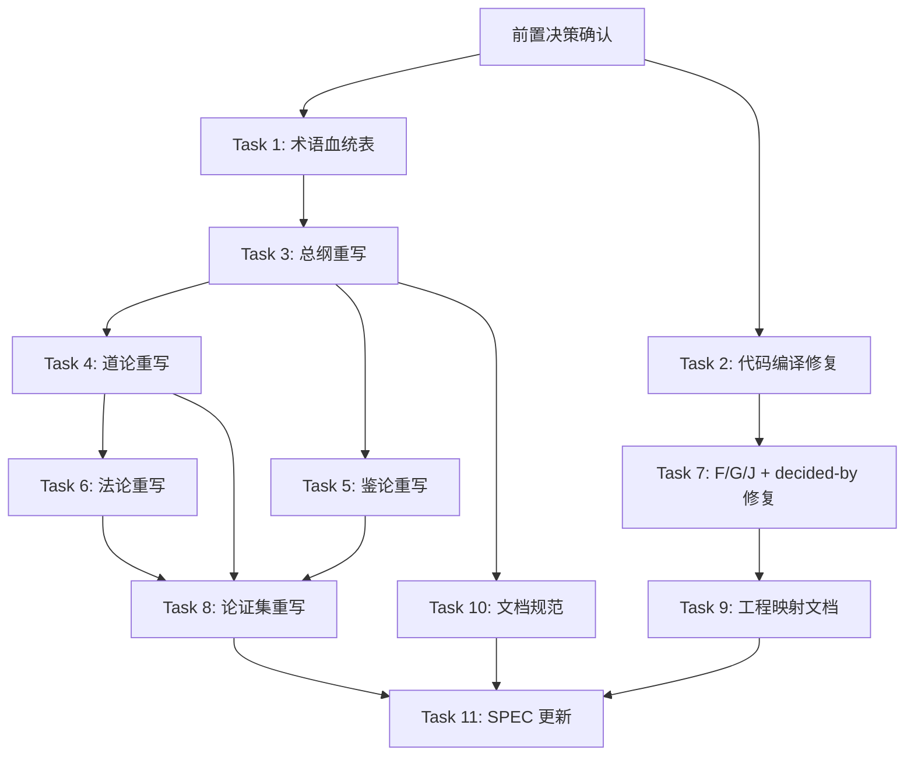

# 司衡体系严谨化重构实施计划

> **For agentic workers:** REQUIRED SUB-SKILL: Use superpowers:subagent-driven-development (recommended) or superpowers:executing-plans to implement this plan task-by-task. Steps use checkbox (`- [ ]`) syntax for tracking.

**Goal:** 将司衡体系从"因美学选择牺牲认识论严谨性"的状态，重构为"哲学内核保留 + 表达严谨化 + 工程映射修复"的可工作状态。

**Architecture:** 三条并行工作流：(A) 哲学文档重写，(B) 工程层代码修复，(C) 工程文档重写。三条工作流在 D 阶段汇合更新 SPEC。每个任务设计为可独立交付给子 agent 执行。

**Tech Stack:** Markdown 文档（哲学层），Rust 代码（工程层），YAML frontmatter（治理层）

---

## 前置决策（需用户确认）

以下三个决策阻塞后续任务，必须在启动前确认：

### 决策 1: 九段式处置
- 选项 A: 退役（鉴论改为"constructed-framework 的诚实声明"，不实现九段式）
- 选项 B: 实现（按旧文档规格实现九段式检验流程）
- 选项 C: 暂缓（保留九段式哲学地位，工程层标记为"待实现"，等工程数据验证后再决定）
- **已确认: C**。审阅者的前两个判断（混血统、没有外部锚点）已被证明是错的，第三个判断（九段式是工程装饰）没有理由默认是对的。在没有恢复完整设计意图的情况下做退役决策，和在没有完整信息的情况下做重建决策是同类错误。

### 决策 2: 框架统一方向
- 选项 A: 以 SPEC 的 P1-P4/G1-G5 为统一框架，废弃 archive 的道法框架和 src 的 iCL/iWW/iCT
- 选项 B: 以 archive 的道法框架为统一框架，重写 SPEC 和 src 对齐
- 选项 C: 三层保留，道法（哲学层）-> P1-P4（原则层）-> iCL/iWW/iCT（机制层），建立显式映射
- **推荐: C**。三层各有不同粒度，V3 R5 确认哲学负载和工程负载不完全重叠。

### 决策 3: 旧文档处理
- 选项 A: archive/philosophy-v1/ 完全保留，新文档写入 docs/specs/philosophy/
- 选项 B: archive/philosophy-v1/ 移动到 docs/specs/philosophy/ 并就地重写
- **推荐: A**。保留旧文档作为参考，新文档独立写入，避免修改过程中丢失原始内容。

---

## 文件结构

### 新建文件

```text
docs/specs/philosophy/
  SiHankor-Philosophy.sih.md              # 总纲（含血统表、认识论标签制度）
  Tao-On-Natural-Convergence.sih.md       # 道论（四道，含锚定声明）
  Canon-On-Governance-Principles.sih.md      # 法论（五法，含工程映射表）
  Assay-On-Verification.sih.md             # 鉴论（constructed-framework 诚实声明）
  Philosophy-Arguments.sih.md             # 论证集（每条标注认识论标签）
docs/specs/engineering/
  Engineering-Mapping.sih.md              # 工程映射（L1-L5 分级表）
  Document-Conventions.sih.md             # 文档规范（含新标签制度）
```

### 修改文件

```text
src/core/models.rs                        # Stage 枚举修复
src/core/parser.rs                        # Stage 调用方修复
src/mind/icl.rs                           # Stage 调用方修复
src/mind/iww.rs                           # Stage 调用方修复
src/mind/ict.rs                           # Stage 调用方修复
src/mcp_server/governance.rs              # Stage 调用方修复 + decided-by 修复
src/core/validator.rs                     # F/G/J ID 隔离
docs/specs/SiHankor-Reconstruction-Spec.md  # SPEC 更新
```

---

## Phase 1: 无依赖并行启动

### Task 1: 术语血统表

**Files:**
- Create: `docs/specs/philosophy/SiHankor-Terminology-Lineage.sih.md`

**Subagent Prompt:**

```text
你的任务是创建司衡体系的术语血统表文档。

## 背景

司衡体系的术语此前被错误地判断为"60% 儒法家、20% 道家、20% 自造"。经过严格考证，全部核心术语均为道家血统。这份文档需要引原文做源出追溯，证明血统纯正。

## 任务

为以下 7 个术语创建血统表，每个术语必须包含：
1. 术语
2. 来源经典（引原文）
3. 原文出处（篇章/章次）
4. 原义
5. 司衡用法
6. 与原义的关系（保留/延伸/限定）

## 术语列表及已确认的来源

1. 自然
   - 来源：道德经
   - 原义：万物自发运行的状态
   - 司衡用法：代码工程的默认发散趋势

2. 知止
   - 来源：道德经第 32 章"始制有名，名亦既有，夫亦将知止；知止所以不殆"
   - 来源：道德经第 44 章"故知足不辱，知止不殆，可以长久"
   - 来源：庄子·庚桑楚"知止其所不知，至矣"
   - 注意：先于儒家《大学》使用此概念
   - 司衡用法：治理力度应有边界

3. 损补
   - 来源：道德经第 77 章"天之道，损有余而补不足"
   - 司衡用法：规则增减应平衡

4. 顺因
   - 来源：庄子
   - 原义：因势利导
   - 司衡用法：遵循因果方向

5. 顺势
   - 来源：道家
   - 原义：主动认知并遵循事物发展的客观规律（道与自然）去行事
   - 司衡用法：治理随项目演进

6. 有度
   - 来源：道家延伸概念
   - 原义："道度一体"，凡事皆有度，"为之有度"与"无为"一脉相承
   - 与知止的关系：知止是行动指令（在哪里停止），有度是哲学原则（凡事皆有度），知止是有度在具体行动上的体现
   - 司衡用法：恰到好处的治理原则

7. 鉴
   - 来源：老子哲学核心认识论概念
   - 原义：反观、映照的认识论工具
   - 司衡用法：反推检验、可证伪性的工程内涵

## 文档格式

使用 SiHankor 文档格式（YAML frontmatter + Markdown 正文）。
frontmatter 必须包含 id（格式：YYMMDD-HHMM-语义短名）、stage（1/3）。
正文使用二级标题分节。
表格不超过 3 列。

## 产出

将文件保存到：
/Users/moc/projects/SiHankor/sihankor/docs/specs/philosophy/SiHankor-Terminology-Lineage.sih.md

## 禁止

- 不得修改任何现有文件
- 不得参考 docs/review-results/ 中的任何文件
- 不得使用 emoji 或非 ASCII/CJK 字符（遵循 AGENTS.md 规范）
```

- [ ] **Step 1: 用户确认前置决策后，将上述 prompt 发送给子 agent**
- [ ] **Step 2: 子 agent 完成后，检查文件是否存在且格式正确**
- [ ] **Step 3: 用户审阅血统表内容准确性**

---

### Task 2: 代码编译修复

**Files:**
- Modify: `src/core/models.rs`
- Modify: `src/core/parser.rs`
- Modify: `src/mind/icl.rs`
- Modify: `src/mind/iww.rs`
- Modify: `src/mind/ict.rs`
- Modify: `src/mcp_server/governance.rs`
- Modify: 其他所有引用 Stage 的文件

**Subagent Prompt:**

```text
你的任务是修复司衡项目的 Rust 代码编译错误。

## 背景

项目执行 `cargo check` 时有 29 个编译错误。根因是 `src/core/models.rs` 中的 `Stage` 类型被重构为枚举，但变更未传导至 9 个调用方。

## 任务

1. 在项目根目录执行 `cargo check 2>&1 | head -100`，获取完整的编译错误列表
2. 逐个修复编译错误，原则：
   - 不改变 Stage 枚举的定义（这是正确的重构方向）
   - 修复调用方代码以适配新的 Stage 枚举
   - 如果调用方使用了旧的字符串 API，改为使用新的枚举 API
3. 每修复一个文件后执行 `cargo check` 验证该文件的错误是否消除
4. 全部修复后执行 `cargo check` 确认零错误
5. 执行 `cargo test` 确认没有引入新的测试失败

## 约束

- 不得改变任何业务逻辑
- 不得删除任何现有测试
- 如果某个修复需要改变业务逻辑，停下来报告，不要自行决定
- 修改前必须先读取文件内容，理解当前代码结构

## 项目路径

/Users/moc/projects/SiHankor/sihankor

## 验证

完成后执行 `cargo check` 和 `cargo test`，输出结果作为完成证据。
```

- [ ] **Step 1: 将上述 prompt 发送给子 agent**
- [ ] **Step 2: 子 agent 完成后，验证 `cargo check` 零错误**
- [ ] **Step 3: 验证 `cargo test` 无新增失败**
- [ ] **Step 4: Commit**

```bash
cd /Users/moc/projects/SiHankor/sihankor
git add src/
git commit -m "fix: resolve 29 compilation errors from Stage enum migration"
```

---

## Phase 2: 总纲重写（依赖 Task 1）

### Task 3: 哲学总纲重写

**Files:**
- Create: `docs/specs/philosophy/SiHankor-Philosophy.sih.md`

**Depends on:** Task 1（术语血统表）

**Subagent Prompt:**

```text
你的任务是重写司衡体系的哲学总纲。

## 背景

司衡体系经历了多轮审阅。最终结论是：哲学内核基本健康（道家的核心概念选择是正确的），但文档表达存在以下问题需要修复：
1. 外部锚定关系未显式声明（道一锚定热力学、道三锚定信息论、道四锚定 Gödel 不完备性）
2. 认识论标签制度缺失（每条主张需要标注其认识论地位）
3. 鉴的认识论地位需要诚实声明（不是"被发现的真理工具"，是"有待外部验证的建构工具"）
4. 术语血统需要显式声明（全部道家血统，引原文追溯）

## 必读文件

1. 旧总纲：/Users/moc/projects/SiHankor/sihankor/archive/philosophy-v1/On-SiHankor.sih.md
2. 元论：/Users/moc/projects/SiHankor/sihankor/archive/philosophy-v1/Arche-The-One-Above-Being.sih.md
3. 术语血统表：/Users/moc/projects/SiHankor/sihankor/docs/specs/philosophy/SiHankor-Terminology-Lineage.sih.md
4. SPEC：/Users/moc/projects/SiHankor/sihankor/docs/specs/SiHankor-Reconstruction-Spec.md（参考认识论标签制度）

## 任务

重写总纲，包含以下章节：

### 第一节：体系定位
- 司衡是什么：基于道家思想的代码工程治理体系
- 司衡不是什么：不是被发现的自然定律，是在经验约束下被建构的有效框架
- 认识论立场：融贯论为主，外部锚定为辅

### 第二节：术语血统
- 引用术语血统表（Task 1 产出）
- 声明全部核心术语为道家血统
- 每个术语引原文追溯

### 第三节：认识论标签制度
定义以下标签，后续所有文档必须使用：
- external-anchor：锚定到外部科学定律（如道一锚定热力学第二定律）
- empirical-hypothesis：可证伪的经验假设
- tautology：逻辑必然
- design-corollary：从其他原则推导
- constructed-framework：在经验约束下被建构的有效框架（如鉴）

### 第四节：外部锚定声明
显式列出体系的外部锚定关系：
- 道一 -> 热力学第二定律（孤立系统熵增 = 发散，局部熵减需要做功 = 收敛需要干预）
- 道三 -> Shannon 信息论（编码有损）
- 道四 -> Gödel 不完备性定理（任何足够强的形式系统无法在自身内部证明自身一致性）
声明：东方哲学术语和西方科学术语描述同一现象时，两者都算锚定，不存在谁更"标准"。

### 第五节：结构概览
- 四层结构：观察 -> 原则 -> 指南 -> 机制 -> 实现
- 道家叙事为主，锚定声明为辅
- 文档间引用关系

## 格式约束

- SiHankor 文档格式（YAML frontmatter + Markdown 正文）
- frontmatter: id（YYMMDD-HHMM-sihankor-philosophy）、stage（1/3）
- 二级标题分节
- 表格不超过 3 列
- 不使用 emoji 或非 ASCII/CJK 字符（遵循 AGENTS.md）
- 外部锚定声明不超过 3 行/条
- 总文档量控制在 500 行以内

## 产出

保存到：/Users/moc/projects/SiHankor/sihankor/docs/specs/philosophy/SiHankor-Philosophy.sih.md

## 禁止

- 不得修改任何现有文件
- 不得参考 docs/review-results/ 中的任何文件
- 不得引入西方科学术语作为主叙事语言（主叙事保持道家）
```

- [ ] **Step 1: 确认 Task 1 已完成**
- [ ] **Step 2: 将上述 prompt 发送给子 agent**
- [ ] **Step 3: 子 agent 完成后，用户审阅总纲**
- [ ] **Step 4: Commit**

---

## Phase 3: 道论 + 鉴论并行（依赖 Task 3）

### Task 4: 道论重写

**Files:**
- Create: `docs/specs/philosophy/Tao-On-Natural-Convergence.sih.md`

**Depends on:** Task 3（总纲）

**Subagent Prompt:**

```text
你的任务是重写司衡体系的道论。

## 背景

道论是司衡的核心。四条道（道一到道四）是体系的哲学原则。旧文档的表达问题：
1. 外部锚定未声明（道一锚定热力学，道三锚定信息论，道四锚定 Gödel）
2. 认识论标签缺失
3. 可证伪条件需要逐条核查可触发性

## 必读文件

1. 旧道论：/Users/moc/projects/SiHankor/sihankor/archive/philosophy-v1/On-SiHankor-Tao.sih.md
2. 新总纲：/Users/moc/projects/SiHankor/sihankor/docs/specs/philosophy/SiHankor-Philosophy.sih.md
3. 术语血统表：/Users/moc/projects/SiHankor/sihankor/docs/specs/philosophy/SiHankor-Terminology-Lineage.sih.md

## 任务

重写道论，四道各一节。每条道必须包含：

1. **陈述**：道声称了什么（用道家术语）
2. **认识论标签**：external-anchor / empirical-hypothesis / tautology / design-corollary
3. **锚定声明**（如有）：与外部科学定律的对应关系，不超过 3 行
4. **适用边界**：在什么条件下成立，什么条件下不成立
5. **可证伪条件**（如适用）：什么证据能推翻这条道。必须检查可触发性：这个条件在现实中能否被触发？如果不能，标注为"方法论资格，非有效性证据"
6. **推导关系**：从哪条观察推导，推导到哪条指南

## 四道内容要点

### 道一：发散是默认状态，收敛需要干预
- 标签：external-anchor
- 锚定：热力学第二定律。孤立系统熵增 = 发散，开放系统局部熵减需要做功 = 收敛需要干预
- 可证伪条件：找到一种代码产出过程，在无协调约束条件下产出方差为零
- 可触发性检查：此条件可触发（例如单人、单模型、固定模板的重复任务可能产出方差为零）

### 道二：意图先于代码，因果方向不可逆
- 标签：design-corollary（从道三推导，范围由"代码是有意图的产出"这一定义限定）
- 锚定：无直接外部锚定，但与热力学时间箭头（因果不可逆）有结构相似性
- 可证伪条件：不可证伪（设计推论）

### 道三：所有编码都是意图的有损编码
- 标签：external-anchor
- 锚定：Shannon 信息论（Shannon 1948）。编码过程必然丢失相对于原始意图的信息
- 可证伪条件：不可证伪（数学定理）

### 道四：规约与实现之间总有间隙
- 标签：道四a为 tautology，道四b为 empirical-hypothesis
- 锚定：Gödel 不完备性定理（任何足够强的形式系统无法在自身内部证明自身一致性）
- 道四a（重言式）：任何有限规约无法穷尽全部语义意图
- 道四b（经验假设）：治理-实践间隙随时间增大，且增大速率与规则数量正相关
- 可证伪条件（道四b）：治理-实践间隙不随时间增大。需要纵向审计。此条件可触发但需要长期数据

## 格式约束

- SiHankor 文档格式（YAML frontmatter + Markdown 正文）
- frontmatter: id（YYMMDD-HHMM-dao-on-natural-convergence）、stage（1/3）
- 二级标题分节，每条道一个二级标题
- 表格不超过 3 列
- 不使用 emoji 或非 ASCII/CJK 字符
- 总文档量控制在 800 行以内

## 产出

保存到：/Users/moc/projects/SiHankor/sihankor/docs/specs/philosophy/Tao-On-Natural-Convergence.sih.md

## 禁止

- 不得修改任何现有文件
- 不得参考 docs/review-results/ 中的任何文件
- 不得在主叙事中引入西方科学术语（锚定声明中可以引用）
```

- [ ] **Step 1: 确认 Task 3 已完成**
- [ ] **Step 2: 将上述 prompt 发送给子 agent**
- [ ] **Step 3: 用户审阅道论**
- [ ] **Step 4: Commit**

---

### Task 5: 鉴论重写

**Files:**
- Create: `docs/specs/philosophy/Assay-On-Verification.sih.md`

**Depends on:** Task 3（总纲）

**Subagent Prompt:**

```text
你的任务是重写司衡体系的鉴论。

## 背景

鉴（反推九段式）是司衡的检验工具。多轮审阅发现鉴存在自证循环问题：鉴的有效性由鉴检验五维天道来证明，而五维天道是否为伪也由鉴判定。V3 R2 判定"攻击赢"，但后续讨论发现：
1. 自证循环的出现部分是因为热力学锚定被删除（美学选择导致）
2. 多主体协作（4+ 个 LLM）被简化为单一主体
3. 鉴仍然有内部自洽和多模型交叉验证作为部分支撑

鉴需要诚实声明其认识论地位。

## 必读文件

1. 旧鉴论：/Users/moc/projects/SiHankor/sihankor/archive/philosophy-v1/On-SiHankor-Assay.sih.md
2. 新总纲：/Users/moc/projects/SiHankor/sihankor/docs/specs/philosophy/SiHankor-Philosophy.sih.md
3. 术语血统表：/Users/moc/projects/SiHankor/sihankor/docs/specs/philosophy/SiHankor-Terminology-Lineage.sih.md

## 任务

重写鉴论，包含以下章节：

### 第一节：鉴的认识论地位
- 标签：constructed-framework
- 声明：鉴不是"被发现的真理工具"，是"在经验约束下被建构的检验工具"
- 鉴的当前支撑：
  1. 内部自洽（九段式产出结构化判决）
  2. 多模型交叉验证（构建过程中 4+ 个 LLM 独立收敛）
  3. 待验证：工程实践数据（尚未收集）
- 鉴的当前限制：
  1. 自证循环（鉴检验五维天道 -> 证明鉴有效 -> 循环）
  2. 循环的部分原因是外部锚定（热力学）在文档化时被删除
  3. 多主体协作被文档行文简化为单一主体

### 第二节：鉴的工程角色
- 鉴在工程层是"候选建议生成器"，不是"裁决器"
- 鉴的产出标记为"候选"，不标记为"已证明"
- 裁决权属于确定性引擎（零 LLM）
- 这与 SPEC 第 3 节两层确定性架构一致

### 第三节：自证循环的诚实处理
- 承认循环存在
- 说明循环的部分原因是文档化过程中外部锚定被删除
- 说明多主体协作被简化为单一主体
- 声明：在工程数据验证前，鉴的判决标记为"候选"
- 声明：承认不完备不免除修补具体已识别的间隙（C4 不可免疫约束）

### 第四节：九段式的处置
- 前置决策已选择"暂缓"：保留九段式的哲学地位，不退役也不立即实现
- 声明九段式为 constructed-framework，当前工程层为零实现
- 标注为"待实现，等工程数据验证后再决定实现或退役"
- 诚实声明：九段式的完整设计意图可能未完全写入文档（数百轮对话的产物），在未恢复完整设计意图前不做不可逆决策

## 格式约束

- SiHankor 文档格式（YAML frontmatter + Markdown 正文）
- frontmatter: id（YYMMDD-HHMM-jian-on-verification）、stage（1/3）
- 二级标题分节
- 表格不超过 3 列
- 不使用 emoji 或非 ASCII/CJK 字符
- 总文档量控制在 400 行以内

## 产出

保存到：/Users/moc/projects/SiHankor/sihankor/docs/specs/philosophy/Assay-On-Verification.sih.md

## 禁止

- 不得修改任何现有文件
- 不得参考 docs/review-results/ 中的任何文件
- 不得声称鉴是"被发现的真理工具"
- 不得回避自证循环问题
```

- [ ] **Step 1: 确认 Task 3 已完成**
- [ ] **Step 2: 将上述 prompt 发送给子 agent**（与 Task 4 并行）
- [ ] **Step 3: 用户审阅鉴论**
- [ ] **Step 4: Commit**

---

## Phase 4: 法论 + 工程映射并行（依赖 Task 4）

### Task 6: 法论重写

**Files:**
- Create: `docs/specs/philosophy/Canon-On-Governance-Principles.sih.md`

**Depends on:** Task 4（道论）

**Subagent Prompt:**

```text
你的任务是重写司衡体系的法论。

## 背景

五法（知止、顺因、有度、损补、顺势）是从道推导的治理原则。全部道家血统。旧文档的问题：
1. 每条法的工程映射不清晰
2. 认识论标签缺失
3. 可证伪条件需要核查

## 必读文件

1. 旧法论：/Users/moc/projects/SiHankor/sihankor/archive/philosophy-v1/On-SiHankor-Canon.sih.md
2. 新总纲：/Users/moc/projects/SiHankor/sihankor/docs/specs/philosophy/SiHankor-Philosophy.sih.md
3. 新道论：/Users/moc/projects/SiHankor/sihankor/docs/specs/philosophy/Tao-On-Natural-Convergence.sih.md
4. 术语血统表：/Users/moc/projects/SiHankor/sihankor/docs/specs/philosophy/SiHankor-Terminology-Lineage.sih.md

## 任务

重写法论，五法各一节。每条法必须包含：

1. **陈述**：法声称了什么（用道家术语）
2. **认识论标签**：design-corollary（五法均从道推导）
3. **推导自**：从哪条道推导
4. **工程映射**：对应的 G1-G5 指南，以及工程验证方法
5. **适用边界**：在什么条件下成立
6. **独立验证方法**：不依赖推导链的验证方法

## 五法内容要点

1. 知止（G1: Scope Boundary）- 推导自道一。治理投入与产出方差成正比。
2. 顺因（G2: Causal Alignment）- 推导自道一。治理规则强制因果方向。
3. 有度（G3: Proportionality）- 推导自道一+道四b。规则数量和严格度与风险成正比。
4. 损补（G4: Trade-off Management）- 推导自道二+道三。每条治理决策涉及权衡。
5. 顺势（G5: Trend Alignment）- 推导自道四b+道一。治理随项目演进。

## 格式约束

- SiHankor 文档格式（YAML frontmatter + Markdown 正文）
- frontmatter: id（YYMMDD-HHMM-fa-on-governance-principles）、stage（1/3）
- 二级标题分节，每条法一个二级标题
- 表格不超过 3 列
- 不使用 emoji 或非 ASCII/CJK 字符
- 总文档量控制在 600 行以内

## 产出

保存到：/Users/moc/projects/SiHankor/sihankor/docs/specs/philosophy/Canon-On-Governance-Principles.sih.md

## 禁止

- 不得修改任何现有文件
- 不得参考 docs/review-results/ 中的任何文件
```

- [ ] **Step 1: 确认 Task 4 已完成**
- [ ] **Step 2: 将上述 prompt 发送给子 agent**（与 Task 7 并行）
- [ ] **Step 3: 用户审阅法论**
- [ ] **Step 4: Commit**

---

### Task 7: 工程层 F/G/J 修复 + decided-by 修复

**Files:**
- Modify: `src/core/validator.rs`
- Modify: `src/mcp_server/governance.rs`

**Depends on:** Task 2（代码编译修复）

**Subagent Prompt:**

```text
你的任务是修复司衡项目工程层的两个问题：F/G/J ID 冲突和 decided-by 语义问题。

## 背景

V3 R4 工程映射审计发现：
1. F/G/J 三处存在 ID 碰撞（validator 的 F-01 = id 格式，Engineering-Mapping 的 F-01 = 代码只能从 ratify 生成）
2. J 语义反转（强判定 -> 静默记录）
3. decided-by: ai-assist 绕过 != "ai-auto" 的字面检查

## 必读文件

1. validator: /Users/moc/projects/SiHankor/sihankor/src/core/validator.rs
2. governance: /Users/moc/projects/SiHankor/sihankor/src/mcp_server/governance.rs
3. 旧工程映射: /Users/moc/projects/SiHankor/sihankor/archive/philosophy-v1/SiHankor-Engineering-Mapping.sih.md

## 任务

### 7.1 F/G/J ID 隔离

1. 读取 validator.rs，找到所有 F/G/J 规则定义
2. 为每个规则添加命名空间前缀，例如：
   - validator 的 F-01 -> V-F-01
   - Engineering-Mapping 的 F-01 -> E-F-01
3. 确保所有引用处同步更新

### 7.2 J 语义修复

1. 找到 J 类规则的定义
2. 确认 J 的语义是"静默记录"还是"强判定"
3. 如果语义反转，修复为正确的语义
4. 如果旧文档定义 J 为"强判定"但代码实现为"静默记录"，以代码实现为准（静默记录是更合理的设计），但在代码注释中说明

### 7.3 decided-by 修复

1. 找到 decided-by 的检查逻辑
2. 当前逻辑：!= "ai-auto" 的字面检查，导致 "ai-assist" 绕过
3. 修复为：decided-by 必须是已知的人类标识符列表，或明确的人类名字
4. 不得接受任何包含 "ai" 前缀的 decided-by 值
5. 如果需要保留 ai-assist 作为文档标记，添加单独的字段（如 ai-assistance-level），不放入 decided-by

## 约束

- 修改前必须先读取文件内容
- 不得破坏编译（修复后执行 cargo check）
- 不得删除任何测试
- 如果某个修复需要改变业务逻辑，停下来报告

## 项目路径

/Users/moc/projects/SiHankor/sihankor

## 验证

完成后执行 cargo check 和 cargo test，输出结果作为完成证据。
```

- [ ] **Step 1: 确认 Task 2 已完成**
- [ ] **Step 2: 将上述 prompt 发送给子 agent**（与 Task 6 并行）
- [ ] **Step 3: 验证 cargo check 零错误**
- [ ] **Step 4: 验证 cargo test 无新增失败**
- [ ] **Step 5: Commit**

---

## Phase 5: 论证集 + 工程映射文档（依赖 Task 6 + Task 7）

### Task 8: 论证集重写

**Files:**
- Create: `docs/specs/philosophy/Philosophy-Arguments.sih.md`

**Depends on:** Task 4, Task 5, Task 6

**Subagent Prompt:**

```text
你的任务是重写司衡体系的论证集。

## 背景

论证集是体系核心论证的集合。旧文档的问题：
1. 每条论证缺少认识论标签
2. 外部锚定未声明
3. 部分论证的适用边界不清晰

## 必读文件

1. 旧论证集：/Users/moc/projects/SiHankor/sihankor/archive/philosophy-v1/SiHankor-Philosophy-Arguments.sih.md
2. 新总纲：/Users/moc/projects/SiHankor/sihankor/docs/specs/philosophy/SiHankor-Philosophy.sih.md
3. 新道论：/Users/moc/projects/SiHankor/sihankor/docs/specs/philosophy/Tao-On-Natural-Convergence.sih.md
4. 新法论：/Users/moc/projects/SiHankor/sihankor/docs/specs/philosophy/Canon-On-Governance-Principles.sih.md
5. 新鉴论：/Users/moc/projects/SiHankor/sihankor/docs/specs/philosophy/Assay-On-Verification.sih.md

## 任务

重写论证集。每条论证必须包含：

1. **论证编号**
2. **陈述**：论证声称了什么
3. **认识论标签**：external-anchor / empirical-hypothesis / tautology / design-corollary / constructed-framework
4. **论证结构**：前提 -> 推理 -> 结论
5. **适用边界**：在什么条件下成立
6. **独立验证路径**：需要什么证据才能被接受
7. **外部锚定**（如有）：引用的外部定理/定律

从旧论证集中提取所有核心论证，按上述结构重写。不增加新论证，不删除旧论证（除非旧论证已被明确反驳）。

## 格式约束

- SiHankor 文档格式（YAML frontmatter + Markdown 正文）
- frontmatter: id（YYMMDD-HHMM-philosophy-arguments）、stage（1/3）
- 二级标题分节，每条论证一个二级标题
- 表格不超过 3 列
- 不使用 emoji 或非 ASCII/CJK 字符
- 总文档量控制在 1000 行以内

## 产出

保存到：/Users/moc/projects/SiHankor/sihankor/docs/specs/philosophy/Philosophy-Arguments.sih.md

## 禁止

- 不得修改任何现有文件
- 不得参考 docs/review-results/ 中的任何文件
- 不得增加新论证
```

- [ ] **Step 1: 确认 Task 4, 5, 6 已完成**
- [ ] **Step 2: 将上述 prompt 发送给子 agent**（与 Task 9 并行）
- [ ] **Step 3: 用户审阅论证集**
- [ ] **Step 4: Commit**

---

### Task 9: 工程映射文档重写

**Files:**
- Create: `docs/specs/engineering/Engineering-Mapping.sih.md`

**Depends on:** Task 7（F/G/J 修复）

**Subagent Prompt:**

```text
你的任务是重写司衡体系的工程映射文档。

## 背景

V3 R4 审计发现工程映射存在大面积断裂（L3-L5）。需要重写工程映射文档，诚实记录每条映射链的当前状态。

## 必读文件

1. 旧工程映射：/Users/moc/projects/SiHankor/sihankor/archive/philosophy-v1/SiHankor-Engineering-Mapping.sih.md
2. 新道论：/Users/moc/projects/SiHankor/sihankor/docs/specs/philosophy/Tao-On-Natural-Convergence.sih.md
3. 新法论：/Users/moc/projects/SiHankor/sihankor/docs/specs/philosophy/Canon-On-Governance-Principles.sih.md
4. validator 源码：/Users/moc/projects/SiHankor/sihankor/src/core/validator.rs
5. governance 源码：/Users/moc/projects/SiHankor/sihankor/src/mcp_server/governance.rs
6. models 源码：/Users/moc/projects/SiHankor/sihankor/src/core/models.rs

## 任务

创建工程映射文档，逐条记录每条哲学概念到工程实现的映射状态。

### 映射分级

- L1 完整映射：哲学概念有精确的工程对应，可机械验证，无歧义
- L2 近似映射：工程对应存在但与哲学原意有偏差，偏差可量化
- L3 降格映射：哲学概念在工程层被简化为字符串/枚举/if-else，原语义丢失
- L4 装饰性映射：工程实现与哲学概念无实质联系，仅为标签挂载
- L5 无映射：哲学概念在工程层无任何对应

### 必须覆盖的映射链

逐条追踪以下映射，每条标注 L 级别：

1. 道一 -> 产出方差度量（当前 L5: 无产出方差/协调覆盖率度量）
2. 道二 -> 意图恢复流程（文档生成侧 L2，代码修改侧 L5）
3. 道三 -> 信息损耗检测（规格 L1: 诚实引用 Shannon，dao_trace L4: 装饰性）
4. 道四a -> 间隙声明（规格 L1: 重言式诚实声明）
5. 道四b -> 跨版本一致性检查（L5: 零实现）
6. 知止 -> G1 Scope Boundary（L5: 无度量管道）
7. 顺因 -> G2 Causal Alignment（部分 L2: 依赖图检查存在）
8. 有度 -> G3 Proportionality（L5: 无规则数审计）
9. 损补 -> G4 Trade-off Management（L5: 无成本-收益文档要求）
10. 顺势 -> G5 Trend Alignment（L5: 无变更率追踪）
11. 鉴九段式 -> 检验流程（L5: 零实现，iCL/iWW/iCT 与九段式无关）
12. F/G/J -> validator 严重级（L3: 降格为字符串匹配，ID 已隔离为 V-F/E-F）
13. stage 生命周期 -> 状态机（L2: 状态机存在但转换条件不完整）
14. decided-by -> 人类决策强制（L2: 检查逻辑已修复但未覆盖所有路径）

### 必须回答的问题

1. 当前最大的断裂点在哪里？
2. 哪些断裂是哲学概念不可工程化导致的？
3. 哪些断裂是工程实现能力不足导致的（可修复）？
4. 哪些断裂是映射方式错误导致的（可修复）？

## 格式约束

- SiHankor 文档格式（YAML frontmatter + Markdown 正文）
- frontmatter: id（YYMMDD-HHMM-engineering-mapping）、stage（1/3）
- 二级标题分节
- 表格不超过 3 列（如映射链表过长，拆分为多个子表）
- 不使用 emoji 或非 ASCII/CJK 字符
- 总文档量控制在 400 行以内

## 产出

保存到：/Users/moc/projects/SiHankor/sihankor/docs/specs/engineering/Engineering-Mapping.sih.md

## 禁止

- 不得修改任何现有文件
- 不得参考 docs/review-results/ 中的任何文件
- 不得虚报映射级别（必须基于实际代码状态）
```

- [ ] **Step 1: 确认 Task 7 已完成**
- [ ] **Step 2: 将上述 prompt 发送给子 agent**（与 Task 8 并行）
- [ ] **Step 3: 用户审阅工程映射**
- [ ] **Step 4: Commit**

---

## Phase 6: 文档规范 + SPEC 更新（依赖所有前置 Task）

### Task 10: 文档规范更新

**Files:**
- Create: `docs/specs/engineering/Document-Conventions.sih.md`

**Depends on:** Task 3（总纲，认识论标签制度）

**Subagent Prompt:**

```text
你的任务是创建司衡体系的文档规范。

## 背景

旧文档规范缺少认识论标签制度。需要创建新的文档规范，包含所有新标签的使用规则。

## 必读文件

1. 新总纲：/Users/moc/projects/SiHankor/sihankor/docs/specs/philosophy/SiHankor-Philosophy.sih.md
2. 旧文档规范（如存在）：检查 /Users/moc/projects/SiHankor/sihankor/archive/philosophy-v1/ 下是否有文档规范文件
3. AGENTS.md：/Users/moc/projects/SiHankor/sihankor/AGENTS.md

## 任务

创建文档规范，包含以下内容：

1. frontmatter 规范（id, stage, upstream, decided-by, verified 字段）
2. 认识论标签使用规则：
   - external-anchor: 何时使用，格式要求
   - empirical-hypothesis: 何时使用，必须包含可证伪条件
   - tautology: 何时使用
   - design-corollary: 何时使用，必须标注推导自哪条原则
   - constructed-framework: 何时使用，必须声明当前验证状态
3. 外部锚定声明格式（不超过 3 行）
4. 术语血统引用规范
5. 目录结构和文件命名规范
6. 字符约束（遵循 AGENTS.md）

## 格式约束

- SiHankor 文档格式
- frontmatter: id（YYMMDD-HHMM-document-conventions）、stage（1/3）
- 总文档量控制在 200 行以内

## 产出

保存到：/Users/moc/projects/SiHankor/sihankor/docs/specs/engineering/Document-Conventions.sih.md
```

- [ ] **Step 1: 确认 Task 3 已完成**
- [ ] **Step 2: 将上述 prompt 发送给子 agent**
- [ ] **Step 3: 用户审阅文档规范**
- [ ] **Step 4: Commit**

---

### Task 11: SPEC 更新

**Files:**
- Modify: `docs/specs/SiHankor-Reconstruction-Spec.md`

**Depends on:** 所有前置 Task

**Subagent Prompt:**

```text
你的任务是更新司衡体系重建规格书（SPEC）。

## 背景

经过多轮审阅和讨论，SPEC 的多个章节需要调整以反映最新结论。

## 必读文件

1. 当前 SPEC：/Users/moc/projects/SiHankor/sihankor/docs/specs/SiHankor-Reconstruction-Spec.md
2. 新总纲：/Users/moc/projects/SiHankor/sihankor/docs/specs/philosophy/SiHankor-Philosophy.sih.md
3. 新道论：/Users/moc/projects/SiHankor/sihankor/docs/specs/philosophy/Tao-On-Natural-Convergence.sih.md
4. 新鉴论：/Users/moc/projects/SiHankor/sihankor/docs/specs/philosophy/Assay-On-Verification.sih.md
5. 新工程映射：/Users/moc/projects/SiHankor/sihankor/docs/specs/engineering/Engineering-Mapping.sih.md

## 任务

修改 SPEC 的以下章节：

### 前言
- 从"该体系是一个自指修辞机器"改为"该体系的哲学内核经三轮独立审阅后确认为基本健康，但文档表达需要严谨化重构"
- 增加声明：两份审阅报告的权重已下调，它们是 LLM 的概率性制成品，且只看文档不看对话过程

### 第 0 节
- 从"旧 docs/ 内容不做迁移，直接归档"改为"旧 docs/ 内容保留在 archive/philosophy-v1/ 作为参考，新文档写入 docs/specs/philosophy/"
- 增加声明：旧体系在文档化过程中因美学选择删除了外部锚定（热力学），导致审阅者误诊为"没有外部锚点"

### 第 2 节（认识论基础）
- 增加 external-anchor 和 constructed-framework 标签
- 增加外部锚定声明：道一锚定热力学，道三锚定 Shannon，道四锚定 Gödel
- 增加声明：东方哲学术语和西方科学术语描述同一现象时，两者都算锚定

### 第 6.4 节（哲学涌现计划）
- 从"哲学层为空，等待数据填充"改为"哲学层已有稳固内核和外部锚定，等待数据验证和修正"
- 保留涌现流程但调整前置条件描述

### 第 9 节（文档处置）
- 旧文档从"归档"改为"保留在 archive/philosophy-v1/ 作为参考，标记为'被 v2 替代'"

## 修改原则

- 只修改指定章节，不改动其他章节
- 保留 SPEC 的整体结构
- 修改前必须先读取当前 SPEC 的对应章节

## 产出

直接修改文件：/Users/moc/projects/SiHankor/sihankor/docs/specs/SiHankor-Reconstruction-Spec.md

## 禁止

- 不得删除 SPEC 中的任何章节
- 不得参考 docs/review-results/ 中的任何文件
```

- [ ] **Step 1: 确认所有前置 Task 已完成**
- [ ] **Step 2: 将上述 prompt 发送给子 agent**
- [ ] **Step 3: 用户审阅 SPEC 更新**
- [ ] **Step 4: Commit**

---

## 执行依赖图



## 并行执行计划

| 批次 | 可并行任务 | 子 agent 数 |
|------|----------|-----------|
| 批次 1 | Task 1 + Task 2 | 2 |
| 批次 2 | Task 3 | 1 |
| 批次 3 | Task 4 + Task 5 | 2 |
| 批次 4 | Task 6 + Task 7 | 2 |
| 批次 5 | Task 8 + Task 9 + Task 10 | 3 |
| 批次 6 | Task 11 | 1 |
