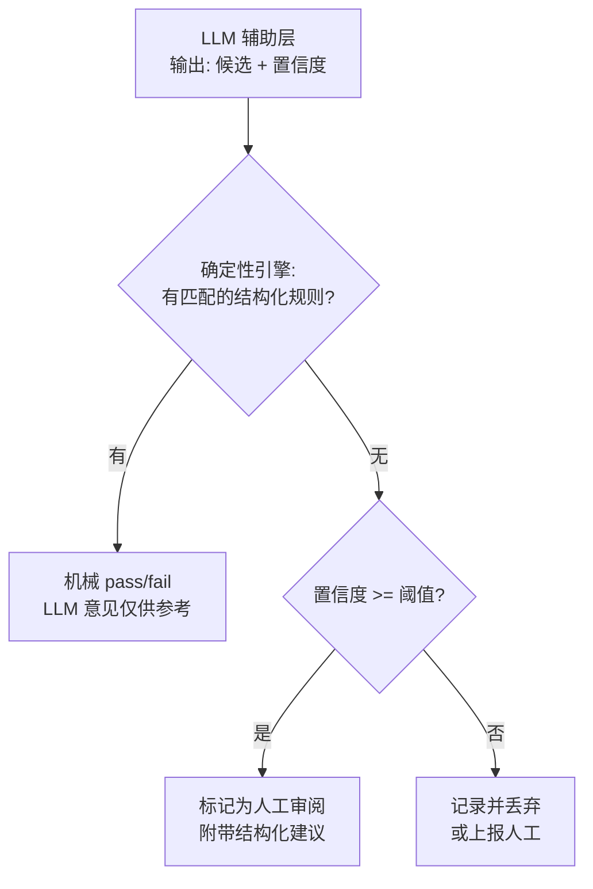

# 司衡体系重建规格书

> version: 1.0
> date: 2026-06-26
> status: 草稿 (1/3) -- 开放修订
> methodology: 设计科学研究 (DSR) 应用于人机协作代码工程治理
> dsr-iteration: 1 (构建阶段 -- 待评估)
> lifecycle-note: 本规格书是 DSR 循环的第一次构建产出。待外部评估（第 6.2 节锚点产出数据）后迭代。在此之前，所有经验声称均为条件性的。

---

## 0. 前言：为什么需要这份文档

现有司衡体系的哲学内核经三轮独立审阅后确认为基本健康。全部核心术语为道家血统（详见术语血统表文档），外部锚定关系实际存在但在文档化时因美学选择被删除。体系的根本义理成立，但文档表达需要严谨化重构。

两份审阅报告的权重已下调。它们是 LLM 的概率性制成品，且只看文档不看数百轮对话过程，存在信息缺失。审阅报告的部分诊断（混血统、没有外部锚点）已被证明是错误的：血统分析修正为全部核心术语为道家血统，外部锚定经新哲学文档写回。

本规格书定义一次文档表达的严谨化重构。目标是将已确认健康的哲学内核重新表达为可检验、可验证的形态，并补全工程映射。

旧 docs/ 内容保留在 archive/philosophy-v1/ 作为参考，标记为"被 v2 替代"。新文档写入 docs/specs/philosophy/ 和 docs/specs/engineering/。本规格书是新体系表达的权威来源。

旧体系在文档化过程中因美学选择（"与道家叙事不兼容"）删除了外部锚定（道一锚定热力学第二定律），导致审阅者误诊为"没有外部锚点"。这是文档化缺陷，不是哲学缺陷。新哲学文档已将外部锚定以声明形式写回。

---

## 1. 方法论定位

### 1.1 不是新框架

本工作将**设计科学研究 (DSR)** 应用于"人机协作代码工程治理"这一具体领域。DSR 是信息系统研究领域已成熟的研究范式（Hevner 等 2004），核心结构为：构建制品 -> 经验评估 -> 反馈迭代。

我们不声称发明了新方法论。我们声称将 DSR 系统性地应用于一个尚未被覆盖的领域：AI 生成代码制品的治理，包括治理系统自身的治理。

### 1.2 一个原创贡献

在 DSR 框架内，我们引入一项可量化的原创贡献：**推导力比率 (Derivability Ratio)** -- 治理规则集中，可从第一性原则逻辑推导的规则所占比例。这将 DSR 文献中已知的"设计理论不确定性"问题（Lukyanenko 等 2020）操作化为一个可测量指标。

### 1.3 诚实状态

在外部锚点数据收集完成之前（至少 6 个月的真实多人项目部署），本框架仍然是**假说，不是理论**。所有经验声称均为条件性的。

---

## 2. 认识论基础：自下而上

### 2.1 推导方向

```text
旧体系:  元 (公理) -> 道 (必然性) -> 法 (方法) -> 术 (实践)  [自上而下]
新体系:  观察 -> 原则 -> 指南 -> 机制 -> 实现  [自下而上]
```

旧结构的致命缺陷在于起点：元声称"先于论"却用 4200 字论元。道声称"工程必然性"但多数命题无法支撑该声称。不诚实的起点使一切下游推导无论多精巧，都是空中楼阁。

新结构从代码工程的经验观察出发，向上抽象为原则，向下推导为指南，通过外部测量验证。锚点在系统之外，在经验里，不在自指中。

### 2.2 观察 (O1-O5)

每条观察显式标注类型和来源。不声称超出其类型所能保证的权威性。

| 编号 | 观察                                                         | 类型              | 来源                                 |
| ---- | ------------------------------------------------------------ | ----------------- | ------------------------------------ |
| O1   | 缺乏显式协调的代码工程中，代码风格、架构和依赖方向趋向发散   | 条件性经验        | 软件工程文献 (Lehman 定律)、一般经验 |
| O2   | 代码，按定义，是由有意图的主体产出的                         | 定义性            | 语言惯例："代码"隐含作者身份         |
| O3   | 仅阅读代码无法自动恢复作者意图；需要额外的文档、注释或上下文 | 经验性，已证明    | 信息论 (Shannon 1948)：编码有损      |
| O4   | 规约文档与最终实现之间总存在偏差                             | 经验性，O3 的递归 | O3 应用于规约（规约也是一种编码）    |
| O5   | 治理规则自身也需要被治理；否则规则会腐化                     | 经验性            | 制度经济学（权力需要制衡）、历史观察 |

**O2 是治理域定义，不是命题。** 它定义"人类或 AI 产出的代码"这一治理域边界，但不产生预测。O2 不进入推导链。

### 2.3 原则 (P1-P4)

原则从观察推导而来。每条标注认识论地位。

**P1: 产出方差是默认状态，收敛需要干预**

> 任何代码产出过程中，产出方差是默认的。收敛需要约束，将产出方差降至项目上下文可接受的阈值以下。

- 类型: **条件性经验假设**（可证伪）
- 推导自: O1
- 证伪条件: 找到一种代码产出过程，在没有任何协调约束的条件下产出方差为零
- 可操作代理变量:
  - **产出方差** = 风格不一致率 + 架构漂移率 + 依赖方向违规率，对同一任务的 N 次产出（相同上下文、不同次运行/不同 agent/不同时间）测量
  - **协调覆盖率** = 被可机械验证的规则（validator、linter、CI gate、类型系统）覆盖的方差源比例
  - **治理强度** = validator 规则数 + 强制 review 轮次 + 文档 stage 3/3 比例
- 推导结论: 治理强度与 产出方差 x (1 - 协调覆盖率) 成正比
- 为什么不"计数认知源": 稳定、可数的"认知源"概念是一个虚构。同一个人在不同日子产出不同代码。同一个 LLM 在相同 prompt 下不同运行产出不同代码（概率性生成）。蒸馏的 9B 模型与其 70B 教师模型共享架构但产出不同。实体计数无法捕捉这些。产出方差测量可以。
- 具体含义:
  - 高产出方差（弱 prompt 的 AI coding、无共享规则的多 agent、新手开发者、LLM 非确定性）-> 需要高治理强度
  - 低产出方差（经验丰富的单一开发者、强 prompt 模板、模式成熟的老项目）-> 较低治理强度即可
  - 治理随测量的方差变化，不随对 agent 数量或类型的假设变化

**P2: 代码是意图的有损编码；修改代码前必须恢复意图**

> 代码是对作者意图的有损编码。对代码的任何修改，都需要先恢复产生该代码的意图。

- 类型: **设计推论**（从 P3 推导，范围由 O2 限定）
- 推导自: O3，范围由 O2 限定
- 不可证伪（设计建议，非经验声称）
- 具体含义:
  - 文档的目的是服务意图恢复，而非合规仪式
  - 文档形式应匹配消费者（人类 vs. AI agent）的意图恢复需求
  - AI coding 的编码链更长（用户意图 -> prompt -> 模型 -> 代码），信息损耗更大，因此需要更多验证
  - 治理应测量编码链长度，作为验证强度需求代理

**P3: 所有编码都是意图的有损编码**

> 意图的任何表示形式（代码、规约、prompt、自然语言）都会丢失相对于原始意图的信息。

- 类型: **外部定理引用**（权威来自信息论，非司衡自身）
- 来源: Shannon 1948
- 不可证伪（其领域内的数学定理）
- 具体含义:
  - P3 是整个体系的外部锚点。其权威来自司衡之外。
  - P2 和 P4a 从 P3 的外部锚点继承合法性。
  - P3 为"AI 生成的代码比人类写的代码需要更多验证"提供了原理性依据：编码链越长 = 信息损耗越大。

**P4a: 规约与实现之间总存在间隙（重言式）**

> 任何有限规约无法穷尽全部语义意图。规约与实现之间的间隙是定义性存在的。

- 类型: **重言式声明**（P3 的递归应用）
- 不可证伪（逻辑必然）
- 不作为免责盾牌（见 C4）

**P4b: 治理间隙随时间扩大（经验假设）**

> 治理规则与工程实践之间的间隙随时间增大，且增大速率与规则数量正相关。

- 类型: **经验假设**（可证伪）
- 推导自: O5, P3
- 证伪条件: 治理-实践间隙不随时间增大；需要纵向审计
- 具体含义:
  - Reopen 应条件触发（检测到间隙 -> 审计 -> 重开），而非手动可选
  - 规则数量增长应有界；应合并规则，而非只增不减
  - 治理开销应与被治理对象复杂度对比测量；若治理成本超过对象复杂度，P4b 被确认，治理应裁剪

### 2.4 认识论分层标签

体系内每条原则和指南必须携带以下标签之一：

| 标签                   | 含义                         | 权威来源                    |
| ---------------------- | ---------------------------- | --------------------------- |
| `empirical-hypothesis` | 可证伪声称，待外部验证       | 经验测量                    |
| `external-theorem`     | 引用自已有科学               | Shannon 1948, Lehman 定律等 |
| `tautology`            | 逻辑必然，不可证伪           | 定义                        |
| `design-corollary`     | 从其他原则推导，不可独立证伪 | 推导链                      |
| `working-assumption`   | 因实用接受，待验证           | 实用主义论证                |
| `external-anchor`      | 锚定到外部科学定律           | 权威来自体系之外            |
| `constructed-framework`| 在经验约束下被建构的有效框架 | 内部建构，待外部验证        |

### 2.5 外部锚定声明

体系的部分原则锚定到外部科学定律，其权威来自体系之外：

- 道一锚定热力学第二定律：孤立系统熵增 = 发散，开放系统局部熵减需要做功 = 收敛需要干预
- 道三锚定 Shannon 信息论：编码有损
- 道四锚定 Godel 不完备性定理：任何足够强的形式系统无法在自身内部证明自身一致性

东方哲学术语和西方科学术语描述同一现象时，两者都算锚定，不存在谁更"标准"。普利高津的耗散结构理论恰恰是热力学和东方哲学融合的先例。

---

## 3. 治理架构：两层确定性

### 3.1 自指问题

任何依赖 LLM 做决策的治理系统都会继承 LLM 的不可靠性：幻觉、上下文窗口遗忘、"任务完成"的自利报告。用一个不可靠的 LLM 验证另一个不可靠的 LLM 的输出，是循环自指——不可信的裁判裁判不可信的运动员。

解决方案：**将可确定性裁决的决策与语义模糊的决策分离**，并将裁决权专属赋予确定性层。

### 3.2 第一层：确定性引擎（零 LLM）

所有 pass/fail 裁决由纯机械规则发出。行为完全可预测、可复现、不可伪造，不随模型版本、prompt 和上下文窗口变化。

| 规则类别 | 裁决方式        | 示例                                              |
| -------- | --------------- | ------------------------------------------------- |
| 结构规则 | AST/schema 校验 | 文件在正确目录、frontmatter 字段类型正确、ID 格式 |
| 依赖规则 | 图算法          | upstream/downstream 环检测、stage 推进前置条件    |
| 权限规则 | 类型系统强制    | stage 1/3 不能被 stage 2/3 引用为权威依据         |
| 状态规则 | 状态机          | Reopen 触发条件、stage 转换合法性                 |
| 格式规则 | 模式匹配        | 表格列数、代码块语言标签、命名约定                |

### 3.3 第二层：语义辅助层（LLM 辅助，不裁决）

需要语义理解但不得做最终裁决的任务：

| 任务     | LLM 角色                     | 不得做什么           |
| -------- | ---------------------------- | -------------------- |
| 意图提取 | 从自然语言提取结构化意图断言 | 判断断言是否正确     |
| 代码审查 | 标记潜在问题区域             | 发出 pass/fail 裁决  |
| 冲突调解 | 生成候选解决方案             | 选择最终方案         |
| 文档生成 | 起草文本                     | 声明文档"已通过验证" |

LLM 输出格式: `候选建议 + 置信度分数`，绝不是`裁决`。确定性引擎决定是否采纳 LLM 建议。

### 3.4 层间协议



### 3.5 核心约束

**C1: 裁决确定性。** 任何 pass/fail 裁决必须由确定性引擎发出。LLM 不得直接发出裁决。

**C2: 不可伪造。** 每条裁决必须附带可独立验证的证据链：规则 ID、输入数据、判定路径。LLM 的"已通过验证"自报告不被接受。

**C3: 人工兜底。** 确定性引擎和 LLM 辅助层都无法裁决时，必须上报人类。LLM 不得在模糊情况下替代人类判断。

**C4: 不可免疫。** P4a（"间隙总存在"）不免除系统修补具体已识别的间隙。"我们承认不完备"不是"免于修补这个具体缺陷"的辩词。审计识别的每个间隙必须有文档化的修补计划，或人类签署的"已接受风险"声明。

**C5: 自治理。** 确定性引擎自身的规则受 P4b 约束。规则-实践间隙通过跨版本一致性检查（同一输入在不同版本的输出是否一致）检测。修正由人类决策触发，不由引擎自身触发。

---

## 4. 结构层级：四层，非六层

### 4.1 层级定义

| 层级 | 内容                                                   | 合法性来源           |
| ---- | ------------------------------------------------------ | -------------------- |
| 观察 | O1-O5: 原始经验观察                                    | 外部经验             |
| 原则 | P1-P4: 含推导和证伪条件的设计原则                      | 从观察推导           |
| 指南 | G1-G5: 方法论指南                                      | 从原则推导，独立验证 |
| 机制 | 三引擎架构 (Clarify, Weigh, Test)、validator、生命周期 | 实现指南的计算结构   |
| 实现 | Rust 代码、MCP 工具、CLI                               | 具体实现             |

### 4.2 为什么是四层不是三层

机制层（在指南与实现之间）是一个独立的粒度。"为什么用三个引擎而非一个""为什么用状态机管理生命周期"这类设计决策，对指南来说太具体（指南说"应该做什么"），对实现来说太抽象（实现说"代码怎么写"）。机制层回答的是："用什么计算结构实现这些指南？"

### 4.3 指南 (G1-G5)

每条指南从一条或多条原则推导。每条有独立验证方法（不依赖推导链验证）。

**G1: Scope Boundary（边界约束）**

- 推导自: P1（治理强度与产出方差成正比；低方差 -> 少治理）
- 内容: 治理投入必须与测量的产出方差成正比。低方差上下文中的过度治理本身就是发散源（治理成本超过被治理对象复杂度）。
- 独立验证: 测量治理开销时间 vs. 生产力开发时间。若治理开销 > 30% 开发时间且测量产出方差低于可比项目的第 25 百分位，G1 被违反。
- 标签: `design-corollary`

**G2: Causal Alignment（因果方向对齐）**

- 推导自: P1（收敛需要指向因果方向的外部干预）
- 内容: 治理规则必须强制因果方向：规约先于实现，意图先于代码，测试先于验证。反向因果流（无规约的代码、无测试的验证）必须被检测和标记。
- 独立验证: 检查依赖图中的反向因果边（代码文件的 upstream 是其规约、无对应测试定义的验证）。
- 标签: `design-corollary`

**G3: Proportionality（适度原则）**

- 推导自: P1（强度公式）、P4b（规则增长有界）
- 内容: 治理规则的数量和严格度必须与被治理对象的风险和复杂度成正比。关键路径（认证、数据变更、访问控制）适用更严格规则；工具路径（日志、格式化）适用更轻规则。规则增长必须有界：添加规则时，评估现有规则是否可以合并。
- 独立验证: 审计各治理区的规则数；标记超过阈值的区域（如工具模块 >10 条规则）。
- 标签: `design-corollary`

**G4: Trade-off Management（权衡管理）**

- 推导自: P2（意图恢复有成本）、P3（所有编码有损）
- 内容: 每条治理决策都涉及权衡。添加规则时，其成本（开发者时间、摩擦、误报率）必须与其收益并列记录。成本超过收益的规则必须被标记为待审查。
- 独立验证: 对每条规则，检查成本-收益文档是否存在且为最新。标记无文档的规则。
- 标签: `design-corollary`

**G5: Trend Alignment（趋势顺应）**

- 推导自: P4b（间隙随时间扩大）、P1（发散是默认）
- 内容: 治理必须随被治理项目演进。静态治理应用于增长中的项目会造成间隙扩大 (P4b)。治理规则的审查频率应与项目变更率成正比。
- 独立验证: 测量自上次规则审查以来的时间 vs. 同期重大代码变更数。标记变更超过阈值但未进行规则审查的情况。
- 标签: `design-corollary`

### 4.4 机制重设计: Clarify -> Weigh -> Test（降级）

| 旧角色            | 新角色                                                              |
| ----------------- | ------------------------------------------------------------------- |
| iCL: 自主发散诊断 | Intent Extractor（意图提取器）: 从自然语言提取结构化意图，输出 JSON |
| iWW: 自主决策权衡 | Proposal Generator（方案生成器）: 生成候选方案 + 置信度分数         |
| iCT: 自主验证     | Issue Marker（问题标记器）: 标记潜在违规 + 置信度分数               |

三者产出结构化数据，由确定性引擎消费。三者的产出均不具备裁决权。

---

## 5. 产品方向

### 5.1 方向 A: 意图护栏管道 (Intent Guard Pipeline)

**目标用户:** 进行 vibe coding 的非技术用户。

**问题:** vibe coding 用户能描述想要什么，但无法验证 AI 输出是否满足其意图。现有治理工具（Harness、Guard）假设用户具备工程知识。

**方案:** 构建不需要工程知识的意图保真度管道。

| 管道阶段     | 做什么                                   | 用户需要做什么     |
| ------------ | ---------------------------------------- | ------------------ |
| 意图捕获     | 询问"给谁用""应该做什么""绝对不能做什么" | 用自然语言回答     |
| 意图回显     | 把意图复述给用户确认                     | 确认或纠正         |
| 行为测试生成 | 从确认的意图生成行为断言                 | 审查断言           |
| 生成后验证   | 对生成的代码运行行为断言                 | 执行测试，判断结果 |

与现有工具的关键区别: 验证在**行为层面**（点击删除后数据真的被删了吗？），而非**工程层面**（是否违反了依赖方向？）。非技术用户能判断行为，不能判断工程。

**验证计划:**

- 锚点 1: 对比"有管道组 vs. 无管道组"的非技术用户行为正确率（相同任务）
- 锚点 2: 测量意图保真度（用户意图 -> 最终行为的一致性）
- 证伪: 若管道组正确率不显著高于无管道组，意图管道不成立

### 5.2 方向 B: 约束注入让低能力模型可用

**目标用户:** 使用廉价模型的成本敏感团队。

**问题:** 低能力模型产出质量较低。全量治理（Guard + Harness）是为昂贵模型设计的。

**方案:** 用治理补偿模型能力差距。

| 补偿方法     | 原理                                                          | 原则依据                         |
| ------------ | ------------------------------------------------------------- | -------------------------------- |
| 搜索空间缩减 | 生成前注入约束（允许的文件、函数、必须通过的测试）            | P1: 搜索空间小 -> 更易收敛       |
| 高频验证     | 增量测试（每个函数测，而非每个模块测）                        | P1: 干预更密集 -> 发散更早被控制 |
| 结构化上下文 | 用结构化信息（schema、类型签名、接口契约）替代自然语言 prompt | P3: 结构化编码减少信息损耗       |

**诚实边界:**

- 可补偿: 风格一致性、约束合规、模式遵循、简单 CRUD
- 不可补偿: 架构决策、算法选择、性能优化、创造性方案
- 低能力模型在不可补偿任务上应诚实标记为"需要人类介入"

**经济模型:**

- 约束注入增加约 30% prompt token
- 验证迭代增加约 50-100% 总 token
- 总成本: 裸用模型的约 2-3 倍
- 仍比高能力模型便宜约一个数量级
- 盈亏平衡: 治理若能将确定性任务可用率从 40% 提升到 80%

---

## 6. 评估框架

### 6.1 推导力比率

核心原创指标。对任意规则集 R：

```
推导力比率 = |{r 属于 R : 若无 P1-P4 则 r 不会存在}| / |R|
```

测试方法: 对每条规则，问"假设 P1-P4 不存在，这条规则仍会被写成现在这样吗？"

- "是" = 独立规则（不依赖原则也可成立）
- "否" = 推导规则（因原则而存在）

**当前测量:** 约 3/13 的规则从原则推导
**目标:** 8/13
**验证:** 该比率本身必须可独立验证；两名独立评估者必须对分类达成一致

### 6.2 外部锚点

| 锚点       | 测量什么                     | 方法                                                  | 时间线  |
| ---------- | ---------------------------- | ----------------------------------------------------- | ------- |
| 跨项目预测 | P1: 治理降低发散             | 选 3-5 个开源项目，测量治理投入 vs. 代码收敛度        | 6+ 个月 |
| 自审计     | P4b: 规则-实践间隙随时间扩大 | 月度确定性引擎规则一致性审计；季度 stage-代码对齐检查 | 持续    |
| 同构验证   | P1 定量预测                  | 在不同产出方差水平下，测量预期 vs. 实际治理成本       | 6+ 个月 |
| 意图管道   | 方向 A 有效性                | 有管道 vs. 无管道的行为正确率                         | 3+ 个月 |
| 约束注入   | 方向 B 有效性                | 低能力模型+治理 vs. 高能力模型，确定性任务可用率      | 3+ 个月 |

### 6.3 统计性评估（DSR 的 AI 语境扩展）

传统 DSR 评估假设制品行为确定。AI 时代的治理制品行为不确定（相同输入，不同 LLM 输出）。

**适配:** 评估单位从"通过/不通过"变为"通过率分布"。制品的有效性定义为在 N 次运行中通过率超过定义阈值，而非单次通过。

### 6.4 哲学涌现计划（工程验证后的归纳）

**前置条件:** 第 6.2 节的外部锚点数据基本成熟（至少 6 个月的真实部署数据）。哲学层已有稳固内核：道家的四道、五法、鉴，以及外部锚定（热力学第二定律、Shannon 信息论、Godel 不完备性定理）。涌现的前置条件从"哲学层为空"调整为"哲学层已有内核但需验证"：等待数据验证和修正，而非从零填充。

**为什么不是"反推":** "反推"暗示结论已确定，只是缺证据。司衡的哲学层已有稳固内核，但内核的有效性仍需数据验证。正确方向是从工程数据中**归纳涌现**：数据可能支持现有内核的某种修正，也可能推翻部分主张，产生全新的表述。

**涌现流程:**

```text
锚点数据成熟 -> 提取数据洞见 -> 与现有哲学传统对比 -> 归纳出哲学层表述
```

具体步骤:

1. **洞见提取**: 从锚点数据中归纳出 P1-P4 在实践中被验证、被修正或被推翻的模式。例如: "P1 的产出方差公式在单人项目中预测准确，在多 agent 项目中系统性低估"。
2. **传统映射**: 将提取的洞见与已有哲学传统（不限于中国哲学）进行对比。不做强制映射。对比的目的是判断工程发现是否已有哲学表述覆盖。
3. **涌现条件**: 仅当以下条件全部满足时，才产生哲学层表述:
   - 至少 2 个外部锚点的数据已收敛（非单点偶然）
   - 洞见无法被已有哲学传统完整覆盖（否则直接引用外部传统）
   - 洞见具有超出代码工程治理的普遍性（否则停留在工程层）
4. **产出**: 哲学层表述作为 `knowledge/notes/` 下的独立文档，stage 1/3，不进入 Principles 层。哲学层表述对工程层无约束力（工程层由 O1-O5/P1-P4 独立驱动）。

**防止退化:** 哲学涌现不得退化为旧体系的修辞机器。每条哲学表述必须附带其数据来源和归纳路径，与 P1-P4 的认识论标签制度保持一致。无数据支撑的哲学表述不产出。

**旧术语的最终处置:** 涌现完成前，旧术语（道/法/术/元）保持归档状态。涌现完成后，可能出现三种结果:

- 数据支持旧术语的某种重新映射 -> 以涌现文档形式建立映射，不恢复旧术语的论证地位
- 数据不支持 -> 旧术语永久归档
- 数据部分支持 -> 如实记录部分支持的范围和条件

---

## 7. 治理流程（轻量）

### 7.1 原则

- ADR 中不需要哲学论证。ADR 记录决策、考虑的替代方案、理由、权衡。
- `decided-by` 必须是人类标识符。`ai-assist` 不是决策者。
- upstream 必须指向一个具体决策（不是 spec，不是哲学文档）。
- 任何提案不得在无独立决策文档的情况下自我 ratify 到 stage 3/3。

### 7.2 生命周期

- Stage 1/3: 草稿，开放修订
- Stage 2/3: 已解决，内部一致，已审阅
- Stage 3/3: 已批准，稳定，可作为权威依据引用
- Stage 0/<后继 id>: 已被替代，由后继者取代
- Stage X: 已废弃，归档

### 7.3 Reopen 触发

Reopen 由 P4b 条件触发，而非手动可选：

- 跨版本一致性检查失败（同一输入，不同输出）
- 外部审计发现规则-实践间隙
- 人类决策要求显式审查

---

## 8. 术语：道家叙事为主，英文对照为辅

### 8.1 理由

血统分析已修正为全部核心术语为道家血统（详见术语血统表文档）。此前"约 60% 儒家/法家、约 20% 道家、约 20% 自造"的判断是错误的，"道家核心是文化拼凑"的判断同样不成立。五个核心术语直接引《道德经》《庄子》原文，两个为道家义理延伸概念，无一儒法家源头，无一自造。

**决定: 保留道家术语作为主叙事语言，英文工程术语作为辅助对照。** 品牌名"司衡"保留。新哲学文档已使用道家术语为主叙事，英文术语在括号或映射表中出现。

### 8.2 映射表

| 道家术语              | 英文对照                                                                     | 关系                                 |
| --------------------- | ---------------------------------------------------------------------------- | ------------------------------------ |
| 道 (Tao)              | Tao (Wade-Giles, 国际通用 Taoism/Tao Te Ching)                              | 代码工程的因果必然性                 |
| 道一                  | Tao-1                                                                       | 发散自-然，收敛必-为                 |
| 道二                  | Tao-2                                                                       | 意图先于代码，因果方向不可逆         |
| 道三                  | Tao-3                                                                       | 凡编码皆为意图之有损编码             |
| 道四                  | Tao-4a + Tao-4b                                                             | 重言式 + 经验假设                    |
| 元 (Arche)            | (退役)                                                                       | 功能被 O1-O5 前件条件吸收            |
| 鉴 (Assay)            | Assay                                                                        | constructed-framework，反推检验工具  |
| 法 (Canon)            | Canon                                                                        | 从道自然生出的方法论原则             |
| 知止                  | Zhi-Zhi                                                                      | 边界约束                             |
| 顺因                  | Shun-Yin                                                                     | 因果方向对齐                         |
| 有度                  | You-Du                                                                       | 适度原则                             |
| 损补                  | Sun-Bu                                                                       | 权衡管理                             |
| 顺势                  | Shun-Shi                                                                     | 趋势顺应                             |
| 六层 (道法术几约形迹) | 四层 (Observations -> Tao -> Canon -> Mechanisms -> Implementation)         | 压平冗余层级                         |
| dao_trace             | design_origin（或退役）                                                      | 见 8.3                               |
| 元->道->法->术        | Observations -> Tao -> Canon -> Mechanisms -> Implementation                | 方向反转                             |

### 8.3 dao_trace 处置

dao_trace 是开发者凭直觉硬编码的 `Option<String>`，无验证机制。两条路：

- **路线 A（推荐）:** 类型强制关联。每条规则注册时声明它检查的 Guideline 编号，类型系统强制关联。不再是自由文本字符串。
- **路线 B:** 从治理输出中退役。仅保留为开发者注释。不在验证报告中输出。

路线 A 更优，因为它使推导链可机械验证，直接支撑推导力比率测量。

---

## 9. 文档处置策略

| 旧类别                                 | 处置                                          | 理由                     |
| -------------------------------------- | --------------------------------------------- | ------------------------ |
| specs/philosophy（道/法/鉴/元）        | 保留在 archive/philosophy-v1/ 作为参考，标记为"被 v2 替代"。内容以新形式在 docs/specs/philosophy/ 中重新表达。 | 旧结构废弃               |
| specs/engineering/Document-Conventions | 保留核心规则，剥离道法映射标签                | 规则独立成立             |
| specs/engineering/Engineering-Mapping  | 废弃。替换为推导力比率审计表                  | 映射是事后贴标签         |
| proposals/                             | 保留有效决策，清理 ai-assist 债务             | 治理债务必须清理         |
| decisions/                             | 保留，清理 ai-assist 债务，修复 upstream 断裂 | 同上                     |
| knowledge/notes/                       | 保留有实证价值的笔记，降级自我感动式记录      | 诚实对待什么构成证据     |
| reference/Compendium                   | 降级为术语速查表，删除"权威定义"声明          | 权威来自数据，不来自汇编 |
| reference/Onomastic-Philosophy         | 保留在 archive/philosophy-v1/ 作为参考，标记为"被 v2 替代" | 术语体系调整为双语并存  |

---

## 10. 风险登记

| 风险                         | 可能性 | 影响 | 缓解措施                                     |
| ---------------------------- | ------ | ---- | -------------------------------------------- |
| P1 被外部数据证伪            | 中     | 高   | 体系优雅降级；个别原则可退役而不导致框架崩塌 |
| 推导力比率持续低于 5/13      | 中     | 中   | 诚实测量是目标；框架合法性不依赖高比率       |
| 确定性引擎规则过时           | 高     | 低   | P4b 触发：自动化间隙检测 + 人工更新          |
| LLM 辅助层建议质量差         | 高     | 低   | 置信度评分 + 确定性引擎作为守门人            |
| 6 个月内无法获得外部锚点数据 | 高     | 中   | 框架以工作假说运作直至验证；诚实标注状态     |
| 意图管道未提升正确率         | 中     | 中   | 可证伪；管道可退役（若锚点 1 失败）          |
| 约束注入未能补偿低能力模型   | 中     | 中   | 可证伪；对不可补偿任务诚实标记               |

---

## 11. 与现有生态的关系

### 11.1 Harness+Loop（工程组织）

司衡的确定性引擎与 Harness 的 Guard Runtime 在架构上同构（两者都基于可配置规则发出机械裁决）。区别: Guard Runtime 规则治理运行时的工具调用；司衡的确定性引擎规则治理产出阶段的制品质量。两者互补，不竞争。

### 11.2 DSR（学术）

本工作将 DSR 应用于具体领域。推导力比率是 DSR 框架内的创新型评估指标。学术定位: "DSR 应用于软件制品治理，附带可量化的设计理论不确定性测量。"

### 11.3 信息论 (P3)

P3 (Shannon 1948) 是外部锚点。其权威不依赖司衡。这是与旧体系的结构性差异 -- 旧体系中所有权威都是自我确立的。

### 11.4 Lehman 定律 (O1)

O1 与 Lehman 的"持续变化"和"复杂度递增"定律一致。司衡从 Lehman 的描述（复杂度增加）推进到处方（治理强度应按比例增加）-- 这是 Lehman 明确没有走的一步。
