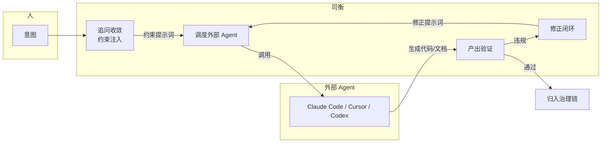

# 司衡核心定位与边界

> 定义司衡是什么、不是什么、为什么这么定位。此文档是司衡所有能力建设的顶层约束。

## 一、核心定位

**司衡是面向工程 AI 编码的治理 orchestrator——约束注入 + 调度外部 Agent + 产出验证。**

司衡不做代码生成。司衡确保生成的代码对齐人的意图。

## 二、三个"不是"

### 2.1 不是自治代码生成器

司衡不调用 LLM 生成代码。原因：

- **道四**：验证者和生成者必须分离。司衡同时是生成者和验证者时，验证的公信力减弱——两者的间隙被压缩在同一进程中，难以被外部审视
- **竞争定位**：所有竞品在做"更好的 Agent 体验"，没有人做"让任何 Agent 都受道法约束的治理层"。司衡的独特性在后者
- **网络效应**：兼容越多外部 Agent，司衡价值越大。锁定在自己生态里，网络效应归零

### 2.2 不是纯 MCP server

司衡不满足于"提供工具，等人调用"：

- 追问引擎主动追问用户，澄清意图
- orchestrator 主动调度外部 Agent，不是被动等待
- 修正闭环主动驱动再生成，不是只报告违规

治理 orchestrator 是主动的、闭环的、有状态的。

### 2.3 不是又一个安全护栏

F/G/J 违规分级是司衡的一部分，但不是全部。安全护栏（ouro-loop、architect-guardrail）只做"拦截坏的东西"。司衡做的是"验证好的东西"——验证产出是否对齐了意图。

## 三、司衡做什么

八个能力域，统一在 orchestrator 调度下：

| 域           | 司衡做什么                                               | 不做什么             |
| ------------ | -------------------------------------------------------- | -------------------- |
| 需求收敛     | 元规则驱动追问，收敛为结构化意图                         | 不替代人的创作判断   |
| 架构约束     | 把设计词汇编码为可验证约束规则                           | 不自己设计架构       |
| 代码检索索引 | 调度外部索引工具（codegraph、tree-sitter），过滤合规结果 | 不自建检索引擎       |
| MCP 工具调度 | 统一权限、限流、审计、调用编排                           | 不替代 MCP 协议本身  |
| 流程技能编排 | 调度外部 skill 文件，约束执行顺序                        | 不自己写 skill 内容  |
| 安全护栏     | Spec 对齐 + F/G/J 违规分级 + iron laws 禁区              | 不替代操作系统级安全 |
| 审计溯源     | upstream 治理链 + governance trailer                     | 不替代 Git 历史      |
| 迭代自校正   | 违规模式 -> 约束注入更新                                 | 不自动修改元规则     |

## 四、元规则的约束对象

五层元规则约束的是**治理流水线本身**，不是约束代码：

| 元规则               | 在 orchestrator 中的约束            |
| -------------------- | ----------------------------------- |
| 道一（意图先于代码） | 追问引擎必须先于提示词生成          |
| 道二（编码必有损）   | @limitations 必填，间隙声明不可跳过 |
| 顺因                 | 每个变更必须有 upstream 追溯        |
| 有度                 | stage 和变更范围必须匹配            |
| 知止                 | 八个域各自有"不做什么"声明          |
| 损补                 | 新能力不能重复已有能力              |
| 顺势                 | 约束力度匹配违规严重度              |

## 五、和竞品的关系

| 竞品                            | 关系                                                             |
| ------------------------------- | ---------------------------------------------------------------- |
| Claude Code / Cursor            | **被调度方**。司衡生成约束提示词，交给它们执行                   |
| Pocock skills                   | **被托管方**。skill 文件保留社区格式，司衡调度执行               |
| codegraph / tree-sitter         | **被集成方**。司衡调用，过滤结果                                 |
| Superpowers                     | **互补**。Superpowers 管流程锁定，司衡管产出验证。可用其一或并用 |
| ouro-loop / architect-guardrail | **互补**。安全护栏拦截危险操作，司衡验证语义对齐                 |

司衡不替代任何外部 Agent 或工具。司衡让它们更可信。

## 六、工程分期

| 阶段    | 内容                                                     | 依赖                 |
| ------- | -------------------------------------------------------- | -------------------- |
| P0 当前 | validator + format-lint + governance trailer + Mind 三机 | 已有                 |
| P0 在建 | 追问引擎（grilling engine）                              | proposal 2/3         |
| P1      | orchestrator 调度循环（提示词 -> Agent -> 验证 -> 修正） | 追问引擎完成         |
| P2      | 流程技能编排（托管外部 skill 文件）                      | orchestrator         |
| P2      | 架构约束规则引擎                                         | orchestrator         |
| P2      | 代码索引 Spec 过滤                                       | orchestrator         |
| P3      | 安全护栏集成（iron laws）                                | orchestrator         |
| P3      | 自校正约束注入                                           | P1-P2 积累的违规模式 |

## 七、@limitations

1. **外部 Agent 的生成质量仍依赖外部 Agent 本身**：司衡能约束提示词的结构化和合规性，但不能保证外部 Agent 理解并严格执行约束
2. **"事前收敛"的上限是提示词约束的强度**：如果外部 Agent 忽略提示词中的约束，司衡只能在事后验证阶段发现
3. **八个域的完整建设是多年工程**：当前 P0 已部分完成，P1 在设计阶段，P2/P3 是规划
4. **此定位和已归档的自我进化路径文档一致**，但更明确地划定"不生成代码"的边界

## DEPS

- 240610-1030-on-sihankor-canon：法论（道/法/术/几/约定义）
- 240602-1000-on-sihankor-assay：鉴论（反推九段式）
- 260622-1330-sihankor-self-evolution-path：自我进化路径（竞品分析、八域矩阵）
- 260622-1325-grilling-engine：追问引擎设计提案

## SEE-ALSO

- Superpowers: <https://github.com/obra/superpowers>
- Pocock skills: <https://github.com/mattpocock/skills>
- ouro-loop: <https://pypi.org/project/ouro-loop/>
