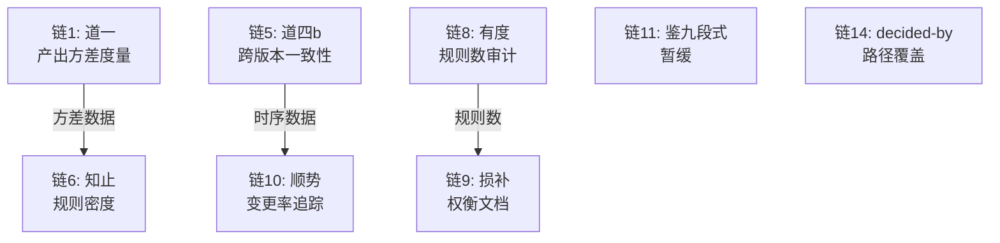

# 司衡概念操作化规格

> 本文档为 8 条 L5/L2 断裂链提供操作化论证：将抽象哲学构念转化为可度量的工程指示器。方法论源自概念操作化（Bridgman 1927, Cronbach & Meehl 1954）。每条链包含构念定义、提议指示器、操作化假设、效度威胁、降格声明、验证路径六个要素。所有操作化均有降格，不存在"完美"反映构念的指示器。

## 操作化框架

### 方法论声明

操作化是将抽象构念转化为可观测、可度量变量的过程。其核心论证不是"指示器等于构念"，而是"指示器在特定条件下能忠实反映构念的某一侧面"。每个指示器都引入了构念到度量之间的映射误差，此误差即为降格。

### 依赖关系

8 条操作化链之间存在数据依赖。依赖关系如下。

链 6 依赖链 1 的产出方差数据。链 10 依赖链 5 的时序数据。链 9 依赖链 8 的规则统计。链 11 为暂缓处置，无下游依赖。链 14 为独立补充操作化。

## 链 1：道一 -> 产出方差度量

### 构念定义

**道一**：发散自-然，收敛必-为。发散是代码工程在多认知源、无治理干预条件下的自-然趋势；收敛需要外部、系统、持续的治理力量介入。（道论第一节）

适用边界：多认知源、长生存期、无治理干预的代码工程。弱化条件为单人短期项目、固定模板的重复任务，此时发散压力极低。

### 提议指示器

三个指示器分别对应道一描述的三种发散形态。

- **文档风格不一致率**：同类型文档（如均为 spec）之间，格式约定违反率的离散程度。度量对象为文档产出，非运行时性能。
- **架构漂移率**：同一项目内，代码模块间依赖方向违规（如核心域依赖胶水代码）的比率随时间的变化。
- **同类型文档间字段差异度**：同 nature 同 stage 的文档集合中，frontmatter 字段存在性、取值模式的变异系数。

### 操作化假设

文档风格不一致率反映理解发散：当多个认知源独立撰写同类型文档时，对"正确格式"的理解天然不同，表现为风格不一致率的统计离散。治理介入（格式规则、validator 检查）应降低此离散度。

架构漂移率反映实现发散：代码模块间的依赖方向在无治理干预下趋向混乱。治理介入（依赖方向规则、架构守卫）应降低漂移率。

同类型文档间字段差异度反映方案发散：对同一文档类型应有统一的结构约定，差异度高意味着认知源之间对文档结构的共识不足。

三个指示器从理解、实现、方案三个侧面逼近"产出方差"这一构念，但均非构念本身。

### 效度威胁

风格不一致率可能将合理的风格多样性误判为发散。某些文档类型的格式约定本就有意保留灵活性，此时不一致率升高不代表治理缺失。

架构漂移率依赖依赖图的抽取精度。动态语言中依赖关系难以精确提取，误判率可能引入系统偏差。此外，架构漂移可能源于业务需求变化而非发散。

字段差异度可能因文档处于不同 stage 而产生假阳性：1/3 文档的结构自由度本就高于 3/3 文档，需按 stage 分层比较。

### 降格声明

当前 **L5**：零实现，无任何产出方差度量管道。

操作化后目标 **L2**：三个指示器均为构念的间接近似。产出方差是一个多维构念（理解发散 + 方案发散 + 实现发散 + 演进发散），三个指示器仅覆盖前三者。演进发散（长期架构演化）需要更长的时间序列，当前指示器无法覆盖。

### 验证路径

升级至 L1 需要以下证据的组合。

- 在至少 3 个不同方差水平的治理域中采集三个指示器的数据，检验其与人工判断的方差评级之间的一致性
- 对比有治理干预和无治理干预区域的指示器差异，若差异方向与道一预测一致（无干预区方差更高），则支持操作化假设
- 通过跨项目验证检验指示器的泛化性

## 链 5：道四b -> 跨版本一致性检查

### 构念定义

**道四b**：治理与实践的间隙随时间增大，且增大速率与规则数量正相关。（道论第四节）

认识论标签为 empirical-hypothesis，可证伪。适用边界为规则持续积累、缺乏定期修剪的治理系统。弱化条件为新建立的治理系统或积极执行损补的治理系统。

### 提议指示器

- **跨版本验证结果差异**：同一份文档（或同一输入集）在时间点 t1 和 t2 通过同一版本 validator 的验证结果差异量。差异量定义为 t1 通过但 t2 失败的规则数加上 t2 通过但 t1 失败的规则数。
- **规则数量时序**：validator 规则定义文件在连续时间点上的规则总数序列。

### 操作化假设

跨版本验证结果差异直接度量"间隙"的操作化近似。若治理规则与实践之间间隙增大，则同一输入在不同时间点的验证结果应产生更多差异：新规则引入使得先前通过的输入不再通过，实践漂移使得先前失败的输入变为通过。

规则数量时序度量间隙增长的驱动因素。道四b 预测间隙增大速率与规则数量正相关，故规则数增长应与验证差异量的增长呈正相关。

两个指示器联合使用：规则数量时序提供"因"的度量，跨版本差异提供"果"的度量。

### 效度威胁

跨版本验证差异可能并非间隙增大所致，而可能是规则修正（修复误报）的正常结果。规则的质量改进也会导致验证结果变化，但方向与间隙增大相反。需要区分"规则修正导致的差异"与"间隙增大导致的差异"。

规则数量时序是粗粒度量。规则增加可能伴随规则合并或删除，净增量无法反映规则质量的变化。此外，规则的认知负荷不仅取决于数量，还取决于复杂度和交互效应。

时间序列的采集需要足够长的时间跨度。短时间内的数据可能不足以暴露间隙增长趋势，导致假阴性。

### 降格声明

当前 **L5**：零实现，无跨版本一致性检查、无规则数量时间序列追踪。

操作化后目标 **L2**：跨版本验证差异是间隙的间接度量，受规则修正噪声干扰。规则数量时序是粗粒度量，未考虑规则质量与交互效应。二者联合仍无法精确度量间隙，但可提供趋势信号。

### 验证路径

- 积累至少 6 个月的规则数量时序数据与跨版本验证差异数据
- 检验规则增长速率与验证差异增长速率之间的相关性。若相关系数显著为正，支持道四b 的正相关假设
- 控制规则修正事件（通过 git log 标记规则修改），区分修正噪声与间隙增长信号

## 链 6：知止 -> G1 Scope Boundary 度量管道

### 构念定义

**知止（G1 Scope Boundary）**：治理投入应与产出方差成正比。方差大处多投入，方差小处少投入乃至不投入。过度治理产生的新发散可能超过其收敛收益。（法论知止节）

适用边界为多认知源、方差非均匀分布的代码工程。弱化条件为方差均匀分布的场景或单人短期项目。

### 提议指示器

- **规则密度**：各治理域的规则数除以该域的文档数，即 rules / docs。高密度意味着单位文档承受更多治理约束。
- **治理开销占比**：治理相关操作（文档维护、规则审查、验证执行）所消耗的时间占总工程时间的比例。

### 操作化假设

规则密度反映知止的"投入"维度。若知止被遵守，高方差治理域应有高规则密度，低方差治理域应有低规则密度。规则密度与链 1 度量的产出方差之间的相关关系即为知止的操作化检验。

治理开销占比提供投入绝对量的度量。知止要求治理投入有界：若某治理域的治理开销显著超过被治理对象本身的价值（如一个低使用率的工具模块消耗了大量治理时间），则知止在该处未被遵守。

规则密度是相对度量（投入与规模的比值），治理开销占比是绝对度量（投入与总资源的比值）。二者互补。

### 效度威胁

规则密度依赖"治理域"的划分。治理域边界不清晰时，规则数的归属不明确。当前司衡的治理域划分基于文件目录与 nature 分类，但同一目录下不同文档的方差水平可能差异很大。

治理开销占比难以精确度量。"治理相关操作"的边界模糊：审查文档算治理还是算开发？治理工具的维护算治理还是算基础设施？

此链依赖链 1 的产出方差数据。若链 1 的指示器本身有较大度量误差，则相关关系的信度降低。

### 降格声明

当前 G1 度量管道为 **L5**，iCT check_zhizhi 降格实现为 **L3**。

操作化后目标 **L2**：规则密度与治理开销占比仅反映投入维度，未直接度量"投入与方差的关系"。相关关系分析需依赖链 1 数据，引入传递误差。iCT 的降格实现（不越界操作的 if-else）仅覆盖知止的边界声明，不覆盖"投入与方差成正比"的核心主张。

### 验证路径

- 在链 1 产出方差数据可用后，计算各治理域的规则密度与产出方差的相关系数
- 识别反例：高规则密度但低产出方差的治理域（过度治理），或低规则密度但高产出方差的治理域（治理缺失）
- 对治理开销占比设置阈值警告：当某治理域的治理开销超过 30% 的域内总工时且方差低于可比治理域的中位数时，触发知止审查

## 链 8：有度 -> G3 Proportionality 规则数审计

### 构念定义

**有度（G3 Proportionality）**：规则数量与严格度应与风险成正比。风险大处多规严规，风险小处少规宽规。（法论有度节）

适用边界为规则持续积累、风险非均匀分布的治理系统。弱化条件为风险均匀分布的系统或新建立的治理系统。

### 提议指示器

- **各治理区域规则数分布**：按治理维度（文档结构、命名约定、引用完整性、治理流程等）分别统计规则数，生成分布直方图。
- **Fatal 级规则占比**：标记为 Fatal 严格度的规则数占规则总数的比例。Fatal 级规则对应"戒 Forbid"力度，是最高严格度。

### 操作化假设

规则数分布反映"度"的分化程度。若有度被遵守，高风险治理维度应有更多规则，低风险维度应有更少规则。分布的均匀性可作为一个反向指标：完全均匀的分布意味着有度未区分风险等级。

Fatal 级规则占比反映严格度的集中度。有度要求严格度与风险匹配，高风险区域应有更高比例的 Fatal 规则。但 Fatal 规则占比过高可能意味着过度治理，需与风险等级联合判断。

两个指示器可从 validator 规则定义中直接提取：规则 ID 前缀（V-F/V-G/V-J）标识严格度，规则的功能分类标识治理维度。

### 效度威胁

"风险"的度量本身是一个未操作化的构念。链 8 假设风险可以从规则的功能分类中间接推断，但风险的多维性（影响范围、发生概率、不可逆性）无法被单一维度完整捕捉。

Fatal 级规则占比受规则历史路径依赖的影响。早期定义的规则可能被标记为 Fatal 而后期未调整，导致比例不再反映当前风险分布。规则严格度的重新校准成本可能阻碍有度的执行。

规则数统计可能忽略规则的实际触发频率。一条高风险区域中从未触发的规则与一条频繁触发的规则，在规则数统计中权重相同，但治理效能差异巨大。

### 降格声明

当前 G3 度量管道为 **L5**，iCT check_youdou 降格实现为 **L3**。

操作化后目标 **L2**：规则数分布和 Fatal 占比仅反映规则定义侧的"度"，不反映规则执行侧的实际严格度。风险度量依赖间接推断，未独立操作化。iCT 的降格实现（action 力度与发散严重度匹配的 if-else）仅覆盖单次验证场景，不覆盖全局规则数审计。

### 验证路径

- 对各治理维度定义风险等级评估标准（可初始采用专家判断），然后检验规则数分布与风险等级的秩相关性
- 追踪 Fatal 规则的实际触发率：高 Fatal 占比但低触发率的治理维度可能是过度治理
- 定期（季度）审计规则严格度标签的时效性，标记需要调整严格度的规则

## 链 9：损补 -> G4 Trade-off Management 权衡文档

### 构念定义

**损补（G4 Trade-off Management）**：每条治理决策皆涉权衡，有所损必有所补，有所补必有所损。（法论损补节）

工程映射要求每条决策记录权衡（ADR 三段式：背景 -> 决策 -> 后果）。G4 验证方法要求审计 ADR 记录，统计规则总量趋势，检验是否存在定期规则修剪机制。

### 提议指示器

- **ADR 权衡记录覆盖率**：有完整"背景 -> 决策 -> 后果"三段式记录的决策文档数占决策文档总数的比例。此处"完整"定义为三个章节均存在且非空。
- **规则增删比率**：在给定时间窗口内，新增规则数与删除（或标记为 Deprecated）规则数的比值。比值为正无穷（只增不删）表示损补失衡。

### 操作化假设

ADR 权衡记录覆盖率反映损补的显式化管理程度。损补之法要求每条治理决策的权衡被显式记录，故高覆盖率意味着损补被遵守。但覆盖率仅度量"记录"行为，不度量"记录质量"。

规则增删比率反映损补的动态平衡。损补要求"损冗余之规则，补缺失之覆盖"，故增删比率应趋向 1:1。比率显著偏离（如持续 > 3:1）意味着只补不损，间隙累积无修正。

### 效度威胁

ADR 权衡记录覆盖率不区分高质量权衡记录与形式化填充。决策文档可能包含"背景 -> 决策 -> 后果"三个标题但内容空洞，此时覆盖率给出虚假的正信号。

规则增删比率依赖规则的删除/废弃标记机制。若规则废弃未被系统追踪（如直接从代码中移除而不标记 Deprecated），则删除数被低估，比率偏大。此外，规则合并（两条合并为一条）在计数上表现为一增一删，但实际上是质量改进而非简单的损补平衡。

"什么样的记录算权衡文档"本身需要操作化定义。当前定义（三段式非空）是一个最低门槛，可能遗漏其他形式的权衡记录。

### 降格声明

当前 G4 文档要求为 **L5**，iCT check_sunbu 降格实现为 **L3**。

操作化后目标 **L2**：ADR 覆盖率度量"是否记录"而不度量"记录是否有实质性权衡内容"。规则增删比率是粗粒度量，未区分规则删除的原因（冗余修剪 vs 错误修复）。二者联合仍无法精确度量损补的质量。

### 验证路径

- 人工抽样审计 ADR 文档质量：随机抽取决策文档，由两人独立判断三段式内容是否包含实质性权衡论述
- 积累规则增删的时间序列数据，检验比率趋势。若比率持续 > 3:1 超过两个审计周期，触发损补审查
- 建立规则废弃追踪机制（阶段 0/<successor-id> 或 stage X），使删除数可被准确统计

## 链 10：顺势 -> G5 Trend Alignment 变更率追踪

### 构念定义

**顺势（G5 Trend Alignment）**：治理力度应随项目演进。势有三层：时势（项目阶段）、地势（代码区域）、人势（认知源数量）。不该收敛时收敛是拔苗助长，该收敛时不收敛是错失时机。（法论顺势节）

工程映射要求纵向追踪力度变化，识别力度不随条件变化的反例。

### 提议指示器

- **审查频率-变更频率比值**：在给定时间窗口内，治理规则审查次数与代码变更次数的比值。比值接近 1 表示审查与变更同步，比值远小于 1 表示审查滞后于变更。

### 操作化假设

审查频率-变更频率比值反映治理力度与项目演进速度的同步程度。顺势要求治理力度随项目变化而适配：代码变更频繁的时期应有更频繁的规则审查，变更稀疏的时期可降低审查频率。比值显著偏离 1（特别是远小于 1）意味着治理力度未随项目演进同步调整。

此指示器直接度量法论定义的 G5 工程验证方法中的"纵向追踪：同一治理域在不同时间点的力度是否随条件变化而调整"。

### 效度威胁

审查频率可能受审查机制而非项目演进的驱动。定期审查（如每月一次）的比值可能人为接近 1，但并非对变更的响应性调整。需要区分"响应性审查"与"例行审查"。

比值度量仅覆盖时势维度，未覆盖地势（区域差异）和人势（认知源数量变化）维度。法论定义的势有三层，此指示器仅操作化了时势。

代码变更次数的统计粒度影响比值。细粒度变更（如每次 commit）使分子分母数量级匹配，粗粒度变更（如每次 release）使分母过小导致比值不稳定。

### 降格声明

当前 G5 变更率追踪为 **L5**，iCT check_shunshi 时势维度为 **L2**。

操作化后目标 **L2**：仅覆盖时势维度，地势与人势维度未操作化。比值度量受审查机制和变更统计粒度的影响，信度有限。iCT 已实现的时势检查（stage 措辞约束、root 保护）为局部 L2，但不构成完整的变更率追踪。

### 验证路径

- 积累至少 3 个月的审查频率与变更频率数据，计算滑动窗口比值
- 检验比值与项目阶段的相关性：propose 阶段（变更频繁）的比值应与 ratify 阶段（变更稀疏）的比值有统计显著差异
- 将地势和人势维度作为后续操作化目标，当前仅验证时势维度

## 链 11：鉴九段式 -> 检验流程

### 构念定义

**鉴九段式**：constructed-framework，反推检验工具。鉴论将九段式标注为"在经验约束下被建构的有效框架"，有效性未经外部工程数据验证。鉴论第四节明确声明："当前工程层状态：零实现。九段式目前仅存在于哲学文档中。"（鉴论第四节）

### 暂不操作化的理由

暂缓处置。理由如下。

鉴论自身声明自证循环风险：检验者与被检验者同源于司衡体系，鉴检验五维天道所得结果被用来证明鉴有效，鉴的有效性又支撑其检验资格。在自证循环被打破之前，工程化九段式等同于固化一个未经验证的检验框架。

九段式的认识论标签为 constructed-framework，非 external-anchor 或 empirical-hypothesis。其权威来自内部建构，不来自体系之外。工程化一个内部建构的框架需要其有效性首先被独立确认。

当前体系优先级为道一度量管道（链 1）与 G1-G5 度量管道（链 6-10）。这些链的操作化可为九段式提供未来的验证数据来源，但不依赖九段式本身。九段式的工程化应等待前序操作化产生足够数据后再重新评估。

### 降格声明

当前 **L5**：零实现，暂缓。无提议指示器，无操作化假设，无验证路径。

暂缓状态下的目标：维持暂缓，直到以下条件之一满足。

- 前序操作化（链 1、5-10）产生足够数据，可用于九段式的独立验证
- 外部评估者对九段式框架进行独立审查，打破自证循环
- 鉴论认识论标签被修订为 empirical-hypothesis 或 external-anchor

## 链 14 补充：decided-by 路径覆盖

### 构念定义

**decided-by 路径覆盖**：decided-by 必须是人类标识符。治理规格明确要求：decided-by 填写人类标识符，不得以 "ai" 前缀开头。（Reconstruction Spec 第 7.1 节）

当前 L2，非 L5，但路径覆盖不完整：V-F-06 检查 ai 前缀阻断有效，但 V-G-09 仅为 Guideline 级警告不阻断缺失，且 governance.rs 的 get_document 路径传入 None 导致 decided-by 检查被跳过。

### 提议指示器

- **decided-by 覆盖率**：有 decided-by 字段且值非空的 decision 文档数占 decisions/ 目录下全部文档总数的比例。

### 操作化假设

decided-by 覆盖率直接度量"决策由人类做出"这一构念在文档层面的遵守程度。高覆盖率意味着大多数决策记录了人类决策者身份，低覆盖率意味着存在无主决策。覆盖率可从文件系统中机械提取，无需语义分析。

此构念的哲学依据为 Reconstruction Spec 的治理流程原则："decided-by 必须是人类标识符。ai-assist 不是决策者。"

### 效度威胁

覆盖率不验证 decided-by 值的有效性：一个非空但不合法的值（如 "test"、"someone"）仍计入覆盖率。需与 V-F-06 的 ai 前缀检查联合使用。

覆盖率依赖文件路径推断。当 governance.rs 的 get_document 传入 None 时，file_path 不可用，nature 推断失败，decided-by 检查被跳过。此路径下的缺失不反映在覆盖率统计中，导致覆盖率被高估。

覆盖率仅覆盖 decisions/ 目录。若其他目录的文档也携带 decided-by（如 proposals），当前指示器不度量这些路径的覆盖情况。

### 降格声明

当前 **L2**：V-F-06 的 ai 前缀检查有效（L1），但 V-G-09 的缺失检查仅为 Guideline 级（L2），且 get_document 路径的 decided-by 检查被跳过。总体路径覆盖不完整。

操作化后目标 **L2**：覆盖率度量本身可达到 L1（机械可验证），但路径覆盖问题不通过指示器解决，需通过工程修复（get_document 传入 file_path、V-G-09 升级为 Fatal）完成。操作化规格仅提供度量手段，不解决路径覆盖的工程缺陷。

### 验证路径

- 修复 get_document 路径后，重新计算 decided-by 覆盖率，确保所有路径均被统计
- 评估 V-G-09 从 Guideline 升级为 Fatal 的影响：统计有多少现有 decision 会因升级而被阻断
- 在路径覆盖修复后，将覆盖率的目标设定为 **100%**，作为 L1 验证条件

## 附录

### DEPS

- 260628-1100-engineering-mapping
  - 工程映射文档，14 条映射链的 L 级别与代码证据
- 260627-1100-dao-on-natural-convergence
  - 道论，四道定义与可证伪条件
- 260628-1000-fa-on-governance-principles
  - 法论，五法与 G1-G5 工程验证方法
- 260626-2200-sihankor-reconstruction
  - 重建规格书，P1-P4 原则与认识论分层
