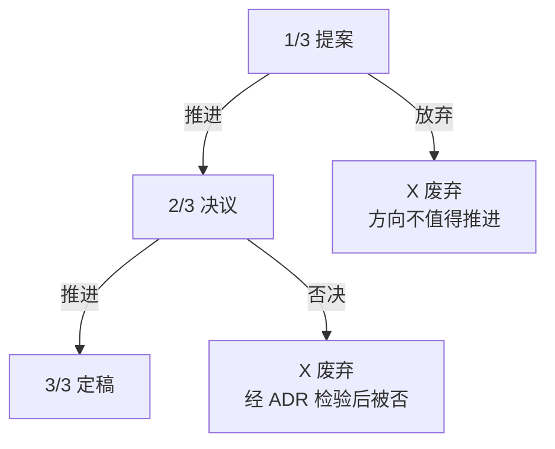
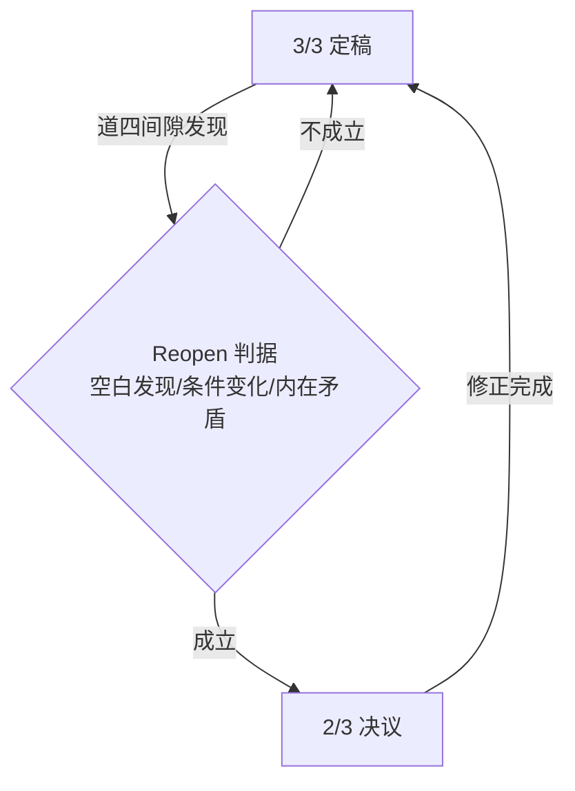
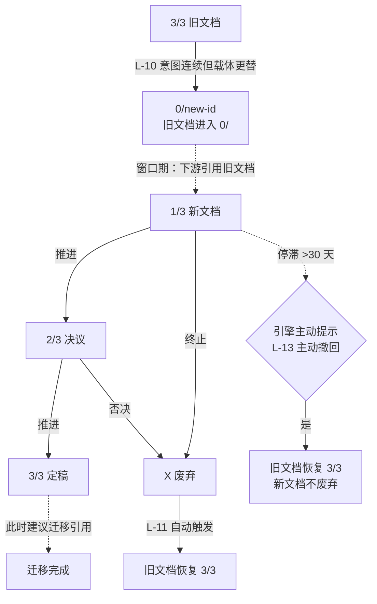

# 司衡文档约定

> 术层文档。定义司衡治理体系中文档的编码格式、目录结构和数据格式约定。
> 法层原则见[《司衡法论》](../philosophy/On-SiHankor-Canon.sih.md)。本文是法的工程展开：不回答"应该遵循什么原则"，只回答"具体怎么操作"。

## 一、stage 编码

### 1.1 编码方案

| 编码 | 编码原理                                                                     |
| ---- | ---------------------------------------------------------------------------- |
| 1/3  | 分数 n/3：序数自明（1/3 < 2/3 < 3/3）                                        |
| 2/3  | 同上                                                                         |
| 3/3  | 3/3 = 1 = 定稿归一                                                           |
| 0/   | 权威归零，后随 successor id |
| X    | ASCII 通用终止记号                                                           |

stage 的中文名称随 nature 而变化，非固定。引擎不依赖 stage 的中文名称做状态判定，仅依赖编码。stage-by-nature 语义见下表：

正向流（1/3 → 2/3 → 3/3）：

| nature                     | 1/3  | 2/3  | 3/3  |
| -------------------------- | ---- | ---- | ---- |
| spec/proposal/decision/reference | 起草 | 审查 | 定稿 |

终止与替换（0/ 与 X）：

| nature                     | 0/   | X    |
| -------------------------- | ---- | ---- |
| spec/proposal/decision/reference | 替换 | 终止 |

### 1.2 编码设计原理

继承自[《司衡法论》$一、stage编码](../philosophy/On-SiHankor-Canon.sih.md#一stage-编码)：

- 分数 n/3：序数关系自明，比自然语言命名更易机械化判定。3/3 = 1，语义为"定稿归一"
- 0/：权威归零，后继 id 紧随 / 后编码。读者看到 stage 即知"意图去了哪里"，无需额外 successor 字段
- X：终结标记，不依赖自然语言命名的状态机标准记号
- 中文/英文名称仅作辅助标注，引擎不依赖名称做状态判定

## 二、id 格式

### 2.1 格式语法

```text
id = YYMMDDHHMM[-NNN]-语义短名
```

| 段          | 含义                  | 示例                |   省略条件   |
| ----------- | --------------------- | ------------------- | :----------: |
| `YYMMDD`    | 创建日期 6 位         | `240610`            |     必填     |
| `HHMM`      | 创建时间 4 位         | `1030`              |     必填     |
| `-NNN`      | 同日同时碰撞序号 3 位 | `001`               | 仅碰撞时追加 |
| `-语义短名` | 人类可验的意图锚点    | `on-sihankor-canon` |     必填     |

### 2.2 设计约束

- `YY` 省略世纪 `20`：司衡文档生命周期以月计，不跨越 2100 年。预设计 75 年后的碰撞是过度规约。若碰撞发生，触发格式的 Reopen
- `-NNN` 仅在同日同时产生多份文档时追加：不为极端情况让所有 id 多扛三位数字
- id 一经分配永久不变：形迹层可追溯性的锚点，改名 = 切断所有历史引用
- id 的唯一职责是引擎内无歧义标识，不承担人类阅读功能。人类通过文件名和 title 定位文档。语义短名段提供最小可验性：写引用时人能确认"我指对了"

### 2.3 时间戳生成规则

引擎生成 id 时，以当前系统时钟为时间戳来源，不依赖文件系统元数据：

```rust
use chrono::Local;
let now = Local::now();
// YYMMDDHHMM → 2406110123
```

事后校验 id 时，仅校验格式（`\d{6}\d{4}(-\d{3})?-.+`），不校验时间戳精确性。id 时间戳是创建时刻的快照记录：人类可读的创建参考。真正的权威时间线在 Git commit 链中：commit timestamp 是分布式共识，不可篡改。

## 三、目录结构

### 3.1 目录命名

| 目录 | 中文 | 用途 |
| ---- | ---- | ---- |
| `specs/` | 系统定义 | 定义系统是什么 |
| `proposals/` | 变更提议 | 论证我们该往哪走 |
| `decisions/` | 决策记录 | 记录为什么这样选 |
| `reference/` | 参照标准 | 术语定义与概念纲要 |
| `knowledge/` | 集体知识 | 未规约化的构思碎片与洞察 |
| `archive/` | 废弃归档 | 已废弃的历史文档 |

`knowledge/` 下分两个子目录：
- `knowledge/drafts/`：构思碎片（非 .sih.md，无 frontmatter，无固定身份）
- `knowledge/notes/`：实践洞察（.sih.md，nature 为 note）

每个目录的详细内容边界见[《司衡法论》$6.2](../philosophy/On-SiHankor-Canon.sih.md#62-目录结构定义)。

### 3.2 目录自定义

文档的语义边界（追问、stage 范围、upstream 语义）是法层定义。目录名是术层约定——在 `.sih/config.yml` 中声明映射即可。引擎从路径第一层推断文档 nature，不依赖目录名硬编码。

```yaml
# .sih/config.yml
paths:
  docs: docs/
  glossary: glossary/
  dirs:
    specs: design
    proposals: rfcs
    decisions: decisions
    reference: reference
    knowledge: knowledge
    archive: archive
```

映射值必须是单层目录名（不含 `/`）。`knowledge/` 和 `archive/` 不建议自定义。

### 3.3 子目录规则

- 所有目录（specs/proposals/decisions/reference/knowledge）均允许子目录，最多三层。knowledge/notes/ 不建议子目录。
- 拆分时机：单目录文件数 > 30。
- 拆分维度：

| 目录 | 维度 | 示例 |
| ---- | ---- | ---- |
| `specs/` | 领域 | `specs/payment/` |
| `proposals/` | 时间 | `proposals/2026/` |
| `decisions/` | 领域 | `decisions/payment/` |
| `reference/` | 领域 | `reference/payment/glossary.md` |
| `knowledge/notes/` | — | 不拆 |

### 3.4 终止文档与归档

- **终止文档（stage X）**：所有目录中 stage X 的文档，迁移至 `docs/archive/{原目录}/{name}.X.md`
- **notes 衰退**：note 的 verified 超过 `review_after_days` → engine 标记衰退警告，降权检索。note 的终止（X）→ `docs/archive/notes/{name}.X.md`

## 四、frontmatter 字段

### 4.1 必填字段

| 字段 | 格式 | 说明 |
| ---- | ---- | ---- |
| `id` | 见 [$二、id格式](#二id-格式) | 文档唯一标识 |
| `stage` | 见 [$一、stage编码](#一stage-编码) | 治理可信度或生命周期状态 |

无需 `type` 字段。文档身份（nature）由所在目录唯一确定：引擎从路径第一层推断。`specs/` 下为 spec，`proposals/` 下为 proposal，`decisions/` 下为 decision，`reference/` 下为 reference，`knowledge/notes/` 下为 note。

### 4.2 upstream 字段

`upstream` 对 note 可选，对 spec/proposal/decision/reference 必填。格式为文档 id：

```yaml
upstream: 240610-1030-on-sihankor-canon
```

引擎沿 upstream 链向上追溯授权源头。领域通过 upstream 链末端推断。

### 4.3 文档身份（nature）

文档身份由所在目录唯一确定。无需 `type` 字段。引擎从路径第一层推断 nature。

| 目录 | nature | stage 语义 |
|------|--------|-----------|
| `specs/` | spec | 可信度（1/3=起草，2/3=审查中，3/3=定稿） |
| `proposals/` | proposal | 可信度（1/3=提案中，2/3=决议中，3/3=已决议） |
| `decisions/` | decision | 可信度（1/3=草拟，2/3=审查中，3/3=定稿） |
| `reference/` | reference | 可信度（1/3=起草中，2/3=审查中，3/3=定稿） |
| `knowledge/notes/` | note | 1/3→2/3→3/3。note 的 stage 表达生命周期成熟度 |

完整语义定义见[《司衡法论》$3.2](../philosophy/On-SiHankor-Canon.sih.md#32-状态定义)。

### 4.4 ADR 签认

ADR 正文为三段式（见 [$4.7、附录格式](#47-附录格式)）。每份 ADR 必须附带签认字段，记录意图源头：

| 字段 | 格式 | 说明 |
| ---- | ---- | ---- |
| `decided-by` | 人名或`ai-assist` | 决策的意图源头。`ai-auto` 不得用于人需决策的 ADR |

签认的两种有效值：

| 值 | 含义 | 顺因链 |
| --- | ---- | ------ |
| 人名 | 人类做出判断，AI 仅辅助记录 | 意图→决策→ADR，完整 |
| `ai-assist` | AI 起草 ADR 建议，人类审核签发 | 意图→AI 表达→人类确认→ADR |
| `ai-auto` | AI 自主决策（**违例**） | 意图缺失，ADR 不应存在 |

签认出现位置：

- 独立 ADR 文档（decisions/）：frontmatter 字段。`decided-by` 仅在 decisions/ 目录下的文档 frontmatter 中出现
- 文档内 ADR（Reopen 声明、Supersede 说明）：ADR 正文尾部一行 `decided-by: {值}`
- specs/、proposals/、reference/、knowledge/notes/ 下的文档：frontmatter 不声明 `decided-by`。`decided-by` 是状态变迁属性，不属于文档状态本身

**几层检测规则。**引擎对 ADR 签认执行以下模式检测，标记可疑但不阻断（检测本身可错：道四）

| 检测规则            | 触发条件                                   | 动作                                                   |
| ------------------- | ------------------------------------------ | ------------------------------------------------------ |
| 同 commit 变更      | ADR 写入与 stage 变更在同一 Git commit     | 标记 `suspicious: adr-and-stage-change-in-same-commit` |
| 签认人-提交人不匹配 | `decided-by` 值与 Git commit author 不一致 | 标记 `suspicious: attestation-committer-mismatch`      |
| 高频 ADR            | 同一签认人在 1 小时内生成 >=5 份 ADR       | 标记 `suspicious: high-frequency-adr`                  |
| 无 GPG 签名         | ADR commit 无 GPG 签名                     | 标记 `info: no-gpg-signature`（非 suspicious，仅提示） |

标记为 `suspicious` 的 ADR 不阻断治理流程，但下游引用者可见此标记：引用者自行判断是否信任此 ADR 的签认

### 4.5 事件记录格式

引擎自动触发的操作不生成 ADR，但生成事件记录。存储于 `.sih/events/{doc-id}.yml`，每文档一个文件，append-only。事件类型包括 stage 变更、检测标记、晋升建议、停滞告警等。

```yaml
# .sih/events/240610-1030-on-sihankor-canon.yml
- event: stage-change
  stage: 1/3→2/3
  decided-by: alice
  rule: Canon$3.3
  evidence:
    refs: [doc-a-id, doc-b-id, doc-c-id]
    dirs: [specs, decisions]
  timestamp: 2026-06-10T14:00:00Z
  commit: abc123def

- event: stage-change
  stage: →0/decayed
  decided-by: sihankor-engine
  rule: Canon$6.2
  evidence:
    exceeded_days: 95
    threshold: 90
  timestamp: 2026-06-10T15:00:00Z
  commit: def456abc

- event: detection
  detection: suspicious-adr
  rule: Canon$4.4
  evidence:
    pattern: adr-and-stage-change-in-same-commit
  timestamp: 2026-06-10T16:00:00Z
  commit: ghi789abc

- event: stall-warning
  rule: Canon$L-13
  evidence:
    successor_id: 240610-1030-new-doc
    inactive_days: 31
    threshold: 30
  timestamp: 2026-06-10T17:00:00Z
  commit: jkl012def
```

字段说明：

| 字段 | 必填 | 说明 |
| ---- | ---- | ---- |
| `event` | 是 | 事件类型：`stage-change`、`detection`、`promotion-suggestion`、`stall-warning` |
| `stage` | 否 | 仅 `stage-change` 事件：变更描述，格式 `原stage→新stage` 或 `→新stage` |
| `decided-by` | 仅 stage-change 人工触发 | 状态变更的决策者。`sihankor-engine` 表示引擎自动触发 |
| `detection` | 否 | 仅 `detection` 事件：检测到的模式标识 |
| `rule` | 是 | 授权此操作的规则引用（Canon 条款或 config.yml 键） |
| `evidence` | 是 | 触发条件的具体证据，随事件类型而异 |
| `timestamp` | 是 | ISO 8601 时间戳 |
| `commit` | 否 | 触发此操作的 Git commit SHA |

事件文件与文档同生命周期：文档晋升清退或 X 归档时，对应事件文件同步移至 `docs/archived/` 下。Git commit message 附简要摘要（`[sihankor] event: stage-change 1/3→2/3 rule: Canon$6.5`），但以事件文件为权威来源。

### 4.6 notes 约定

#### frontmatter

```yaml
id: 240610-1500-auth-edge
verified: 240610
```

notes 位于 `knowledge/notes/`，nature 为 note。核心字段为 id、stage 与 verified。stage 表达洞察成熟度。

#### 生命周期

note 的 stage 表达生命周期成熟度：

- **创建**：AI 或人类创建草稿，verified 为空或初始日期
- **确认**：人类审视后更新 verified 字段为确认日期（格式 YYMMDD）
- **衰退**：verified 超过 `review_after_days` 未更新 → engine 标记衰退警告，降权检索。人可重新审视并更新 verified 解除衰退
- **成熟转化**：当 note 的洞察足够成熟（达到 3/3）时，人创建新的 spec/proposal/decision 文档（有 stage）承载其核心内容。原 note 的 stage 推进至 3/3 表示洞察已充分验证。身份变更（note→spec/decision）创建新文档
- **终止**：人类主动标记 X，迁移至 `docs/archive/notes/{name}.X.md`

详细定义见[《司衡法论》$6.2](../philosophy/On-SiHankor-Canon.sih.md#62-目录结构定义)。

### 4.7 附录格式

附录位于文档末尾，统一收纳 ADR、DEPS 和 SEE-ALSO，按此顺序排列：

```markdown
## 附录

### ADR

{标题}

#### 背景
...

#### 决策
...

#### 后果
...

decided-by: {值}

### DEPS

- 文档 id
  - 说明
  - [文档名](./path)

### SEE-ALSO

- 文档 id
  - 说明
  - [文档名](./path)
```

`DEPS` 与 `SEE-ALSO` 共用三层结构：id（引擎标识）→ 说明（人类阅读）→ 链接（形迹层可追溯）。两者语义区别：DEPS 为上游依赖（被本文直接引用或授权的文档），SEE-ALSO 为同级关联（与本文主题相关的其他文档）。

## 五、glossary 文件格式

### 5.1 文件组织

```text
glossary/
  zh.yml            # 源语言权威定义（term + definition + derives-from + verified）
  en.yml            # 工程通用语映射（mapping + rejected + disambiguation + verified）
```

glossary/ 为可选——无多语言需求的项目不创建此目录。

### 5.2 zh.yml（源语言权威定义）

每个条目的 `derives-from` 指向 reference/ 中的文档 id，建立概念溯源链。engine 通过此链做 join，直接解析 glossary 条目与 reference 文档之间的引用关系。

```yaml
法:
  derives-from: 240610-1030-on-sihankor-canon
  term: 法
  definition: 从道推导的方法论原则。收敛五法：顺因、有度、知止、损补、顺势。
  verified: 240610
```

### 5.3 en.yml（工程通用语映射）

`rejected` 为键值对（被拒词即键，理由即值）。en.yml 不声明 `derives-from`——通过概念键关联到 zh.yml，再通过 zh.yml 的 derives-from 到达 reference/。

```yaml
法:
  mapping: Canon
  rejected:
    Law: "暗示立法起源，法是被推导的而非被制定的"
    Rule: "暗示机械遵守，法需要合道性判断"
  disambiguation: "Canon as canonical rules derived from Tao, not cannon"
  verified: 240610
```

### 5.4 治理模型

#### 因果方向

`specs/` → `reference/` → `glossary/zh.yml` → `glossary/en.yml`。reference 变更必须传播到 glossary，glossary 变更不反向影响 reference。

#### stale 检测

engine 通过 derives-from 链检测过期：zh.yml 条目声明的 derives-from 指向的文档若修改日期晚于条目的 verified，标记 "stale"。

#### 变更分级

| 变更等级 | 触发条件 | 治理流程 |
| -------- | -------- | -------- |
| 映射调整 | 修改 `mapping`、`disambiguation`、`rejected` | 轻量：直接修改 |
| 概念变更 | 修改 `definition`（zh.yml） | 完整：proposals/ → decisions/ |
```

#### 拆分机制

单语言文件超过 50 条时，按机械编号拆分为同语言目录（如 `zh/00-core.yml`）。编号不承载语义分类。拆分后引擎扫描目录树按概念键匹配。同一概念在所有语言目录中位于同编号文件。

### 5.5 引擎 校验规则

| 规则         | 触发条件                                                           | 动作                       |
| ------------ | ------------------------------------------------------------------ | -------------------------- |
| orphan       | 条目 `derives-from` 指向不存在的文档 id（含 successor 链末端无效） | 标记 "orphan"              |
| stale        | `derives-from` 文档的修改日期 > 条目的 `verified`                  | 标记 "stale"               |
| duplicate    | 同语言目录下两个文件出现相同概念键                                 | 标记 "duplicate"，阻断加载 |

## 六、生命周期流程图

以下流程图是对[《司衡法论》$三、生命周期治理](../philosophy/On-SiHankor-Canon.sih.md#三生命周期治理)中 13 条规则的可视化拆解。

### 6.1 主流与终止

L-01, L-02, L-05



### 6.2 修正流

Reopen（L-07, L-08, L-09）



### 6.3 替换流

Supersede（L-10, L-11, L-12, L-13）



## 七、文件名规范

### 7.1 命名格式

```text
文件名 = 语义词-语义词-... .sih.md
```

每个语义词首字母大写（PascalCase），连字符连接。`SiHankor` 保留大写 S 和大写 H。后缀 `.sih.md` 标记文档为司衡治理文档。

示例：

| 文件名                                 | 说明                         |
| -------------------------------------- | ---------------------------- |
| `On-SiHankor.sih.md`                   | 论著：语义词-专名            |
| `SiHankor-Document-Conventions.sih.md` | 术层文档：专名-语义词-语义词 |
| `Arche-The-One-Above-Being.sih.md`     | 元：非 On- 系列              |

### 7.2 约束

- 引擎校验 `.sih.md` 后缀：缺失时建议用户添加，不阻断
- 文件名与 id 的语义短名不强制一致：文件名承载人类浏览意图，id 承载引擎无歧义标识。但引擎在文档创建时建议两者对齐，并在校验报告中标记不一致
- 文件重命名需同步更新所有交叉引用路径

## 八、文档风格约束

> 以下规则由 AGENTS.md 过渡承载，后期由司衡几层（iCT/iCL）在引擎中执行约束。

### 8.1 表格

表格最多 3 列。超过 3 列的信息应拆分为多个窄表，或用加粗标题 + 列表替代。

### 8.2 粗体

粗体（`**`）仅用于关键定义句和关键数据点。正文段落不使用粗体。避免将整段标题级文本用粗体包裹：如需强调段落主题，使用 `###` 子标题。

### 8.3 代码块

所有 fenced code block 必须声明语言：`mermaid`、`yaml`、`json`、`rust`、`text`。空代码块（无语言且无内容）禁止。

### 8.4 水平线

`---` 水平线仅用于 frontmatter 的开始与结束分隔线。正文中禁止使用 `---` 分隔节。节分隔使用 `##` 标题。

### 8.5 字符约束

- Pure ASCII + CJK only。禁止 emoji 和非 ASCII 符号
- 节号标记使用 ASCII 美元符 `$`（U+0024），不使用分节符 `§`（U+00A7）
- 中文连接符使用全角冒号 `：`，不使用 em-dash `--`（U+2014）
- 引号使用 straight quotes `""`，不使用 curly/smart quotes
- 箭头使用 `->` 和 `<-`

### 8.6 引用格式

三种引用场景，格式统一如下。

#### 跨文档引用

```text
[文档名](./path/to/file.sih.md)
[《文档名》$节号、标题](./path/to/file.sih.md#节号-标题)
```

- `《》` 包裹文档中文名或标题
- 路径相对于当前文件，以 `./` 或 `../` 起始
- 含章节定位时，`$节号、标题` 紧接文档名，空格后跟路径

示例：

```markdown
[《司衡法论》](../philosophy/On-SiHankor-Canon.sih.md)
[《司衡法论》$6.2、五目录定义](../philosophy/On-SiHankor-Canon.sih.md#62-五目录定义)
```

#### 本文内引用

```markdown
[$节号、标题](#节号-标题)
[$节号.子节号-标题](#节号子节号-标题)
```

- `$` 后直接跟节号，无空格
- 中文数字节号（如 `$二、标题`）和阿拉伯数字节号（如 `$2.3、标题`）均可，同一文档内保持一致
- 推荐不带字节号的使用中文，有子节号的使用阿拉伯数字
示例：

```markdown
[$二、id格式](#二id-格式)
[$4.3、文档类型](#43-文档类型)
```

附录格式（含 ADR、DEPS、SEE-ALSO）见 [$4.7、附录格式](#47-附录格式)。

### 8.7 ASCII 图禁止

禁止使用 ASCII 文本绘制流程图或结构图。所有流程、关系、结构图使用 Mermaid `flowchart`。

### 8.8 列表

列表最多嵌套 2 层。长内容使用段落而非列表。

### 8.9 中英文混合

推荐同一段落或标签内不混合中英文（如 `engine 建议`、`context（背景）`）。引擎检测到混合时标记提醒，不阻断。标记可通过 `.sih/config.yml` 中的 `style.mix_lang_ignore` 设置为全局忽略。

### 8.10 可读性约定

以下为人类自检的软规范，引擎不自动验证，区别于以上格式约束（引擎可验证）：

- **TL;DR 模式**：每篇文档必须在开篇告知读者"它是什么、谁该读、核心结论是什么"。建议在导言中以一句加粗文本概括核心立场；
- **前置知识机制**：引用外部概念时，在首次出现处附带简短解释或链接，确保读者不需跳转即可理解；
- **术语首次解释**：领域术语在文档中首次出现时必须给出定义或标注其 glossary 引用（如 `glossary:道`）。

## 附录

### ADR

推进至 2/3（决议）

#### 背景

司衡文档约定自创建以来，经过多轮审阅与修正：stage 编码方案简化（移除中英文列、合并 treatise/compendium/mapping 行）、文件命名规范标准化（PascalCase.sih.md）、格式约束自洽性审计（表格、粗体、字符约束、引用格式），以及本节自身按 $8 规则的合规性检验。当前文档内容完整、自洽，无已知格式违规。

#### 决策

推进至 2/3（决议）。文档内容已结构化，核心论点（stage 编码、id 格式、目录结构、frontmatter 字段、glossary 格式、生命周期流程图、文件名规范、文档风格约束）均已稳定。待 引擎 实现后可验证规约可操作性后再晋升 3/3。

#### 后果

- 正向：文档可作为决议供后续引用和实现参考；引擎 开发可据此文档编码
- 风险：部分规约（glossary 引擎 校验、事件记录格式、几层检测规则）尚未经实现验证，可能在 引擎 实现过程中触发 reopen

> 本附录的设计决策由 AI 辅助生成，人类审核确认。

### DEPS

- 240610-1030-on-sihankor-canon
  - 法层授权文档，本文所有规约从法层展开
  - [司衡法论](../philosophy/On-SiHankor-Canon.sih.md)

### SEE-ALSO

- 240602-0900-on-sihankor
  - 总纲：六层脉络定位
  - [司衡论](../philosophy/On-SiHankor.sih.md)
