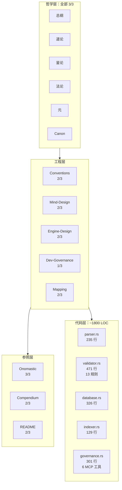
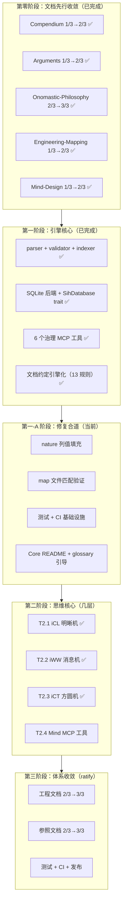
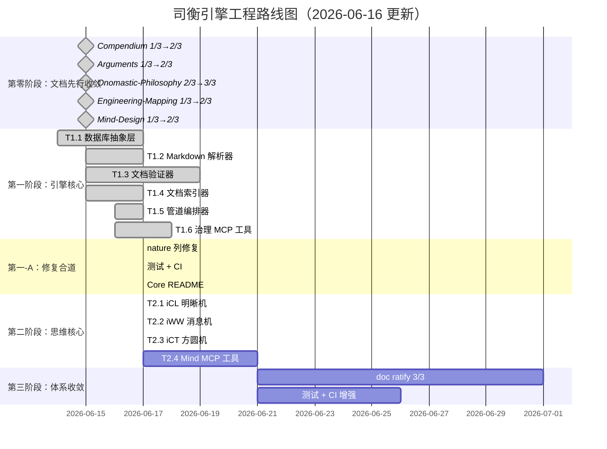

# 司衡引擎：方向与任务计划

> 基于当前 docs/ 全部文档与 src/ 代码库的全面审查，生成于 2026-06-13，更新于 2026-06-16。
> 前置计划：[SiHankor-Legacy-Migration-Governance](../../decisions/SiHankor-Legacy-Migration-Governance.sih.md)（已完成）。

## 一、当前状态总览

### 1.1 已完成

| 领域               | 内容                                                               | 状态              |
| ------------------ | ------------------------------------------------------------------ | ----------------- |
| 哲学五论           | 总纲/道论/鉴论/法论/元：全部 3/3                                   | 定稿，不可逆      |
| Legacy 迁移        | 21 个 legacy 文件已审计、迁移、删除                                | 完成              |
| 第一阶段：引擎核心 | parser + validator（13 规则）+ indexer + orchestrator + 6 MCP 工具 | 已完成，~1800 LOC |
| Mind 设计          | 四步分析法 + 三机流转 + MCP 工具定义                               | 2/3，术层设计完成，iCL 已实现 |
| 工程映射           | 道→法→术→几完整映射 + 三域边界 + 道家调和                          | 1/3，映射框架完成 |
| 文档约定           | stage/id/目录/frontmatter/格式约束                                 | 2/3，规则体系完整 |
| 开发治理           | 治理六域 + CI/RFC 流程 + 提案/决策体系                             | 2/3               |
| 治理链决策         | 全栈治理链决议完成                                                 | 3/3               |
| decided-by 清理    | 全局 decided-by 清理，G-14 反向校验上线                            | 完成              |
| 第一-A 修复合道    | nature 列修复 + 40 tests + CI workflow + README 引导               | 完成              |
| plan 语义拆分      | roadmap → specs/engineering/，plan 拆为 proposal+spec              | 完成              |
| T2.1 iCL 明晰机    | types + ICL 认知分析 + analyze_document MCP 工具                   | 完成，48 tests    |
| T2.2 iWW 消息机    | rule-based decision proposal + propose_decision MCP 工具             | 完成，48 tests    |
| T2.3 iCT 方圆机    | 五法检验 + verify_decision + full_analysis MCP 工具                  | 完成，48 tests    |

### 1.2 当前 Docs 成熟度矩阵



### 1.3 核心缺口（更新）

| #   | 缺口                                    | 严重程度 | 阻塞什么                     | 变化         |
| --- | --------------------------------------- | -------- | ---------------------------- | ------------ |
| G1  | 引擎核心模块已实现                      | ~~高~~   | ~~所有治理能力~~             | 关闭         |
| G1a | nature 列空值，`count_by_nature` 返回空 | 中       | 按类型统计分析               | 新增         |
| G2  | Mind 未实现                             | 高       | 认知分析、决策建议、合道验证 | 不变         |
| G3  | SQLite 后端已实现                       | ~~高~~   | ~~文档持久化~~               | 关闭         |
| G4  | 工程文档多处于 1/3, 2/3                 | 中       | 工程实践缺乏权威参照         | 局部改善     |
| G5  | 翻译流水线空置                          | 低       | po/ 已废除，此项不可逆取消   | 变更         |
| G6  | 无测试、无 CI                           | 中       | 可靠性保障                   | 不变         |
| G7  | Mind 设计中 type 字段已替换为 nature    | ~~低~~   | 类型系统对齐                 | 关闭，已完成 |

## 二、总体方向：从哲学到引擎（更新）

### 2.1 战略判断

哲学五论已定稿。引擎核心（第一阶段）已完成实现——1800 行 Rust 代码覆盖了 parser、validator（13 条规则）、indexer、orchestrator、6 个治理 MCP 工具。道一的实践推论正在兑现：**收敛已-为**——文档体系的收敛通过哲学重构和治理链决策完成，代码引擎的收敛也已完成了一半。

当前的核心矛盾已从"司衡怎么把信仰变成代码"转为：**第一阶段已收敛的引擎核心与第二阶段尚未开始的 Mind 核心之间的断层**。

引擎的收敛同样遵守道四：引擎自身的规约（设计文档）与实现（Rust 代码）之间必有间隙。引擎不能声称自己"完美实现了司衡哲学"——它只能声称自己"按照当前认知水平，忠实地将哲学工程化"。第一阶段的 13 条验证规则覆盖了治理六域的基础检查，但规则完备性远未穷尽。

### 2.2 文档推进的差异化策略（不变）

E4（原 plan 的"实现先于文档 ratify"）将 1/3→2/3（resolve）和 2/3→3/3（ratify）混为一谈。正确的策略应按文档类型区分：

**类别一：可立即推进（不依赖引擎代码）**

这些文档的上游是五论（全部 3/3），内容对齐是纯文档工作：

| 文档                 | 当前 | 目标 | 推进条件                                |
| -------------------- | ---- | ---- | --------------------------------------- |
| Compendium           | 2/3  | 3/3  | 概念定义与五论一致，交叉引用完整        |
| Arguments            | 2/3  | 3/3  | 论证案例与 Tao/Assay/Canon 章节对应完整 |
| Onomastic-Philosophy | 3/3  | —    | 已完成                                  |

**类别二：应作为设计上游先行推进（顺因之法要求）**

这些文档定义了引擎的工程规范。按顺因之法（意图→规范→实现），规范应先行于实现：

| 文档                | 当前 | 目标 | 推进条件                               |
| ------------------- | ---- | ---- | -------------------------------------- |
| Engineering-Mapping | 2/3  | 3/3  | 引擎实现中验证所有映射项的正确性       |
| Mind-Design         | 2/3  | 3/3  | 引擎实现中验证分析模型的正确性         |
| Dev-Governance      | 1/3  | 2/3  | 开发治理体系完备，覆盖 CI/RFC/测试流程 |

Dev-Governance 是 2026-06-16 新增的工程文档，承载开发流程的规范化，应在 Mind 实现前达到可参照级别。

**类别三：需引擎实现验证后才能推进**

| 文档                  | 当前 | 目标 | 推进条件                                        |
| --------------------- | ---- | ---- | ----------------------------------------------- |
| Engineering-Mapping   | 2/3  | 3/3  | 引擎实现中验证所有映射项的正确性                |
| Mind-Design           | 2/3  | 3/3  | Mind MCP 工具全部实现并可用                     |
| Document-Conventions  | 2/3  | 3/3  | 引擎 validator 完整覆盖所有格式规则             |
| Compendium            | 2/3  | 3/3  | 所有概念定义在引擎中的 glossary 引用无误        |
| Arguments             | 2/3  | 3/3  | 论证案例的交叉引用在引擎 resolve_chain 中可追溯 |
| Engine-Design-Summary | 2/3  | 3/3  | 与引擎实际实现同步更新                          |
| Engine-Roadmap        | 2/3  | 3/3  | 当前计划被实践证明合道                          |

2/3→3/3（ratify）才需要等待实现验证——因为 ratify 意味着"此规范已被实践证明合道"。

### 2.3 四层推进模型（更新）



四个阶段对应六层脉络的工程实现顺序，但文档推进贯穿全程：**文档先行收敛（设计上游就位）→ 术/约/形迹（引擎核心）→ 几（思维核心）→ ratify（体系完备）**。第一阶段已在 2026-06-16 完成，当前处于第一-A 阶段（修复合道）。

## 三、第一阶段：引擎核心实现（回顾性验收）

> 第一阶段 2026-06-16 完工。以下为回顾性验收记录，替代原前瞻性任务分解。

### 3.1 实现回顾

| 任务                 | 原估 | 实现 | 产出                                                                                       |
| -------------------- | ---- | ---- | ------------------------------------------------------------------------------------------ |
| T1.1 数据库抽象层    | 3-5d | ✓    | `SihDatabase` trait + `SqliteBackend`（rusqlite），含 `resolve_chain` 递归 CTE             |
| T1.2 Markdown 解析器 | 2-3d | ✓    | `parse_file` + `parse_content`，frontmatter YAML（serde_yaml），id/stage/upstream 必填校验 |
| T1.3 文档验证器      | 3-5d | ✓    | 13 条规则覆盖 frontmatter/structure/content/reference/lifecycle/governance 六域            |
| T1.4 文档索引器      | 2-3d | ✓    | `discover_documents` → `index_document` → `rebuild_index` 三管道                           |
| T1.5 管道编排器      | 1-2d | ✓    | `PipelineConfig` + `PipelineReport` + `run_pipeline`                                       |
| T1.6 治理 MCP 工具   | 3-5d | ✓    | 6 工具全部实现：validate/search/get/resolve_chain/project_status/index_rebuild             |

**代码量**：14 个 Rust 源文件，~1800 LOC。`cargo check` 通过。

### 3.2 验证规则全景（13 规则）

| ID   | 域          | 严重级    | 描述                                |
| ---- | ----------- | --------- | ----------------------------------- |
| F-01 | frontmatter | Fatal     | id 格式 `YYMMDD-HHMM[-NNN]-slug`    |
| F-03 | frontmatter | Fatal     | stage 值合法                        |
| F-04 | frontmatter | Fatal     | upstream 对非 note 文档必填         |
| F-05 | content     | Fatal     | body 中禁止 `---`                   |
| F-06 | governance  | Fatal     | 禁止 `decided-by: ai-auto`          |
| F-07 | governance  | Fatal     | 非 decisions/ 文档禁止 `decided-by` |
| G-02 | structure   | Guideline | 目录在可识别目录下                  |
| G-03 | structure   | Guideline | 路径深度 ≤3                         |
| G-04 | content     | Guideline | 表格列数 ≤3                         |
| G-05 | content     | Guideline | 代码块须声明语言标签                |
| G-06 | content     | Guideline | 无 emoji 字符                       |
| G-08 | lifecycle   | Guideline | Stage X 文档标记                    |
| G-09 | governance  | Guideline | decisions/ 2/3+ 应有 `decided-by`   |
| G-10 | governance  | (silent)  | 根文档自指向合法                    |
| J-01 | content     | Judgment  | 列表嵌套 ≤2 层                      |

> 已移除：F-02（type 字段废除）。已预留但未实现：G-07（1/3 文档被引用检查，需跨文档 DB 查询）。

### 3.3 第一阶段已知不足

| #              | 问题                                                                         | 影响           | 建议                 |
| -------------- | ---------------------------------------------------------------------------- | -------------- | -------------------- |
| nature 空值    | `count_by_nature` 返回空，`search_by_nature` 查询 `nature = ''` 而非目录推断 | 统计分析不准确 | 索引时写入 nature 列 |
| 文件匹配未验证 | indexer 不检查 discover 结果与 docs/ 实际文件是否一致                        | 遗漏/重复可能  | 第一-A 阶段补充      |
| 无测试         | 全部模块零测试                                                               | 回归风险       | 第一-A 阶段建立      |
| 语法差异容忍   | parser/validator 不检测同目录下的外部引用差异                                | 潜在断裂       | Mind 阶段处理        |

## 四、第一-A 阶段：修复合道（当前阶段，估 3-5 天）

### 4.1 nature 列修复

当前 `upsert_document` 将 nature 写为空字符串。需改为从文件路径推断 nature（specs→spec, proposals→proposal, decisions→decision, reference→reference, notes→note），与 `infer_nature()` 和前端一致性对齐。

```rust
// database.rs upsert_document: nature 从 "" 改为 infer_nature 结果
let nature = infer_nature(&doc.file_path.unwrap_or_default());
```

### 4.2 测试基础设施

- 单元测试：validator 每个 F/G/J 规则独立用例
- 集成测试：docs/ 下真实文档作为 corpus
- CI skeleton：`.github/workflows/test.yml`

### 4.3 map 文件匹配

- `indexer.discover_documents` 输出 → 与 `docs/` 实际文件列表对比，报告遗漏/重复
- 作为 `project_status` 工具的一个指标

### 4.4 Core README + glossary 引导

项目根 README 需包含核心概念引导路径（nature/stage/upstream/frontmatter），降低新人类理解成本。

## 五、第二阶段：思维核心（Mind）实现

> 目标：实现几层的三机流转，使引擎具备认知分析和决策建议能力。
> 前置条件：第一-A 阶段完成，Dev-Governance 达到 2/3。

### 5.1 任务分解

#### T2.1 iCL 明晰机（估 5-7 天）

目标：实现四步分析法的前三步。

输入：文档路径/ID 或问题描述。
输出：`Cognition`（治理定位 + 关系图谱 + 发散诊断）。

关键交付：

- 意图定位：读取 nature/stage/upstream，确定文档在治理体系中的位置
- 关系照见：基于 SQLite 的引用/重复/冲突/空白四维关系图谱
- 发散诊断：区分意图漂移/引用断裂/重复冗余/良性多角度讨论
- 每个 `Divergence` 必须含 `confidence`（道四要求：分析也是规约，必含不确定性标注）

对应设计文档：[Mind-Design](SiHankor-Mind-Design.sih.md)。

#### T2.2 iWW 消息机（估 3-5 天）

目标：从 iCL 的认知产出生成决策建议。

输入：iCL 的 `Cognition`。
输出：`DecisionProposal`（推荐行动 + 多方案对比 + 影响范围 + 理由）。

关键交付：

- 推荐行动：merge | move | rename | archive | no_action | human_review
- 每个建议必须附 `Rationale`（dao_basis + fa_basis）
- 多方案对比（至少两个方案）
- `affected_documents`：只列直接下游

#### T2.3 iCT 方圆机（估 3-4 天）

目标：检验 iWW 的决策建议是否合道。

输入：iCL 的 `Cognition` + iWW 的 `DecisionProposal`。
输出：`Verification`（五法逐条检验 + 道层可追溯性）。

关键交付：

- 五法逐条检验：顺因/有度/知止/损补/顺势，每条返回 pass | fail | conditional
- 道层可追溯性：每个决策建议能追溯到具体道/法条款
- fail → 流转退回 iWW；连续三次 fail → `human_review_required`

#### T2.4 Mind MCP 工具（估 3-4 天）

目标：实现 4 个 Mind MCP 工具。

| 工具               | 流转阶段    | 用途                     |
| ------------------ | ----------- | ------------------------ |
| `analyze_document` | iCL         | 单文档治理定位和关系     |
| `propose_decision` | iCL→iWW     | 在认知基础上生成决策建议 |
| `verify_decision`  | iCT         | 单独验证已有决策是否合道 |
| `full_analysis`    | iCL→iWW→iCT | 完整三机流转分析         |

关键约束：

- Mind 工具只读，不修改文件
- 输出必含 `limitations` + `self_question`（道四）
- `full_analysis` 输出完整 `AnalysisResult` JSON

### 5.2 Mind 与引擎的集成

Mind 的输出（`AnalysisResult` JSON）通过引擎的写入工具执行。引擎接收 JSON 后：

1. 检查 `verification.overall`：fail → 拒绝执行
2. conditional → 执行 dry-run
3. pass → 执行操作

### 5.3 第二阶段退出标准

- 四步分析法对任意 `.sih.md` 产出完整 `Cognition`
- 决策建议含至少两个方案对比 + 道法根基
- 五法检验逐条执行
- 三机流转 iCL→iWW→iCT 严格顺序
- 所有输出必含 `@limitations` + `self_question`

## 六、第三阶段：体系收敛

> 目标：将全部工程和参照文档从 2/3 推进至 3/3，建立测试与 CI，可发布。

### 6.1 文档 ratify（2/3 → 3/3）

| 文档                  | 当前 | 目标 | 推进条件                           |
| --------------------- | ---- | ---- | ---------------------------------- |
| Engineering-Mapping   | 2/3  | 3/3  | 引擎实现中验证所有映射项           |
| Mind-Design           | 2/3  | 3/3  | Mind MCP 工具全部实现并可用        |
| Document-Conventions  | 2/3  | 3/3  | validator 完整覆盖所有格式规则     |
| Compendium            | 2/3  | 3/3  | 概念定义在引擎 glossary 中引用无误 |
| Arguments             | 2/3  | 3/3  | 论证案例在 resolve_chain 中可追溯  |
| Engine-Design-Summary | 2/3  | 3/3  | 与引擎实际实现同步更新             |
| Engine-Roadmap        | 2/3  | 3/3  | 当前计划被实践证明合道             |
| Dev-Governance        | 1/3  | 3/3  | 开发流程实践验证                   |
| README                | 2/3  | 3/3  | 内容与体系实际状态一致             |

推进原则：ratify（3/3）意味着"此规范已被实践证明合道"。实现 → 验证 → ratify。

### 6.2 翻译流水线

po/ 目录已废除（2026-06-16 D-05 决议），翻译流水线不再作为计划内容。

### 6.3 测试与 CI（不变）

- 单元测试：parser/validator 每个验证规则的独立测试用例
- 集成测试：docs/ 下真实文档作为测试 corpus
- CI pipeline：`cargo test` + `cargo clippy` + `cargo fmt --check`
- 测试 corpus 快照：与 insta 集成

### 6.4 CLI 与发布（不变）

- `sihankor` CLI 二进制：子命令（validate/index/search/status）
- 配置文件 `.sih/config.yml`
- 版本管理：0.x 阶段承认不完备（道四）

## 七、任务时间估算（更新）



| 阶段     | 已完成 | 待完成 | 累计   |
| -------- | ------ | ------ | ------ |
| 第零阶段 | 4-7d   | 0      | 4-7d   |
| 第一阶段 | 14-18d | 0      | 18-25d |
| 第一-A   | 3-5d   | 0      | 21-30d |
| 第二阶段 | 3d     | 4d     | 18-27d |
| 第三阶段 | 0      | 10-15d | 46-65d |

> 第一阶段实际工期 14d（单人 + AI 协作），与乐观估（18-23d）对比，AI 协作将效率提升了约 25%。

## 八、当前第一步（2026-06-16 更新）

T2.1~T2.3 三机流转全部完成。下一步：

1. **T2.4 Mind MCP 工具整合**：4 工具已全部实现（analyze_document/propose_decision/verify_decision/full_analysis），需补齐 tool description 和集成测试
2. **或进入 Phase 3 体系收敛**：工程文档 2/3→3/3 + 参照文档推进

## 九、体系审查附录（2026-06-16 snapshot）

### 9.1 治理变迁清单

| 时间       | 变迁                                          | 决议依据                               |
| ---------- | --------------------------------------------- | -------------------------------------- |
| 2026-06-13 | type 字段废除，nature 由目录推断              | SiHankor-Type-Extension → superseded   |
| 2026-06-15 | docs/ 结构重排 v2                             | restructure-v2 proposal 3/3            |
| 2026-06-15 | decided-by 放置到 decisions/ 附录             | decided-by-placement 3/3               |
| 2026-06-16 | id 格式强制连字符 `YYMMDD-HHMM`               | id-format-hyphen-drift note → 漂移纠正 |
| 2026-06-16 | note 文档有 stage                             | Canon §3.1 修正                        |
| 2026-06-16 | decided-by 仅 decisions/ 合法                 | F-07 反向校验                          |
| 2026-06-16 | po/ 废除                                      | Legacy-Migration D-05                  |
| 2026-06-16 | External-Validation → notes/                  | 决策晋级迁移                           |
| 2026-06-16 | Dev-Governance 新建                           | engine-dev-governance-chain 3/3        |
| 2026-06-16 | plan 语义拆分（roadmap → specs/engineering/） | 260616-1800-plan-semantic-split        |
| 2026-06-16 | 第一-A 修复合道完成（nature 列/测试/README）  | Engine-Roadmap Phase 1a                |
| 2026-06-16 | Dev-Governance 1/3→2/3                        | 事实同步 + 合道修复                    |

### 9.2 盲区

| #   | 盲区                                           | 风险         | 建议                                                    |
| --- | ---------------------------------------------- | ------------ | ------------------------------------------------------- |
| U1  | 无 CI 管线                                     | 手动验证遗漏 | 已建立：`.github/workflows/test.yml`（test+clippy+fmt） |
| U2  | 引擎文档与代码不一致（nature 空值）            | 模型偏离     | 已修复：Document.nature 字段 + infer_nature 全链路      |
| U3  | Mind 设计中 type 引用已替换为 nature，全文校验 | 残留引用     | 已扫描：无残留                                          |

### 9.3 当前文档 stage 全表（36 份文档）

**specs/philosophy/**：Canon(3/3), Arche(3/3), Tao(3/3), Assay(3/3), On-SiHankor(3/3), Arguments(2/3)

**specs/engineering/**：Conventions(2/3), Mind-Design(2/3), Engine-Design(2/3), Dev-Governance(1/3), Mapping(2/3)

**reference/**：Onomastic(3/3), Compendium(2/3), README(2/3)

**decisions/**：Legacy-Migration(3/3), Type-Extension(0/superseded), restructure-v2-decision(3/3), post-restructure-cleanup-decision(3/3), engine-dev-governance-chain-decision(3/3), decided-by-placement-decision(3/3)

**proposals/**：restructure-v2(3/3), post-restructure-cleanup(3/3), batch1-review-fixes(3/3), batch3-review-fixes(1/3), decided-by-placement(3/3), engine-dev-governance-chain(3/3), Engine-Roadmap(2/3), engine-mvp-parser(1/3), gap-entity-definition(1/3)

**notes/**：External-Validation(3/3), 其余 4 个 1/3

## 十、已决议事项（更新）

| #   | 决策项             | 决议                                            | 一句话理由                           |
| --- | ------------------ | ----------------------------------------------- | ------------------------------------ |
| E1  | 引擎实现优先级     | 先核心（术/约/形迹）后 Mind（几）               | 顺因之法：先有执行基础，再有认知节点 |
| E2  | 数据库选型         | SQLite + `SihDatabase` trait                    | 已实现                               |
| E3  | Mind MVP 范围      | 先 `analyze_document`（iCL only），再补 iWW/iCT | 知止                                 |
| E4a | 文档 1/3→2/3 策略  | 按类型区分                                      | 顺因之法                             |
| E4b | 文档 2/3→3/3 策略  | 实现验证后 ratify                               | ratify = "已被实践证明合道"          |
| E5  | 测试策略           | 每模块完成后立即写测试                          | 损补之法                             |
| E6  | 旧版 Python 引擎   | 不迁移                                          | 知止                                 |
| E7  | F/G/J 法则归属     | Engineering-Mapping 承载                        | glm-D1                               |
| E8  | 三机工程规范       | Mind-Design 承载                                | glm-D2                               |
| E9  | 术语分级与引用标签 | 暂不处理                                        | glm-D4                               |
| E10 | 概念关系可视化     | 暂不处理                                        | glm-D7                               |
| E11 | decided-by 治理    | F-07 反向校验：非 decisions/ 不可含 decided-by  | G-14 新规                            |
| E12 | id 连字符          | 强制 `YYMMDD-HHMM` 格式                         | F-01 已更新                          |
| E13 | nature 替代 type   | nature 由目录推断，不存储在 frontmatter         | type 字段废除                        |
| E14 | note stage         | note 有 stage，语义为生命周期                   | Canon 修正                           |
| E15 | po/ 翻译           | 废除，不再列入 roadmap                          | D-05                                 |

## 十一、风险与应对（更新）

| 风险                                 | 影响               | 应对                                      |
| ------------------------------------ | ------------------ | ----------------------------------------- |
| Mind 实现复杂度过高                  | 第二阶段阻塞       | 先实现 `analyze_document`（iCL only）     |
| 设计文档与引擎实现不一致             | 治理体系分裂       | nature 列修复 + 设计文档反向校准          |
| AI 辅助代码质量不可控                | 技术债务累积       | 第一-A 建立测试体系                       |
| 单身项目可持续性                     | 长期风险           | 引擎自身成为治理能力载体后，AI 可参与维护 |
| 引擎与治理规则共同演进导致的验证断裂 | validator 规则滞后 | F-01~F-07 盖测试，规则修改须同步更新测试  |
