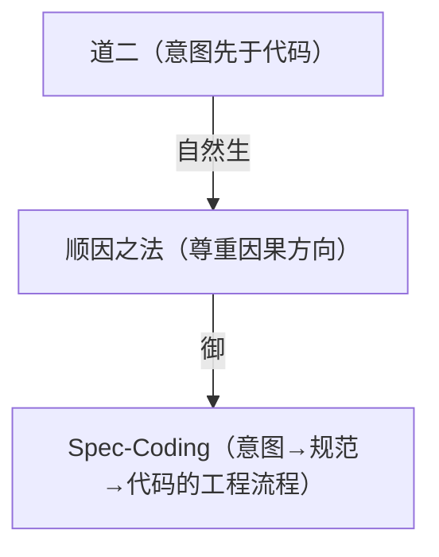

# 司衡工程映射

> 本文档是《司衡哲学纲要》的工程落地对应。纲要定义了"司衡信什么"，本文说明"司衡怎么把信仰变成工程"。三份文档构成完整体系：纲要（定义）→ 论证集（为什么）→ 工程映射（怎么做）。

## 一、哲学到工程的映射总览

| 哲学层                       | 工程实现                             | 映射关系                                                 |
| ---------------------------- | ------------------------------------ | -------------------------------------------------------- |
| 道一（发散自-然，收敛必-为） | 三域边界 + F/G/J 力度梯度            | 发散的不可避免→治理域必须有边界；收敛需主动→力度必须分层 |
| 道二（意图先于代码）         | Spec-Coding + resolve_ref 溯源       | 因果方向→规范先于代码；可追溯→每段代码能追溯到意图       |
| 道三（代码自晦，意图必复）   | iCL 明→晰递进 + @意图标注            | 代码不自明→需要机器辅助恢复意图                          |
| 道四（规约与实现必有间隙）   | @limitations + @deviation + 生命周期 | 间隙不可消除→显式声明不完备；间隙需管理→正规例外路径     |
| 顺因之法                     | F-01/F-02 + Spec-Coding 流程         | 因果方向→代码只能从规范生成                              |
| 有度之法                     | F/G/J 三级力度 + 三域边界            | 恰到好处→不同场景不同力度                                |
| 知止之法                     | idea 类型 + tags 不参与逻辑 + 三域   | 知道不做什么→允许不规约                                  |
| 损补之法                     | 约系从博返约 + iWW 收敛梯度          | 定向调节→减冗余补缺失                                    |
| 顺势之法                     | 三阶段力度梯度 + iWW 阶段感知        | 力度适配→阶段不同力度不同                                |
| 公理一（意图先于代码）       | F-01（代码只能从 ratify 规范生成）   | 公理→硬约束                                              |
| 公理二（层级不可越）         | resolve_ref 只能引用 ratify 级文档   | 公理→引用规则                                            |
| 原则一（力度有别）           | F/G/J 分类体系                       | 原则→力度分类                                            |
| 原则二（单向不可逆）         | propose→resolve→ratify 单向流        | 原则→生命周期                                            |
| 原则三（三机分权）           | iCL/iWW/iCT 各自主权                 | 原则→架构分权                                            |

## 二、道层到法则的完整映射

### 2.1 道一 → 法则

| 法则 | 力度 | 道一依据  | 说明                                           |
| ---- | ---- | --------- | ---------------------------------------------- |
| F-01 | 戒   | 收敛必-为 | 代码只能从 ratify 规范生成——不自动生成就不收敛 |
| F-02 | 戒   | 收敛必-为 | 无上游不得建下游——因果链不能断裂               |
| F-03 | 戒   | 有度      | require 和 spec 不得混行——过度规约=刻意有为    |
| F-08 | 戒   | 有度      | 文档必须在 type 对应目录——规约有边界           |
| G-04 | 规   | 损补      | 同格 ratify 文档不超 3 个活跃版本——损有余      |
| G-06 | 规   | 知止      | tags 不参与逻辑——不是所有信息都需要规约        |
| F-13 | 戒   | 知止      | iCL 不读取未声明路径——治理有边界               |

### 2.2 道二 → 法则

| 法则 | 力度 | 道二依据     | 说明                               |
| ---- | ---- | ------------ | ---------------------------------- |
| F-01 | 戒   | 意图先于代码 | 代码只能从规范生成——因果方向不可逆 |
| F-02 | 戒   | 意图先于代码 | 无上游不得建下游——因果链完整       |
| G-01 | 规   | 顺势         | propose→resolve 推进时限——适时收敛 |

### 2.3 道三 → 法则

| 法则      | 力度 | 道三依据 | 说明                                    |
| --------- | ---- | -------- | --------------------------------------- |
| F-01      | 戒   | 意图必复 | 规范显式化意图——降低恢复成本            |
| G-06      | 规   | 知止     | tags 不参与逻辑——但 tags 可辅助意图恢复 |
| iCL 明→晰 | 架构 | 意图必复 | 明（拆解）→晰（约取）——从代码恢复意图   |

### 2.4 道四 → 法则

| 法则         | 力度 | 道四依据       | 说明                                |
| ------------ | ---- | -------------- | ----------------------------------- |
| @limitations | 规   | 间隙不可消除   | 规范必须声明自身的不完备性          |
| @deviation   | 规   | 间隙需管理     | 偏离必须有强制理由记录              |
| 生命周期     | 架构 | 间隙需持续修正 | propose→resolve→ratify 不是一步到位 |
| 版本演化     | 架构 | 间隙需持续修正 | 规范随认知深化而演化                |

## 三、三机体系的哲学基础

### 3.1 iCL（明晰机）——司判

| 维度     | 内容                                                         |
| -------- | ------------------------------------------------------------ |
| 对应之法 | 顺因（沿因果方向拆解）+ 有度（判读力度适中）                 |
| 对应之道 | 道二（意图→代码的因果链拆解）+ 道三（从代码恢复意图）        |
| 主权     | 认知主权——自己解析、自己约取、自己入库，不委托外部 Agent     |
| 道四约束 | iCL 的解析规则本身是否完备？——不是，iCL 可能解析不了某些结构 |

### 3.2 iWW（消息机）——司驱

| 维度     | 内容                                                         |
| -------- | ------------------------------------------------------------ |
| 对应之法 | 顺势（阶段感知，力度适配）+ 有度（驱动力度梯度）             |
| 对应之道 | 道一（收敛必-为——驱动收敛）                                  |
| 主权     | 策略主权——决定验证力度、驱动/阻断/标记                       |
| 道四约束 | iWW 的策略判断本身是否完备？——不是，某些场景可能无法自动决策 |

### 3.3 iCT（方圆机）——司规

| 维度     | 内容                                                         |
| -------- | ------------------------------------------------------------ |
| 对应之法 | 有度（按力度验证）+ 知止（不验证不该验证的）                 |
| 对应之道 | 道四（验证结果可能错误——iCT 说"通过"不意味着真的没问题）     |
| 主权     | 验证主权——按指定力度执行验证                                 |
| 道四约束 | iCT 的验证规则本身是否完备？——不是，规则有覆盖不到的边界情况 |

### 3.4 三机与道四

道四对三机体系的核心约束是：**三机的输出都不是绝对正确的**。这意味着：

- iCT 的"通过"不等于"没有问题"——可能有规则未覆盖的问题
- iWW 的"阻断"不等于"必须修改"——可能有策略判断错误的场景
- iCL 的"解析"不等于"完整理解"——可能有解析不了的结构

因此，三机体系必须有**人工例外机制**——@deviation 声明及强制理由记录，以及定期的例外审查。

## 四、spec-coding 的哲学定位与边界

### 4.1 spec-coding 在体系中的位置

spec-coding 是顺因之法的最直接体现——它将"意图先于代码"从一个哲学主张变成一个可执行的工程流程。

### 4.2 spec-coding 不是什么

| 常见误解                             | 正确理解                                                                         |
| ------------------------------------ | -------------------------------------------------------------------------------- |
| spec-coding 是道的本身               | spec-coding 是道的镜子，不是道本身——如果未来有更好的意图显式化方式，司衡应能演化 |
| spec-coding 是唯一的术               | DDD、极简架构、契约测试等也是合道之术                                            |
| spec-coding 要求一切代码都从规范生成 | 有度之法——规约恰到好处，不多不少。一次性脚本不需要 spec-coding                   |
| spec-coding 消除了意图和代码的间隙   | 道四——规范与实现之间仍有间隙，spec-coding 缩小了间隙但不能消除                   |

### 4.3 DDD 洞察的归属

DDD 的核心洞察在司衡体系中的归属：

| DDD 概念   | 表面是术     | 深层归属               | 理由                 |
| ---------- | ------------ | ---------------------- | -------------------- |
| 限界上下文 | 模块划分方法 | 顺因之法在映射维的展开 | 代码边界=业务边界    |
| 聚合根     | 数据建模方法 | 有度之法在结构维的展开 | 不变量守恒的边界单元 |
| 领域事件   | 通信模式     | 顺势之法在运行维的展开 | 业务事实的流动单元   |
| 通用语言   | 沟通规范     | 顺因之法在映射维的展开 | 心物同构的语言保障   |
| 事件风暴   | 建模工作坊   | 术层                   | 发现业务因果的方法   |

**结论**：DDD 的洞察属于法层（代码结构=业务结构的治理原则），DDD 的具体实践属于术层（事件风暴、聚合根建模步骤）。司衡应引入 DDD 的法层洞察，不引入 DDD 的方法论绑定。

## 五、三域边界模型的哲学基础

### 5.1 三域与知止之法

三域边界模型是知止之法的工程实现：

| 域       | 知止体现                     | 道四体现                       |
| -------- | ---------------------------- | ------------------------------ |
| 治理域   | 治理在此域内完全管理         | 此域的治理也可能有盲区         |
| 观察域   | 只读——不做不该做的           | 只观察不干预——承认干预可能有害 |
| 不可见域 | 完全不可见——不治理不该治理的 | 承认有看不到的地方             |

### 5.2 scope.yaml 的哲学含义

scope.yaml 不是"自然之道不普遍"的证据——而是道四的工程体现：我们承认不可能治理一切，所以我们明确声明治理什么。未声明 = 不治理，不是"道不覆盖"，而是"认知不覆盖"。

## 六、三阶生命周期的哲学基础

### 6.1 propose→resolve→ratify 与顺势之法

三阶生命周期是顺势之法的工程实现——力度随阶段递增：

| 阶段          | 力度 | 对应的哲学立场                  |
| ------------- | ---- | ------------------------------- |
| propose（议） | 宽松 | 发散自-然——允许发散，不急于收敛 |
| resolve（决） | 中等 | 收敛必-为——需要开始主动收敛     |
| ratify（定）  | 严格 | 有度——收敛到位，可引用          |

### 6.2 "propose 可以死亡"与知止之法

propose 可以死亡——不是所有提议都值得推进。这是知止之法的体现：知道不做什么，比知道做什么更难。

### 6.3 "单向不可逆"与顺因之法

propose→resolve→ratify 单向流动，修正通过叠加而非覆盖——这是顺因之法的体现：因果方向不可逆，只能向前。

## 七、道家思想调和的工程建议

### 7.1 最小必要干预

| 道家原则       | 司衡工程化   | 实现方式                                         |
| -------------- | ------------ | ------------------------------------------------ |
| 无为而治       | 最小必要干预 | F/G/J 力度体系——F 是最小必要干预，G/J 是递减干预 |
| 治大国若烹小鲜 | 不折腾       | 三域边界——不可见域不干预                         |

### 7.2 不确定性元数据

| 道家原则 | 司衡工程化     | 实现方式                                |
| -------- | -------------- | --------------------------------------- |
| 知不知   | 承认认知不完备 | confidence 元数据——标注规则的不确定程度 |
| 涤除玄览 | 清洁反思       | @limitations 声明——显式标注不完备       |

### 7.3 软阈值

| 道家原则 | 司衡工程化 | 实现方式                                      |
| -------- | ---------- | --------------------------------------------- |
| 中道     | 不走极端   | 四级阈值：pass / soft-pass / soft-fail / fail |

### 7.4 临时合规流程

| 道家原则 | 司衡工程化       | 实现方式                                  |
| -------- | ---------------- | ----------------------------------------- |
| 权变     | 特殊情况特殊处理 | @deviation 声明 + 强制理由记录 + 定期审查 |

### 7.5 不确定性元数据

| 维度          | 内容                                                                                                   |
| ------------- | ------------------------------------------------------------------------------------------------------ |
| 是什么        | 在治理规则和验证结果上附加 `confidence`（置信度）和 `impact`（影响面）元数据，标注规则自身的不确定程度 |
| 对应哪条道/法 | 道四（规约与实现必有间隙——治理规则本身也是规约，天然不完整）；知止之法（知道治理的边界）               |
| 工程体现      | iCT 的验证结果附带 `confidence` 标记；引擎在输出时声明"当前判定的置信度为 X，未覆盖的边界情况为 Y"     |

### 7.6 软阈值分级

| 维度          | 内容                                                                                                                                                                      |
| ------------- | ------------------------------------------------------------------------------------------------------------------------------------------------------------------------- |
| 是什么        | 将验证结果的二元判定（pass/fail）扩展为四级：`pass`（通过）、`soft-pass`（有条件通过，标注保留条件）、`soft-fail`（条件性未通过，标注可接受的例外场景）、`fail`（硬阻断） |
| 对应哪条道/法 | 有度之法（治理力度恰到好处——不是所有违规都该硬阻断）；顺势之法（力度适配场景——早期阶段 soft-fail 足以提醒而不断流）                                                       |
| 工程体现      | iCT 验证输出四级结果而非二元；iWW 根据阶段和场景决定 soft-fail 是阻断还是标记                                                                                             |

## 八、sihankor-mind 的哲学约束

sihankor-mind 是按六层脉络进行结构化推理的 MCP 服务器提案。其设计受三个哲学硬约束：

### 约束一：只分析不写入

sihankor-mind 不修改代码和规范——它只提供分析结果。这是顺因之法的体现：机器沿因果方向分析，但不代替人做决定。

### 约束二：只建议不决定

sihankor-mind 的输出是建议而非指令——最终决定权在人类。这是知止之法的体现：机器知道自己的边界，不越权。

### 约束三：只自知不假装

sihankor-mind 必须声明自己的分析不确定性和认知盲区——不假装全知。这是道四的体现：治理工具自身也受道的约束。

### 几层补全

sihankor-mind 提案诊断了当前引擎的关键缺口：**缺失几层**——引擎从问题直接跳到工具，没有经过道→法→术→几的结构化推理。补全几层意味着：

1. 遇到问题时，先识别它属于哪个道（道一~道四的哪一条）
2. 确定应该遵循哪条法（顺因·有度·知止·损补·顺势）
3. 选择对应的术（spec-coding / 三机 / F/G/J）
4. 在几层执行，产出形迹

工程设计规范见 [《司衡思维核心（Mind）设计规范》](./SiHankor-Mind-Design.sih.md)。

## 九、哲学-工程映射速查表

| 哲学概念 | 工程实体                           | 映射方式                              |
| -------- | ---------------------------------- | ------------------------------------- |
| 道一     | 三域边界、F/G/J 力度体系           | 发散不可根除→治理必须有边界和力度梯度 |
| 道二     | Spec-Coding、resolve_ref           | 因果方向→规范先于代码、可追溯         |
| 道三     | iCL 明→晰递进、@意图标注           | 代码不自明→机器辅助恢复意图           |
| 道四     | @limitations、@deviation、生命周期 | 间隙不可消除→显式声明+正规例外路径    |
| 顺因     | F-01/F-02                          | 因果方向→代码只能从规范生成           |
| 有度     | F/G/J 三级力度                     | 恰到好处→不同力度                     |
| 知止     | idea 类型、三域、propose 可死亡    | 知道不做什么→允许不规约               |
| 损补     | 约系从博返约、iWW 收敛梯度         | 定向调节→减冗余补缺失                 |
| 顺势     | 三阶段力度梯度                     | 力度适配→阶段不同力度不同             |
| 公理一   | F-01                               | 意图先于代码→代码只能从规范生成       |
| 公理二   | resolve_ref 引用规则               | 层级不可越→只能引用 ratify 级         |
| 原则一   | F/G/J 分类                         | 力度有别→三级分类                     |
| 原则二   | propose→resolve→ratify             | 单向不可逆→单向流                     |
| 原则三   | iCL/iWW/iCT 分权                   | 三机分权→各自主权                     |
