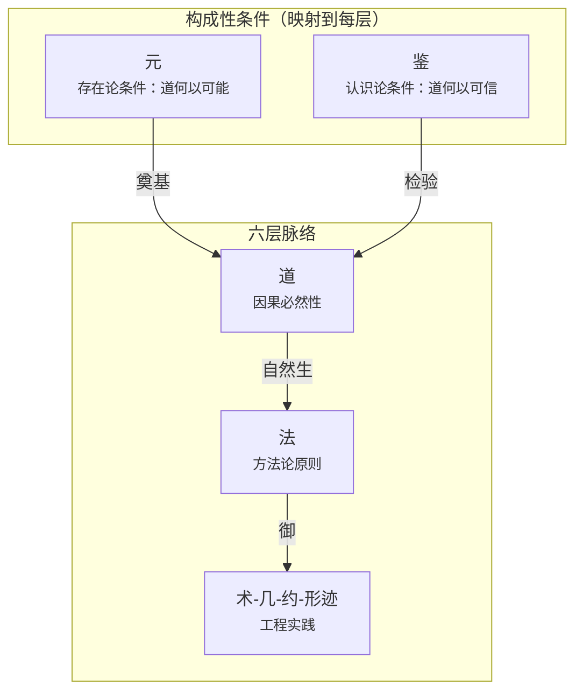
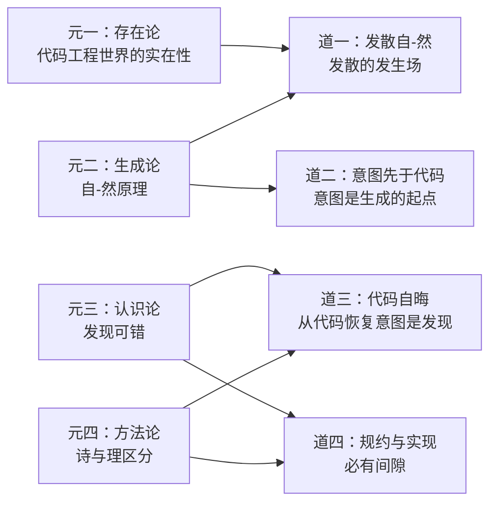

# 元

> 元者，道之所由立也。

元不是六层脉络之上的"第七层"——它是使道得以被发现、被检验、被确立的构成性条件之总和。元不在脉络中，但映射到脉络的每一层。

道是"被发现的"因果必然性。但发现本身需要条件：需要一个真实存在的代码工程世界（道在其中显现），需要一种生成原理（道从世界的运作中涌现），需要一种认识能力（人类理性能够识别道），需要一套方法论标准（能够区分真道与伪道）。这些条件，就是元。

本文非论元——元不在论域内。元不可名而名：它在整个司衡体系的工程实践的沉默呼应中浮现，我们为其立名不是要论证它，而是要梳理道从何而来。"不可名而名"与"名而定体"不矛盾：命名是工程操作的需要——使元可被引用、讨论、检验——不改变元先于理的性质。正如给风暴命名不改变风暴是自然力，给元立名不使其沦为论域中的概念。

## 一、破题：何为元

### 1.1 元在司衡体系中的位置

元不是论的对象——论以理辨，元先于理。元在司衡体系中的浮现，并非来自纯哲学推演，而是在工程实践的反-复追问中沉默地到来：当我们追问"道何以能被发现""鉴何以能区分真伪"，这些追问本身已经指向了某个使追问得以可能的条件域。对此条件域的梳理，就是本文的意图——不为论证元，而为明道之由来。

司衡的完整架构中，元与鉴是两翼——不在六层脉络中，但使六层脉络成为可能：

六层脉络（道→法→术→几→约→形迹）是司衡的"内容"——它回答"代码工程世界中的因果必然性是什么，依据这些必然性应该怎么行动"。但脉络的存在本身就需要回答更根本的问题：这个"内容"的存在条件是什么？

- 元回答"道何以可能"：道的发现需要真实世界、自-然原理、人类理性、方法论标准
- 鉴回答"道何以可信"：道的每一个主张都必须经得起反推检验、能设定可证伪条件

两者一为存在论奠基，一为认识论奠基，共同构成司衡的双重自觉。

### 1.2 元与道的根本区别

| 维度         | 元                             | 道                                     |
| ------------ | ------------------------------ | -------------------------------------- |
| 性质         | 构成性条件：使道得以可能的条件 | 因果必然性：在代码工程世界中成立的规律 |
| 追问         | 道何以可能？                   | 为什么会有这个矛盾？                   |
| 在脉络中     | 否：映射到每一层，但不在脉络中 | 是：六层脉络的第一层                   |
| 可否独立检验 | 是：元四的自指检验             | 是：反推九段式 + 可证伪条件            |
| 数量         | 四元                           | 四道                                   |
| 变更频率     | 极低：元变则体系重构           | 低：新道被发现需极强证据               |

关键区分：元是"条件"，不是"超级道"。元不取代道，不高于道——它回答的是不同层次的问题。正如物理学不回答"因果性本身是什么"，道学也不回答"道何以可能"——那是元的追问。

### 1.3 元与鉴：双重自觉

元（存在论奠基）和鉴（认识论奠基）不是上下级关系，而是平行的两翼：

| 维度     | 元                                | 鉴                                 |
| -------- | --------------------------------- | ---------------------------------- |
| 奠基类型 | 存在论：道何以可能                | 认识论：道何以可信                 |
| 核心追问 | 道的发现需要什么条件？            | 一个主张凭什么进入道层？           |
| 核心概念 | 实在性、自-然、可错性、诗与理区分 | 反推九段式、可证伪条件、诗与理区分 |
| 工程展开 | 公理体系                          | 反推检验流程                       |
| 自指要求 | 元四本身必须可证伪                | 鉴的方法本身必须经得起鉴的检验     |

元四（方法论之元）是元与鉴的交汇点：元四确立了"诗与理"的区分作为道的准入门槛，鉴将这一哲学立场展开为可操作的反推九段式检验流程。详见[《司衡鉴论》$7.1](./On-SiHankor-Assay.sih.md#71-鉴与元方法论之元元四的工程展开)。

### 1.4 公理体系：元在体系中的投射

公理体系是元在司衡体系中的第一个显性投射。公理独立于六层脉络而存在——它们不是道，不是法，而是体系自身的构成性约束。

公理体系分为两层：

**核心公理**：从元直接投射，承载因果必然性，修改需推翻因果必然性主张。

- 公理一：意图先于代码。任何代码被写出之前，写它的人一定先有一个意图。投射自元一（存在论：代码工程世界的实在性）和元二（生成论：意图是代码得以生成的源头）。
- 公理二：层级不可越。治理链中的因果关系不可逆转：上游决定下游，下游不逆定上游。投射自元二（自-然：发散的因果方向不可逆）和道二的因果方向。

**衍生原则**：从法层推导，是工程经验的凝练，修改需工程验证。以下原则不属于元层，此处仅列不展开：力度有别、单向不可逆（已被 Canon $三修正模型取代）、三机分权。

公理体系与道层的关系：公理一"意图先于代码"同时也是道二的另一种表述——这是公理体系与道层重叠之处。重叠不是冗余：公理是体系自身的构成性约束，道是被发现的因果必然性。同一命题从两个角度被锚定——公理角度说"体系必须这样构造"，道角度说"世界本来就是这样"。

## 二、四元

### 2.1 元一：存在论之元

**定义**：代码工程作为人类实践领域而存在。道的存在以代码工程世界的存在为前提——无此世界则无此道。

代码工程世界不是抽象概念，而是由真实的业务需求、真实的技术环境、真实的认知源构成的实在。这个世界持续变化——这是发散的终极驱动力，也是道永远有新内容可供发现的根本原因。

#### 命题结构

元一是元层唯一的存在论命题——它不描述世界内部的事态，而是断言"这个世界存在"本身。

| 维度     | 内容                                                                          |
| -------- | ----------------------------------------------------------------------------- |
| 命题类型 | 存在论断言：代码工程世界作为人类实践领域是实在的                              |
| 不是     | 经验断言（可通过数据证实或证伪）、定义（词语约定）                            |
| 检验方式 | 间接检验：如果这个世界不存在，道一"发散自-然"将没有发生场——但发散确实被观测到 |
| 实践含义 | 治理力度不由治理者的意志决定，而由被治理世界的条件决定                        |

#### 在体系中的映射

- 投射为公理一"意图先于代码"：意图是代码工程世界中的基本事实——代码不是自生的，是人写的
- 支撑道一"发散自-然"：发散需要发生场——这个场就是代码工程世界
- 支撑鉴的认识论立场：检验不是纯逻辑游戏，检验的对象是真实世界中的主张

### 2.2 元二：生成论之元

**定义**："自-然"——自己如此——是道之生成的根本原理。在多认知源参与代码工程的条件下，各个认知源按照各自的理解运作，发散"自己如此"地涌现，不需要外力推动。收敛不能"自-然"发生——收敛需要外力的介入。

#### 命题结构

| 维度     | 内容                                                                     |
| -------- | ------------------------------------------------------------------------ |
| 命题类型 | 生成论原理：描述事物如何从世界的运作中涌现                               |
| 类比     | "自-然"之于道，如"因果性"之于物理学定律——使规律成为可能，自身不是规律    |
| 不是     | 道（因果必然性）——自-然是道的生成条件；法（行动原则）——自-然不是行动指南 |

#### 关键属性

| 属性       | 含义                                                                       |
| ---------- | -------------------------------------------------------------------------- |
| 自发性     | 发散自己发生，不需要人推动                                                 |
| 非决定性   | "自-然"不强迫任何事情发生，而是描述事情如何自己发生                        |
| 条件依赖性 | 多认知源 + 无治理干预是发散自-然显现的条件场                               |
| 不可根除性 | 只能被相反力（治理）对抗，不能从外部消除——只要认知源 > 1，发散就会自己涌现 |

#### 在体系中的映射

- 直接支撑道一"发散自-然"的前件——"发散自己发生"不是经验归纳，是自-然原理的必然推论
- 支撑道二"意图先于代码"——意图是生成的起点，代码是生成的产物，因果方向不可逆
- 投射为公理二"层级不可越"——治理链的因果方向不可逆，因为自-然的方向就是不可逆的
- 为知止之法提供元层依据：发散不可根除，因此治理不可能也不应该消除所有发散——知止不是"偷懒"，是承认生成论现实

### 2.3 元三：认识论之元

**定义**：道是"被发现的"——但发现不是自动的，也不是完备的。人类理性通过观察、反推检验、概念区分、可证伪条件设定等方法，将直觉式的工程观察转变为可检验的因果必然性主张。

#### 发现的四个特性

| 特性       | 含义                                                                                   | 工程例证                                             |
| ---------- | -------------------------------------------------------------------------------------- | ---------------------------------------------------- |
| 渐进性     | 发现不是一次性的——对道的理解随检验的深入而精确化                                       | 道一从"收敛必然"到"收敛必-为"的校准                  |
| 可错性     | 被 ratify 的"发现"仍可能在后续反推中被校准——ratify 不是认知终点                        | 五维天道 21 条主张经鉴检验，0 条幸存                 |
| 方法依赖性 | 发现需要特定的方法论条件——反推检验、可证伪性设定、概念区分。没有这些方法，发现只是直觉 | 道三的发现依赖于代码考古学方法——从代码逆向恢复意图   |
| 不可完备性 | 任何时候都可能存在尚未被发现的因果必然性——道的发现永远在进行中                         | 四道是当前已知的道，不代表只有四条——未来可能发现新道 |

#### 可错性在治理中的核心地位

元三的可错性是司衡生命周期修正机制的元层依据。法论 L-07（Reopen）和 L-10（Supersede）的哲学根基在此：如果发现是不可错的，ratify 就是认知终点——不需要 Reopen，不需要 Supersede。正因为发现可错，治理体系才必须包含正规的修正通道。

可错性与道四（规约与实现必有间隙）形成双重认识论自觉：

| 元三（发现论）             | 道四（工程论）              |
| -------------------------- | --------------------------- |
| 发现道的过程不完备         | 将道工程化的过程不完备      |
| 被 ratify 的认知仍可被校准 | ratify 的规约与实现仍有间隙 |
| 需要 Reopen 回到决议阶段   | 需要损补持续修正            |

两者的共同结论：司衡不是一个声称自己完备的体系，而是一个承认不完备但持续收敛的体系。

#### 在体系中的映射

- 为法论 L-07（Reopen）、L-08（Reopen 证据要求）、L-10（Supersede）提供元层依据
- 支撑鉴的反推九段式：九段式之所以必要，正是因为发现不是一次性的——需要系统的检验流程
- 为顺势之法提供认识论基础：不同阶段不同力度——因为早期的认知天然更不完整，需要保护探索

### 2.4 元四：方法论之元

**定义**：一个主张进入道层，不是因为它"听起来深刻"——而是因为它能被反推检验、被设定可证伪条件、被区分于纯粹的诗意修辞。

#### 诗与理的区分

| 维度   | 诗                       | 理                               |
| ------ | ------------------------ | -------------------------------- |
| 性质   | 不可证伪的修辞策略       | 可被检验的论证策略               |
| 判据   | 无法指明什么证据会推翻它 | 可以设定可证伪条件               |
| 示例   | "接口是代码世界的无"     | "代码自晦，意图必复"             |
| 在道层 | 不能进入——再深刻也是诗   | 可以进入——但必须通过鉴的全部检验 |
| 在法层 | 不能作为法的推导依据     | 可以作为法的推导前提             |

诗不是无价值的——诗可以启发思考、凝聚共识、传递愿景。但诗不能作为道层主张——因为诗无法被检验，而道的生命在于可检验性。

#### 自我指涉

元四本身也必须经得起元四的检验：可证伪标准本身必须是可证伪的。否则元就变成了自己所要防止的东西——一个不可检验的终极真理。

自我指涉检验追问：

1. "诗与理的区分"本身是诗还是理？它是理——因为它可以被检验：如果存在一种方法论，它不依赖可证伪条件却能持续产出比鉴更可靠的道层判决，则元四被推翻。
2. 可证伪标准是可证伪的吗？是——如果发现"诗与理"的区分在工程实践中无法应用（区分结果不收敛、或区分出的"理"在实践中被持续推翻），元四不成立。

详见[《司衡鉴论》$6.2](./On-SiHankor-Assay.sih.md#62-案例二元四的自我指涉检验)。

#### 在体系中的映射

- 鉴是元四的工程展开——元四确立了"诗与理"区分的哲学立场，鉴将其展开为反推九段式
- 为有度之法提供方法论基础：规范力度应有别——因为不同主张的可检验性不同
- 五维天道的证伪是元四在实践中最具说服力的验证：21 条子主张经九段式检验，0 条完好幸存，证明这套方法论确实具有区分力

## 三、元与道的生发关系

### 3.1 元如何使道成为可能

元不是"产生"道——元是道得以被发现的必要条件。四元在四道的发现中各司其职：

逐道说明：

- 道一"发散自-然，收敛必-为"：元一提供了发散的发生场（代码工程世界），元二提供了发散的发生原理（自-然）。如果没有元一和元二，"发散"只是一个经验观察，不是必然性。
- 道二"意图先于代码"：元二（自-然的因果方向）支撑了因果链的不可逆性。意图→代码的方向不是工程惯例，是自-然原理在代码生成中的具体显现。
- 道三"代码自晦，意图必复"：元三（发现可错、方法依赖）解释了为什么恢复意图需要方法——代码考古学。元四（诗与理区分）确保恢复出的"意图"是可检验的，不是臆测。
- 道四"规约与实现必有间隙"：元三（发现不可完备）解释了为什么规约永远无法完全覆盖实现——因为我们对道的发现永远在进行中。元四（诗与理区分）确保"间隙"本身是可检验的——可以指出具体的间隙在哪里。

### 3.2 四元在法中的映射

五条收敛之法同样以四元为构成性条件：

| 法   | 元层依据                                            |
| ---- | --------------------------------------------------- |
| 顺因 | 元二（自-然的因果方向不可逆）+ 元一（意图是实在的） |
| 有度 | 元一（治理力度由被治理世界的条件决定）              |
| 知止 | 元二（发散不可根除）+ 元三（发现不可完备）          |
| 损补 | 元三（发现可错→需要修正）+ 元四（修正需要方法）     |
| 顺势 | 元三（认知渐进→力度应适配认知阶段）                 |

### 3.3 元与道的循环关系

元与道之间并非单向奠基。公理体系的悖论性位置揭示了这种循环：公理体系独立于六层脉络（元层次特征），但公理一"意图先于代码"本身是道层内容。公理一既是道，公理体系又在道之上——这不是逻辑缺陷，而是自指性的必然表现。类似地，"知止"从道一派生为法层原则，却又反过来声明了道的认识论不完备——道的某条内容反过来规定了道本身的认知条件。

这种循环是包含了认识论反思的哲学体系的必然特征。当体系能够对自己的认识条件做出声明时（"我不完备"、"我可能犯错"），元与道的边界就必然是模糊的——因为认识论反思本身就是在元层次和对象层次之间来回移动的。司衡接受了自指循环，同时获得了自我认识和自我修正的能力。

### 3.4 元与道的不对称

尽管存在循环，两者之间有一个根本的不对称：

|                | 元（构成性条件）                   | 道（因果必然性）               |
| -------------- | ---------------------------------- | ------------------------------ |
| 被司衡正式命名 | 是（经过显性化过程）               | 是（六层脉络明确命名）         |
| 被反推检验     | 是（元四的自指检验）               | 是（道的内容经系统反推检验）   |
| 被 ratify      | 本文推进中                         | 已 ratify                      |
| 可被经验观察   | 否（元条件不在经验世界中直接呈现） | 是（道可通过经验现象间接观察） |

这个不对称记录了历史的真实顺序：司衡先发现道，再追问发现的条件。

## 四、元的检验

### 4.1 元四的自指检验

元的最严格检验来自元四的自指要求：方法论之元本身必须经得起方法论的检验。元四不能被神化为不可检验的终极真理。

检验流程：

1. 将元四的"诗与理区分"应用于元四自身——它是诗还是理？
2. 设定元四的可证伪条件：如果存在一种不依赖可证伪条件的替代方法，能持续产出比反推九段式更可靠的道层判决，则元四被推翻
3. 检验历史记录：五维天道 0/21 幸存证明了反推九段式确实具有区分力
4. 持续监控：如果未来反推九段式持续产出无区分力的结果（所有主张都通过或都不通过），则元四需要重新审视

可证伪条件的具体表述：

| 条件 | 内容                                                                                                                                                                    |
| ---- | ----------------------------------------------------------------------------------------------------------------------------------------------------------------------- |
| F1   | 如果元一至元四中任何一个要素的核心主张被证明为伪（如：元二"自-然"原理被证明在代码工程中不适用——发散不是自己发生的，而是每次都需要外部推动），则该要素需被移除或重新校准 |
| F2   | 如果元被证明为冗余——所有被元覆盖的理论功能都可以被道或公理体系替代而无任何理论损失——则元作为一个独立概念不需要存在                                                      |
| F3   | 如果将元纳入体系后，并未产生 $六 所述的实践后果——治理决策没有更精准、方法论自省没有更形式化——则元的显性化可能只是不必要的概念增殖                                       |

### 4.2 元一、元二、元三的间接检验

元一~元三不是可直接检验的经验命题——它们是构成性条件，不是因果必然性。检验是间接的：

| 元   | 间接检验方式                                                                                 |
| ---- | -------------------------------------------------------------------------------------------- |
| 元一 | 如果代码工程世界不存在，道一的发生场不存在——但发散确实被观测到，故元一成立                   |
| 元二 | 如果在多认知源+无治理条件下不出现发散，自-然原理不成立——但历史观察持续支持发散自-然发生      |
| 元三 | 如果存在一条道被一次性完美发现且从未需要修正，可错性不成立——但道一的校准历史证明发现是渐进的 |

这些检验不是一次性的——它们是持续开放的。任何新的工程观察都可能触发对元的重新审视。

### 4.3 元的可修正性

元是最稳固的层次——因为它是构成性条件，不是经验发现。修正元的门槛高于修正道、远高于修正法。

修正元的判据：

- 发现新的构成性条件（如识别出当前四元未覆盖的条件）——这是扩充，不是否定
- 发现现有元的推导有逻辑断裂——这需要指出具体断裂点
- 发现元层的自指矛盾——如元四无法通过元四的检验

元的修正不是 Reopen——因为元不在六层脉络中，不适用文档生命周期规则。元的修正意味着体系重构——整个道-法-术体系需要重新审视其元层基础。这是极罕见的操作，需要比道层证伪更强的证据。

## 五、元的历史：从隐性到显性

> 本节记录元从"在而不名"到被正式识别和命名的历史过程。它是元三（发现渐进性）在元自身历史中的体现。

### 5.1 "在而不名"的六条证据

在司衡体系的早期构建中，元已经在执行不可替代的理论功能——为道的合理性提供根基、为道的可发现性提供理由、为道的可修正性提供保障——但它处于"被使用但未被命名"的状态。以下六条证据记录了元的隐性在场：

**证据一：公理体系的独立存在。** 公理体系独立于六层脉络而存在，不属于道-法-术-几-约-形迹中的任何一层。公理一"意图先于代码"的内容就是道，但公理体系承载了"发现而非规定"这一元层次声明。这个"结构裂缝"是元在体系结构中的第一次出现——作为一个无法被六层脉络容纳的独立结构。

**证据二："发现而非发明"是元层次主张。** "这不是规定，而是发现"——这个声明本身不是道的内容，而是关于"道是以什么方式被建立"的元层次判断。更深一层：司衡对"在被发现之前，因果必然性是否存在"这一形而上学经典问题保持了正确的沉默——它只断言"存在可发现的规律"，而不进一步追问规律的存在论地位。这个刻意不追问的决定本身就是元层次追问的在场证明：一个体系之所以需要"沉默"，恰恰意味着该问题已被识别并被认为超出了当前体系的合法边界。这个边界暗示了使"发现道的认识论条件得以成立"的维度——元。

**证据三："诗与理"的区分是道层主张的筛选标准。** 五维天道 FAL 中，"诗与理"的区分直接决定了哪些主张进入道层、哪些被排除。这个区分标准本身不是道——它是关于"什么构成一个合格的道层主张"的元标准。

**证据四："知止"之法对认知边界的声明。** "知止"声明了"发现的不完备性"——这是一个关于"我们能知道什么"的认识论元判断，它约束的不是代码工程本身，而是司衡对代码工程的认知活动。

**证据五："自-然"作为生成原理不属于任何一条特定的道。** "发散是自-然的"是一条道，但"自-然"作为万物"自己如此"的运作原理，比任何一条特定的道更根本——它解释了道本身的生成方式。

**证据六：区分"发现"与"回应"的元标准被识别为缺失。** 体系能操作"发现"和"回应"的区分，但缺乏判断"发现之为发现"的元标准——这个识别到的缺口本身证明元层次追问已经实际在场。

### 5.2 从"在而不名"到"名而定体"

一个概念从隐性走向显性，需要满足五个条件。"名而定体"不改变元的性质——命名是工程引用的需要，元先于理的地位不因被命名而动摇。

| 条件                     | 含义                               | 本文的对应                                 |
| ------------------------ | ---------------------------------- | ------------------------------------------ |
| 概念的内涵已被清晰界定   | 核心含义不再分散，无需读者自行拼凑 | $二：四元的统一定义与精确定义              |
| 概念的外延边界已被划定   | 包含什么、不包含什么是明确的       | $一.2：元与道的边界；$一.4：元与公理的边界 |
| 概念在体系中的位置已确定 | 在司衡层级结构中的定位             | $一.1：不在脉络中但映射到每层              |
| 概念具有独立的命名       | 有可引用的标识符                   | Arche，代号 arche-the-one-above-being      |
| 概念的实践后果可被追溯   | 从概念出发可推导对治理实践的指导   | $六                                        |

### 5.3 元不在脉络但映射到每一层

元不是第七层脉络，但作为构成性条件，与六层脉络的每一层都有映射关系：

| 六层脉络          | 元在此层的映射                                          |
| ----------------- | ------------------------------------------------------- |
| 道                | 元一（道扎根于代码工程世界）+ 元二（道从"自-然"中涌现） |
| 法                | 元三（法从道的发现中推导）+ 元四（法必须可检验）        |
| 术（spec-coding） | 元三（术是方法论的工程化）+ 元四（术的选择需可证伪）    |
| 几（三机）        | 元三（三机的认知活动依赖发现的方法论条件）              |
| 约（约系）        | 元四（约取的标准需区分"有效的结构提取"和"任意的简化"）  |
| 形迹              | 元一（形迹是代码工程世界实在性的可观测证据）            |

## 六、元的实践含义

### 6.1 治理决策的元层次检验

道说"收敛必-为"（所有代码工程中收敛需要治理），元说"必-为的力度依赖于代码工程世界的具体条件"。两者结合，治理决策从普遍原则走向具体场景。

实例：在单人维护的遗留项目中应用完整 F/G/J 体系。道层追溯——"收敛必-为"。元层次检验——元一：该项目只有 N=1 认知源，业务变化几乎为零，发散程度远低于多认知源项目；元二推论：发散在 N=1 条件下"自-然"程度极低，收敛力度可相应降低。元校准后——维持 F 级硬约束，降低 G 级软引导力度。

### 6.2 方法论自省的形式化

反推检验是区分道与伪道的工具，但这工具本身有两种可识别的偏差：

**偏差 A**：将反推检验的失败等同于主张的真值为假——忽略了检验者构建最强反证的能力限制。元三声明了发现的可错性：反推检验的结果不是二元真值，而是"在当前条件和当前最强反证下，未被推翻"——一个带有方法论条件的结果。

**偏差 B**：将通过的检验等同于主张的终极真理——忽略了"经得起"不等于"在一切条件下成立"。元三声明了发现的不可完备性，元四要求可证伪条件：如果一条道无法指明什么证据会推翻它，它就不符合元四的标准。

### 6.3 道层校准的合法化

从"发散自然，收敛必然"到"发散自-然，收敛必-为"的校准，不是"原来的道错了"——是元三（发现的渐进性）的正常运作。原命题不是错误，是发现过程中的一个阶段。它的不完备在后续反推中被识别，它的表述在更精确的概念分析中被校准。这个"识别→校准"过程不是否定发现，而是深化发现。

### 6.4 一条边界

元的显性化是起点，不是终点。四元可以在后续反推检验中被校准，元的实践意义可以在更多治理场景中被验证或否定。"定体"之"定"是"有确定的形式可以讨论和检验"，不是"已达到不可修正的终极形态"。这条边界本身是元四（可证伪标准）在本文中的自我指涉实践。

## 附录

### ADR

追溯性定稿确认

#### 背景

本文从 legacy/ 中提取哲学遗产并重建为独立元文档。经与四道完整性对照、公理体系一致性检验及跨文档引用对齐后认定内容完整。

#### 决策

确认为 3/3（定稿）。元为构成性条件而非可论证命题，不适用道层的反推检验框架。

#### 后果

- 正向：为四道提供元层依据
- 风险：无已知风险

decided-by: ai-assist

### DEPS

- 240602-0900-on-sihankor
  - 总纲：司衡全貌，元在 $三中首次系统定义
  - [司衡论](./On-SiHankor.sih.md)
- 240602-0930-on-sihankor-tao
  - 四道的系统阐述，元为道的构成性条件
  - [司衡道论](./On-SiHankor-Tao.sih.md)
- 240602-1000-on-sihankor-assay
  - 认识论条件：元四的工程展开
  - [司衡鉴论](./On-SiHankor-Assay.sih.md)

### SEE-ALSO

- 240610-1030-on-sihankor-canon
  - 法从道生，元三为生命周期修正机制提供元层依据
  - [司衡法论](./On-SiHankor-Canon.sih.md)
- 260613-1728-sihankor-philosophy-compendium
  - 术语速查：四元与公理体系的定义
  - [司衡哲学纲要](../../reference/SiHankor-Philosophy-Compendium.sih.md)
