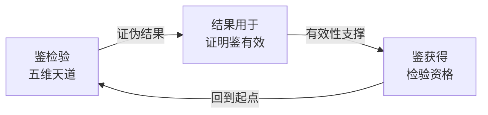

# 司衡鉴论

> 鉴者，映照反观之器也。然鉴非被发现的真理工具，乃经验约束下被建构的检验框架：其有效性有待外部验证，其判决标记为候选。

本文重写鉴论，诚实声明鉴的认识论地位，处理自证循环问题，并记录九段式的暂缓处置。旧鉴论已归档于 archive/，本文为其重写。

## 一、鉴的认识论地位

### 1.1 标签与核心声明

鉴的认识论标签为 **constructed-framework**（建构框架）。这一标签的含义是：鉴不是"被发现的真理工具"，而是"在经验约束下被建构的检验工具"。

鉴的道家血统出自《道德经》第10章"涤除玄鉴，能无疵乎"与第54章"以身观身"。老子以鉴为镜，涤除尘蔽以映照大道。司衡取"映照反观"义，延伸为反推检验与可证伪性的工程内涵。血统的纯正不等于认识论地位的确立：鉴有道家源出，但其作为检验工具的有效性仍需独立验证。

核心声明：鉴的有效性目前由内部自洽与多模型交叉验证部分支撑，尚未经工程实践数据验证。在外部独立验证完成之前，鉴的地位是建构框架，不是经验已证实的工具。

### 1.2 鉴的当前支撑

鉴当前具有三重支撑，强度递减。

第一，内部自洽。九段式作为鉴的检验规程，能将待检验主张拆解为子主张，逐段施加反证、反例、可证伪条件等压力，并产出结构化判决（经得起、需校准、需重定位、被证伪、不可证伪）。产出结构的稳定性是内部自洽的初步证据。

第二，多模型交叉验证。鉴的构建过程中有 4 个以上 LLM 独立参与，各自从不同路径收敛到相近的检验框架。多模型收敛降低了单一主体偏好的风险，是外部交叉验证的弱形式。

第三，待验证：工程实践数据。鉴尚未在司衡自身建构之外的独立工程案例中收集足够数据。内部成功（五维天道 21 条子主张 0 条幸存）不等于外部验证：被检验对象与检验工具同源于一个体系，二者之间可能存在共谋。

### 1.3 鉴的当前限制

鉴当前存在三项限制，须诚实声明。

第一，自证循环。鉴检验五维天道 -> 五维天道的证伪结果被用来证明鉴有效 -> 鉴的有效性又反过来支撑它对五维天道的检验资格。检验者与被检验者同源，构成闭环。这是鉴最根本的认识论限制。

第二，外部锚定的删除。循环的出现部分是文档化的产物。旧体系曾因美学选择删除外部锚定（道一锚定热力学第二定律、道三锚定 Shannon 信息论、道四锚定 Godel 不完备性定理），使道的权威全部退回体系内部融贯。当道的权威只剩内部融贯，鉴检验道就退化为"自家人审自家人"，循环无法从外部打破。新总纲已将外部锚定以声明形式写回，但鉴论层面的循环处理仍须在此基础上补足。

第三，多主体协作的简化。鉴的实际构建是多主体协作：4 个以上 LLM 分轮次独立产出、互相审阅、收敛。但文档行文将这一过程简化为单一主体，使读者误以为鉴是单一主体的产物，既掩盖了交叉验证的真实强度，也掩盖了协作过程中可能未被记录的分歧。

## 二、鉴的工程角色

### 2.1 候选建议生成器

鉴在工程层是候选建议生成器，不是裁决器。鉴的产出是对主张施加反推压力后得到的校准建议与风险标注，其用途是供确定性引擎与人类治理者参考，而非直接生效。

鉴的产出统一标记为"候选"，不标记为"已证明"。标记规则如下：

| 产出类型 | 标记 | 含义 |
| ---- | ---- | ---- |
| 检验判决 | 候选 | 九段式产出的判决待外部确认 |
| 校准建议 | 候选 | 建议方案待治理者裁决 |
| 风险标注 | 候选 | 识别出的风险待工程数据验证 |

"候选"标记意味着：鉴的产出可以被采纳，可以被驳回，可以被改写，但不可以被当作已证成的结论直接引用为权威。

### 2.2 裁决权归属

裁决权属于确定性引擎（零 LLM）。确定性引擎以可复现的规则对候选建议做最终判定，其裁决不依赖概率模型，可被审计、可被复现。

这一分工与 SPEC 第 3 节两层确定性架构一致：鉴（LLM 参与的反推检验）位于候选生成层，确定性引擎（零 LLM 的规则判定）位于裁决层。鉴不越权裁决，确定性引擎不越权生成候选。两层各司其职，鉴的不完备性由此被限制在候选层，不会污染裁决层。

## 三、自证循环的诚实处理

### 3.1 承认循环存在

鉴的自证循环不是可以被一句话消除的修辞问题，而是鉴当前认识论地位的真实结构特征。检验者（鉴）与被检验者（五维天道）同源于司衡体系，鉴检验五维天道所得的"0 条幸存"结果，被旧鉴论用作"鉴具有区分力"的证据，而鉴的区分力又支撑它继续检验其他主张。闭环由此闭合。

诚实处理的第一步是承认：在工程数据验证之前，这一循环无法从内部打破。任何声称"鉴已经自证有效"的论述都仍在循环之内。

### 3.2 循环的部分成因

循环的出现并非纯粹的逻辑缺陷，部分原因是文档化过程中的两个具体损失。

其一，外部锚定被删除。道一锚定热力学第二定律、道三锚定 Shannon 信息论、道四锚定 Godel 不完备性定理。这些外部锚定本可为鉴的检验提供体系之外的参照：若道的部分权威来自外部科学定律，鉴检验道时就有一部分不依赖内部融贯。旧体系因美学选择删除外部锚定，使道的权威全部内化，循环因此失去外部突破口。新总纲已将外部锚定写回，鉴论须在此基础上重新定位自身。

其二，多主体协作被简化为单一主体。鉴的实际构建涉及 4 个以上 LLM 的多轮独立产出与交叉审阅，这是一种弱形式的外部验证。但文档行文将多主体协作压缩为单一叙述声音，使交叉验证的存在与强度对读者不可见，循环因此显得比实际更封闭。

### 3.3 候选标记的约束力

在工程数据验证之前，鉴的一切判决标记为"候选"。这一约束具有两层含义。

对内，鉴论自身不得使用"鉴已证明"或"鉴具有区分力（已证成）"之类的表述。旧鉴论中"0 条幸存：这不是失败，而是方法论有效性的证明"一类的断言，在新鉴论中降格为"内部检验的初步证据"，而非有效性证明。

对外，引用鉴的判决时须携带"候选"标记。道论、法论等下游文档引用鉴的检验结果时，须标注其为候选判决，不得将其作为已证成的前提。

### 3.4 不完备不豁免修补

承认鉴不完备、承认自证循环存在，不等于鉴获得了"因此可以暂不修补具体间隙"的豁免。这与道四的不可免疫约束一致：治理引擎不能声称自己例外于道，鉴作为治理引擎的认识论组件，同样不能声称自己例外于"规约与实现必有间隙"。

具体而言，已识别的间隙必须逐一修补，不得以"鉴整体尚不完备"为由搁置：

- 外部锚定删除导致的循环，已通过新总纲写回锚定声明部分修补，鉴论须在此基础上重新定位
- 多主体协作简化导致的可见性损失，须在本节如实记录协作的真实形态
- 工程数据缺失导致的验证空白，须在第四节九段式处置中明确为待验证项

承认不完备是诚实的起点，逐一修补已识别间隙是诚实的落脚点。二者不可互相替代。

## 四、九段式的处置

### 4.1 暂缓决策

九段式的处置已由前置决策确定为"暂缓"。暂缓的含义是：保留九段式在司衡体系中的哲学地位，既不退役，也不立即在工程层实现。

暂缓而非退役的理由：九段式作为反推检验的规程设计，其内部自洽与多模型交叉验证提供部分支撑，贸然退役将丢弃这部分支撑，且九段式的完整设计意图可能尚未完全恢复（见 4.4）。

暂缓而非立即实现的理由：九段式的有效性尚未经工程实践数据验证，在数据缺失时立即实现等同于将未经检验的框架固化为工程强制流程，违背鉴自身"候选标记"的约束。

### 4.2 constructed-framework 声明

九段式声明为 **constructed-framework**。与鉴的整体标签一致，九段式不是"被发现的检验真理"，而是"在经验约束下被建构的检验规程"。

九段式所伴随的诗与理区分、可证伪条件设定规则等方法论组件，与九段式共享 constructed-framework 标签与暂缓处置。它们不是被删除，而是随九段式一同进入待验证状态。

当前工程层状态：零实现。九段式目前仅存在于哲学文档中，未在确定性引擎或任何工程机制中落地。任何关于九段式"已在工程中运行"的表述均不成立。

### 4.3 待实现标注

九段式标注为"待实现，等工程数据验证后再决定实现或退役"。这一标注的含义是：

- 当前不实现：九段式不进入工程强制流程
- 待验证项：九段式的区分力须经独立工程案例检验
- 决策门槛：工程数据收集后，依据数据决定实现或退役
- 不可逆禁令：在决策门槛达成前，不做不可逆的实现或退役决策

### 4.4 设计意图的诚实声明

九段式是数百轮多主体对话的产物。其完整设计意图可能未完全写入文档：部分设计考量存在于对话过程而未沉淀为文本，部分校准逻辑在多轮迭代中被压缩。

在未恢复完整设计意图之前，对九段式不做不可逆决策。这一声明与 4.3 的待实现标注互为支撑：正因为设计意图可能不完整，贸然实现可能固化一个失真的版本，贸然退役可能丢弃一个尚未被完整理解的框架。

恢复设计意图的可行路径：梳理多主体对话记录，将未沉淀的设计考量补写入文档；在工程数据验证前，九段式保持哲学地位与零实现的现状。

## 附录

### DEPS

- 260627-1030-sihankor-philosophy
  - 总纲，鉴论的认识论标签与外部锚定声明来源
  - [司衡哲学总纲](./SiHankor-Philosophy.sih.md)

### SEE-ALSO

- 240602-1000-on-sihankor-assay
  - 旧鉴论（已归档），本文的前身
  - [司衡鉴论](../../../archive/philosophy-v1/On-SiHankor-Assay.sih.md)
- 260627-1000-sihankor-terminology-lineage
  - 术语血统表，鉴的道家源出考证
  - [司衡术语血统表](./SiHankor-Terminology-Lineage.sih.md)
