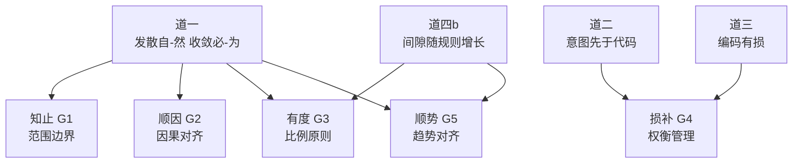

# 司衡法论

> 法者，从道推导之方法论指南也。五法各从道生，遵循则合道，违逆则违道。

## 导言

### 法在四层结构中的位置

司衡架构分四层：观察、原则、指南、机制与实现。法居指南层，从原则层之四道推导而出。道回答"为什么"，法回答"怎么做"。四道定义见[《司衡道论》](./Tao-On-Natural-Convergence.sih.md)。

法与道的根本区别：道是被发现的工程必要性，法是从道推导的方法论指南。道不可违反，法可被校准。法若在实践中被证明不合道，应通过生命周期修正机制重新检验。

### 认识论标签声明

收敛五法均携带 design-corollary 标签。五法的权威不来自自身，而来自其所推导之道。若上游之道被推翻或校准，相应之法须重新检验。标签制度定义见[《司衡哲学总纲》第三节](./SiHankor-Philosophy.sih.md)。

### 本文结构

每条法包含六个要素。陈述：法用道家术语声称了什么。认识论标签：主张的权威来源。推导自：从哪条道推导，推导逻辑是什么。工程映射：对应的 G1-G5 指南及工程验证方法。适用边界：在什么条件下成立。独立验证方法：不依赖推导链的验证方法。

## 五法推导总览

五法各从道推导，推导关系如下。道一定义见道论第一节，道二见第二节，道三见第三节，道四b见第四节。

道一为五法共通之源：收敛必-为的要求贯穿知止、顺因、有度、顺势。道四b为有度与顺势提供间隙增长的约束。道二与道三为损补提供有损编码与因果不可逆的约束。

## 知止：G1 范围边界

### 陈述

知止者，知治理之边界也。非所有发散皆须遏制，非所有事务皆须规约。治理投入应与产出方差成正比：方差大处多投入，方差小处少投入乃至不投入。知所当止，则治理不僭越；不知止，则治理本身成为发散之源。

### 认识论标签

design-corollary。知止从道一推导，权威来自道一的担保。若道一被推翻（无协调约束下方差为零），知止失去上游依据。

### 推导自

道一：发散自-然，收敛必-为。

道一确立收敛须人为介入，但未声称所有收敛投入等价有效。收敛力量有限：人力、时间、注意力皆为有限资源，故须选择投入点。选择的标准是产出方差：方差大者，收敛投入收益高；方差小者，收敛投入收益低乃至为负。过度治理产生的新发散可能超过其收敛收益。知止划定"不为"的边界，使有限的收敛力量集中于"必为"之处。

### 工程映射

G1：Scope Boundary（范围边界）。

治理范围应显式划定。每个治理域须声明其覆盖范围与不覆盖范围。一次性脚本不须 spec，探索性原型不须 ratify，低方差区域不须强制完整验证。idea 类型允许意图保持隐性，非 ratify 文档不被下游引用。

工程验证方法：
- 测量各治理域的治理投入（规则数、审查轮次、维护工时）与产出方差（缺陷率、变更频率、发散指标）
- 检验二者是否正相关：高方差域应有高投入，低方差域应有低投入
- 识别反例：高投入低方差域为过度治理，低投入高方差域为治理缺失

### 适用边界

成立条件：多认知源、方差非均匀分布的代码工程。方差分布越不均匀，知止越重要。

弱化条件：方差均匀分布的场景，所有区域方差相近，范围边界的区分度低，知止收益降低。单人短期项目方差极低，知止近乎不适用。

不适用条件：无方差的固定模板重复任务。道一在此条件下弱化，知止随之弱化。

### 独立验证方法

检查治理体系中是否存在"治理成本超过被治理对象成本"的区域。具体操作：
- 列举所有治理规则，估算每条规则的维护成本
- 列举每条规则所解决的问题，估算问题的危害成本
- 若存在规则的维护成本大于问题的危害成本，则知止在该处未被遵守

此验证不依赖道一是否成立，仅依赖成本与收益的工程度量。

## 顺因：G2 因果对齐

### 陈述

顺因者，顺因果之方向也。意图先于规范，规范先于实现。治理规则应强制因果方向：上游决定下游，下游不逆定上游。逆因果方向之操作，虽可执行，终将导致意图丧失、治理失效。

### 认识论标签

design-corollary。顺因从道一推导，权威来自道一的担保。道一担保发散是默认趋势，强制因果方向是收敛必-为的具体形式。

### 推导自

道一：发散自-然，收敛必-为。

道一确立发散是默认趋势，收敛须人为介入。发散的一种形态是因果方向混乱：意图、规范、实现三者次序颠倒，各层互相反定。强制因果方向（意图->规范->实现）是对此种发散的收敛，是必-为的具体形式之一。不强制因果方向，则因果链断裂，意图不可追溯，发散不可遏制。

### 工程映射

G2：Causal Alignment（因果对齐）。

治理链每一环须保持因果方向。upstream 溯源形成不可逆授权链：每份文档标注治理授权来源。spec-coding 将意图显式化为规范，代码从规范生成。文档生命周期 propose->resolve->ratify 依因果方向递进，不可跳过。

工程验证方法：
- 从任一代码符号出发，检验能否沿引用链追溯到 ratify 规约，再追溯到意图声明
- 从任一治理文档出发，检验 upstream 链是否完整可达授权源头
- 识别逆因果操作：用代码反推"纠正"规范、用实现反定需求

### 适用边界

成立条件：所有涉及意图、规范、实现三层关系的代码工程。只要存在"意图->规范->实现"的编码链，顺因即成立。

弱化条件：无独立规范层的简单项目，意图直接编码为代码，因果方向虽存在但层次简化，顺因约束力减弱。

不适用条件：无。因果方向是代码工程的构成性特征，顺因在其定义域内无条件成立。

### 独立验证方法

检查治理操作是否存在"逆因果方向施加控制"的现象。具体操作：
- 检测是否存在从代码反推修改规范的非正式操作（非 Reopen 的正式修正，而是随意覆盖）
- 检测是否存在实现决定需求的现象（技术约束反过来定义业务意图）
- 检测 upstream 链是否有断裂或循环

此验证不依赖道一是否成立，仅依赖因果方向的可追溯性度量。

## 有度：G3 比例原则

### 陈述

有度者，治理之力度恰到好处也。规则数量与严格度应与风险成正比：风险大处多规严规，风险小处少规宽规。过度的规则是刻意有为，不足的规则是放任发散，二者皆违道。

### 认识论标签

design-corollary。有度从道一与道四b推导，权威来自二者的联合担保。道一要求收敛必-为（不可不规约），道四b警告规则越多间隙越大（不可过度规约）。有度在二者之间取平衡。

### 推导自

道一：发散自-然，收敛必-为。道四b：治理与实践的间隙随时间增大，且增大速率与规则数量正相关。

道一要求必须收敛，不可无规则。道四b警告规则越多间隙越快增大，不可规则过多。二者形成张力：完全不规约，发散失控，违道一；过度规约，间隙膨胀，违道四b。有度在此张力中确立平衡点：规则数量与严格度应与风险成正比。风险高的区域，不规约的代价大于间隙增大的代价，故应多规；风险低的区域，间隙增大的代价大于不规约的代价，故应少规。

### 工程映射

G3：Proportionality（比例原则）。

治理力度三级分化，力度选择应与被治理对象的风险等级匹配：

| 力度 | 含义 | 适用场景 |
| ---- | ---- | ---- |
| 戒 Forbid | 硬约束，违反即拒绝 | 导致系统性不可维护性的操作 |
| 规 Guideline | 软规范，偏离须标记 | 偏离应被看见但不阻断的操作 |
| 矩 Judgment | 精确判定，pass/fail | 可机械判定的合规检查 |

工程验证方法：
- 对每个治理域，评估其风险等级（缺陷影响范围、变更频率、认知源数量）
- 对每个治理域，统计其规则数量与严格度等级
- 检验风险等级与规则力度是否正相关
- 识别反例：低风险高严格为过度治理，高风险低严格为治理不足

### 适用边界

成立条件：规则持续积累、风险非均匀分布的治理系统。风险分布越不均匀，有度的区分度越高。

弱化条件：风险均匀分布的系统，所有区域风险相近，力度分化的收益降低。新建立的治理系统，规则少、生存期短，道四b的间隙压力尚未显现，有度的道四b侧约束弱化。

不适用条件：无规则的系统，道一弱化，有度无从调节。或无限资源的系统，治理成本可忽略，力度无约束。

### 独立验证方法

逐条检验规则的"度"是否恰当。具体操作：
- 对每条规则，问：此规则带来的麻烦是否超过它解决的问题？若是，此规则过度，违有度
- 对每个高风险区域，问：此处是否有足够的规则覆盖？若否，此区域治理不足，违有度

此验证不依赖道一与道四b是否成立，仅依赖规则成本与收益的逐条度量。

## 损补：G4 权衡管理

### 陈述

损补者，损有余而补不足也。每条治理决策皆涉权衡：有所损必有所补，有所补必有所损。非随机增删，乃有方向之调节：损冗余之规则，补缺失之覆盖。

### 认识论标签

design-corollary。损补从道二与道三推导，权威来自二者的联合担保。道二担保因果方向不可逆，道三担保编码有损。二者共同担保每条治理决策皆是有损且不可逆的编码，必有取舍。

### 推导自

道二：意图先于代码，因果方向不可逆。道三：凡编码皆为意图之有损编码。

治理决策是将治理意图编码为规则的过程。道三担保此编码有损：每条规则在捕获意图的同时丢失部分意图，故每条规则既是补（覆盖某语义）又是损（遗漏某语义）。道二担保因果方向不可逆：规则一旦下游生效，其影响不可简单逆转，故权衡须在决策时完成。二者联合：每条治理决策是有损且不可逆的编码，故必涉权衡。补此处之意图即损彼处之意图，增此规则之覆盖即增彼规则之间隙。损补之法要求此权衡被显式管理。

### 工程映射

G4：Trade-off Management（权衡管理）。

每条治理决策须记录其权衡。ADR 三段式（背景->决策->后果）是损补的工程载体：背景记录"补什么"，决策记录"如何补"，后果记录"损了什么"。Reopen 机制是损补的触发：间隙发现时，损旧规之错误，补新规之缺失。规则定期审计是损补的周期性执行：删除冗余规则（损），补齐缺失覆盖（补）。

工程验证方法：
- 审计 ADR 记录，检验每条决策是否显式记录了权衡（所补与所损）
- 统计规则总量随时间的变化趋势：若单调递增（只补不损），损补失衡
- 检验是否存在定期规则修剪机制：无修剪则间隙累积无修正

### 适用边界

成立条件：规则持续积累、决策有下游影响的治理系统。规则越多、决策越不可逆，损补越重要。

弱化条件：新建立的治理系统，规则少、历史决策少，权衡的累积压力尚未显现。可逆决策（可无代价撤销的决策）的道二侧约束弱化。

不适用条件：无规则的系统，无规则可损补。或完全可逆的决策环境，权衡可事后无代价修正，损补的必要性降低。

### 独立验证方法

检查规则总量的单调性。具体操作：
- 在多个时间点统计规则总量，绘制趋势线
- 若规则总量单调递增（只增不减），损补之法未被有效执行
- 检查是否存在冗余规则：功能重叠的规则、已无对应问题的规则、被新规则覆盖但未删除的旧规则

此验证不依赖道二与道三是否成立，仅依赖规则总量的时间序列度量。

## 顺势：G5 趋势对齐

### 陈述

顺势者，治理之力度随势而变也。势有三层：时势（项目阶段）、地势（代码区域）、人势（认知源数量）。早期宽松以护探索，后期严格以护稳定。不该收敛时收敛，是拔苗助长；该收敛时不收敛，是错失时机。

### 认识论标签

design-corollary。顺势从道四b与道一推导，权威来自二者的联合担保。道四b担保间隙随时间增大，道一担保发散强度随条件变化。二者共同担保治理力度应随条件变化而适配。

### 推导自

道四b：治理与实践的间隙随时间增大，且增大速率与规则数量正相关。道一：发散自-然，收敛必-为，且发散强度随条件变化。

道一声称发散强度随条件变化：多认知源、长生存期发散剧烈，单人短期发散微弱。故治理力度应随条件适配而非一成不变：条件变化时，力度不变则或过度（条件弱化时）或不足（条件强化时）。道四b声称间隙随时间增大：项目演进中，规则累积使间隙膨胀，故后期须更严格的收敛以对抗间隙扩张。二者联合：治理力度应随项目阶段、代码区域、认知源数量的变化而动态适配。

顺势不意味着"可随意降低标准"。ratify 阶段的严格性是道一的要求：收敛一旦建立，放松就是发散。顺势调节的是"何时达到严格"，而非"严格本身可被放松"。

### 工程映射

G5：Trend Alignment（趋势对齐）。

文档生命周期阶段递进是顺势的工程实现。力度随阶段递增：

| 阶段 | 治理力度 | 验证标准 |
| ---- | ---- | ---- |
| propose 1/3 | 宽松 | ID 唯一性、基本格式 |
| resolve 2/3 | 中等 | 引用可验、术语一致、ADR 结构 |
| ratify 3/3 | 严格 | 跨文档引用完整性、内容指纹、治理链完整性 |

时势维度：力度随项目阶段递增。地势维度：不同代码区域可有不同力度（核心域严，胶水代码宽）。人势维度：认知源数量影响力度（多源须严，单源可宽）。

工程验证方法：
- 映射各项目阶段的治理力度等级，检验力度是否随阶段递增
- 映射各代码区域的治理力度等级，检验力度是否与区域风险匹配
- 纵向追踪：同一治理域在不同时间点的力度是否随条件变化而调整
- 识别反例：力度不随阶段变化（一成不变）或力度逆势（早期过严或后期过宽）

### 适用边界

成立条件：长生存期、有可区分阶段的项目。阶段越清晰、生存期越长，顺势越重要。

弱化条件：短生存期或单阶段项目，无阶段可分，时势维度弱化。条件稳定不变的环境，发散强度恒定，顺势的调节需求降低。

不适用条件：无阶段区分的一次性任务。道一在此条件下弱化，顺势随之弱化。

### 独立验证方法

检查治理力度是否随项目阶段动态调整。具体操作：
- 列举项目各阶段（或各代码区域）的治理力度配置
- 检验是否存在力度梯度：不同阶段或区域应有不同力度
- 检验力度是否随时间调整：同一域在不同时间点的力度配置应有变化记录
- 若力度完全统一且从不调整，顺势之法未被有效执行

此验证不依赖道四b与道一是否成立，仅依赖力度配置的时空分布度量。

## 五法关系

五法非孤立，相互制约、相互补充。

知止与有度互补：知止问"不做什么"，有度问"做多少"。知止划定边界，有度调节力度。二者从道一的不同侧面推导：知止从"收敛力量有限"推导，有度从"收敛力量须恰到好处"推导。

损补为诸法提供修正方向：损补之法本身不规定"损什么、补什么"，其方向由其他法确定。违反顺因处须补因果约束，违反知止处须损冗余规则，违反有度处须调力度等级。

顺势为诸法提供时机调节：顺势不改变其他法的要求，只调节"何时以何种力度执行"。早期可暂缓知止之严（护探索），后期须强化有度之规（护稳定）。

顺因为诸法提供因果秩序：所有治理操作须顺因果方向而行。知止划定边界、有度调节力度、损补执行修正、顺势适配时机，皆须在因果方向正确的前提下进行。

## 附录

### DEPS

- 260627-1100-dao-on-natural-convergence
  - 道论，四道的系统阐述，法从道生
  - [司衡道论](./Tao-On-Natural-Convergence.sih.md)
- 260627-1030-sihankor-philosophy
  - 哲学总纲，认识论标签制度与四层结构
  - [司衡哲学总纲](./SiHankor-Philosophy.sih.md)

### SEE-ALSO

- 240610-1030-on-sihankor-canon
  - 旧法论（已归档），本文的前身
  - [司衡法论](../../../archive/philosophy-v1/On-SiHankor-Canon.sih.md)
- 260627-1000-sihankor-terminology-lineage
  - 术语血统表，五法术语的道家源出考证
  - [司衡术语血统表](./SiHankor-Terminology-Lineage.sih.md)
