# 司衡鉴论

> **鉴者，照察真伪也。** 司衡之所以可信，不是因为它的主张听起来深刻，而是因为每一主张都经得起反推检验。本文是这套检验方法的系统阐述。

## 一、破题：何为鉴

### 1.1 字源释义

鉴，镜也，照也，察也。古以青铜为鉴，可以正衣冠；以史为鉴，可以知兴替。在司衡体系中，鉴的含义有三层：

- 照：让主张暴露在反例和反证的审视之下，不遮蔽、不回避
- 察：区分真伪：什么是因果必然性（理），什么是修辞策略（诗）
- 验：设定可证伪条件，产出可复现的判决：通过还是被推翻

[《司衡论》$1.1 字源释义](./On-SiHankor.sih.md#11-字源释义) 言："衡的前提是度（量），衡的保障是鉴（照），衡的结果是平（稳）。"
鉴是衡得以成立的保障：没有鉴的检验，衡不过是一厢情愿的收敛宣称。

### 1.2 鉴在司衡体系中的位置

司衡的完整架构可表述为：

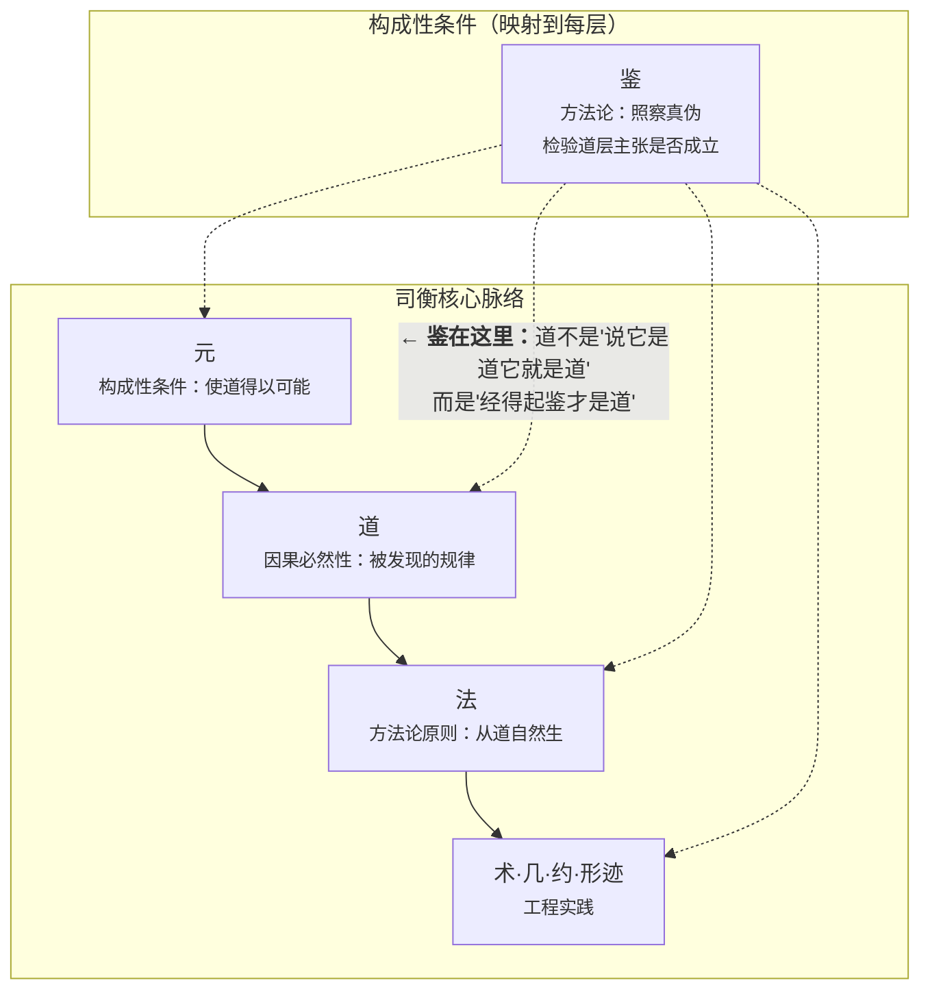

鉴不是六层脉络中的任何一层。它与元一样，是"映射到每一层但不在脉络中"的构成性条件。元回答"道何以可能"，鉴回答"道何以可信"。两者一为存在论奠基，一为认识论奠基，共同构成司衡的双重自觉。

### 1.3 《司衡论》与《司衡鉴论》的关系

|            | 《司衡论》                 | 《司衡鉴论》                                     |
| ---------- | -------------------------- | ------------------------------------------------ |
| 定位       | 总纲：司衡信什么           | 方法论：凭什么信                                 |
| 回答的问题 | 司衡是什么？道与元是什么？ | 一个主张凭什么进入道层？怎么检验它？             |
| 读者       | 通读即可知晓全貌           | 需要检验主张、校准概念、或理解司衡为何可信时查阅 |
| 关系       | 立义                       | 立法                                             |

### 1.4 本文之旨

本文是司衡方法论的独立著作，肩负三重使命：

- 立法：将反推九段式、诗与理区分、可证伪条件设定系统化为可操作的检验规程
- 立信：阐明司衡凭什么相信自己的主张？不是因为权威，而是因为方法
- 自鉴：方法论自身必须经得起自己的检验，否则鉴就变成了自己所要防止的东西

本文不仅阐述方法，也展示方法在司衡自身建构中的实际运用：五维天道的证伪、道一的校准、道三的校准，都是这套方法论的产出。

## 二、反推九段式

道层主张的检验规程

> 反推九段式是司衡检验道层主张的标准流程。它不是唯一的检验方式，但它是经过了充分验证的：五维天道 21 条子主张经九段式检验，0 条完好幸存，证明了这套方法确实具有区分力。

```mermaid
title: 九段式总览
flowchart LR
    S1["1. 主张提取"] --> S2["2. 概念分析"]
    S2 --> S3["3. 最强反证构建"]
    S3 --> S4["4. 反例举证"]
    S4 --> S5["5. 类比检验"]
    S5 --> S6["6. 逻辑一致性"]
    S6 --> S7["7. 可证伪条件设定"]
    S7 --> S8["8. 证伪判定"]
    S8 --> S9["9. 校准建议"]
```

九段式的设计遵循一个核心原则：最优版本原则：构建的反证必须是被检验主张面临的最强挑战，而非最容易反驳的版本。如果主张经得起最强反驳，才是可靠的。如果只经得起弱反驳，只说明反驳不够强。

### 2.1 第一段：主张提取

目的：将待检验主张拆解为可独立检验的子主张，消除隐含前提和语义捆绑。

操作步骤：

1. 完整引用：从源文档中提取主张的完整原文，包括上下文展开
2. 子主张拆分：识别主张中可独立成立或不成立的最小语义单元
3. 隐含前提提取：找出主张成立所依赖但未明说的前提
4. 编号与分类：为每个子主张分配编号，标注其命题类型（因果必然性/规范性/描述性/定义性）

判据：拆分后的子主张应满足：任意一个子主张被推翻时，可以明确判断原主张整体是否被推翻。如果子主张之间相互依赖、无法独立检验，说明拆分不够彻底。

常见失败模式：

| 失败模式     | 表现                                                               | 修正方法                 |
| ------------ | ------------------------------------------------------------------ | ------------------------ |
| 语义捆绑     | 一个句子中包含两个不同性质的主张（如"发散是自然的，收敛是必然的"） | 拆开，分别检验           |
| 隐含前提遗漏 | 主张暗含了"多人协作"条件但未明说                                   | 提取为显式子主张         |
| 分类错误     | 将规范性主张当作因果必然性提取                                     | 先归类的检验延后到第二段 |

### 2.2 第二段：概念分析

目的：检验关键概念的定义清晰度，识别多义性、歧义和范畴混淆。

操作步骤：

1. 关键词提取：识别主张中承载核心含义的关键词（通常 2-5 个）
2. 多义性排查：检验每个关键词是否存在多种不同的含义，列出所有义项
3. 义项归位：判断主张在使用该关键词时，实际使用的是哪个义项：以及不同义项之间是否在滑动
4. 范畴判定：初步判断主张属于哪一层（道/法/术），这个判定会在第六段逻辑一致性中正式确认

判据：通过概念分析的主张应满足：每个关键词有唯一确定的义项；不同关键词的义项之间不存在概念冲突；如果允许义项滑动，必须声明滑动范围。

以道一校准为例：

"发散自然，收敛必然"中的"必然"存在两种义项的滑动：

| 义项              | 含义                       | 例句                   |
| ----------------- | -------------------------- | ---------------------- |
| 必然~1~（描述性） | 正在发生（收敛是客观趋势） | "代码库必然走向收敛"   |
| 必然~2~（规范性） | 必须发生（收敛是应然要求） | "我们必须让代码库收敛" |

概念分析揭示了这个滑动，直接导致了后续的校准。

### 2.3 第三段：最强反证构建

目的：构建被检验主张面临的最强挑战：不是最容易反驳的版本，而是最难回应的版本。

操作步骤：

1. 枚举可能反驳：列举所有可能挑战该主张的论证路径
2. 强度排序：按"如果成立则对主张的威胁程度"从高到低排序
3. 选择最强：选择威胁最大的反驳作为"最强反证"
4. 精炼表述：将最强反证表述为清晰、可检验的命题

判据：如果被检验主张能够有效回应最强反证，则它经受住了这一段的检验。如果最强反证成立且无法回应，该段已经初步揭示了主张的问题。注意：最强反证不必是实际上是正确的：它需要的是对主张构成最大威胁，迫使主张的辩护者做出最诚实的回应。

以道三检验为例：

被检验主张："代码必须被理解才能被维护"

最强反证构建：AI 维护代码：AI 可以在不具备人类意义上的"理解"的情况下，对代码进行有效的修改、重构和修复。如果"理解"是维护的因果前提，AI 是怎么做到的？

这个反证对主张构成了严重挑战：它迫使我们要么重新定义"理解"（将 AI 的模式匹配纳入"理解"），要么承认"理解"不是维护的因果前提。

### 2.4 第四段：反例举证

目的：寻找真实工程案例中挑战该主张的具体实例。

操作步骤：

1. 反例搜索：在真实代码工程中寻找与主张矛盾的具体案例
2. 真实性验证：确认反例确实发生在真实工程中，而非虚构的极端场景
3. 相关性确认：确认反例确实触及了主张的核心，而非边缘情况
4. 反例强度分级：
   - 致命反例：一个即可推翻整个主张
   - 限制反例：缩小了主张的适用范围
   - 边缘反例：不影响主张的核心成立

判据：致命反例的出现=主张被证伪；限制反例的出现=主张需要校准范围；仅边缘反例=主张通过此段。

以道一检验为例：

主张："代码工程都在趋近收敛"（描述性解读）

反例：大型遗留系统（"大泥球"代码库），没有在趋近收敛，而是在持续发散至不可维护。这不是边缘反例，这是行业中普遍存在的现象。

以道三检验为例：

主张："代码必须被理解才能被维护"

反例：自动化重构工具（如 IDE 的 rename refactoring），可以在不理解业务意图的情况下安全地执行代码变换。这是限制反例：它不推翻"理解有助于维护"，但推翻了"理解是维护的必要条件"。

### 2.5 第五段：类比检验

目的：检验支持主张的类比或隐喻是否在关键方面失效，即类比源和目标之间的结构映射是否在核心维度上断裂。

操作步骤：

1. 提取类比：识别主张中使用的类比或隐喻
2. 映射关系分析：列出类比源（A）和目标（B）之间的对应关系
3. 关键维度检查：检验在主张成立所依赖的维度上，A 和 B 是否确实同构
4. 断裂点识别：如果存在关键维度的不等价，标注为类比断裂

判据：如果主张成立所依赖的类比在所有关键维度上成立，通过此段。如果关键维度断裂，类比失效：但这不一定推翻主张本身，只是移除了一种支持论证。

常见断裂模式：

- **层级混淆**：用物理实体的属性类比抽象概念
  - 错误示例： "代码如水，顺势而流"
    代码不是流体，水的物理流动属性无法映射到代码架构
  - 正确示例： "代码像文档，需要版本管理"
    同层级类比

- **方向颠倒**：类比的因果方向与目标相反
  - 错误示例： "好的架构像晶体一样生长"
    晶体是被动生长，架构是主动设计，因果方向相反
  - 正确示例： "好的架构像建筑蓝图"
    都是主动设计

- **范畴错位**：类比的约束条件在目标域不成立
  - 错误示例： "代码演化如生物进化"
    生物进化无目的，代码演化有明确意图，约束条件完全不同
  - 正确示例： "代码演化如产品迭代"
    都有目的和反馈

### 2.6 第六段：逻辑一致性检验

目的：检验主张与现有司衡框架是否存在逻辑矛盾：包括与已 ratify（定稿） 的道、法、公理的一致性，以及主张自身内部的自洽性。

操作步骤：

1. 与已确立道的检验：主张是否与道一至道四中的任何一条矛盾
2. 与法的检验：主张是否与收敛五法中的任何一条冲突
3. 与公理的检验：主张是否违反两条公理或三条原则
4. 内部自洽性：主张的子主张之间是否存在相互矛盾
5. 层级归属确认：最终确认主张属于道（因果必然性）、法（方法论原则）还是术（具体实践）

判据：与已 ratify 的道矛盾=需校准或推翻；与法矛盾=需重定位（可能本身是法而非道）；内部不自洽=需校准表述。

关键教训：范畴归位优先：

五维天道证伪的核心教训是：许多貌似是"道"的主张，实际上是"法"在工程维度的投射。在进行逻辑一致性检验时，最致命的发现不是"主张是错的"，而是"主张不属于它声称自己属于的那一层"。

| 检验结果     | 含义                           | 后续操作                       |
| ------------ | ------------------------------ | ------------------------------ |
| 与已有道矛盾 | 新旧主张冲突，至少一个需要修正 | 追溯冲突的根源，重新检验双方   |
| 层级错位     | 主张有价值但不在道层           | 重定位到法层，重新表述         |
| 不可证伪     | 主张是诗而非理                 | 排除出道层，可降为启发式或注释 |
| 内部矛盾     | 主张自身不自洽                 | 拆分或校准                     |

### 2.7 第七段：可证伪条件设定

目的：为通过前六段检验的主张设定明确的可证伪条件：精确描述"什么证据出现会推翻该主张"。

操作步骤：

1. 条件枚举：列举所有可能的可证伪条件
2. 有效性筛选：排除"逻辑上不可能出现"和"出现也不一定推翻主张"的条件
3. 精确表述：将有效可证伪条件表述为可观察、可判断的命题
4. 检验可行性：确认在当前或可预见的条件下，该条件是否可能被实际检验

判据：有效的可证伪条件应满足：（1）逻辑上可能出现；（2）出现时能唯一确定地推翻主张；（3）当前可检验或在可预见的未来可检验。如果一条主张无法设定任何有效可证伪条件，它就是诗而非理。

四条道的可证伪条件（已确立）：

| 道   | 可证伪条件                                                   |
| ---- | ------------------------------------------------------------ |
| 道一 | 发现无需外力干预就能自动收敛的多人代码工程场景               |
| 道二 | 发现"先有代码后有意图"的工程场景                             |
| 道三 | 发现"代码=意图"的无损编码方式                                |
| 道四 | 发现规约能完美捕获全部语义意图且实现能完美匹配规约的符号系统 |

这些条件的共同特征：精确、可观察、一旦出现即可唯一确定地推翻对应道。迄今为止，无一被满足。

### 2.8 第八段：证伪成功判定

目的：综合前七段的所有检验结果，做出最终的证伪成功/失败判定。

操作步骤：

1. 逐段汇总：将每段的检验结果汇总为一张判定表
2. 加权综合：并非每段权重相同：致命反例（第四段）和不一致（第六段）的权重高于类比断裂（第五段）
3. 判定输出：根据综合结果，输出以下五种判定之一

判定流程：

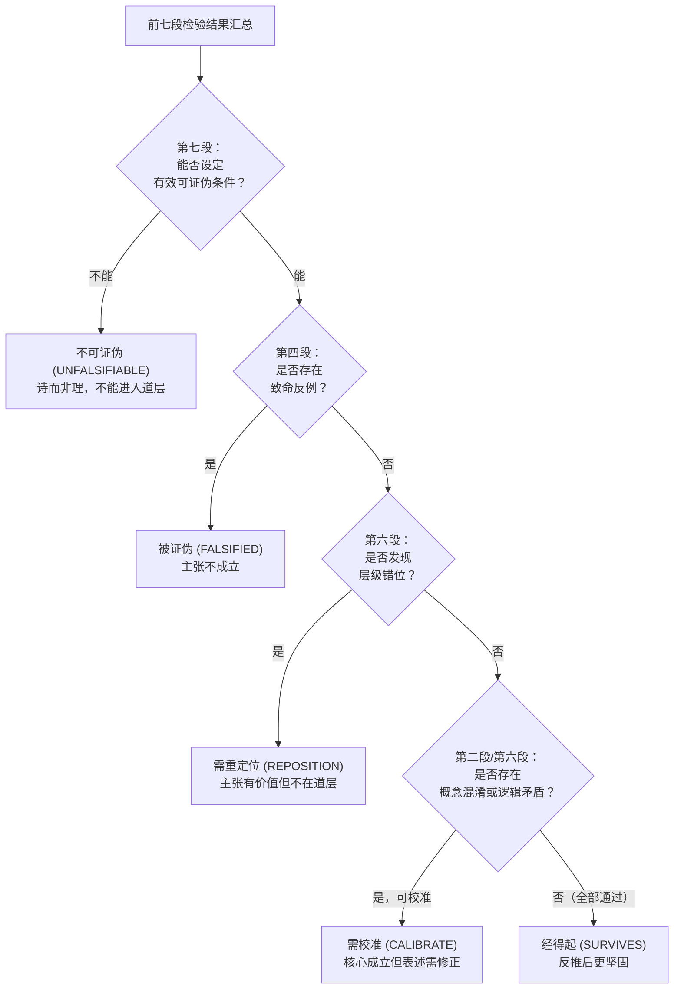

五种判定等级：

| 等级                      | 含义                   | 条件                                           |
| ------------------------- | ---------------------- | ---------------------------------------------- |
| 经得起（SURVIVES）        | 反推后更坚固           | 所有九段均通过，最强反证被有效回应             |
| 需校准（CALIBRATE）       | 核心成立但表述需修正   | 概念分析或逻辑一致性发现问题，但可通过校准解决 |
| 需重定位（REPOSITION）    | 主张有价值但不在道层   | 第六段发现层级错位                             |
| 被证伪（FALSIFIED）       | 主张不成立             | 致命反例出现，或逻辑矛盾不可调和               |
| 不可证伪（UNFALSIFIABLE） | 诗而非理，不能进入道层 | 第七段无法设定有效可证伪条件                   |

五维天道检验的判定分布（21 条子主张）：

| 结果     | 数量 | 占比 |
| -------- | ---- | ---- |
| 被证伪   | 14   | 67%  |
| 需校准   | 4    | 19%  |
| 需重定位 | 3    | 14%  |
| 完好幸存 | 0    | 0%   |

0 条完好幸存：这不是失败，而是方法论有效性的证明。

### 2.9 第九段：校准建议

目的：对于"需校准"或"需重定位"的主张，提出具体的改进方案。

操作步骤：

1. 问题定位：精确指出需要校准的是什么（概念混淆？范畴错位？表述模糊？）
2. 方案枚举：提出多个可能的校准方案
3. 方案对比：按概念精确性、修辞一致性、工程区分力等维度对比各方案
4. 推荐方案：给出推荐方案及理由
5. 校准后的可证伪条件：为校准版重新设定可证伪条件

判据：好的校准方案应：（1）解决原主张的问题；（2）不引入新的问题；（3）保持与体系其他部分的一致性；（4）具有明确的工程区分力。

以道一校准为例：

| 方案       | 表述                 | 评价                                                       |
| ---------- | -------------------- | ---------------------------------------------------------- |
| 一         | 发散自然，收敛必须   | 直接消歧但破坏对偶结构                                     |
| 二         | 发散自生，收敛人为   | 突出人为性但"人为"与道家"自然"对立过强                     |
| 三（采纳） | 发散自-然，收敛必-为 | 保持对偶结构；"自-然"还原为"自己如此"；"必-为"明确为规范性 |
| 四         | 发散自-然，收敛使然  | "使然"暗示外力但丢失规范性强度                             |

采纳方案三的理由：概念精确性、修辞对偶性、道家方法论一致性、工程区分力：四者兼顾。

### 2.10 九段式使用原则

1. 不跳过：九段各有其独立检验目的，跳过某段意味着该维度未经检验
2. 不强凑：如果某段不适用（如主张不使用类比，则第五段可跳过），应声明不适用的理由
3. 可迭代：校准后的主张可以（且应该）重新通过九段式检验。校准不是终点，校准后的再检验才是
4. 记录完整：每一段的检验过程、判据、中间结论均应记录，以便后续追溯和复核

## 三、诗与理的区分：道层资格的准入门槛

> 一个主张进入道层，不是因为它"听起来深刻"，而是因为它能被反推检验、被设定可证伪条件、被区分于纯粹的诗意修辞。

### 3.1 区分的操作化标准

诗与理的区分不是哲学立场，而是可操作的判别流程。判断一个主张是诗还是理，回答三个递进问题：

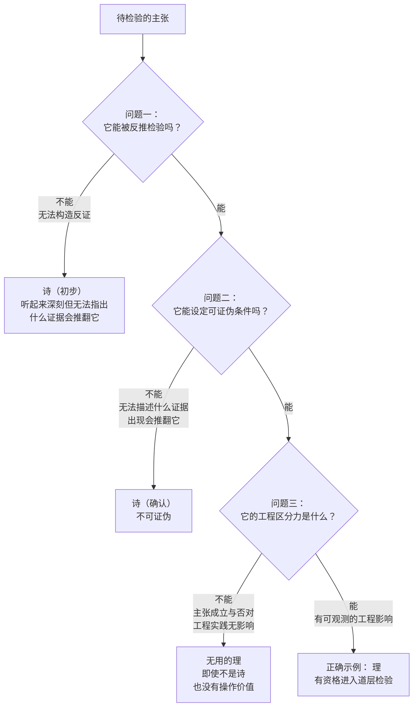

问题一：它能被反推检验吗？

能 = 可以构造反证并检验主张能否回应。不能 = 诗（初步）。

诗的典型特征："听起来深刻但无法指出什么证据会推翻它"。

问题二：它能设定可证伪条件吗？

能 = 可以精确描述"什么证据出现会推翻该主张"。不能 = 诗（确认）。

问题三：它的工程区分力是什么？

能 = 如果这个主张成立，会对工程实践产生可观测的影响：做什么或不做什么会不同。不能 = 即使不是诗，也是无用的理。

### 3.2 诗的四种典型形态

在司衡自身的演化史中，以下四种形态的主张被识别为"诗"并被排除出道层：

- **隐喻僭越**：用诗意的比喻替代因果论证
  - 实例： "接口是代码世界的'无'"
  - 为什么是诗： 无法指出什么证据会推翻"接口是无"

- **范畴混淆**：将规范性主张伪装为描述性
  - 实例： "代码结构必然清晰"
  - 为什么是诗： "应该清晰"!="必然清晰"，不可证伪

- **概念映射错误**：将道家概念强行对应工程概念
  - 实例： "'当其无有器之用'->代码结构之道"
  - 为什么是诗： 原文讲虚空之用，不是边界清晰

- **空洞深刻**：表述宏大但无操作含义
  - 实例： "架构的本质是制造虚空"
  - 为什么是诗： 无法转化为可检验的工程判据

### 3.3 理的检验清单

一个主张声称自己属于道层（因果必然性），应通过以下清单：

- [ ] 命题类型明确：是因果必然性（what must be），不是规范性（what should be）
- [ ] 反例可设定：可以描述什么情况会推翻它，且该情况逻辑上可能
- [ ] 工程区分力：如果它成立，工程实践会有可观测的差异
- [ ] 概念自洽：关键概念无歧义滑动
- [ ] 体系一致：与已 ratify 的其他道不矛盾
- [ ] 非隐喻依赖：论证不依赖无法检验的比喻

六项全通过 = 理，有资格进入道层的正式检验（九段式）。任何一项不通过 = 退回重审。

## 四、可证伪条件的设定规则

> 可证伪条件不是装饰：它是道层主张的生命线。没有可证伪条件的主张，不是道，是诗。

### 4.1 有效可证伪条件的四条判据

一条可证伪条件必须同时满足以下四项：

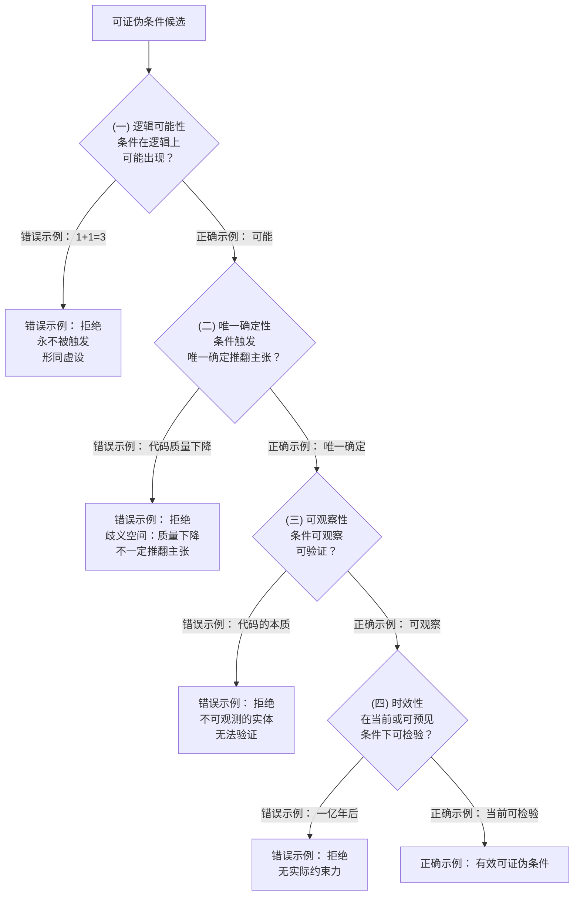

（一）逻辑可能性：条件必须在逻辑上可能出现。一个"逻辑上不可能"的条件是空的：它永远不触发，因此不构成真正的检验。

- 错误示例： "如果 1+1=3，则道一被推翻"：前提逻辑上不可能
- 正确示例： "如果发现无需外力干预就能自动收敛的多人代码工程场景"：逻辑上可能（虽然事实上未发现）

（二）唯一确定性：条件触发时必须能唯一确定地推翻主张，不存在"条件触发但主张依然成立"的歧义空间。

- 错误示例： "如果代码质量下降"->道一被推翻："代码质量下降"可能由多种原因导致，不一定推翻"收敛必-为"
- 正确示例： "如果发现'先有代码后有意图'的工程场景"->道二被推翻：唯一确定

（三）可观察性：条件的触发必须是可观察、可验证的，不能依赖不可观测的实体或状态。

- 错误示例： "如果代码的本质发生变化"："代码的本质"不可观察
- 正确示例： "如果发现'代码=意图'的无损编码方式"：可观察（比较编码前后的信息量）

（四）时效性：条件在当前或可预见的条件下具有检验的可行性。一个需要在"一亿年后"才能检验的条件，对当前的司衡体系没有实际约束力。

### 4.2 过弱与过强的边界

- **过弱**：条件永不被触发（如"如果宇宙规律改变"）
  - 危害：条件形同虚设，主张实际不可证伪
  - 修正：收紧为在当前世界中可触发的条件

- **过强**：条件触发但不一定推翻主张（如"如果项目失败"）
  - 危害：条件与主张之间缺乏唯一确定性
  - 修正：精确化条件，确保触发=推翻

- **过窄**：条件只覆盖主张的一小部分
  - 危害：主张的大部分内容逃避检验
  - 修正：为每个子主张设定独立条件

### 4.3 道四的可证伪条件再分析

道四的可证伪条件值得特别分析，因为它涉及自我指涉：

> 若存在一个符号系统，其规约能完美捕获全部语义意图且实现能完美匹配规约，则道四被推翻。

这个条件是否过强？不。它精确地道出了道四的断言（"间隙不可消除"）的反面。如果存在一个反例（一个实现了零间隙的符号系统），道四就被推翻。这是一个非常强的可证伪条件，它只需要一个反例，但正因为强，它才是诚实的。

## 五、自我指涉：方法论自身的检验

> 司衡的方法论不能声称自己"例外于方法"。如果鉴不能鉴自身，鉴就变成了自己所要防止的东西："一个不可检验的终极权威"。

### 5.1 反推九段式能检验自身吗？

将反推九段式应用于反推九段式自身：

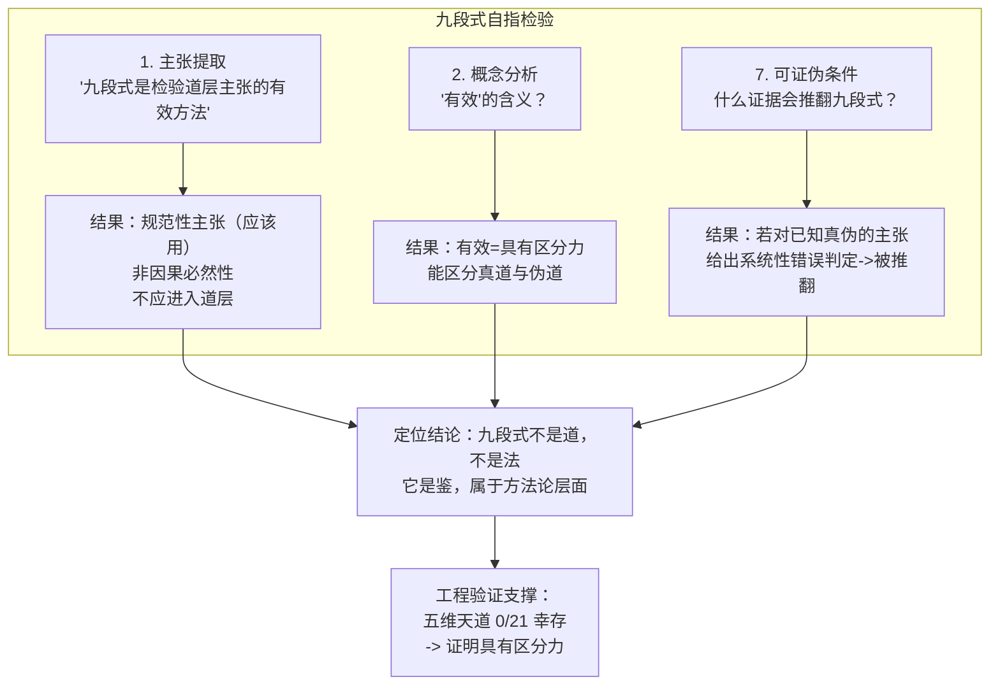

- **1. 主张提取**："反推九段式是检验道层主张的有效方法"
  -> 这是一个规范性主张（"应该用九段式检验"），不是因果必然性：所以它不应进入道层，而应定位为方法论规则

- **2. 概念分析**："有效"的含义是什么？
  -> 需要明确：有效=具有区分力（能区分真道与伪道）

- **7. 可证伪条件**：什么证据会推翻九段式？
  -> 如果九段式对一批已知真伪的主张给出了系统性错误判定（如将已知为真的判为伪，将已知为伪的判为真），则九段式被推翻

九段式的自我定位：九段式不是道，不是法：它是鉴，属于方法论层面。它不是"被发现的因果必然性"，而是"被发明并经过验证的检验工具"。它的有效性不依赖于哲学证明，而依赖于工程验证：五维天道 0/21 幸存证明了它具有区分力。

### 5.2 诗与理区分是诗还是理？

这是元四的核心追问，详见：[《司衡论》$3.4](./On-SiHankor.sih.md#34-元四方法论之元诗与理的区分)

> "元四本身也必须经得起元四的检验：可证伪标准本身必须是可证伪的。"

检验"诗与理区分"本身：

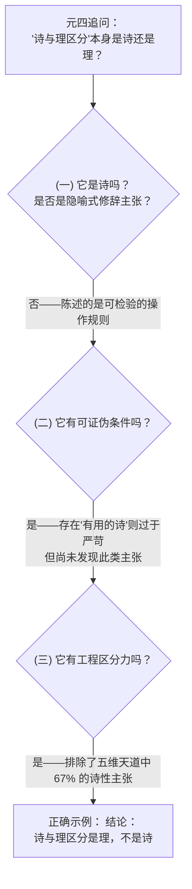

- 它是诗吗？
  - "诗与理区分"本身不是一个隐喻式的修辞主张
  - 它陈述的是一条操作规则："如果无法指明可证伪条件，则不能进入道层。"
  - 这条规则是可检验的
- 它有可证伪条件吗？
  - 有
  - 如果存在一个无法设定可证伪条件但仍然具有工程区分力的主张（即"有用的诗"），则"诗与理"的区分作为准入门槛就过于严苛
  - 但截至目前，尚未发现这样的主张：声称"深刻但不可证伪"的主张一旦被要求说明工程后果，通常都归于空洞。
- 它有工程区分力吗？
  - 有
  - 它排除掉了五维天道中 67% 的诗性主张

结论：诗与理区分是理，不是诗。

### 5.3 方法论有效性的经验证明

司衡方法论的有效性不来自逻辑演绎，而来自它在司衡自身建构中的实际表现：

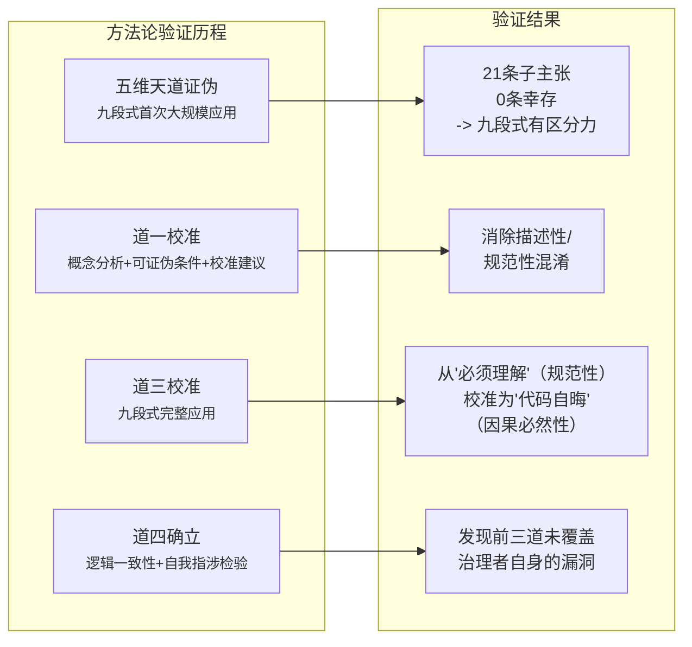

- **五维天道证伪**（九段式首次大规模应用）
  -> 21 条子主张，0 条幸存：证明九段式有区分力

- **道一校准**（概念分析 + 可证伪条件 + 校准建议）
  -> 消除描述性/规范性混淆

- **道三校准**（九段式完整应用）
  -> 从"必须理解"（规范性）校准为"代码自晦"（因果必然性）

- **道四确立**（逻辑一致性 + 自我指涉检验）
  -> 发现前三道未覆盖治理者自身的漏洞

每一轮检验不仅检验了被检验的主张，也检验了方法论本身。方法论在每一次成功区分真道与伪道的过程中积累了自己的可信度。

### 5.4 三种方法论偏见

九段式作为方法论工具，其设计本身承载了三种内生偏见。承认这些偏见不否定九段式的有效性，而是将其产出正确定位为"经过压力测试的校准建议"而非"被证明的真理"：

- **反证偏见**：九段式偏好寻找最强反证，可能导致对主张的过度怀疑。一个在实际工程中被广泛验证的主张，可能因一个精心构造的反例而被要求校准，即使该反例在工程中极少出现。意识到这个偏见，意味着反推检验是必要但不充分的：：通过九段式不等于"被证明为真"，未通过九段式也不意味着"在工程中无效"。
- **精确性偏见**：九段式偏好精确可操作的主张（能拆解为子主张、能设定可证伪条件），可能低估模糊但有洞察力的直觉。五维天道中的一些隐喻（"上善若水"）在精确性检验中被排除，但其背后可能有尚未被精确化的工程直觉。
- **片断化偏见**：九段式将主张拆为子主张逐一检验（第五段），可能丢失整体视角：：一个主张的整体说服力可能大于各部分之和。因此，即使全部子主张通过检验，仍需要一步"整体审视"来确认组合后的含义是否与原主张一致。

## 六、案例：方法论在司衡体系建构中的运用

### 6.1 案例一：五维天道的大规模证伪

背景：司衡早期体系将代码工程的道表述为五个独立的维度：运行之道、结构之道、演化之道、制约之道、映射之道。这五个维度被视为五条独立的因果必然性。

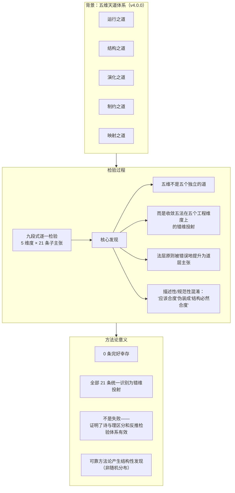

检验过程：对五个维度下的 21 条子主张逐一应用九段式检验。

核心发现：五维不是五个独立的道，而是收敛五法在五个工程维度上的错维投射：法层原则被错误地提升为道层主张。这犯了与道一校准前相同的描述性/规范性混淆：将"应该合度"伪装成"结构必然合度"。

方法论意义：这场大规模的自我证伪不是失败，它证明了诗与理的区分和反推检验体系确实有效。一个不可靠的方法论会产生随机分布的结果；一个可靠的方法论会产生结构性的发现（在此案中，所有 21 条被统一识别为错维投射）。

四种失效模式（从五维证伪中归纳）：

| 失效模式     | 定义                         | 例子                         |
| ------------ | ---------------------------- | ---------------------------- |
| 范畴混淆     | 将规范性主张伪装为描述性     | "代码结构必然清晰"           |
| 概念映射错误 | 将工程概念与道家概念强行对应 | "'当其无有器之用'->结构之道" |
| 隐喻僭越     | 以诗意比喻替代因果论证       | "接口是代码世界的无"         |
| 空洞深刻     | 表述宏大但无操作含义         | "架构的本质是制造虚空"       |

### 6.2 案例二：道一从"收敛必然"到"收敛必-为"

原命题："发散自然，收敛必然"

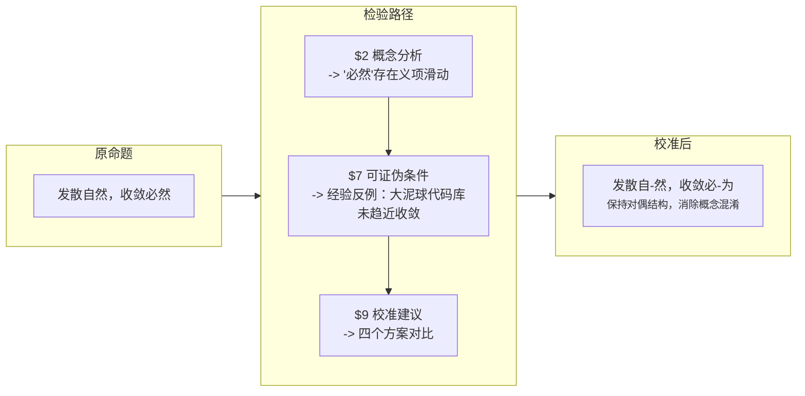

检验路径：第二段（概念分析）-> 第七段（可证伪条件）-> 第九段（校准建议）

关键发现：概念分析揭示"必然"在描述性（"正在收敛"）与规范性（"必须收敛"）之间滑动。经验反例（大泥球代码库没有在趋近收敛）推翻了描述性解读。校准保留了对偶结构，同时消除了概念混淆。

方法论要点：并非所有检验都需要经过全部九段。当概念分析已经发现核心问题时，后续段落用于确认和深化发现，而非从头开始。

### 6.3 案例三：道三从"代码必须被理解"到"代码自晦，意图必复"

原命题："代码必须被理解才能被维护"

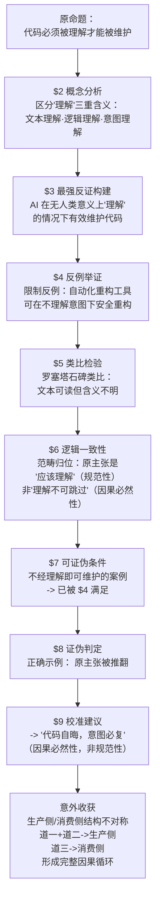

检验路径：完整九段式（见《司衡哲学论证集》$二）

关键发现：

1. 第二段：区分"理解"的三重含义（文本理解、逻辑理解、意图理解）
2. 第三段：最强反证：AI 可以在不具备人类意义上"理解"的情况下有效维护代码
3. 第四段：限制反例：自动化重构工具可在不理解意图的情况下安全重构
4. 第五段：罗塞塔石碑类比：文本可读但含义不明，支持"理解需要额外信息"
5. 第六段：原主张是"应该理解"（规范性），不是"理解不可跳过"（因果必然性）：范畴归位
6. 第七段：可证伪条件：若存在不经理解即可维护的案例，已被步骤 4 满足
7. 第八段：证伪：原主张被推翻
8. 第九段：校准："代码自晦，意图必复"（因果必然性陈述，非规范性要求）

意外收获：校准过程中发现了生产侧/消费侧的结构不对称，道一 + 道二覆盖生产侧，道三补全了消费侧，形成完整因果循环。方法论的价值不仅在于排除伪道，还在于发现新道。

## 七、鉴与司衡体系的关系

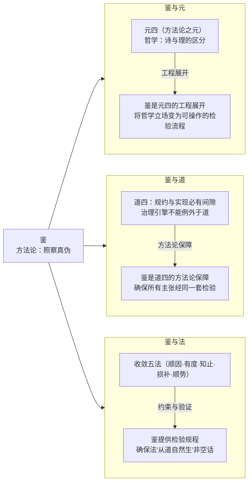

### 7.1 鉴与元：方法论之元（元四）的工程展开

元四（方法论之元）确立了"诗与理"的区分作为道的准入门槛。鉴是元四的工程展开：它将"诗与理"从一个哲学立场变为一套可操作的检验流程。

- 诗与理的区分：反推九段式 + 检验清单
- 可证伪标准：[$四、可证伪条件的设定规则）](#四可证伪条件的设定规则)
- 自我指涉：[$五、自我指涉：方法论自身的检验](#五自我指涉方法论自身的检验)
- "诗"的排除：四种失效模式的识别与分类

元四回答了"为什么需要方法论"，鉴回答了"方法论具体是什么"。

### 7.2 鉴与道：道四自我指涉的方法论保障

道四断言："规约与实现必有间隙：治理引擎不能声称自己例外于道。"
鉴是道四的方法论保障：它确保治理引擎的每一个主张：包括道四自身：都经过同一套检验。没有鉴，道四只是一个姿态；有了鉴，道四是一个可验证的承诺。
具体而言，鉴保证了引擎的规约可以像被治理对象的规范一样被检验。

### 7.3 鉴与法：方法论如何约束法的发现与选择

收敛五法（顺因、有度、知止、损补、顺势）不是随意命名的：每一条法都必须：

1. 能够追溯到它"所顺之道"（因果必然性依据）
2. 具有工程区分力（遵循与不遵循有可观测的差异）
3. 不与其他法冲突

鉴提供了检验这三条的规程：它确保法"从道自然生"不是一句空话，而是可以逐条验证的。

## 八、使用指南

### 8.1 何时使用本鉴

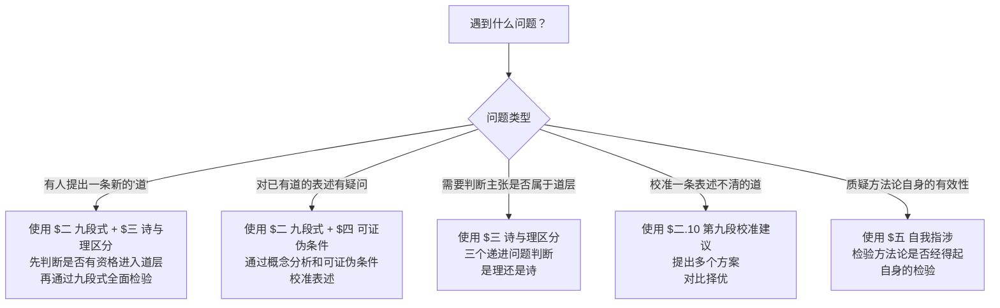

| 场景                         | 使用的章节                       |
| ---------------------------- | -------------------------------- |
| 有人提出一条新的"道"         | $二（九段式）+ $三（诗与理区分） |
| 对已有道的表述有疑问         | $二（九段式）+ $四（可证伪条件） |
| 需要判断一个主张是否属于道层 | $三（诗与理区分）                |
| 校准一条表述不清的道         | $二.10（第九段：校准建议）       |
| 质疑司衡方法论自身的有效性   | $五（自我指涉）                  |

### 8.2 本鉴的自我声明

按照道四的要求，本鉴声明自身的不完备性：

- 九段式不能保证 100% 的检验准确率：它可能漏判（将伪道判为真）或误判（将真道判为伪）
- 诗与理的区分存在灰色地带：某些主张可能兼具理的内容和诗的表述
- 本鉴尚未经历足够多的独立案例检验：当前所有案例均来自司衡自身的建构过程

这些不完备不否定本鉴的有效性：它们只是诚实地承认：方法论也受道四的约束。鉴不是终极真理，鉴是当前最好的检验工具。如果未来发现了更好的检验方法，司衡应能演化。

> 鉴之以为鉴，不鉴之以为不鉴。 一个经得起自身检验的方法论，比一个声称自己永远正确的方法论更值得信任。

## 附录

### ADR

追溯性定稿确认

#### 背景

本文定义鉴的九段式检验框架、诗与理区分标准、可证伪条件及自我指涉处理，经多轮案例检验和自指验证后认定方法有效。

#### 决策

确认为 3/3（定稿）。鉴论框架稳定，后续新增案例检验不改变方法本身。

#### 后果

- 正向：道层主张可依赖此框架进行反推检验
- 风险：无已知风险

> 本附录的设计决策由 AI 辅助生成，人类审核确认。

### DEPS

- 240602-0900-on-sihankor
  - 总纲：鉴在六层脉络中的定位
  - [司衡论](./On-SiHankor.sih.md)
- 240602-0930-on-sihankor-tao
  - 道论：鉴检验的对象
  - [司衡道论](./On-SiHankor-Tao.sih.md)

### SEE-ALSO

- 240610-1030-on-sihankor-canon
  - 法论，方法论与鉴的边界
  - [司衡法论](./On-SiHankor-Canon.sih.md)
