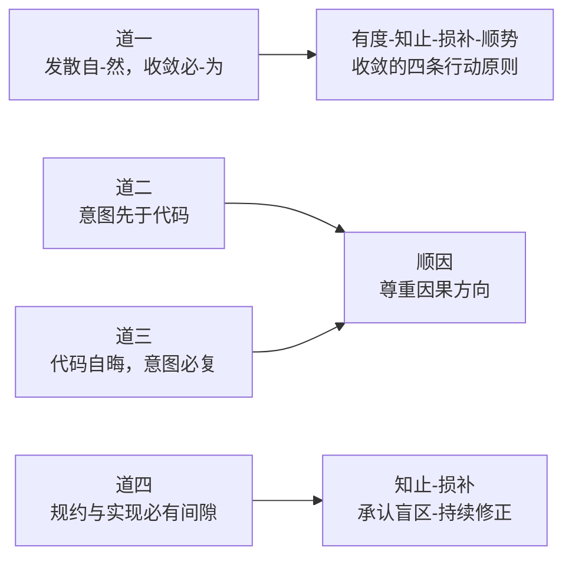
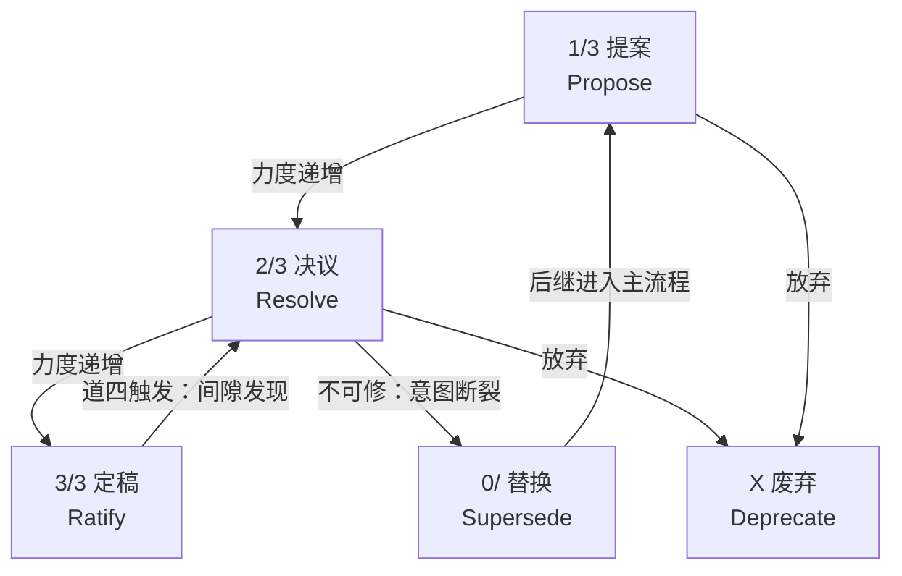

# 司衡法论

> 法者，从道而生之方法论原则也。

道是"被发现的"因果必然性，法是"被推导的"行动原则：面对道的矛盾，应该遵循什么原则来行动？本文系统阐述收敛五法的完整推导、以及从道四与元三推导出的生命周期修正机制。

## 一、破题：何为法

### 1.1 法在六层脉络中的位置

法居[六层脉络](./On-SiHankor.sih.md#11-字源释义)第二层，生发自道：道回答"为什么"，法回答"怎么做（原则层面）"。六层全貌（元→道→法→术→几-约-形迹）及层间关系见[《司衡论》](./On-SiHankor.sih.md)。

#### 法与道的根本区别

| 维度       | 道                     | 法                                 |
| ---------- | ---------------------- | ---------------------------------- |
| 性质       | 因果必然性             | 方法论原则                         |
| 来源       | 被发现                 | 从道推导                           |
| 检验方式   | 反推检验 + 可证伪条件  | 实践验证 + 合道性检验              |
| 可否有替代 | 否：道不成立则体系崩溃 | 是：同一道可生出不同法（只要合道） |
| 违反后果   | 不可违反（如同重力）   | 违反则不合道（治理失效或过度）     |

### 1.2 法的生发逻辑

道自然生法：这不是"道命令法"，而是"理解道之后，法作为合理的回应自然浮现"。四道定义见[《司衡道论》](./On-SiHankor-Tao.sih.md)。

生发链：



五法中，顺因直接对应道二和道三的因果方向；有度、知止、损补、顺势四条从道一的"收敛必-为"展开：它们回答的是同一个问题的不同侧面：收敛应该如何进行？知止和损补同时从道四获得额外的推导依据。

## 二、收敛五法

### 2.1 顺因：尊重因果方向

**定义**：意图先于规范，规范先于实现。任何逆因果方向的操作都是违道。

| 项目     | 内容                                                                         |
| -------- | ---------------------------------------------------------------------------- |
| 所顺之道 | 道二（意图先于代码）+ 道三（意图必复）                                       |
| 核心原则 | 治理链的每一环必须保持因果方向：上游决定下游，下游不逆定上游                 |
| 双向性   | 不仅"意图->规范->代码"是顺因，"代码->恢复意图->理解需求"也是顺因（道三方向） |

#### 在治理中的具象

- spec-coding：意图显式化为规范，代码从规范生成
- upstream 溯源：每份文档标注治理授权来源，形成不可逆的授权链
- iCL 明晰递进：解析->判读->约取，不可跳过
- 文档归纳合成：从多份 source 文档归纳为一份 compendium 时，归纳本身是意图的再次编码（道二的递归适用）。每次归纳必须保持可追溯到原文的 resolve_ref 路径：归纳者的解读不得扭曲原始文档的含义

**关键检验**：一个治理操作是否顺因，看它是否在逆因果方向施加控制。例如：用代码反推来"纠正"规范：这是逆因，违道。用规范来约束代码：这是顺因，合道。

### 2.2 有度：收敛恰到好处

**定义**：规约不多不少。过度规约 = 刻意有为 = 违道；不足规约 = 放任发散 = 无收。

| 项目     | 内容                                                             |
| -------- | ---------------------------------------------------------------- |
| 所顺之道 | 道一（收敛必-为，但过犹不及：强制超过必要的收敛是对自-然的僭越） |
| 核心原则 | 治理力度与被治理对象的条件相匹配：复杂度、认知源数量、变更频率   |
| 度的判据 | 如果一条规范带来的麻烦比解决的问题还多，它就是过度的             |

#### 力度的三级分化

| 力度              | 含义     | 违反后果  | 适用场景                         |
| ----------------- | -------- | --------- | -------------------------------- |
| 戒（F-Forbid）    | 硬约束   | 拒绝      | 违反将导致系统性不可维护性的操作 |
| 规（G-Guideline） | 软规范   | 鉴行标记  | 偏离应被看见但不阻断流程的操作   |
| 矩（J-Judgment）  | 精确判定 | pass/fail | 可机械判定的合规性检查           |

#### 有度与知止的边界

有度问"做多少"，知止问"不做哪些"。有度调节力度，知止划定边界。两者从道一和道四的不同侧面推导

### 2.3 知止：知道不做什么

**定义**：不是所有东西都需要规约，不是所有规约都需要 ratify，不是所有问题都能通过治理解决。

| 项目     | 内容                                                                                      |
| -------- | ----------------------------------------------------------------------------------------- |
| 所顺之道 | 道一（发散自-然：部分发散是良性的，不需要遏制）+ 道四（治理有盲区：不是所有问题都能治理） |
| 核心原则 | 知道治理的边界比知道治理的方法更难，也更重要                                              |
| 双重来源 | 从道一：过度治理是违道；从道四：治理不完备是结构性的                                      |

#### 知止的三层判据

1. **不规约什么**：idea 类型允许意图保持隐性；一次性脚本不需要 spec；探索性原型不需要 ratify
2. **不引用什么**：非 ratify 文档不被下游引用；观察域文档不参与 upstream 链
3. **不能治理什么**：治理引擎自身的自指不完备（道四）不可消除，只能管理

**知止的自指**：知止之法本身也受知止约束：知止不应膨胀为"一切都不做"的借口。知止的边界由损补之法动态调节。

### 2.4 损补：损有余补不足

**定义**：去冗余、减发散、填空白、补缺失。不是随机增删，而是有方向的调节。

| 项目     | 内容                                                                                   |
| -------- | -------------------------------------------------------------------------------------- |
| 所顺之道 | 道一（发散不均匀：某些区域发散更严重，需要定向治理）+ 道四（间隙需要持续修正）         |
| 核心原则 | 调节的方向由道的约束确定：违反顺因处要补，违反知止处要损                               |
| 方向性   | "损"是减掉冗余规约，"补"是补齐缺失规约。两者不对称：损比补更难，因为删东西需要更多判断 |

#### 损补在生命周期中的体现

- Reopen 是损补的触发机制：道四间隙被发现 -> 损（修正旧规范的错误部分）+ 补（填充缺失的覆盖）
- Supersede 是损补的极端形式：旧文档整体被判定为"有余或不足到无法在原框架内修正"
- 约系（符约+文约）是损补的工程实现：从博（海量代码/文档）返约（结构化索引）

### 2.5 顺势：力度适配场景

**定义**：不该收敛时收敛 = 拔苗助长；该收敛时不收敛 = 错失时机。治理力度应随条件变化而适配。

| 项目     | 内容                                                     |
| -------- | -------------------------------------------------------- |
| 所顺之道 | 道一（发散的强度随条件变化，治理力度应适配而非一成不变） |
| 核心原则 | 治理有节奏：早期宽松保护探索，后期严格保护稳定           |
| 三层势   | 时势（项目阶段）、地势（代码区域）、人势（认知源数量）   |

#### 顺势在生命周期中的体现

| 阶段    | 治理力度 | 验证标准                                 |
| ------- | -------- | ---------------------------------------- |
| propose | 宽松     | ID 唯一性、基本格式                      |
| resolve | 中等     | 引用可验、术语一致、ADR 结构             |
| ratify  | 严格     | 跨文档引用完整性、内容指纹、治理链完整性 |

**顺势不意味着"可以随意降低标准"**：ratify 阶段的严格性是道一的要求：收敛一旦建立，放松就是发散。顺势调节的是"何时达到严格"，而不是"严格本身可被放松"。

## 三、生命周期治理

> 三阶生命周期是顺势之法与顺因之法在文档治理中的联合工程实现。本节定义其完整的治理规则。所有规则的道层依据（道四、元三）定义见[《司衡道论》](./On-SiHankor-Tao.sih.md)和[《元》](./Arche-The-One-Above-Being.sih.md)。

### 3.1 设计原理：为什么"单向不可逆"需要修正

旧模型将生命周期定义为严格的单向流动：propose -> resolve -> ratify，不可逆行，修正只能"叠加而非覆盖"。此模型隐含的前提是：ratify 代表终局正确。

但道四告诉我们：规约与实现必有间隙。ratify 文档是一种规约，它与其所描述的现实之间必然存在间隙。元三告诉我们：发现是可错的：被 ratify 的认知仍可能在后续反推中被校准。

因此，ratify 不是认知终点。治理体系必须包含正规的**修正通道**：不是"叠加新文档"（那是绕过问题），而是**回到决议阶段重新检验和修改**。

修正后的模型：

- **主流**：propose -> resolve -> ratify（顺势：力度递增）
- **修正流**：ratify -> Reopen -> resolve（道四触发：间隙发现）
- **替换流**：Reopen 不可行时，ratify -> Supersede -> 新 propose（顺因：意图连续但载体更替）



### 3.2 状态定义

| 编码 | 中文 | 英文      | 含义                                                                                                     | 下游引用            |
| ---- | ---- | --------- | -------------------------------------------------------------------------------------------------------- | ------------------- |
| 1/3  | 提案 | Propose   | 想法提出，开放讨论，可大幅变化                                                                           | 不可引用            |
| 2/3  | 决议 | Resolve   | 结构化讨论，绑定 ADR，核心论点已稳定                                                                     | 可引用但需注明阶段  |
| 3/3  | 定稿 | Ratify    | 收敛完成，当前认可版本                                                                                   | 可引为可靠依据      |
| 0/   | —    | —         | 权威归零。treatise/compendium/mapping：后随 successor id（如 0/new-id）。note：后随衰减原因（0/decayed） | 可引用，engine 标记 |
| X    | 废弃 | Deprecate | 概念或方向被放弃                                                                                         | 禁止引用，无后继    |

编码格式与 id 语法见[《司衡文档约定》](../../engineering/SiHankor-Document-Conventions.sih.md)。以下仅定义 type 的语义边界。

#### type 定义

type 回答"文档是什么意图"——不是文档的内容层级（道/法/术），而是写作意图的形态。从 metadata/ 中实际存在的 9 份文档归纳（顺因），仅三种意图：

|    英文    | 中文 | 定义     | 写作特征                     |
| :--------: | ---- | -------- | ---------------------------- |
|  treatise  | 论   | 哲学论证 | 提出主张、展开推导、记录检验 |
| compendium | 纲   | 参照标准 | 定义术语、建立对照、供查阅   |
|  mapping   | 映   | 工程映射 | 哲学概念->工程实践的投射     |
|    note    | 记   | 经验沉淀 | AI 或人类工作中产生的洞察    |

设计约束：

- type 值为全英文词，自文档化。不使用单字母代号。
- type 不绑定目录（术层）、不绑定验证规则（几层）、不与三机建立硬映射。
- type 一经分配不建议变更。

#### stage 的 type 感知语义

同一套 `stage` 字段，不同 type 有不同的治理含义

| type       | 1/3            | 2/3            | 3/3             | 0/               | X    |
| ---------- | -------------- | -------------- | --------------- | ---------------- | ---- |
| treatise   | 提案 (propose) | 决议 (resolve) | 定稿 (ratify)   | 替换 (supersede) | 终止 |
| compendium | 提案           | 决议           | 定稿            | 替换             | 终止 |
| mapping    | 提案           | 决议           | 定稿            | 替换             | 终止 |
| note       | 草稿 (draft)   | 成熟 (matured) | 晋升 (promoted) | 衰减 (decayed)   | 终止 |

note 不经过提案→决议→定稿的治理流程。详见 $6.5。

### 3.3 主流程：Propose -> Resolve -> Ratify

#### 规则一（顺势）

propose -> resolve -> ratify 是力度递增的单向主流程。正常推进不可跳过阶段

#### 规则二（知止）

终止规则。treatise、compendium、mapping、note 均可终止。终止是 stage 变更——需 ADR 记录终止原因。终止后文档迁移至对应 archived 目录（$6.2），stage 变为 X

- propose 终止："不值得推进"。方向被考虑过但未深入，留下记录供未来参考。
- resolve 终止："经结构化检验后被否决"。ADR 记录了为什么此路不通——这是对后来者更珍贵的前置知识。resolve 终止比盲目推进到 ratify 更有治理价值。

resolve 终止后如需重提，属新生而非 Reopen：创建新文档以 1/3 进入主流程，在 deps 中引用旧文档作为前置知识，upstream 继承与旧文档相同的治理授权链。旧文档的 ADR 是珍贵的地图：新提案应在此基础上提出修正方案，而非假装旧的探索没发生过。

#### 规则三（顺因）

所有人为触发的 stage 变更必须有 ADR。stage 变更是治理决策的记录点——每一次推进、退回、终止、替换都是需要存档的判断。标准 ADR 三段式：背景（Context）→ 决策（Decision）→ 后果（Consequences）。

ADR 必须附带**签认（decided-by）**字段，记录决策的意图源头。有效值：人名（人类做出判断，AI 仅辅助记录）或 `ai-assist`（AI 起草 ADR 建议，人类审核确认后签发）。签认不是身份认证，是意图溯源——它回答"这份 ADR 记录的决策，其意图源头是谁"。这是道二（意图先于代码）和道三（意图必复）在 ADR 中的直接应用：如果 ADR 声称记录了一个决策，但签认字段揭示意图源头缺失，则此 ADR 的顺因链不成立。`ai-auto` 不得出现在人需决策的 ADR 上。

**签认的局限与分层防御**。签认是文本字段——AI 可以写入任何人名。这是道四在签认机制中的递归：签认字段（规约）与实际决策过程（实现）之间必有间隙，此间隙不可被更多文本规则消除（知止）。防御是分层的：

1. **签认字段**（法层）：声明意图源头。可伪造，但伪造是有成本的——AI 必须显式说谎，而非默许越权
2. **几层检测**（引擎）：检测可疑模式——ADR 与 stage 变更同 commit、签认人与 Git committer 不匹配、短时间大量 ADR。引擎标记警告，不阻断——因为检测也是可错的（道四）
3. **Git 提交签名**（形迹层）：GPG 签名将 commit 绑定到已知身份。签认人应与 committer 一致。签名仍有伪造空间（人类让 AI 代签），但提高了共谋成本
4. **人工交叉核验**（治理流程）：周期性审核 ADR 签认与 stage 变更历史的对应关系。这是最终的防线——治理者审视治理记录

分层防御不追求"不可伪造"（知止：文本治理达不到），追求"伪造需要跨越多层、留下更多痕迹"（损补：每层增加造假成本）

例外：引擎自动触发的变更不需 ADR——note 的引用驱动推进（1/3→2/3）、自然衰减（→0/decayed）、L-11 被动取消（后继死亡自动恢复）。这些不以人的判断为决策点。

但不需 ADR 不等于不需记录。引擎必须在变更时生成**事件记录**，包含：触发规则引用（Canon 条款或 config.yml 阈值）、触发条件的具体证据（引用来源列表、逾期天数、后继 stage 状态）、触发时间。事件记录是引擎落实已有法层决策的执行凭据——决策在规则 ratify 时已完成，事件记录是"条件满足，执行"的形迹留存。

事件记录存储于 `.sih/events/{doc-id}.yml`，每文档一个 YAML 文件，append-only。此文件与文档同生命周期——文档 X 或晋升清退时，对应事件文件同步归档。Git commit message 仍附简要摘要，但以 events/ 中的结构化记录为权威来源

#### 规则四（道二）

只有 ratify 可被下游作为权威依据引用。iWW 只在 ratify 阶段驱动下游工作流。**例外**：进入 0/ 的文档保留其 ratify 时的引用有效性——0/ 不撤销内容质量，只标记意图转移。engine 标记 "superseded" 而非阻断引用。引用者应关注 successor 进展，但不必须等待 successor ratify

#### 规则五（有度）

阶段推进不产生新文件。同一文件，stage 字段变化，Git 追踪阶段演进

#### 规则六（顺因）

upstream 不随阶段变化。一份文档从 propose 走到 ratify，upstream 始终指向同一份上游授权文档。upstream 的语义是治理溯源（"谁授权了这项工作"），不是阶段快照

### 3.4 修正流：Reopen（从 3/3 退回 2/3）

#### 存在理由（道四）

ratify 文档与其所描述的现实之间的间隙，可能在被 ratify 之后才被发现。当间隙不可忽视时，治理体系必须提供回到决议阶段重新检验的通道

#### 触发条件（道四 + 元三）

Reopen 不是随意的"我觉得还可以更好"。它需要具体的道四证据：发现了规约与现实之间的可指明的间隙：

| 判据     | 说明                                        | 道层依据                         |
| -------- | ------------------------------------------- | -------------------------------- |
| 空白发现 | ratify 文档未覆盖的关键语义被识别           | 道四：规约的有损性导致语义遗漏   |
| 条件变化 | ratify 文档的规范在新条件下不再成立         | 元三：发现是条件依赖的           |
| 内在矛盾 | ratify 文档的内部逻辑被新的反推检验发现矛盾 | 元三+道四：认知可错 + 规约不完备 |

#### 退回规则

1. stage 从 3/3 变为 2/3
2. 文档正文中新增 Reopen 声明节，记录：触发判据、发现人、发现时间、具体间隙描述
3. 原 3/3 的引用关系不自动失效：下游文档的维护者收到 Reopen 通知，自主决定是等待修正还是切换引用
4. Reopen 后的修改遵循 resolve 阶段的 ADR 要求

**Reopen 不是"可随意逆转"**：Reopen 需要道四证据。没有可指明的间隙，不能仅凭"我想改"就退回。这是 Reopen 与"自由编辑"的根本区别：Reopen 是道的必然推论，不是偏好的表达。

### 3.5 替换流：Supersede（0/）及其取消

**定义为 0/ 的条件（顺因）**：当文档需要被整体替换：意图连续但载体更替：而非在原文档内修正时，旧文档进入 0/ 状态。stage 值格式为 0/new-doc-id，后继文档的完整 id 直接编码在 / 之后。Supersede 是 stage 变更（3/3→0/）——需 ADR 记录替换理由和 successor 的选择依据。

判据（与 Reopen 的区别）：

| 维度       | Reopen                   | Supersede                    |
| ---------- | ------------------------ | ---------------------------- |
| 意图连续性 | 连续：在原意图框架内修正 | 连续但重构：需要新的意图载体 |
| 修改范围   | 局部：修正具体内容       | 整体：核心定义改变           |
| 文档载体   | 同一文档                 | 新文档                       |
| 旧文档状态 | 从 3/3 到 2/3            | 从 3/3 到 0/                 |

0/ 文档的 stage 值直接编码了后继文档 ID（如 0/240610-1030-new-doc），无需单独的 successor 字段。这一要求来自顺因之法：读者看到 stage 即知"意图去了哪里"。

**触发时机**：Supersede 不要求新文档已达 3/3。旧文档在 successor id 分配后立即进入 0/，无论新文档当前 stage。新文档以 1/3 进入主流程，正常推进。

**0/ 期间的引用行为**：0/ 不撤销旧文档 ratify 时的内容质量。旧文档在 3/3 时通过了完整检验，这个事实不因意图转移而失效。禁止引用旧文档等于否认它曾是 ratify——这是对治理历史的自我否定。0/ 期间的引用行为按后继 stage 分级：

| 后继 stage | 引用行为                                                                                                                |
| ---------- | ----------------------------------------------------------------------------------------------------------------------- |
| 1/3 或 2/3 | 可引用旧文档。engine 标记 "superseded: successor [stage 描述]"。引用的是旧文档 ratify 时的内容，非 successor 的当前状态 |
| 3/3        | 可引用旧文档。engine 标记 "superseded: use [new-id]"。内容仍有效，但建议迁移到 successor                                |
| X          | L-11 触发，0/ 取消，旧文档恢复原 stage。标记自动移除                                                                    |

**窗口期实践**：旧文档 0/ 后、新文档 3/3 前，下游持续引用旧文档。引旧文档的风险是"内容可能逐渐过时"：engine 标记提醒关注 successor 进展。引新文档的风险是"内容可能错误"：新文档未 ratify，明天可能面目全非。两个风险择其轻。

**Supersede 的内容约束（顺因）**：Supersede 的判据是"意图连续但载体更替"，不是"内容任意推翻"。若新文档 3/3 后内容与旧文档核心结论相互矛盾，不应走 Supersede——它应是独立的 proposal，有自己的 upstream，不声称自己是旧文档的 successor。意图的连续性是 Supersede 的合法性基础，内容的大幅断裂否定意图的连续性。

**Supersede 被动取消：后继终止（道四递归）**：治理者也可能选错后继。当后继文档被废弃（X）或被否决时，0/ 文档可恢复活跃状态。此为 engine 自动触发（L-11），不需 ADR。

1. 若后继 stage 变为 X：0/ 中的编码关系自动解除，原文档 stage 恢复至被替换前的值
2. 若后继在 Reopen 后最终被否决：同上

这一规则的哲学依据是道四的递归适用：规约->实现有间隙，那么选择后继文档这个"规约"与后继文档自身的质量这个"现实"之间同样有间隙。

**Supersede 主动撤回：后继停滞（道四，L-13）**：后继未终止（不是 X）但也不推进（长期停留 1/3 或 2/3）。治理者可主动将旧文档 0/ 取消，stage 恢复至被替换前的值。此为人为触发——需 ADR 记录撤回理由。新文档不自动废弃，触发条件由项目约定（建议：新文档 30 天无活动）。道层依据：治理者对"后继是否能完成"的判断也是规约，此规约与后继实际进展之间的间隙适用道四修正机制。

### 3.6 Reopen -> Supersede 转换

当 Reopen 后发现修改范围过大、无法在原文档框架内完成时：

1. 保留原文档，stage 设为 0/new-doc-id（后继 id 嵌入编码）
2. 创建新文档，以 1/3 进入主流程
3. 新文档的 upstream 可指向与旧文档相同的上游（继承治理授权链）

转换的判据（有度之法）：修改是否改变了原文档的核心定义。增补细节 -> Reopen 即可。重写核心定义 -> 应转换。

### 3.7 规则体系总览

| 编号 | 规则                                                 | 类型   | 道层依据                           | 法层依据  |
| ---- | ---------------------------------------------------- | ------ | ---------------------------------- | --------- |
| L-01 | 主流程单向推进：propose -> resolve -> ratify         | 主流程 | 道二（因果方向）                   | 顺因      |
| L-02 | propose 和 resolve 均可终止                          | 终止   | 道一（部分发散不须遏制）           | 知止      |
| L-03 | 所有人为 stage 变更必须有 ADR                        | 主流程 | 道二（意图先于）                   | 顺因      |
| L-04 | 只有 ratify 可被下游引用                             | 引用   | 道二（因果方向）+ 道四（不完备）   | 顺因+知止 |
| L-05 | 阶段推进不产生新文件                                 | 主流程 | 道三（意图必复，同一意图不应分裂） | 顺因      |
| L-06 | upstream 不随阶段变化                                | 主流程 | 道二（治理溯源链不可逆）           | 顺因      |
| L-07 | Reopen：道四间隙触发，退回 2/3                       | 修正流 | 道四+元三                          | 损补      |
| L-08 | Reopen 需具体间隙证据                                | 修正流 | 元三（发现需方法）                 | 有度      |
| L-09 | Reopen 后原引用不自动失效                            | 修正流 | 道四（下游自主判断间隙）           | 知止      |
| L-10 | Supersede：意图连续但载体更替，stage 设为 0/new-id   | 替换流 | 道三（旧载体无法承载修正后意图）   | 顺因      |
| L-11 | Supersede 被动取消：后继废弃时旧文档自动恢复原 stage | 替换流 | 道四递归（治理者也会选错）         | 损补      |
| L-12 | Reopen -> Supersede 转换                             | 转换   | 道四（有些间隙无法在原框架内填补） | 有度      |
| L-13 | Supersede 主动撤回：后继停滞时可手动取消 0/          | 替换流 | 道四（治理判断与现实进展的间隙）   | 损补      |

### 3.8 流程序解图

流程的可视化拆解见[《司衡文档约定》$六](../../engineering/SiHankor-Document-Conventions.sih.md#六生命周期流程图)。以下为主流程图（$3.1 同）：

## 四、法与术的边界

法层与术层在六层脉络中相邻，但性质不同。此处明确两者的边界，防止以法代术或以术代法的混淆。

### 4.1 区分标准

| 维度         | 法                     | 术                                     |
| ------------ | ---------------------- | -------------------------------------- |
| 回答什么问题 | 应该遵循什么原则？     | 具体怎么操作？                         |
| 与道的关系   | 从道直接推导           | 从法推导 + 实践选择                    |
| 数量         | 五条（收敛五法）       | 不限定（当前核心术：spec-coding）      |
| 可否竞争     | 否：五法合道，缺一不可 | 是：同一法可有多种术，在实践中比较优劣 |
| 变更频率     | 低：道不变则法不变     | 中：术随实践演化                       |

### 4.2 典型混淆案例

**混淆一："spec-coding 是道"**：spec-coding 是顺因之法的核心术，不是道本身。将它提升为道，是以术代道。Decision #41 已确认此校准。

**混淆二："F/G/J 是独立的法"**：F/G/J 三级力度体系是有度之法和顺势之法在术层的工程展开，不是独立的法。力度分级是"有度"的一种实现方式，理论上可以有不同的力度体系（只要合道）。

**混淆三："三阶生命周期规则是术"**：生命周期状态定义属于术层（它定义操作流程）。但生命周期修正机制（Reopen 的条件、Supersede 取消的判据）属于法层：它们是方法论原则，不是操作细节。本文 $三的定义是法层规则，具体的字段操作和工具行为是术层实现。

**混淆四："公理 = 道"或"公理 = 法"**：公理体系是元在体系中的投射，独立于六层脉络。公理一"意图先于代码"确实是道二的另一种表述：这是公理体系与道层重叠之处。但"单向不可逆"等衍生原则属于法层推导，不应被赋予公理的地位。

### 4.3 法层原则与术层实现的分离

以生命周期为例说明法-术分离：

| 层面 | 内容       | 示例                               |
| ---- | ---------- | ---------------------------------- |
| 道层 | 因果必然性 | 道四：规约与实现必有间隙           |
| 法层 | 方法论原则 | L-07：间隙发现时应可退回决议       |
| 术层 | 操作流程   | stage 字段如何变更、通知如何发送   |
| 几层 | 执行机制   | iWW 如何检测 Reopen 条件并触发流程 |

本文定义法层规则（$三）。术层和几层的实现细节不在本文范围内：它们应由相应的术层文档（如哲学纲要 $六）和几层配置（iWW 策略）承载。

## 五、法自身的演化

### 5.1 法的可修正性

法是从道推导的：不是道本身。因此法也是可修正的。如果一条法在实践中被证明不合道（推导错误或遗漏了关键的道层约束），它应该被校准。

法的修正遵循生命周期规则：法论文档自身就是 1/3，将经历 propose -> resolve -> ratify。如果未来发现收敛五法需要调整（例如从道四推导出第六条法），本文可通过 Reopen 机制修正。

### 5.2 法的检验标准

一条法是否成立，检验标准不同于道的检验标准。道的检验追问"这个因果必然性是否真实"——反推、证伪、必然性论证。法的检验追问"这个行动原则是否有效且合道"——三条标准互为补充，缺一不可。

#### 实践检验

法不是逻辑推导的终点，是行动的起点。实践检验追问：在治理中应用此法后，是否产生预期效果？

| 维度           | 说明                                                                             |
| -------------- | -------------------------------------------------------------------------------- |
| 检验方式       | 在真实治理场景中应用此法，观察治理结果是否向收敛方向移动                         |
| 判据           | 应用此法后，发散是否减少？溯源是否更清晰？决策是否更可追溯？                     |
| 与道检验的区别 | 道的反推检验是逻辑的（从结论反推前提是否必然），实践检验是经验的（从应用看效果） |

示例——顺因之法的实践检验：要求每份文档标注 upstream。检验：经过一个治理周期后，是否任一文档都能沿 upstream 链追溯到授权源头？如果出现断链（某文档的 upstream 指向不存在或不可读的文档），则顺因之法在该场景下未被有效执行，但不否定法本身——法是正确的，执行有缺损。

示例——知止之法的实践检验：限制 notes/ 不经过正式治理流程。检验：notes/ 中是否出现了本应在 specs/ 中的系统性定义？如果出现了，说明知止的边界需要重新校准（可能某些 note 应该晋升），而不是知止之法本身错误。

#### 违反后果的可观测性

每条法必须定义：如果违反了，会出现什么可观测的不良后果？这是实践检验的逆问题——不是"做对了有什么好处"，而是"做错了有什么代价"。如果一条法声称很重要但违反后看不到任何后果，它可能是过度规约（违知止）——治理成本是真实的，治理收益是虚幻的。

| 法   | 违反行为                   | 可观测后果                                                       |
| ---- | -------------------------- | ---------------------------------------------------------------- |
| 顺因 | 下游文档不标注 upstream    | 治理溯源链断裂——无法回答"这份文档凭什么在这里"                   |
| 有度 | 对所有文档强制完整验证     | 规范膨胀——propose 阶段文档堆积、推进停滞                         |
| 知止 | 试图用规范消除所有不确定性 | 治理体系本身成为最大的发散源——维护规范的成本超过被治理对象的成本 |
| 损补 | 只补不损（不断加规范）     | 规范总量单调递增——最终无人能读完所有规范                         |
| 顺势 | ratify 阶段放松标准        | 下游引用不可靠——引用者不知道 ratify 文档是否真的可靠             |

违反后果的可观测性是一条法的"安全网"：它确保法的正确性不是纯理论宣称，而是可以被治理实践中的具体现象所校准。

#### 合道性论证

合道性论证是法最根本的检验：法是从道推导的，推导是否正确？核心追问——**如果违反这条法，会导致哪条道描述的后果？如果找不到对应的道，这条法可能是无根之木。**

合道性论证的三个步骤：

1. **识别道层问题**：此法声称解决什么道层矛盾？五法的道层依据见 $二各节
2. **验证因果链**：违反此法 → 道描述的因果后果是否必然出现？这条链中的每一步都必须可论证
3. **排除替代解释**：是否存在另一条道可以更简洁地推出此法？如果存在，此法的道层归属可能需要修正

以顺因为例的合道性论证：

- 道层问题：道二（意图先于代码）+ 道三（代码自晦，意图必复）
- 因果链：不标注 upstream（违顺因）→ 代码与规范的因果关系不可追溯 → 代码自晦后意图无法恢复（违道三）→ 治理失效
- 此链中每一步的必然性：不标注 upstream，则意图-规范-代码的因果链中缺少可验证的链接；缺少链接，则从代码回溯意图时路径断裂；路径断裂，则道三要求的"意图必复"不可实现

五法的完整合道性论证见 $二各节。新提出的法必须通过此三步骤检验方可纳入收敛五法体系；现有五法的修正也必须重新通过合道性论证。

## 六、文档目录治理

> 目录不是引擎扫描的容器，而是收敛治理的人机界面。读者通过目录建立对文档体系的心智模型，目录如果混乱，人的认知就发散。

### 6.1 设计原理

目录在收敛治理中承担三重职能：

| 职能 | 说明                                     | 对应的法                             |
| ---- | ---------------------------------------- | ------------------------------------ |
| 定位 | 读者知道要找的文档在哪个目录             | 顺因：浏览路径应顺应文档意图         |
| 约束 | 新文档必须归入一个已有目录，防止随意堆放 | 有度：目录分类即规约边界             |
| 导航 | 目录名暗示其中文档的阅读模式             | 知止：不引入文档自身不支持的分类维度 |

核心原则：**目录按文档类别分类，不按哲学层级（道/法/术/鉴/元）分类**。读者进入目录时的追问是"这份文档是干什么用的"，而非"这份文档在六层脉络的哪一层"。

### 6.2 五目录定义

文档体系由五类文档构成，对应五个目录。以下逐一定义每个目录的内容边界、格式要求及不同角色的使用方式。

#### specs/ —— 系统规范：系统是什么

| 维度     | 内容                                                                                         |
| -------- | -------------------------------------------------------------------------------------------- |
| 放什么   | 数据模型、业务流程、API 契约、约束条件、状态机。回答"系统应该长什么样"                       |
| 不放什么 | 为什么选这个方案（→ decisions/）、这个方案还处于讨论中（→ proposals/）、踩坑记录（→ notes/） |
| stage    | 1/3（草稿规范）→ 2/3（评审中）→ 3/3（ratify，可被代码引用）                                  |
| 格式     | 1/3 可自由描述，2/3 需结构化，3/3 需完整覆盖                                                 |
| 谁创建   | 工程师撰写；非技术用户口述需求，AI 代理生成；AI 用户与 AI 协作起草                           |
| 子目录   | 按领域。如 `specs/payment/`、`specs/user/`                                                   |

#### proposals/ —— 方向提案：我们应该往哪走

| 维度     | 内容                                                                         |
| -------- | ---------------------------------------------------------------------------- |
| 放什么   | 头脑风暴、RFC、方案对比、技术探索。回答"我们是否应该做 X"或"A 和 B 哪个更好" |
| 不放什么 | 已决定的方案（→ decisions/）、已定稿的系统定义（→ specs/）                   |
| stage    | 1/3（头脑风暴/探索，无需 ADR）→ 2/3（结构化提案，需 ADR）→ X（否决）         |
| 格式     | 1/3 自由描述，甚至可以只有标题+几段想法。2/3 需 ADR 三段式（背景/决策/后果） |
| 谁创建   | 任何角色。非技术用户：描述问题或想法，AI 起草提案。工程师：自行撰写          |
| 子目录   | 按时间。如 `proposals/2026/`。提案天然有时序，且单个提案可能跨多个领域       |

#### decisions/ —— 架构决策：为什么这样选

| 维度     | 内容                                                                     |
| -------- | ------------------------------------------------------------------------ |
| 放什么   | ADR：记录已做出的关键选择及其理由。回答"为什么选了 A 而不是 B、C、D"     |
| 不放什么 | 还在讨论的方案（→ proposals/）、系统定义本身（→ specs/）                 |
| stage    | 3/3（已决策）。decisions/ 不存放 1/3 或 2/3 的文档——这些在 proposals/ 中 |
| 格式     | ADR 三段式：背景（Context）→ 决策（Decision）→ 后果（Consequences）      |
| 谁创建   | 工程师或 AI，在 proposal 决议通过后生成                                  |
| 子目录   | 按领域，与 specs/ 对齐。如 `decisions/payment/`                          |

#### reference/ —— 参照标准：术语是什么意思

| 维度     | 内容                                                                           |
| -------- | ------------------------------------------------------------------------------ |
| 放什么   | 项目术语表、命名约定、编码标准、架构原则速查。回答"这个东西在我们项目里叫什么" |
| 不放什么 | 概念的哲学论证（→ specs/）、为什么选这个标准（→ decisions/）                   |
| stage    | 3/3（静态参照）。如需修订，走 Reopen                                           |
| 格式     | 表格、列表、短定义。以查阅效率为优先                                           |
| 谁创建   | 工程师或 AI，从 specs/ 和 decisions/ 中提取整理                                |
| 子目录   | 按领域。如 `reference/payment/glossary.md`                                     |

#### notes/ —— 知识孵化：我们学到了什么

| 维度     | 内容                                                                                                                                                                        |
| -------- | --------------------------------------------------------------------------------------------------------------------------------------------------------------------------- |
| 放什么   | 工作过程中产生的洞察：踩坑记录、可复用模式、被反复问到的问题、临时解决方案                                                                                                  |
| 不放什么 | 已晋升为正式规范的（→ specs/decisions/）、闲聊或一次性信息（AI 不生成 note）                                                                                                |
| stage    | 1/3（经验的第一次积累）→ 2/3（被跨目录引用，自动推进）→ 3/3（晋升→迁移至 specs/decisions，原 note 清退）→ 0/decayed（衰减→notes/archived/）→ X（终止→docs/archived/notes/） |
| 格式     | 自由格式。AI 可生成 1/3 草稿，但必须人类确认（变更为 2/3）才能进入活跃状态                                                                                                  |
| 谁创建   | AI 草稿 + 人类确认。人在对话中说"帮我把刚才的讨论整理成一条 note"，AI 按格式输出，人确认后落盘。审批规则见 $6.5                                                             |
| 子目录   | 不建议。通过引用链检索，不通过目录浏览                                                                                                                                      |

#### 上游语义判据

五目录的互斥性由"这份文档的 upstream 指向什么"决定

| 若 upstream 指向                | 文档属于     | 因为                           |
| ------------------------------- | ------------ | ------------------------------ |
| 领域总纲或项目总纲              | `specs/`     | 它在定义系统的某个部分         |
| 被变更的 spec 或 decision       | `proposals/` | 它在提案变更已有规范           |
| 对应的 proposal                 | `decisions/` | 它在记录 proposal 的决议结果   |
| 概念出处文档                    | `reference/` | 它在为某个已有概念建立标准表述 |
| （无 upstream，通过引用链计算） | `notes/`     | 它的上游是产生洞察的工作上下文 |

#### 子目录的通用规则

- 所有目录均允许子目录，最多三层。拆分阈值：单目录文件数 > 30。
- 推荐拆分维度见上表。notes 不建议子目录——通过引用链检索，不通过目录浏览。
- 拆分是术层操作——不改变文档的 stage、type、id，不影响引擎索引。

#### 终止文档的统一归宿

所有目录中 stage X 的文档，迁移至 `docs/archived/{原目录}/{name}.X.md`。文件名追加 `.X` 后缀以释放语义命名。note 的 0/（衰减）→ `notes/archived/`，X（终止）→ `docs/archived/notes/{name}.X.md`。

### 6.3 type 与目录的关系

type 是文档的写作意图（内质），目录是文档的阅读路径（外显）。两者对齐但不绑定：

- type 字段是权威来源：引擎从 frontmatter 读 type，不从路径推断
- 目录是约定：人类通过目录浏览文档体系
- 文档可以不在 type 对应的目录中——这是收敛违规，但不是引擎阻断条件

**引擎校验的非法组合**（不穷举合法的，只排除确定的错误）：

| 目录         | 非法 type  | 理由                                         |
| ------------ | ---------- | -------------------------------------------- |
| `proposals/` | 道相关文档 | 道是被发现的因果必然性，不能用提案来"决定"道 |
| `proposals/` | 元相关文档 | 元是构成性条件，先于道的发现，不能提案产生   |
| `notes/`     | 道相关文档 | 道不是从工作中学到的洞察，是推导出的         |
| `notes/`     | 元相关文档 | 同上                                         |

engine 标记异常，不阻断。

### 6.4 domain 字段

根级 spec 文档（无 upstream）需显式声明归属领域，供人类浏览和 engine 的领域推断使用。principle：能推断的不声明，推断不了的才声明。领域通过 upstream 链末端唯一确定，详见[《司衡文档约定》$4.2、upstream字段](../../engineering/SiHankor-Document-Conventions.sih.md#42-upstream-字段)。

### 6.5 notes：治理前置的孵化层

notes 是从经验到规范的中间跳板。notes 不经过提案→决议→定稿的治理流程，而是通过引用信号自然成长——从经验积累到跨目录验证到晋升规范。

#### stage 语义

（type 感知，见 $3.2）：

| stage          | 含义                 | 触发                                                      | 归宿                              |
| -------------- | -------------------- | --------------------------------------------------------- | --------------------------------- |
| 1/3 (draft)    | 经验的第一次积累     | AI 或人类记录洞察                                         | —                                 |
| 2/3 (matured)  | 被多份跨目录文档引用 | engine 检测到引用 >=3 且跨 >=2 目录，自动推进             | —                                 |
| 3/3 (promoted) | 晋升                 | engine 建议 + 人类确认 → 迁移为 specs/ 或 decisions/ 文档 | note 自身清退                     |
| 0/ (decayed)   | 自然衰减             | 逾 `review_after_days` 未晋升                             | `notes/archived/`                 |
| X              | 主动终止             | 人类判定不再适用                                          | `docs/archived/notes/{name}.X.md` |

晋升是 note 的核心价值路径：不是被删除，而是"毕业"为正式治理文档。衰减和终止是两条不同的归宿——一个自然到期，一个主动放弃。

#### 1/3→2/3 自动推进

engine 维护所有 note 的反向引用索引。当引用计数 >=3 且引用来源跨 >=2 目录，engine 自动将 stage 变更为 2/3。此步骤不需人类干预

#### 2/3→3/3 晋升

engine 建议 + 人类确认后，note 的核心内容以合适的形式迁移至 `specs/` 或 `decisions/`。晋升是人为触发的 stage 变更——需 ADR 记录晋升理由和目标目录的选择依据。原 note 清退（不保留）

#### 0/ 衰减

note 在 1/3 或 2/3 停留超过 `review_after_days`，未被跨目录引用或引用不足 → engine 标记 stage 为 `0/decayed` → 移入 `notes/archived/`。衰减的 note 不删除，排除常规检索

#### X 终止

人类判定 note 不再适用 → stage X → 迁移至 `docs/archived/notes/{name}.X.md`。终止是人为触发的 stage 变更——需 ADR 记录终止原因

#### 逾期判定

engine 通过 Git 时间戳和引用链确定有效验证时间。基础性文档的引用视为永久验证。配置项：`.sih/config.yml` 中 `notes.review_after_days`（默认 90）

### 6.6 reference/ 与 glossary/ 的边界

glossary/ 是 reference/ 的跨语言扩展，不独立于 reference 存在。

| 维度     | reference/                             | glossary/                        |
| -------- | -------------------------------------- | -------------------------------- |
| 回答什么 | 概念是什么（单语语义定义）             | 概念在各语言中叫什么（多语映射） |
| 格式     | markdown                               | YAML                             |
| 治理     | 完整生命周期（propose→resolve→ratify） | 轻量治理（字段级分级）           |
| 权威性   | 概念语义的唯一权威源                   | 不重新定义概念，只提供跨语言精度 |

边界规则：

- reference/ 变更必须传播到 glossary/：概念定义变了，跨语言映射可能需要调整
- glossary/ 变更不反向影响 reference/：映射改了（如英文词从 Law 改为 Canon），概念定义没变
- 因果方向不可逆：`specs/` → `reference/` → `glossary/`

### 6.7 glossary 治理模型

glossary 条目是 YAML 结构化数据，不直接套用文档生命周期。采用三层治理：

#### 第一层：条目自声明

每个条目内嵌 `derives-from` 和 `verified` 字段。engine 通过 successor 链解析 derives-from 指向的文档，若文档修改日期晚于条目的 verified，标记 "stale"

#### 第二层：字段级变更分级

| 变更等级 | 触发条件                                     | 治理流程                      |
| -------- | -------------------------------------------- | ----------------------------- |
| 映射调整 | 修改 `mapping`、`disambiguation`、`rejected` | 轻量：直接修改                |
| 概念变更 | 修改 `definition`（zh.yml）                  | 完整：proposals/ → decisions/ |

判定规则是字段级而非语义级：`definition` 字段变更一律走完整流程。

#### 第三层：与 reference/ 的因果链

reference/ 变更 → engine 标记关联 glossary 条目为 "stale" → 维护者审视映射调整。glossary 不反向要求 reference/ 改定义。因果方向不可逆

文件组织、YAML 结构、engine 校验规则及拆分机制等术层细节见[《司衡文档约定》$五](../../engineering/SiHankor-Document-Conventions.sih.md#五glossary-文件格式)。

### 6.8 目录自定义

五目录是司衡的默认治理结构，覆盖绝大多数项目的需求。但不同项目有不同的组织习惯——有的团队习惯 `docs/design/` 而非 `docs/specs/`，有的希望用 `rfcs/` 而非 `proposals/`。

**五类不可增删，目录名可自定义**。五类文档的语义边界（追问、stage 范围、type、upstream 语义）是法层定义——新增或删除一个类别意味着治理模型的变更，需走法层修正流程。目录名是术层约定——在 `.sih/config.yml` 中声明映射即可。

```yaml
# .sih/config.yml
paths:
  docs: docs/
  glossary: docs/glossary/
  dirs:
    specs: design        # 默认 specs/ → 项目使用 design/
    proposals: rfcs      # 默认 proposals/ → 项目使用 rfcs/
    decisions: decisions  # 保持默认
    reference: reference  # 保持默认
    notes: notes          # 保持默认
```

#### 自定义约束

- 映射值必须是单层目录名（不含 `/`），如 `design` 有效，`specs/design` 无效
- 不能将两个类别映射到同一目录名——engine 需通过目录区分文档类别
- 自定义后 engine 按映射表解析，不依赖默认目录名
- `docs/archived/`、`notes/archived/` 不建议自定义

#### 何时自定义

| 场景                                        | 建议                                                               |
| ------------------------------------------- | ------------------------------------------------------------------ |
| 个人项目、新项目                            | 使用默认五目录。降低认知负担                                       |
| 与现有团队惯例对齐                          | 自定义。如团队 10 年用 `design/` 而非 `specs/`——强行改名是舍本逐末 |
| 需要额外目录（如 `assets/`、`prototypes/`） | 在 docs/ 外单独创建，不纳入治理体系                                |

自定义不影响引擎的文档索引——引擎通过 frontmatter 的 type 和 stage 识别文档，目录只是人类的浏览路径。

## 附录

### ADR

追溯性定稿确认

#### 背景

本文经多轮审阅、实际工程验证及跨文档对齐后认定内容完整、自洽。所有法层规则（收敛五法、生命周期治理、文档目录治理）均已在实践中验证有效。

#### 决策

确认为 3/3（定稿）。在后续道层发现或法层修正需求出现前维持此状态。

#### 后果

- 正向：可作为下游文档的法层权威依据
- 风险：无已知风险

decided-by: ai-assist

### DEPS

- 240602-0930-on-sihankor-tao
  - 四道的系统阐述，法从道生
  - [司衡道论](./On-SiHankor-Tao.sih.md)
- 240602-0900-on-sihankor
  - 总纲：道的全貌与六层脉络定位
  - [司衡论](./On-SiHankor.sih.md)

### SEE-ALSO

- 240610-1500-sihankor-document-conventions
  - 术层文档：stage 编码、id 格式、目录结构、glossary 文件格式等约定
  - [司衡文档约定](../../engineering/SiHankor-Document-Conventions.sih.md)
- 260613-1728-sihankor-onomastic-philosophy
  - 命名中英代号对照
  - [命名哲思](../../reference/SiHankor-Onomastic-Philosophy.sih.md)
- 260613-1728-sihankor-philosophy-compendium
  - 生命周期状态定义的术层概述
  - [哲学纲要](../../reference/SiHankor-Philosophy-Compendium.sih.md)
