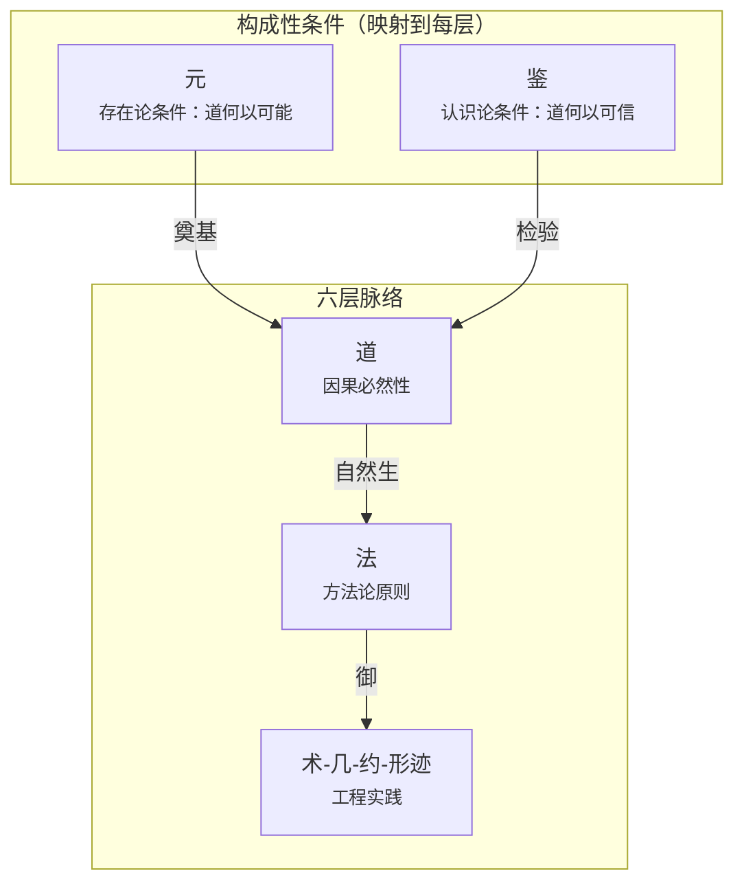
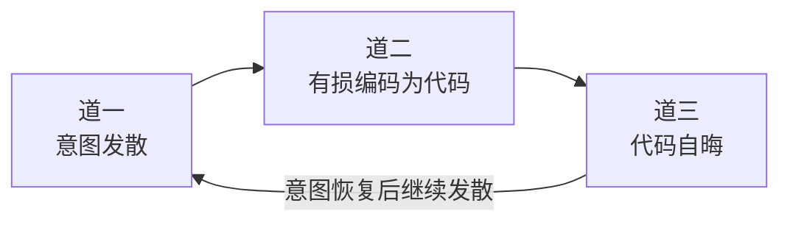
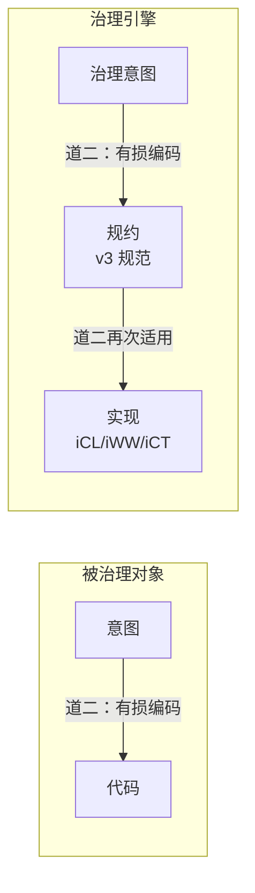
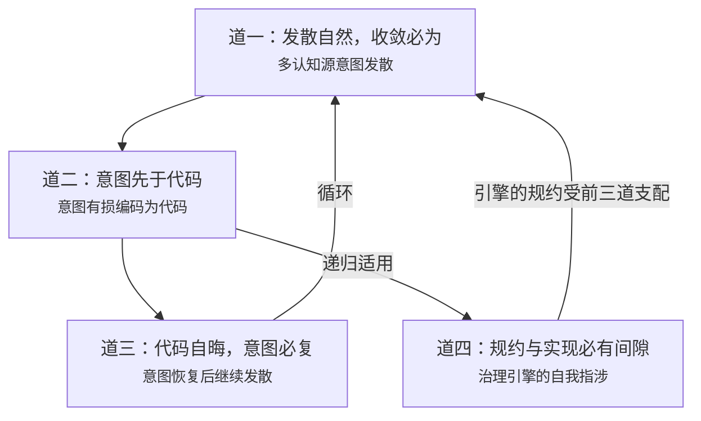

# 司衡道论

> **道者，代码工程之因果必然性也。** 道是"被发现的"而非"被发明的"：它不依赖于我们是否认同而成立。本文是四道的系统阐述：每条道的定义、发现过程、检验记录、可证伪条件与实践推论。

## 一、破题：何为道

### 1.1 道的定位

道在司衡体系中是六层脉络的第一层。它回答一个问题：**为什么会有这个矛盾？**

道不是人为设计的规范，不是工程实践的指南，不是审美偏好。道是代码工程世界中的因果必然性：如同物理学定律之于物质世界。你可以忽视它，但不能使它不成立。

道与体系中其他构成性条件的关系：

- 元回答"道何以可能"：道的发现需要代码工程世界的实在性、自-然原理、人类理性、方法论标准
- 鉴回答"道何以可信"：道的每一个主张都必须经得起反推检验、能设定可证伪条件
- 法回答"面对道应该怎么做"：从道自然生出的方法论原则

### 1.2 道层主张的资格

一个主张要进入道层，必须同时满足以下条件：

- 命题类型是因果必然性（what must be），不是规范性（what should be），不是定义性（what we call it），不是审美性（what we prefer）
- 能够指明"什么证据会推翻它"（可证伪条件）
- 能够通过反推九段式的全部检验，详见[《司衡鉴论》$二、反推九段式](./On-SiHankor-Assay.sih.md#二反推九段式)

五维天道被整体排除出道层（21 条子主张，0 条幸存），正是因为它们没有通过这一资格的检验：它们是将法层原则错误地提升为道层主张的"错维投射"。详见[《司衡鉴论》$6.1 案例一：五维天道的大规模证伪](./On-SiHankor-Assay.sih.md#61-案例一五维天道的大规模证伪)。

### 1.3 四条道

道层共四条。前三条描述被治理对象的因果必然性，第四条将同一套必然性递归应用于治理者自身：

- 道一：发散自然，收敛必为： 为什么代码工程需要治理？
- 道二：意图先于代码： 代码从哪里来？
- 道三：代码自晦，意图必复： 为什么维护代码这么难？
- 道四：规约与实现必有间隙： 为什么治理者也会出错？

## 二、道一

> 发散自然，收敛必为

### 2.1 定义

发散是代码工程在多认知源、无治理干预条件下的默认趋势。发散自己发生（自-然），不需要人推动：每个开发者的理解天然发散，每个方案的探索天然发散，设计空间是无限的。

收敛不是默认方向。默认方向是发散。收敛需要外部的、系统的、持续的治理力量的介入。治理是收敛的构成性条件：没有治理，就没有收敛。收敛必须有人去做（必-为）。

#### 发散的四种形态

发散在代码工程中以四种形态持续涌现：

- 理解发散：同一需求，各人解读不同
- 方案发散：同一问题，解决路径不同
- 实现发散：同一方案，编码方式不同
- 演进发散：同一系统，各部分以不同速度和方向演化

四种形态共享同一个根源：多认知源在无治理干预下的独立运作。从理解到演进，发散的破坏力逐步扩大——理解的偏差导致方案的歧出，方案的分叉固化为实现的分裂，实现的分裂随时间的推移扩大为演进的不可调和。

### 2.2 命题结构

道一是司衡体系中唯一一条**复合命题**：前件为描述性，后件为规范性。这不是缺陷，而是精确：

- **前件（自-然）**：发散自己如此发生。描述性。是对代码工程世界的观察陈述。
- **后件（必-为）**：收敛必须人为介入。规范性。是"如果要收敛，则必须治理"的条件陈述。

两个概念的关键区分：

- 自-然：自己如此（spontaneity）。描述性的。含义："发散不需要人推动就会发生。"
- 必-为：必须人为（must be done）。规范性的。含义："如果不主动治理，收敛不会发生。"

### 2.3 校准历史

道一的现表述并非一蹴而就。原表述为"发散自然，收敛必然"：这个表述存在一个致命的概念混淆。

#### 2.3.1 原命题的问题

原命题"发散自然，收敛必然"中的"必然"在两种含义之间滑动：

- 必然~1~（描述性）：正在收敛："代码库必然走向收敛"：这是对事实的断言
- 必然~2~（规范性）：必须收敛："我们必须让代码库收敛"：这是对应然的要求

当"必然"在描述性与规范性之间滑动时，论证出现了逻辑断裂：从"发散是自然趋势"（描述性的"是"）推出"收敛必然"（规范性的"应该"），缺少了从"是"到"应该"的桥梁。

#### 2.3.2 四维系统性检验

对原命题进行了四个维度的检验：

- 概念一致性：不通过。"必然"在描述/规范间滑动，核心概念不自洽
- 经验可证伪性：不通过。如果"必然"是描述性的，应能指出什么证据推翻它：但实际无法区分"正在收敛"和"应该收敛"
- 与道家的对应：不通过。道家"道法自然"的"自然"是描述性的，"无为"是规范性的，两者从不混淆：原命题的概念混用违反了这一方法论传统
- 工程区分力：不通过。"必然"暗示收敛会自动发生：这与工程实践矛盾：无人治理的项目发散而非收敛

#### 2.3.3 四个校准方案

- 方案一："发散自然，收敛必须"：直接消歧，但"必须"破坏了原文的对偶修辞结构
- 方案二："发散自生，收敛人为"：突出人为性，但"人为"与道家"自然"对立过强，暗示治理是反自然的
- **方案三（采纳）**："发散自-然，收敛必-为"：保持对偶结构；"自-然"还原为"自己如此"（spontaneity）；"必-为"明确为规范性；"自"对"必"，"然"对"为"
- 方案四："发散自-然，收敛使然"："使然"暗示外力驱动，但丢失了"必须人为"的规范性强度

#### 2.3.4 采纳方案三的理由

- 概念精确性："自-然"= 自己如此（描述性），"必-为"= 必须人为（规范性），消除了混淆
- 修辞对偶性：保持了原文的美学结构
- 道家方法论一致性：与道家区分"自然"（描述）和"无为"（规范）的方法论一致
- 工程区分力：明确传达"收敛不会自动发生"：必须有人去做

### 2.4 可证伪条件

道一被推翻，如果：

- 发现存在无需外力干预就能自动收敛的多人代码工程场景
- 发现"收敛必-为"的规范性无法从"发散自-然"的描述性中逻辑推出

截至目前，无一被满足。

### 2.5 实践推论

发散不是均匀的：团队规模越大、系统生存期越长、认知源越多，发散越剧烈。单人短期项目的发散压力极低。这不是反驳道一，而是道一的精确化：发散是条件依赖的，"自-然"描述的是"自己发生"的机制，不承诺"在所有条件下等强度发生"。这一条件依赖性为顺势之法提供了道层根基：治理力度应随条件适配而非一成不变。

- 发散不能根除，只能治理。不要试图"消灭发散"：那是不可能的，也是不必要的
- 代码工程要么在治理下收敛，要么在无治理下发散至不可维护，要么死亡。没有第四条路
- 治理不是锦上添花：它是收敛的构成性条件。没有治理就没有收敛，就像没有力就没有加速度

### 2.6 道一与元二的关系

元二（生成论之元）确立了"自-然"作为道之生成的最根本原理。"自-然"之于道，可类比于"因果性"之于物理学定律：定律是因果性在特定领域的表达，因果性本身不是一条定律。同样，"自-然"使道一成为可能，但"自-然"自身不是道，是元。

## 三、道二：意图先于代码

### 3.1 定义

任何代码被写出之前，写它的人一定先有一个意图。即使是最草率的 copy-paste，背后也有"我需要这个功能"的意图。这是代码工程的因果结构，不是选择。

### 3.2 命题类型

因果必然性。逻辑上不可逆：不存在"先有代码后有意图"的工程场景。即使在最极端的情况下：比如随机生成代码然后试着理解它：理解的瞬间，意图已经出现在代码之后，但这不是"代码先于意图产生"，而是"意图在代码之后被赋予"。代码被产生时仍然有一个意图（"我想看看随机代码能做什么"）。

### 3.3 关键定位

道二确立的是**因果方向**：意图->代码。

一个极其重要的区分：**"意图应被显式化"是法层的规范性建议（顺因之法），不是道层本身。** 将 spec-coding 与道混同，是以术代道的根本谬误。道二只说"意图在因果上先于代码"，不说"意图必须写成文档"。写成文档是法层的选择：一个合道的选择，但仍然是一个选择。

### 3.4 与其他道的关系

道二是道一和道三之间的桥梁：

- 道一说"多认知源的意图发散"：这预设了"有意图"这个前提。道二确立了这个前提
- 道三说"代码是意图的有损编码"：这预设了"代码从意图来"。道二确立了这个因果链的起点

### 3.5 可证伪条件

道二被推翻，如果：

发现"先有代码后有意图"的工程场景：即代码在没有任何人持有任何意图的情况下被产生，且这一产生方式是可复现的。

截至目前，未被满足。随机代码生成器的背后是"生成随机代码"的意图，进化算法的背后是"让程序自己找到解决方案"的意图：意图始终在先。

### 3.6 实践推论

- 逆因果方向的操作是违道的：从代码反推规范是可以的（道三：意图必复），但声称"代码本身就是规范"是不可以的（违反因果方向）
- 代码审查的本质不是"检查代码是否符合规范"：这只是表象。本质是"检查实现是否忠实地传达了意图"
- 意图可以被记录、被传递、被追溯，但不可以被跳过

## 四、道三：代码自晦，意图必复

### 4.1 定义

代码不会自行揭示意图。维护之前必须恢复意图。代码是意图的有损编码：编码过程不可避免地丢失了意图的部分信息。代码作为符号系统，其含义天然不是自明的。

### 4.2 命题类型

因果必然性（符号系统属性）。"自晦"不是代码质量问题，不是某个程序员写得太差：它是符号系统的客观属性。任何将意图编码为符号的过程，都会丢失信息。这不是技术水平能解决的问题。

### 4.3 "自晦"的精确含义

- 代码不是故意隐藏意图：它只是作为符号系统，含义天然不是自明的
- "自晦"是客观属性，不是代码质量问题。好的命名、清晰的结构能降低理解成本，但不能消除它：**编码不可能无损**
- 自晦的程度可以降低（通过好的实践），但自晦本身不能消除（因为编码的本质是有损映射）

### 4.4 校准历史

道三的现表述经历了完整的九段式反推检验。

#### 4.4.1 原命题的问题

原命题为"代码必须被理解才能被维护"。这个表述存在三层问题：

- **规范性伪装为因果性**："必须被理解"是规范性要求（"你应该理解代码"），不是因果必然性（"理解不可跳过"）
- **"理解"概念模糊**：理解代码文本 != 理解写代码时的原始意图。前者是阅读能力，后者是意图恢复：两者不是一回事
- **与 AI 时代的矛盾**：AI 可以维护它不理解（在人类意义上）的代码：如果"理解"是维护的因果前提，AI 是怎么做到的？

#### 4.4.2 九段式反推检验摘要

九段式反推检验的过程和结论（详见《司衡鉴论》$6.3）：

- 第一段（主张提取）：拆解为四个子主张
- 第二段（概念分析）："理解"有三义：文本理解、逻辑理解、意图理解
- 第三段（最强反证）：AI 可以在不具备人类意义上"理解"的情况下有效维护代码
- 第四段（反例举证）：自动化重构工具可在不理解意图的情况下安全重构：这是限制反例，推翻了"理解是维护必要条件"
- 第五段（类比检验）：罗塞塔石碑：文本可读但含义不明，支持"理解需要额外信息"
- 第六段（逻辑一致性）：原主张是"应该理解"（规范性），不是"理解不可跳过"（因果必然性）：范畴归位
- 第七段（可证伪条件）：若存在不经理解即可维护的案例：已被步骤四满足
- 第八段（证伪判定）：原主张被推翻
- 第九段（校准建议）："代码自晦，意图必复"：从规范性要求转为因果必然性陈述

#### 4.4.3 校准的核心转变

从"你应该理解代码"（规范性要求）-> "代码不会自己告诉你意图，你必须主动恢复"（因果必然性）。

校准后的两个要素：

- 代码自晦：代码作为符号系统，其含义天然不是自明的。因果必然性（符号系统属性）
- 意图必复：维护之前必须恢复意图：恢复是维护的因果前提。因果必然性（维护的条件）

### 4.5 生产侧/消费侧的结构性发现

道三的校准揭示了一个在司衡早期体系中缺失的结构性维度：

- 生产侧（写代码）：道一 + 道二覆盖：发散自-然 -> 意图先于代码
- 消费侧（读/维护代码）：道三覆盖：代码自晦 -> 意图必复

原体系只有生产侧的道，缺少消费侧的道。道三的纳入补全了因果循环：

### 4.6 可证伪条件

道三被推翻，如果：

- 发现存在"代码=意图"的编码方式（无损编码）：即代码完全自明，无需额外恢复意图
- 发现维护可以在不恢复意图的情况下可靠进行：即意图恢复不是维护的因果前提

截至目前，无一被满足。好的命名、清晰的架构、充分的文档可以减少恢复成本，但不能将恢复成本降为零：恢复永远是必要的，只是代价不同。

### 4.7 实践推论

- 阅读理解代码的时间远超写代码的时间：这是因果必然性，不是代码质量问题。不要因为代码需要花时间理解而责怪程序员：责怪道
- 好的命名、清晰的结构、充分的注释能降低理解成本但不能消除它：编码不可能无损
- AI 没有取消理解的必要性，只是转移了理解的承担者。AI 帮助恢复意图，但"意图必须被恢复"这一因果前提不变

## 五、道四：规约与实现必有间隙

### 5.1 定义

任何规约都是意图的有损编码（道二），而实现对规约同样是有损编码：形成"意图->规约->实现"的**双重有损链**。规约永远无法完美捕获全部语义意图，实现永远无法完美匹配规约。

试图"消除"这一间隙是徒劳的：正确的策略是承认间隙、管理间隙、在间隙中保持诚实。

### 5.2 命题类型

因果必然性（符号系统属性-递归）。道四是道二的递归应用：如果"意图->代码"有损，那么"治理意图->治理规约->治理实现"同样有损。治理引擎不能声称自己例外于道。

### 5.3 发现过程

道四的发现不是来自对外部世界的观察，而是来自一个**自我指涉的递归追问**：

- 道二说"意图->代码"是有损编码
- 那么治理引擎自身的"意图->规约->实现"是不是也有损？
- 答案必然是肯定的：因为治理引擎也是符号系统，也受道二支配

这就形成了双重有损链：

### 5.4 道四是前三道的自我指涉

道一~道三描述的是被治理对象的因果必然性。道四将同一套必然性递归应用于治理者自身：

- 被治理对象：意图分歧（道一）-> 有损编码（道二）-> 代码自晦（道三）
- 治理引擎：治理意图 -> 治理规约（v3 规范）-> 治理实现（iCL/iWW/iCT 代码）

道四不否定治理的有效性：它否定的是治理的**绝对正确性**。一个承认自己可能出错的治理引擎，比一个声称自己永远正确的治理引擎更值得信任。

### 5.5 常见误解辨析

以下误解必须被澄清：

- **误解**："间隙不可消除"意味着"间隙不可缩小"
- **正解**：好的规约可以减少间隙，好的实现可以逼近规约，但零间隙在逻辑上不可能。缩小间隙是有意义的工程努力；声称可以消除间隙是妄想

- **误解**："承认不完备"意味着"可以不遵守"
- **正解**：道四要求的是**显式声明不完备和正规纠错路径**，而非放任。承认不完备是诚实的前提，不是推卸责任的借口

- **误解**："自我指涉"意味着"自我否定"
- **正解**：道四不否定治理的有效性：它否定的是治理的绝对正确性。自我指涉不是自毁，是自觉

### 5.6 道四的治理检查项

道四不仅是哲学主张：它在司衡治理体系的实际评估中揭示了四个设计缺口：

- **不完备承认力**：规范必须声明自身的不完备性。当前状态：缺失：无 @limitations 机制
- **纠错机制力**：必须有正规的例外和偏离处理路径。当前状态：缺失：@deviation 无强制理由记录
- **版本演化力**：规范演化必须有可追溯的生命周期。当前状态：部分存在：版本号有，演化路径无
- **自我质疑力**：治理体系必须定期审查自身。当前状态：缺失：无自审机制

### 5.7 道四与元三的双重认识论自觉

元三（认识论之元）陈述"发现道的过程不完备"，道四陈述"道的工程化过程不完备"。两者共同构成司衡的认识论自觉：

- 元三"发现是渐进的" -> 道四"规约是渐进收敛的：propose->resolve->ratify 不是一步到位"
- 元三"发现是可错的" -> 道四"引擎的验证结果可能错误：iCT 说'通过'不意味着真的没问题"
- 元三"发现是方法依赖的" -> 道四"规约的完备性取决于表达方法：不同的规范写法产生不同的语义覆盖"
- 元三"发现是不可完备的" -> 道四"规范永远有未覆盖的语义：@limitations 声明不完备性是诚实而非缺陷"

两者的区别在于作用域：元三针对"发现道的过程"，道四针对"将道工程化的过程"。共同结论：**司衡不是一个声称自己完备的体系，而是一个承认不完备但持续收敛的体系。**

### 5.8 可证伪条件

道四被推翻，如果：

发现一个符号系统，其规约能完美捕获全部语义意图且实现能完美匹配规约：即零间隙的编码系统。

最强反例"够简单的规范可以完美"：例如只定义 `name: string` 的规范：已被驳回：即使最简单的规范也有未覆盖语义（"name 用什么编码？是否允许空字符串？长度上限？"）。语义间隙随确认粒度缩小但不可归零。

### 5.9 实践推论

- 治理引擎的设计必须包含自我不完备的承认机制（@limitations 声明、已知间隙记录）
- ratify 不是"文档已完美"：它只是"文档已收敛到可引用的程度"
- iCT 的验证结果不应是不可挑战的：必须有正规的人工例外机制
- 规范演化不仅需要版本号，还需要可追溯的生命周期路径
- 治理体系必须定期审查例外和偏离，防止例外累积导致治理名存实亡

## 六、四道关系

### 6.1 整体结构

四道构成闭合因果循环加自我指涉。前三道形成生产-消费闭合环，道四作为元治理自指轴，将同一因果必然性递归应用于治理引擎自身。

### 6.2 生产-消费闭合环（前三道）

- 意图发散（道一）-> 各认知源产生不同的意图
- 有损编码（道二）-> 意图被编码为代码，信息丢失
- 代码自晦（道三）-> 维护者面对代码，意图不可见，必须恢复
- 意图恢复后继续发散（道一）-> 恢复的意图与原始意图不同，产生新的发散

这是一个完整的因果循环。它不是恶性循环：治理（法-术-几-约-形迹）在这个循环的每个节点上实施干预，减缓发散、降低有损程度、辅助意图恢复。

### 6.3 元治理自指轴（道四）

道四独立于循环之外，但作用于循环的每一个环节：

- 对道一的递归：治理的收敛力本身也可能发散（治理规约被不同执行者不同解读）
- 对道二的递归：治理意图->治理规约同样是有损编码
- 对道三的递归：治理规约也是代码的一种形式：它同样自晦，同样需要意图恢复

### 6.4 四道的完整性

四条道构成一个完整的体系：

- 没有道一，无法解释"为什么需要治理"
- 没有道二，无法解释"代码从哪里来"
- 没有道三，无法解释"为什么维护这么难"
- 没有道四，无法解释"为什么治理者也会出错"：治理者就会滑向声称自己永远正确

四道缺一不可。缺少任何一条，体系都会出现结构性漏洞。

## 七、道的检验：鉴的运用

### 7.1 四道的检验状态

每条道都经过了反推检验，其检验结论如下：

- 道一：经九段式概念分析（第二段）发现描述性/规范性混淆，经校准（第九段）后通过全九段检验。当前表述经得起
- 道二：经逻辑一致性检验（第六段）确认范畴归位正确：因果必然性，非规范性。经得起
- 道三：经完整九段式检验，原命题被证伪（第八段），校准版通过。当前表述经得起
- 道四：经正反论证检验和最强反例驳回。从道二递归推导，不与道一~道三矛盾。经得起

### 7.2 四条道的可证伪条件汇总

- 道一：发现无需外力干预就能自动收敛的多人代码工程场景
- 道二：发现"先有代码后有意图"的可复现工程场景
- 道三：发现"代码=意图"的无损编码方式
- 道四：发现规约能完美捕获全部语义意图且实现能完美匹配规约的符号系统

这些条件精确、可观察、一旦出现即可唯一确定地推翻对应道。截至目前，无一被满足。

### 7.3 开放问题

道层目前有几个尚未正式回应的开放问题：这些是道论诚实声明的不完备之处：

- **发现 vs 发明的自证问题**：司衡凭什么声称"发现"了而非"发明"了道？部分回应（元三的渐进性+可错性），但尚未形成完整的自证论证
- **复杂度悖论**：治理本身是否增加复杂度？治理的复杂度增长是否也有道层必然性？这是一个潜在的"道五"：尚未被正式检验
- **小型项目适用性**：司衡的治理成本是否只适用于大型项目？元一的实践含义部分回应了这个问题，但未在道层做出系统回答

这些开放问题不否定四道的有效性：它们只是诚实地承认：道的发现是不可完备的（元三），任何时候都可能存在尚未被发现的因果必然性。

## 八、道与体系中其他概念的关系

### 8.1 道与元

元是道得以可能的构成性条件。四道依存于四元：

- 道一依存于元二（"自-然"原理）：如果没有"自-然"作为生成原理，"发散自己发生"就无法被理解
- 道二依存于元一（代码工程世界的实在性）：如果没有代码工程这个实践领域，"意图先于代码"就没有发生的场所
- 道三依存于元三（认识论之元）：代码自晦是一个被发现的属性：发现它需要人类理性的认识能力
- 道四依存于元四（方法论之元）：道四的自我指涉需要"诗与理"的区分：它自身必须是理而非诗

### 8.2 道与鉴

鉴是检验道层主张的方法论。四道都经过了鉴的检验：详见 $七。鉴不创造道，鉴区分真道与伪道。五维天道的被排除（0/21 幸存）正是因为它们没有通过鉴。

### 8.3 道与法

法是"从道自然生出"的方法论原则。每一条法都至少追溯到一条道：

- 顺因 <- 道二 + 道三（因果方向不可逆）
- 有度 <- 道一（过犹不及：收敛必须恰到好处）
- 知止 <- 道一 + 道四（不是所有发散都需要遏制 + 治理有盲区）
- 损补 <- 道一 + 道四（发散不均匀需定向治理 + 间隙需持续修正）
- 顺势 <- 道一（发散的强度随条件变化，治理力度应适配）

法不是逻辑必然地从道推导出来的：它们是"发现+选择"的结果。不同的工程传统可能从同一条道中生出不同的法。法的权威不来自逻辑必然性，而来自工程验证：遵循合道、违逆违道。

> **道不远人，人之为道而远人，不可以为道也。** 四道不是远离工程实践的抽象思辨：每一条都可以在日常开发中观察到、体验到、验证到。道之所以为道，不是因为玄妙，而是因为它经得起每一个程序员在每一次维护中的经验检验。

## 附录

### ADR

追溯性定稿确认

#### 背景

本文系统阐述四道的完整推导、可证伪条件及自指检验，经鉴论反推检验和实际工程案例验证后认定内容完备。

#### 决策

确认为 3/3（定稿）。四道定义稳定，不随法层或术层变化而改变。

#### 后果

- 正向：法论和工程映射的推导可据此展开
- 风险：无已知风险

decided-by: ai-assist

### DEPS

- 240602-0900-on-sihankor
  - 总纲：六层脉络定位
  - [司衡论](./On-SiHankor.sih.md)
- 240602-1000-on-sihankor-assay
  - 鉴论：道层主张的反推检验
  - [司衡鉴论](./On-SiHankor-Assay.sih.md)

### SEE-ALSO

- 240610-1030-on-sihankor-canon
  - 法论，法从道生
  - [司衡法论](./On-SiHankor-Canon.sih.md)
