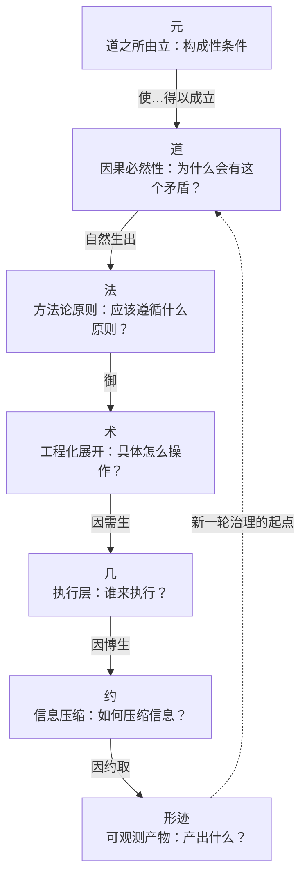
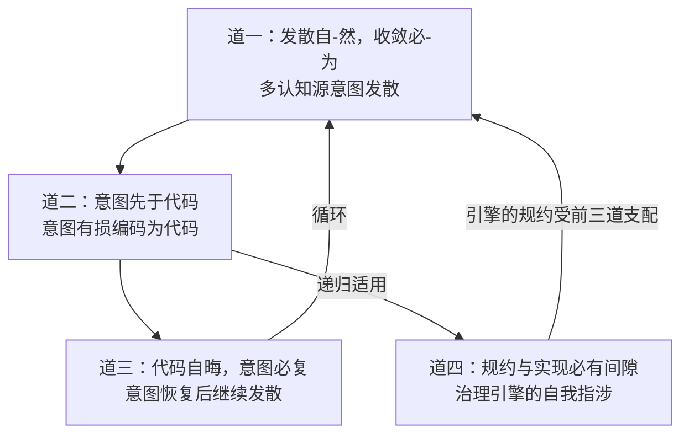
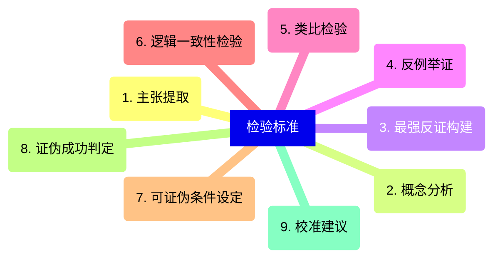
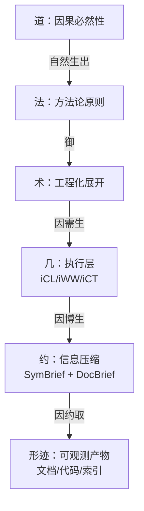
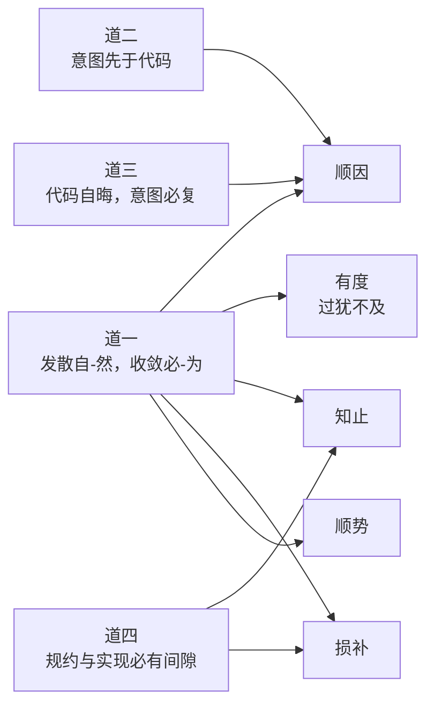

# 司衡论

> **司衡（SiHankor）** ： 一个承认治理自身也不完备的代码工程收敛引擎。其认识论内核是一套完整的、可检验的论证体系。

## 一、破题：何为司衡

### 1.1 字源释义

司，司职：履行职能。不是主宰命运的外来意志，而是代码工程自身演化到需要治理时，自然涌现的治理机能。司意味着有职分、有边界、有方向。

衡，称量、持平。不是简单的收敛或压缩，而是经过度量之后达到的平衡状态。衡的前提是度（量），衡的保障是鉴（照），衡的结果是平（稳）。

合而论之：司衡者，司职称量、驱动持平之治理器官也。它不是外加于代码工程的统治者，而是代码工程自己长出来的收敛机制。

### 1.2 命名意图

司衡是一个收敛治理引擎。它的内核是一套完整的、可检验的论证体系：以“元”为构成性条件，以“道”为论证对象，以反推检验和可证伪条件为方法。工程实践（文档治理、翻译流水线、F/G/J 法则）是这套论证体系在形迹层的投射。

司衡区别于一切“声称自己完备”的治理框架的根本特征在于：它承认治理自身也受道的约束。治理引擎的规约同样是有损编码，验证结果同样可能出错。一个承认自己可能出错的治理引擎，比一个声称自己永远正确的治理引擎更值得信任。

### 1.3 本文之旨

本文是司衡哲学体系的总纲：恰如中国古典的“序”或“引论”，肩负破题、立义、贯脉络三重使命：

- 破题：司衡是什么，它因何而存在
- 立义：司衡的核心概念体系：道、元、法、术、几、约、形迹
- 贯脉络：这些概念从何而来，经历了怎样的推导与校准

本文提供精简而精确的哲学表达。读完本文，可不参阅其他文档而大致知晓司衡的哲学全貌。各概念的详细论证、反推检验记录、工程实现细节，见 `docs/specs/philosophy/` 下其他文档。

## 二、道：代码工程的因果必然性

> 道层是代码工程的因果必然性：回答“为什么会有这个矛盾？”。道是“被发现的”而非“被发明的”。

道层共四条。前三条描述被治理对象的因果必然性，第四条将同一套必然性递归应用于治理者自身。

### 2.1 道一：发散自-然，收敛必-为

发散是代码工程在多认知源、无治理干预条件下的默认趋势。发散自己发生（自-然），不需要人推动：每个开发者的理解天然发散，每个方案的探索天然发散，设计空间是无限的。

收敛不是默认方向。默认方向是发散。收敛需要外部的、系统的、持续的治理力量的介入。治理是收敛的构成性条件：没有治理，就没有收敛。收敛必须有人去做（必-为）。

- **自-然**：自己如此（spontaneity）：描述性的
- **必-为**：必须人为（must be done manually）：规范性的

实践推论：发散不能根除，只能治理。代码工程要么在治理下收敛，要么在无治理下发散至不可维护，要么死亡。治理不是锦上添花：它是收敛的构成性条件。

### 2.2 道二：意图先于代码

任何代码被写出之前，写它的人一定先有一个意图。即使是最草率的复制粘贴，背后也有“我需要这个功能”的意图。这是代码工程的因果结构，不是选择。

命题类型：因果必然性：逻辑上不可逆，不存在“先有代码后有意图”的工程场景。

关键定位：道二确立的是因果方向（意图->代码）。“意图应被显式化”是法层的规范性建议（顺因之法），不是道层本身。将 `spec-coding` 与道混同，是以术代道的根本谬误。

### 2.3 道三：代码自晦，意图必复

代码不会自行揭示意图，维护之前必须恢复意图。代码是意图的有损编码：编码过程不可避免地丢失了意图的部分信息。代码作为符号系统，其含义天然不是自明的。

“自晦”的精确含义：代码不是故意隐藏意图，而是作为符号系统，其含义天然不是自明的。“自晦”是客观属性，不是代码质量问题。好的命名、清晰的结构能降低理解成本，但不能消除它：编码不可能无损。

命题类型：因果必然性（符号系统属性）。

结构性贡献：道三补全了代码工程的消费侧。道一加道二覆盖生产侧（意图->代码），道三覆盖消费侧（代码->理解->维护），形成完整的因果循环。

### 2.4 道四：规约与实现必有间隙

任何规约都是意图的有损编码（道二），而实现对规约同样是有损编码：形成“意图->规约->实现”的双重有损链。规约永远无法完美捕获全部语义意图，实现永远无法完美匹配规约。

道四是前三道的自我指涉：治理引擎不能声称自己“例外于道”。引擎的规约（v3 规范）同样是有损编码，引擎的实现（iCL/iWW/iCT 代码）同样不能完美匹配规约。iCT 说“通过”不意味着真的没问题。

道四不否定治理的有效性：它否定的是治理的绝对正确性。一个承认自己可能出错的治理引擎，比一个声称自己永远正确的治理引擎更值得信任。

- **“间隙不可消除” = “间隙不可缩小”**（误解）：好的规约可以减少间隙，但零间隙在逻辑上不可能
- **“承认不完备” = “可以不遵守”**（误解）：道四要求显式声明不完备和正规纠错路径，而非放任
- **“自我指涉” = “自我否定”**（误解）：道四不否定治理的有效性：它否定的是治理的绝对正确性

### 2.5 四道关系

四道构成闭合因果循环加自我指涉。前三道构成生产-消费闭合环，道四作为元治理自指轴，将同一因果必然性递归应用于治理引擎自身。

## 三、元：道何以可能

> 元者，道之所由立也：使道得以被发现、被检验、被确立的构成性条件之总和。元不是六层脉络中的任何一层，但映射到每一层。

道是“被发现的”。但发现本身需要条件：需要一个真实存在的代码工程世界（道在其中显现），需要一种生成原理（道从世界的运作中涌现），需要一种认识能力（人类理性能够识别道），需要一套方法论标准（能够区分真道与伪道）。这些条件，就是“元”。

### 3.1 元一：存在论之元：代码工程世界的实在性

代码工程作为人类实践领域而存在。道的存在以代码工程世界的存在为前提：无此世界则无此道。代码工程世界不是抽象概念，而是由真实的业务需求、真实的技术环境、真实的认知源构成的实在。这个世界持续变化：这是发散的终极驱动力，也是道永远有新的内容可供发现的根本原因。

实践含义：治理的力度不由治理者的意志决定，而由被治理世界的条件决定。不能要求一个单人项目建立完整的 F/G/J 法则体系。

### 3.2 元二：生成论之元：“自-然”原理

“自-然”：自己如此：是道之生成的最根本原理。在多认知源参与代码工程的条件下，各个认知源按照各自的理解运作，发散“自己如此”地涌现，不需要外力推动。收敛则不然：收敛不能“自-然”发生，需要外力（治理）的介入。

“自-然”之于道，可类比于“因果性”之于物理学定律。物理学定律是因果性在特定领域的表达，因果性本身不是一条物理学定律。同样，“自-然”使道成为可能，它自身不是道。

### 3.3 元三：认识论之元：发现的条件与边界

道是“被发现的”：但发现不是自动的，也不是完备的。人类理性通过观察、反推检验、概念区分、可证伪条件设定等方法，将直觉式的工程观察转变为可检验的因果必然性主张。

发现的四个特性：

- **渐进性**：从“收敛必然”到“收敛必-为”的校准本身就是渐进发现的例证
- **可错性**：被 ratify 的“发现”仍可能在后续反推中被校准
- **方法依赖性**：发现需要反推检验、可证伪性设定、概念区分：没有这些方法，发现只是直觉
- **不可完备性**：任何时候都可能存在尚未被发现的因果必然性

### 3.4 元四：方法论之元：“诗与理”的区分

一个主张进入道层，不是因为它“听起来深刻”：而是因为它能被反推检验、被设定可证伪条件、被区分于纯粹的诗意修辞。

- “诗”：不可证伪的修辞策略。如“接口是代码世界的'无'”：听起来深刻，但无法指出什么证据会推翻它。
- “理”：可被检验的论证策略。如“代码自晦，意图必复”：可以设定可证伪条件（若存在无损编码方式则被推翻）。

元四本身也必须经得起元四的检验：可证伪标准本身必须是可证伪的。否则元就变成了自己所要防止的东西：一个不可检验的终极真理。

## 四、贯脉络：司衡的推导之路

> 司衡不是一个人的灵光一闪，而是一系列诚实的自我质疑和系统性反推的产物。本节记录从命名哲学到体系确立的关键推导节点。详细论证过程见《司衡哲学论证集》。

### 4.1 从命名到体系

司衡的起点是一个看似简单的问题：如何让命名同时满足哲学精确性和工程可用性？从方圆机（iCT）、消息机（iWW）、明晰机（iCL）的命名实践中，提炼出“中文对 + 英文对 + 代号”的三重对齐原则和“拆字见意”的命名哲学。命名不是标签，而是哲学概念的精确投射。

命名哲学的成熟直接催生了元文档 v4.0.0：六层脉络（道->法->术->几->约->形迹）、五条公理、八卦框架、四卷结构。但此时的体系存在一个根本问题：五维天道：将代码工程的道表述为五个独立的维度（运行之道、结构之道、演化之道、制约之道、映射之道）。

### 4.2 关键校准：从“收敛必然”到“收敛必-为”

对道层核心命题“发散自然，收敛必然”的系统性检验揭示了一个关键的描述性/规范性混淆：

- “发散自然”是描述性的：发散确实自己发生
- “收敛必然”中的“必然”在两种含义间滑动：描述性必然（“正在收敛”）和规范性必然（“必须收敛”）

检验发现：“代码工程都在趋近收敛”作为描述性命题不成立：大泥球代码库没有在趋近收敛。最诚实的表述是：代码工程要么在治理下收敛，要么在无治理下发散至不可维护，要么死亡。校准后的表述为“发散自-然，收敛必-为”：前者是描述性的（自己发生），后者是规范性的（必须人为）。

### 4.3 系统性反推：五维天道的证伪

对五维天道体系的系统性反推检验（九段式反推，21 条子主张逐一检验）得出了一个具有里程碑意义的结论：

- **被证伪**：14 条（67%）
- **需校准**：4 条（19%）
- **需重定位**：3 条（14%）
- **完好幸存**：**0** 条（**0%**）

0 条完好幸存。五维不是五个独立的道，而是收敛五法在五个工程维度上的错维投射：法层原则被错误地提升为道层主张。这场大规模的自我证伪不是失败，而是司衡方法论成熟的关键标志：它证明了“诗与理”的区分和反推检验体系确实有效。

### 4.4 元的显性化：从“在而不名”到“名而定体”

五维天道的证伪引发了一个更深层的追问：如果“诗与理”的区分能够成功地排除伪道，那么这个区分本身是什么？它从哪里获得权威？这个追问将司衡的哲学反思推向了比道更根本的层次：元。

元在司衡体系中长期处于“在而不名”的状态：公理体系独立于六层脉络存在（结构的裂缝）、“发现而非发明”的声明（元层次主张）、“诗与理”的区分（方法论标准）：这些都在使用元但没有命名元。经过系统性梳理，元的四重哲学面相被识别并正式命名，完成了从隐性到显性的转变。

## 五、认识论内核：可检验的论证体系

> 司衡之所以能治理，是因为它的内核是一套完整的、可检验的论证体系。这套体系以元为构成性条件，以反推检验为方法，以可证伪条件为准绳。

### 5.1 论证何以是内核

司衡不只是一个翻译工具或文档管理工具。它的每一个概念：从“发散自-然”到“代码自晦”：都不是随意命名的，而是经过了严格的反推检验才被纳入体系的。一个术语的译法、一种文档结构、一个概念解释，当且仅当它经得起反推检验时，才被视为“合道”而成立。

论证的步骤：条件枚举 -> 实例检验 -> 判决输出。这在工程上体现为术语表、翻译规则、LLM 提示词约束：每一个工程决策都可以追溯到某条道的某次检验。

### 5.2 反推九段式

道层主张的检验采用反推九段式。核心原则是最优版本原则：构建的反证必须是该主张面临的最强挑战，而非最容易反驳的版本。如果主张经得起最强反驳，才是可靠的。

### 5.3 “诗与理”的区分

道层主张必须能够指明“什么证据会推翻它”。如果无法指明，就是诗非理，不能进入道层。五维天道中的大量主张（“接口是代码世界的无”、“架构的本质是制造虚空”）正是因为无法通过这一区分而被排除。

### 5.4 可证伪条件

四条道各有其可证伪条件：

- **道一**：发现无需外力干预就能自动收敛的多人代码工程场景
- **道二**：发现“先有代码后有意图”的工程场景
- **道三**：发现“代码=意图”的无损编码方式
- **道四**：发现规约能完美捕获全部语义意图且实现能完美匹配规约的符号系统

如果这些条件被满足，对应的道即被推翻。迄今为止，无一被满足。

### 5.5 自我指涉

论证体系自身也必须经得起论证。元四的可证伪标准本身必须是可证伪的：如果“诗与理”的区分本身是诗而非理，元就变成了自己所要防止的东西。反推九段式在五维天道检验中的成功应用（0/21 幸存，67% 被证伪），证明了这套方法论确实具有区分力：它不是任意的，它产出有意义的判决。

## 六、法·术·几·约·形迹：从原理到实践

> 道自然生法，法御术，术因需生几，几因博生约，约因约取形迹。这十九个字概括了司衡从根本原理到可观测世界的完整架构。

### 6.1 六层脉络总览

- **第一层：道**：回答“为什么会有这个矛盾？”：因果必然性
- **第二层：法**：回答“应该遵循什么原则？”：发现 + 选择
- **第三层：术**：回答“具体怎么操作？”：选择 + 验证
- **第四层：几**：回答“谁来执行？”：工程实现
- **第五层：约**：回答“如何压缩信息？”：工程实现
- **第六层：形迹**：回答“产出什么？”：可观测世界

### 6.2 法：收敛五法

法是从道自然生出的方法论原则。遵循五法则合道，违逆五法则违道。

- **顺因**：尊重因果方向：意图先于规范，规范先于实现。所顺之道：道二 + 道三。在司衡中的体现：spec-coding、resolve_ref 溯源
- **有度**：收敛恰到好处：规约不多不少。所顺之道：道一（过犹不及）。在司衡中的体现：F/G/J 力度体系、三阶段验证梯度
- **知止**：知道不做什么：不是所有东西都需要规约。所顺之道：道一 + 道四。在司衡中的体现：idea 类型、三域边界、propose 可死亡
- **损补**：损有余而补不足：定向调节。所顺之道：道一 + 道四。在司衡中的体现：约系从博返约、iWW 收敛梯度
- **顺势**：力度适配场景：不同阶段不同力度。所顺之道：道一。在司衡中的体现：三阶段力度梯度、iWW 阶段感知

### 6.3 术：Spec-Coding 与三机体系

Spec-Coding 是顺因之法最直接的术：将意图显式化为可验证的规范，代码从规范生成。但它必须保持清醒：它是道的镜子，不是道本身。僵化执行 spec-coding（为了写 Spec 而堆砌文档）变成刻意有为，反而违道。

三机体系是几层的核心实现：

- **方圆机（iCT）**：角色：司规。职能：定义 Schema + 按指定力度验证合规。主权：验证主权
- **消息机（iWW）**：角色：司驱。职能：管理收敛策略 + 驱动工作流。主权：策略主权
- **明晰机（iCL）**：角色：司判。职能：拆解读写修 + 约取形迹。主权：认知主权

三机各有主权，各有边界。认知、策略、验证是三种性质不同的治理功能，混淆会导致权责不清。

### 6.4 几·约·形迹

几：三机流转的执行层。术规定了“做什么”，几执行“怎么做”。三机流转严格按 iCL->iWW->iCT 顺序，不可跳过、不可逆序。

约：从博返约的信息压缩。符约（SymBrief）+ 文约（DocBrief），是损补之法的工程体现。几不能直接处理形迹：形迹太博、太杂、太冗：必须通过约来压缩。

形迹：可观测的产物。文档、代码、索引：一切可被看到、被读取、被验证的东西。形迹为道之显化：六层脉络的终点，也是新一轮治理的起点。

## 七、工程映射

> 司衡的哲学体系在工程中有一一对应的实现。治理不是空谈：每一个哲学概念都有明确的工程实体。

### 7.1 文档治理与 glossary

以论证体系为内核，外层配套治理机制：

- glossary 三层模型：`specs/ → reference/ → glossary/zh.yml → glossary/en.yml`，中文定义是跨语言语义权威源
- 因果方向不可逆：reference 变更传播到 glossary，glossary 变更不反向影响 reference；zh.yml 定义概念，en.yml 提供翻译映射。修正通过 Reopen/Supersede 正规通道进行（见 Canon $3.1 修正模型）
- 文档三阶生命周期：`propose（1/3）→ resolve（2/3）→ ratify（3/3）`，治理力度递增
- 目录即身份：文档 nature 由所在目录唯一确定，不需 type 字段

### 7.2 生命周期与修正机制

三阶生命周期是顺势之法的工程实现。修正机制来自道四（规约与实现必有间隙）和元三（发现可错）：

- **主流程**：propose → resolve → ratify（顺势：力度递增）
- **修正流**：ratify → Reopen → resolve（道四触发：间隙发现，退回重新检验）
- **替换流**：旧文档 stage 0/，successor 新文档从 1/3 进入主流程（顺因：意图连续但载体更替）
- propose 可以终止：不是所有提议都值得推进，留下 ADR 记录即为前置知识

### 7.3 F/G/J 法则体系

有度之法和顺势之法的直接体现：

- **戒（F-Forbid）**：硬约束：违反则拒绝
- **规（G-Guideline）**：软规范：违反则鉴行标记
- **矩（J-Judgment）**：精确判定：pass/fail

每条法则可追溯至至少一条道和至少一条法：不存在无道层溯源的工程规则。

## 八、文献渊源与创新

### 8.1 与道家的关系

司衡大量使用道家术语：“道”、“自然”、“无为”、“知止”、“损补”、“顺势”。但司衡之道是代码工程的因果必然性，不是宇宙本体论。司衡借用道家概念，是因为它们在描述“自然涌现 vs 人为干预”的张力时极为精确：发散是“自-然”的（自己发生的），收敛是“必-为”的（必须人为推动的）。

司衡对道家不是依附，而是创造性转化。“自晦”是一个道家文献中不存在的新概念：它精确地描述了代码作为符号系统的客观属性。道四的自我指涉（治理者也受道的约束）在道家传统中没有直接对应：它是司衡的原创。

### 8.2 与分析哲学的关系

司衡的方法论内核直接受益于分析哲学的两个核心工具：

- 休谟的“是-应该”区分：直接驱动了道一的校准。原命题“发散自然，收敛必然”通过混合描述性要素（“正在收敛”）和规范性要素（“必须收敛”）获得了修辞力量但牺牲了逻辑一致性。校准后严格区分了“自-然”（描述性）和“必-为”（规范性）。
- 波普尔的可证伪性概念：直接塑造了元四“诗与理”的区分。道层主张必须指明可证伪条件，否则就是诗非理，不能进入道层。

### 8.3 司衡的原创贡献

司衡在以下方面做出了现有工程哲学中未见的贡献：

1. 道的自我指涉（道四）：治理者也受道的约束。这一递归结构解决了“谁来治理治理者”的无限后退问题：不是找一个更高的治理者，而是让同一套道递归适用于治理者自身。
2. “自晦”的概念创造：精确区分了“代码不清晰”（质量问题）和“代码作为符号系统无法自我陈述意图”（因果必然性）。前者可以通过写好代码改善，后者不能。
3. 六层脉络的体系结构：从道到形迹的六层递进，提供了从因果必然性到可观测产物的完整映射。
4. F/G/J 力度体系：按后果而非内容对治理规则分类，使规则的可操作性与其哲学根源同时保持清晰。

## 九、阅读指南

### 9.1 文档体系导航

- **[总纲入口](../reference/SiHankor-README.sih.md)**：新用户的第一站。一句话定义 + 三条阅读路径
- **《司衡论》（本文）** `On-SiHankor.sih.md`：总纲：破题、立义、贯脉络。首次接触，建立全貌
- **《司衡鉴论》** `On-SiHankor-Assay.sih.md`：检验方法论：反推九段式、诗与理区分、可证伪条件
- **《司衡道论》** `On-SiHankor-Tao.sih.md`：四道的系统阐述、推导记录、可证伪条件
- **《司衡法论》** `On-SiHankor-Canon.sih.md`：收敛五法、生命周期治理、文档目录治理
- **《元》** `Arche-The-One-Above-Being.sih.md`：元层次的追问式阐述
- **《哲学纲要》** `SiHankor-Philosophy-Compendium.sih.md`（在 reference/）：全部核心概念的权威定义
- **《哲学论证集》** `SiHankor-Philosophy-Arguments.sih.md`：每个概念的反推检验记录
- **《命名哲思》** `SiHankor-Onomastic-Philosophy.sih.md`（在 reference/）：中英代号三重对齐
- **《工程映射》** `SiHankor-Engineering-Mapping.sih.md`（在 engineering/）：哲学到工程的完整映射

### 9.2 阅读路径

- **首次接触**：README（reference/）-> 本文 -> Compendium（reference/）$一~$四
- **查找定义**：Compendium（reference/）文末术语速查表
- **深入理解**：本文 -> Compendium（reference/）-> Arguments 对应章节
- **工程实现**：本文 $七 -> Engineering-Mapping（engineering/）-> Document-Conventions（engineering/）

### 9.3 概念速查

- **元**：道之所由立：使道得以被发现、被检验、被确立的构成性条件
- **道**：代码工程的因果必然性：被发现的，非被发明的
- **法**：从道自然生出的方法论原则：顺因·有度·知止·损补·顺势
- **术**：法的工程化展开：Spec-Coding、三机体系、F/G/J 法则
- **几**：三机流转的执行层：iCL（明晰机）、iWW（消息机）、iCT（方圆机）
- **约**：从博返约的信息压缩：符约（SymBrief）+ 文约（DocBrief）
- **形迹**：可观测产物：文档、代码、索引

## 附录

### ADR

追溯性定稿确认

#### 背景

本文作为司衡总纲，经多轮哲学推导审阅与工程实践验证，六层脉络体系完整、层间关系清晰，内容自洽。

#### 决策

确认为 3/3（定稿）。总纲定义六层脉络全貌，不随单层修正而频繁变动。

#### 后果

- 正向：下游各论著可据此定位层间关系
- 风险：无已知风险

## 附录：ADR 记录

> 本附录的设计决策由 AI 辅助生成，人类审核确认。

### DEPS

- 240602-0930-on-sihankor-tao
  - 道论，道为六层脉络的核心层
  - [司衡道论](./On-SiHankor-Tao.sih.md)

### SEE-ALSO

- 240610-1030-on-sihankor-canon
  - 法论，法从道生
  - [司衡法论](./On-SiHankor-Canon.sih.md)
- 240602-1000-on-sihankor-assay
  - 鉴论，鉴检验道层主张
  - [司衡鉴论](./On-SiHankor-Assay.sih.md)
