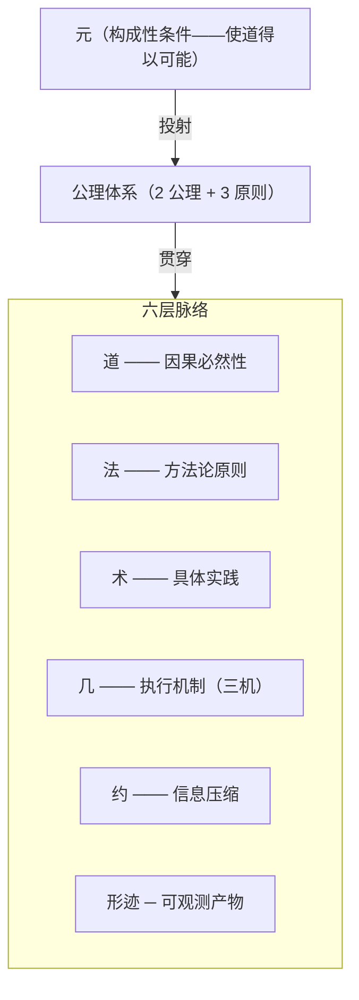
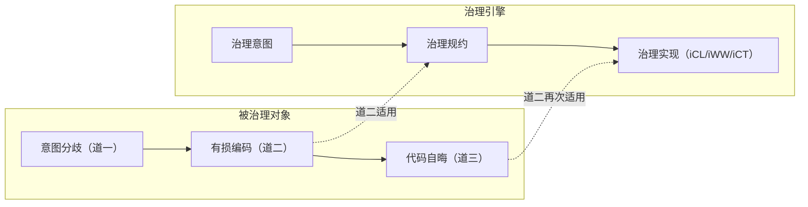
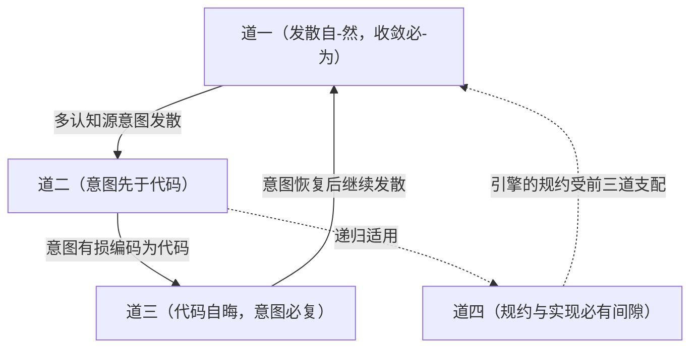
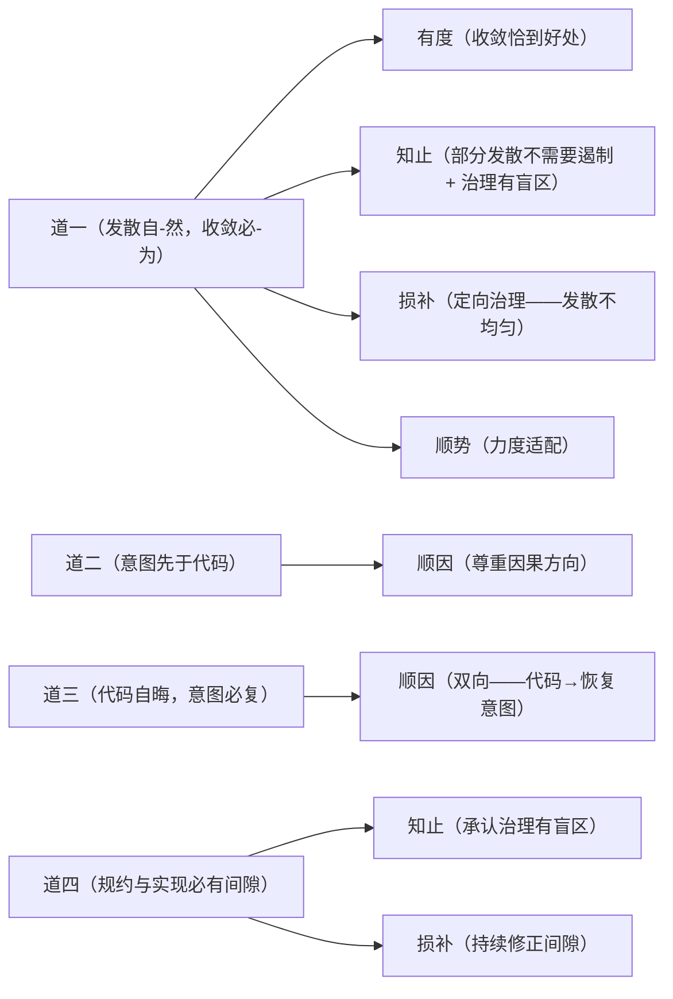

# 司衡哲学纲要

> **司衡（SiHankor）**——一个承认治理自身也不完备的代码工程收敛引擎。

本纲要定义司衡哲学体系的全部核心概念。每个概念在本文中**有且仅有一个权威定义**。如需了解定义的论证过程，参见《司衡哲学论证集》。

## 如何阅读本文

| 读者     | 建议路径                                       |
| -------- | ---------------------------------------------- |
| 首次接触 | 通读全文，跳过「论证注记」灰框                 |
| 查找定义 | 使用「术语速查表」（文末），按术语首字拼音排序 |
| 深入理解 | 阅读「论证注记」灰框，再参阅《论证集》对应章节 |

## 一、司衡的根本命题

代码工程是人类意图的物化过程。物化受因果方向的约束，受计算边界的约束，受符号系统属性的约束。治理，就是在这些约束下让物化过程不偏离意图。但治理自身也受同样约束——治理者也会出错。

这句话包含四个递进层次：

1. **意图先于代码**——这是代码工程的因果结构，不是选择
2. **物化过程必然面临三重约束**——发散、自晦、语义间隙，均为因果必然性
3. **治理是对抗约束的力量**——收敛不会自动发生，必须主动作为
4. **治理自身也受约束**——治理者不是道的例外，规约与实现之间同样有不可消除的间隙

第四个层次是司衡区别于一切"声称自己完备"的治理框架的根本特征。

## 二、体系总览

每一层只回答一类问题：

| 层   | 回答什么问题         | 命题性质（层级特性）         |
| ---- | -------------------- | ---------------------------- |
| 元   | 道何以可能？         | 构成性条件的描述（条件层面） |
| 道   | 为什么会有这个矛盾？ | 因果必然性（逻辑层面）       |
| 法   | 应该遵循什么原则？   | 方法论原则（原则层面）       |
| 术   | 具体怎么操作？       | 实践方法（方法层面）         |
| 几   | 谁来执行？           | 工程实现（工程层面）         |
| 约   | 如何压缩信息？       | 工程实现（工程层面）         |
| 形迹 | 产出什么？           | 可观测产物（产物层面）       |

## 三、元——道何以可能

> **元者，道之所由立也。**
> 元不是六层脉络之上的"第七层"——它是使道得以被发现、被检验、被确立的**构成性条件**。元不在脉络中，但映射到脉络的每一层。

### 元一：存在论之元

**定义**：代码工程作为人类实践领域而存在——道的存在以这个世界的存在为前提，无此世界则无此道。

代码工程世界不是抽象概念，而是由真实的业务需求、技术环境和认知源构成的实在。这个世界持续变化，这是发散的终极驱动力，也是道永远有新内容可供发现的根本原因。

**实践含义**：治理的力度不由治理者的意志决定，而由被治理世界的条件决定。不能要求一个单人项目建立完整的法则体系。

### 元二：生成论之元

**定义**："自-然"——自己如此——是道之生成的根本原理。发散"自己如此"地涌现，不需要外力推动。收敛不能"自-然"发生，需要外力介入。

"自-然"之于道，类比于"因果性"之于物理学定律：定律是因果性在特定领域的表达，因果性本身不是一条定律。"自-然"使道成为可能，自身不是道。

**关键属性**：

| 属性 | 含义 |
| ---- ||
| 自发性     | 发散自己发生，不需要人推动                          |
| 非决定性   | "自-然"不强迫任何事情发生，而是描述事情如何自己发生 |
| 条件依赖性 | 多认知源+无治理干预是发散自-然显现的条件场          |
| 不可根除性 | 只能被相反力（治理）对抗，不能从外部消除            |

### 元三：认识论之元

**定义**：道是"被发现的"——但发现不是自动的，也不是完备的。人类理性通过反推检验、可证伪条件设定、概念区分等方法，将直觉式的工程观察转变为可检验的因果必然性主张。

**关键属性**：

| 属性       | 含义                                                       |
| ---------- | ---------------------------------------------------------- |
| 渐进性     | 从"收敛必然"到"收敛必-为"的校准本身就是渐进发现的例证      |
| 可错性     | 被 ratify 的"发现"仍可能在后续反推中被校准                 |
| 方法依赖性 | 发现需要特定的方法论条件——反推检验、可证伪性设定、概念区分 |
| 不可完备性 | 任何时候都可能存在尚未被发现的因果必然性                   |

### 元四：方法论之元

**定义**：一个主张进入道层，不是因为它"听起来深刻"——而是因为它能被反推检验、被设定可证伪条件、被区分于纯粹的诗意修辞。

**"诗与理"区分**："诗"是不可证伪的修辞策略，"理"是可被检验的论证策略。道层主张必须指明"什么证据会推翻它"——如果无法指明，就是诗非理，不能进入道层。

**自我指涉**：元四本身也必须经得起元四的检验——可证伪标准本身必须是可证伪的。否则元就变成了自己所要防止的东西。

## 四、道——因果必然性

> **道层是代码工程的因果必然性——回答"为什么会有这个矛盾？"。道是"被发现的"而非"被发明的"。**

道层共四条，前三条描述**被治理对象**的因果必然性，第四条将同一套必然性**递归应用于治理者自身**。

### 道一：发散自-然，收敛必-为

**定义**：发散是代码工程在多认知源、无治理干预条件下的默认趋势——发散自己发生（自-然），不需要人推动。收敛不是默认方向——收敛需要外部的、系统的、持续的治理力量的介入（必-为）。

**命题类型**：前件为描述性强统计趋势，后件为规范性条件要求。

**关键区分**：

| 概念 | 含义 | 性质 |
| ---- || -- |
| 自-然 | 自己如此（spontaneity）  | 描述性的 |
| 必-为 | 必须人为（must be done） | 规范性的 |

原表述"发散自然，收敛必然"中的"必然"在描述性（"正在收敛"）与规范性（"必须收敛"）之间滑动。校准版消除了这个混淆——收敛不是自动发生的（描述性），而是必须有人去做（规范性）。

**实践推论**：

- 发散不能根除，只能治理
- 代码工程要么在治理下收敛，要么在无治理下发散至不可维护，要么死亡
- 治理不是锦上添花——它是收敛的构成性条件

> **论证注记**：道一的校准来自系统性反推检验。原命题"发散自然，收敛必然"在四维检验中发现描述性/规范性混淆。四个校准方案经对比后采纳方案三"发散自-然，收敛必-为"——保持对偶修辞结构，消除概念混淆。详见《论证集》$一。

### 道二：意图先于代码

**定义**：任何代码被写出之前，写它的人一定先有一个意图。即使是最草率的 copy-paste，背后也有"我需要这个功能"的意图。这是代码工程的因果结构，不是选择。

**命题类型**：因果必然性（逻辑上不可逆——不存在"先有代码后有意图"的工程场景）。

**关键定位**：道二确立的是因果方向（意图→代码），而"意图应被显式化"是法层的规范性建议（顺因之法），不是道层本身。

### 道三：代码自晦，意图必复

**定义**：代码不会自行揭示意图，维护之前必须恢复意图。代码是意图的有损编码——编码过程不可避免地丢失了意图的部分信息。代码作为符号系统，其含义天然不是自明的。

**命题类型**：因果必然性（符号系统属性）。

**"自晦"的精确含义**：代码不是故意隐藏意图，而是作为符号系统，其含义天然不是自明的。"自晦"是客观属性，不是代码质量问题。

**实践推论**：

- 阅读理解代码的时间远超写代码的时间——这是因果必然性，不是代码质量问题
- 好的命名、清晰的结构、充分的注释能降低理解成本但不能消除它——编码不可能无损
- AI 没有取消理解的必要性，只是转移了理解的承担者

> **论证注记**：道三的校准来自九段式反推检验。原命题"代码必须被理解才能被维护"是规范性要求（"应该理解"），校准为"代码自晦，意图必复"是因果必然性陈述（"理解不可跳过"）。校准同时发现了生产侧/消费侧的结构性不对称——道一+道二覆盖生产侧，道三补全了消费侧。详见《论证集》$二。

### 道四：规约与实现必有间隙

**定义**：任何规约都是意图的有损编码（道二），而实现对规约同样是有损编码——形成"意图→规约→实现"的**双重有损链**。规约永远无法完美捕获全部语义意图，实现永远无法完美匹配规约。试图"消除"这一间隙是徒劳的——正确的策略是承认间隙、管理间隙、在间隙中保持诚实。

**命题类型**：因果必然性（符号系统属性·递归）——从道二递归推导而来。

**道四是前三道的自我指涉**：

道一~道三描述的是被治理对象的因果必然性。道四将同一套必然性递归应用于治理者自身：

治理引擎不能声称自己"例外于道"——引擎的规约同样是有损编码，引擎的实现同样不能完美匹配规约。

**关键区分**：

| 常见误解                          | 正确理解                                                                                                                       |
|  |  |
| "间隙不可消除" = "间隙不可缩小" ❌ | 好的规约可以减少间隙，好的实现可以逼近规约，但零间隙在逻辑上不可能                                                             |
| "承认不完备" = "可以不遵守" ❌     | 道四要求的是显式声明不完备和正规纠错路径，而非放任                                                                             |
| "自我指涉" = "自我否定" ❌         | 道四不否定治理的有效性——它否定的是治理的绝对正确性。一个承认自己可能出错的治理引擎，比一个声称自己永远正确的治理引擎更值得信任 |

**实践推论**：

- 治理引擎的设计必须包含自我不完备的承认机制（@limitations 声明、已知间隙记录）
- ratify 不是"文档已完美"——它只是"文档已收敛到可引用的程度"
- iCT 的验证结果不应是不可挑战的——必须有正规的人工例外机制
- 规范演化不仅需要版本号，还需要可追溯的生命周期路径
- 治理体系必须定期审查例外和偏离，防止例外累积导致治理名存实亡

**道四与元三的双重认识论自觉**：

元三陈述"发现道的过程不完备"，道四陈述"道的工程化过程不完备"。两者共同构成司衡的认识论自觉：

| 元三（发现论） | 道四（工程论） |
| -------------- ||
| 发现是渐进的     | 规约是渐进收敛的——propose→resolve→ratify 不是一步到位           |
| 发现是可错的     | 引擎的验证结果可能错误——iCT 说"通过"不意味着真的没问题          |
| 发现是方法依赖的 | 规约的完备性取决于表达方法——不同的规范写法产生不同的语义覆盖    |
| 发现是不可完备的 | 规范永远有未覆盖的语义——@limitations 声明不完备性是诚实而非缺陷 |

> **论证注记**：道四从道二递归推导而来——道二确立了"意图→代码"的有损性，道四将此必然性递归应用于"规约→实现"的编码链。道四的可证伪条件：若存在一个符号系统，其规约能完美捕获全部语义意图且实现能完美匹配规约，则道四被推翻。最强反例"够简单的规范可以完美"被驳回：即使最简单的规范也有未覆盖语义。详见《论证集》$三。

### 四道关系

四道构成闭合因果循环加自我指涉：

前三道构成**生产-消费闭合环**：意图发散（道一）→ 有损编码（道二）→ 代码自晦（道三）→ 恢复后继续发散（道一）。道四作为**元治理自指轴**，将同一因果必然性递归应用于治理引擎自身。

## 五、法——方法论原则

> **法是从道自然生出的方法论原则。遵循法则合道，违逆法则违道。**

法层共五条，每条可追溯至至少一条道。

### 顺因——尊重因果方向

**定义**：意图先于规范，规范先于实现。任何逆因果方向的操作都是违道。

| 项目 | 内容 |
| ---- ||
| 所顺之道       | 道二（意图先于代码）+ 道三（意图必复）                       |
| 在司衡中的体现 | spec-coding、resolve_ref 溯源、iCL 明→晰递进                 |
| 关键法则       | F-01（代码只能从 ratify 规范生成）、F-02（无上游不得建下游） |

**顺因的双向性**：顺因不仅指"沿因果方向前行"（意图→规范→代码），也指"沿因果方向回溯"（代码→恢复意图→理解原始需求）。道三"意图必复"要求维护时必须从代码回溯意图——这也是顺因。

### 有度——收敛恰到好处

**定义**：规约恰到好处，不多不少。过度规约 = 刻意有为 = 违道；不足规约 = 放任发散 = 无收。

| 项目 | 内容 |
| ---- ||
| 所顺之道       | 道一（收敛必-为，但过犹不及）                                      |
| 在司衡中的体现 | F/G/J 力度体系、三阶段验证梯度、三域边界模型                       |
| 关键法则       | F-03（require 和 spec 不得混行）、F-08（文档必须在 type 对应目录） |

**"度"的判断标准**：核心接口需要 ratify 级确定性，内部实现可能 resolve 就够了，一次性脚本甚至 idea 级意图记录就足够。度的本质是**匹配**——治理力度与被治理对象的条件相匹配。

### 知止——知道不做什么

**定义**：不是所有东西都需要规约，不是所有规约都需要 ratify，不是所有问题都能通过治理解决。知道哪里不需要收敛，比知道哪里需要收敛更难。

| 项目           | 内容                                                                                |
| -------------- | ----------------------------------------------------------------------------------- |
| 所顺之道       | 道一（发散自-然——不是所有发散都需要遏制）+ 道四（治理有盲区——不是所有问题都能治理） |
| 在司衡中的体现 | idea 类型允许意图保持隐性、tags 不参与逻辑、三域边界、propose 可死亡                |
| 关键法则       | G-06（tags 不参与逻辑）、F-13（iCL 不读取未声明路径）                               |

**知止的双重来源**：从道一来看，发散是自-然的，不是所有发散都需要遏制——过度治理本身就是违道。从道四来看，治理不可能完备——承认盲区是诚实的，也是必要的。知止是司衡的自我约束，没有知止，司衡就会滑向过度规约。

### 损补——损有余补不足

**定义**：去冗余、减发散、填空白、补缺失。代码工程的"人之道"是补过度设计而忽略真正需要收敛的地方。损补要求反过来：减掉冗余的规约，补齐缺失的规约。

| 项目           | 内容                                                                             |
| -------------- | -------------------------------------------------------------------------------- |
| 所顺之道       | 道一（发散在特定区域更严重，需要定向治理）+ 道四（规约与实现的间隙需要持续修正） |
| 在司衡中的体现 | 约系从博返约（符约+文约）、iWW 收敛梯度管理                                      |
| 关键法则       | G-04（同格 ratify 文档不超 3 个活跃版本）                                        |

**损补的方向性**："损"不是随机删除——是损有余（过度规约的区域）。"补"不是随机添加——是补不足（缺失规约的区域）。方向由道的约束确定：违反顺因的地方要补，违反知止的地方要损。

### 顺势——力度适配场景

**定义**：不该收敛时收敛 = 拔苗助长；该收敛时不收敛 = 错失时机。在项目不同阶段、不同场景下，收敛的力度和方式应自然适配。

| 项目 | 内容 |
| ---- ||
| 所顺之道       | 道一（发散的强度随条件变化，治理力度应适配）           |
| 在司衡中的体现 | 三阶段力度梯度（宽松/中等/严格）、iWW 阶段感知         |
| 关键法则       | F-06（iCT 不运行时变更 Schema）、G-01/G-02（推进时限） |

**"势"的三层含义**：

1. **时势**：项目阶段不同，治理力度不同（propose 阶段宽松，ratify 阶段严格）
2. **地势**：代码区域不同，治理力度不同（核心接口严格，内部实现宽松）
3. **人势**：认知源数量不同，治理力度不同（单人项目宽松，多人协作严格）

### 五法与四道的对应

## 六、术——具体实践

> **术是法在实践中的具体展开。同一法可以有多种术，不同术可以在实践中比较优劣。**

### Spec-Coding

**定义**：将意图显式化为可验证的规范，代码从规范生成。

**定位**：顺因之法的核心术——最直接地体现"意图先于规范，规范先于实现"的因果方向。但 spec-coding **不是唯一的术**——DDD、极简架构、契约测试等也是合道之术。它是道的镜子，不是道本身。

**关键自觉**：

- 僵化执行就是违道——规约恰到好处，不多不少（有度之法）
- 如果未来有更好的意图显式化方式，司衡应能演化（顺势之法）

### 三机体系

**定义**：三机分权——认知、策略、验证是三种不同的治理功能，混淆会导致权责不清。

| 机器          | 角色 | 职能                             | 主权     |
| ------------- | ---- | -------------------------------- | -------- |
| 方圆机（iCT） | 司规 | 定义 Schema + 按指定力度验证合规 | 验证主权 |
| 消息机（iWW） | 司驱 | 管理收敛策略 + 驱动工作流        | 策略主权 |
| 明晰机（iCL） | 司判 | 拆解读写修 + 约取形迹            | 认知主权 |

**执行流**：`.sih.md 原始文件 → iCL(解析·判读·约取) → iWW(决定验证力度) → iCT(执行验证) → 验证结果 → iWW(驱动/阻断/标记)`

### F/G/J 法则体系

**定义**：戒·规·矩三级力度体系，是有度之法和顺势之法的直接体现。

| 类别 | 含义 | 违反后果 | 示例 |
| ---- | ---- || -- |
| 戒（F-Forbid）    | 硬约束   | 拒绝      | F-01：代码只能从 ratify 规范生成 |
| 规（G-Guideline） | 软规范   | 鉴行标记  | G-06：tags 不参与逻辑            |
| 矩（J-Judgment）  | 精确判定 | pass/fail | J-01~J-10                        |

### 三域边界模型

**定义**：知止之法的工程实现——明确治理的边界。

| 域  | 含义 | 司衡权限 |
| --- ||  |
| 治理域   | sih-docs/ 内部        | 完全管理权（读/写/验证/驱动）  |
| 观察域   | scope.yaml 声明的路径 | 只读访问（约取索引、验证合规） |
| 不可见域 | 未声明的路径          | 完全不可见                     |

### 三阶生命周期

**定义**：顺势之法与顺因之法在文档治理中的联合工程实现。治理力度随阶段递增，但 ratify 不是认知终点——道四（规约与实现必有间隙）和元三（发现可错）要求治理体系包含正规的修正通道。

**状态编码**：

| 编码  | 中文              | 含义                                     |
| ----- | ----------------- | ---------------------------------------- |
| "1/3" | 提案（Propose）   | 想法提出，开放讨论，不可引用             |
| "2/3" | 决议（Resolve）   | 结构化讨论，绑定 ADR，可引用但须注明阶段 |
| "3/3" | 定稿（Ratify）    | 收敛完成，可引为可靠依据                 |
| "0"   | 替换（Supersede） | 已被新版本取代，须标注 @successor        |
| "X"   | 废弃（Deprecate） | 概念或方向被放弃，无后继                 |

**主流程**：propose -> resolve -> ratify，力度递增，不可跳过。propose 可以死亡，resolve 必须有 ADR，只有 ratify 可被下游权威引用。阶段推进不产生新文件，同一文件 stage 字段变化。

**修正流（Reopen）**：当 ratify 文档被发现存在道四间隙（空白发现、条件变化、内在矛盾）时，stage 从 "3/3" 退回 "2/3"，进入决议阶段重新检验和修改。Reopen 需具体间隙证据，不可仅凭偏好退回。原引用关系不自动失效，下游维护者自主决定是否切换。

**替换流（Supersede 及其取消）**：当文档需整体替换时，旧文档进入 "0" 并标注后继。若后继被废弃，@successor 关系自动解除，"0" 取消，原文档恢复活跃状态。

**转换**：Reopen 后发现修改范围过大时，转为 Supersede：旧文档 "0"，新文档 "1/3" 进入主流程。

> 完整的生命周期治理规则（12 条规则及其道层/法层依据），详见[《司衡法论》$三](../specs/philosophy/On-SiHankor-Canon.sih.md#三生命周期治理)。

## 七、几·约·形迹

### 几——执行机制

**定义**：三机体系（iCL/iWW/iCT）是几层的核心实现。"几"是道→法→术的工程承载——术规定了"做什么"，几执行"怎么做"。

三机各有主权：认知主权（iCL）、策略主权（iWW）、验证主权（iCT）。主权意味着该机在自己的职能范围内有最终判断权，其他机器不得越权。

### 约——信息压缩

**定义**：约系是从博返约的工程实现——符约（SymBrief）+ 文约（DocBrief），是损补之法的工程体现。

### 形迹——可观测产物

**定义**：文档、代码、索引是治理过程的可观测产出。形迹层的核心属性是**可追溯性**——任何形迹必须能通过 resolve_ref 链追溯到其上游意图。

## 八、公理体系

> **公理体系是元在司衡体系中的第一个显性投射。**

公理体系分为两层：**核心公理**（从元直接投射，具有因果必然性）和**衍生原则**（从法层推导，是工程经验的凝练）。

### 核心公理

**公理一：意图先于代码**

任何代码被写出之前，写它的人一定先有一个意图。这是代码工程的因果结构。

→ 直接投射自元三（认识论之元）和道二

**公理二：层级不可越**

六层脉络中，上层决定下层的方向，下层不能跳过上层自行决定。道→法→术→几→约→形迹的层级关系不可违反。

→ 直接投射自元一（存在论之元）和道二的因果方向

### 衍生原则

**原则一：力度有别**

不同场景需要不同的治理力度——F/G/J 三级力度体系是有度之法的直接体现。

→ 从有度之法推导

**原则二：生命周期可修正**

三阶生命周期以 propose->resolve->ratify 为主流方向，但道四（规约与实现必有间隙）要求 ratify 可被 Reopen 退回决议阶段重新检验。替换（Supersede）也可在特定条件下被取消。修正不是随意的——需要可指明的间隙证据。

-> 从顺势之法（主流程方向）+ 损补之法（修正机制）+ 道四（修正的必要性）联合推导

**原则三：三机分权**

认知、策略、验证三种治理功能必须分离，混淆导致权责不清。

→ 从顺因之法（职能因果方向）+ 有度之法（权力适度）联合推导

## 九、治理域的工程维度

> 道层的因果必然性在法层展开时，可以从五个工程维度观察。维度不是独立的道——维度是法层展开的观察角度。

这五个维度是五法在不同工程视角下的投射：

| 维度 | 核心追问             | 法层投射                     |
| ---- | -------------------- | ---------------------------- |
| 运行 | 代码**做什么**？     | 顺势之法——数据如水，运行合道 |
| 结构 | 代码**是什么形态**？ | 有度之法——边界清晰，结构合度 |
| 演化 | 代码**变成什么**？   | 损补之法——熵增受控，演化收敛 |
| 制约 | 代码**不能做什么**？ | 知止之法——边界明确，止于当止 |
| 映射 | 代码**对应什么**？   | 顺因之法——代码结构=意图结构  |

**维度的性质**：维度是观察法层的透镜，不是法层之上的另一个层级。同一条法可以从不同维度观察——顺因之法在映射维体现为"代码结构对应意图结构"，在运行维体现为"数据沿因果方向流动"。两者是同一法的不同面相，不是两条不同的法。

> **论证注记**：五维原被提议为五个独立的"道"（五维天道），经系统性反推检验后被证伪——67% 的子主张被证伪，核心结论为"五维是五法在五个工程维度上的投射，而非独立的道层主张"。详见《论证集》$四。

## 十、司衡与道家思想的关系

司衡深受道家思想启发，但不是道家的直接移植。关键对应与区别如下：

| 道家概念     | 司衡对应               | 区别                                                                 |
|  | - | -- |
| 道法自然     | 道一"发散自-然"        | 道家的"自然"是终极原则，司衡的"自-然"仅描述发散侧——收敛侧不自然      |
| 无为而治     | 知止之法 + 有度之法    | 道家的"无为"是终极理想，司衡的"无为"是知止的边界——不是不做，是不多做 |
| 知止不殆     | 知止之法               | 完全对应                                                             |
| 涤除玄览     | 道四（自我指涉不完备） | 道家是修身隐喻，司衡是工程必然性                                     |
| 损有余补不足 | 损补之法               | 道家是经济伦理，司衡是治理策略                                       |
| 上善若水     | 运行维度的理想状态     | 道家是存在论判断，司衡是工程审美                                     |

**根本区别**：道家追求与道合一的终极状态，司衡承认自己永远不能完全合道——因为治理者自身也受道的约束（道四）。司衡不是一个"得道"的引擎，而是一个"知不足而持续收敛"的引擎。

## 术语速查表

按术语首字拼音排序。

| 术语         | 定义                                                               | 所属层级           |
|  |  |  |
| 必-为        | 收敛必须有人去做——规范性要求，不是描述性趋势                       | 道（道一后件）     |
| 代码自晦     | 代码作为符号系统，其含义天然不是自明的——客观属性，不是代码质量问题 | 道（道三前件）     |
| 道一         | 发散自-然，收敛必-为                                               | 道                 |
| 道二         | 意图先于代码                                                       | 道                 |
| 道三         | 代码自晦，意图必复                                                 | 道                 |
| 道四         | 规约与实现必有间隙——语义间隙不可消除                               | 道                 |
| 法           | 从道自然生出的方法论原则                                           | 六层脉络第二层     |
| 符约         | SymBrief——约系的一种形式                                           | 约层               |
| 公理         | 元在体系中的直接投射，具有因果必然性                               | 独立于六层脉络     |
| 规（G）      | 软规范，违反后果为鉴行标记                                         | 术（F/G/J 体系）   |
| 几           | 三机执行机制                                                       | 六层脉络第四层     |
| 戒（F）      | 硬约束，违反后果为拒绝                                             | 术（F/G/J 体系）   |
| 矩（J）      | 精确判定，结果为 pass/fail                                         | 术（F/G/J 体系）   |
| 六层脉络     | 道→法→术→几→约→形迹                                                | 架构层次           |
| 损补         | 损有余补不足——定向调节                                             | 法                 |
| 顺因         | 尊重因果方向——意图先于规范，规范先于实现                           | 法                 |
| 顺势         | 力度适配场景——不同阶段不同力度                                     | 法                 |
| 司衡         | 一个承认治理自身也不完备的代码工程收敛引擎                         | —                  |
| spec-coding  | 将意图显式化为可验证的规范，代码从规范生成——顺因核心术，非唯一术   | 术                 |
| 三机         | 方圆机(iCT)·消息机(iWW)·明晰机(iCL)                                | 几层               |
| 三阶生命周期 | propose（议）→ resolve（决）→ ratify（定）                         | 术                 |
| 三域         | 治理域 / 观察域 / 不可见域                                         | 术                 |
| 术           | 法在实践中的具体展开                                               | 六层脉络第三层     |
| 双重有损链   | 意图→规约（有损）→实现（有损）——道四的核心机制                     | 道（道四）         |
| 文约         | DocBrief——约系的一种形式                                           | 约层               |
| 形迹         | 文档/代码/索引——治理过程的可观测产出                               | 六层脉络第六层     |
| 衍生原则     | 从法层推导的工程原则：力度有别、生命周期可修正、三机分权           | 独立于六层脉络     |
| 有度         | 收敛恰到好处，不多不少                                             | 法                 |
| 意图必复     | 维护之前必须恢复意图——因果前提                                     | 道（道三后件）     |
| 意图先于代码 | 任何代码被写出之前，写它的人一定先有一个意图                       | 道（道二）/ 公理一 |
| 约系         | 符约 + 文约——从博返约的工程实现                                    | 约层               |
| 知止         | 知道不做什么——不是所有东西都需要规约                               | 法                 |
| 自-然        | 自己如此——发散自己发生，不需要外力推动                             | 元（元二）         |
| 自晦         | 见"代码自晦"                                                       | 道（道三）         |
| 元           | 道之所由立——使道得以被发现、被检验、被确立的构成性条件之总和       | 构成性条件         |
| 元一         | 存在论之元——代码工程世界的实在性                                   | 元                 |
| 元二         | 生成论之元——"自-然"原理                                            | 元                 |
| 元三         | 认识论之元——发现的条件与边界                                       | 元                 |
| 元四         | 方法论之元——"诗与理"的区分                                         | 元                 |
