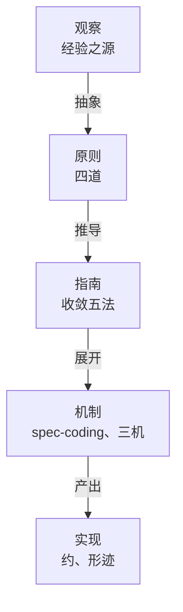
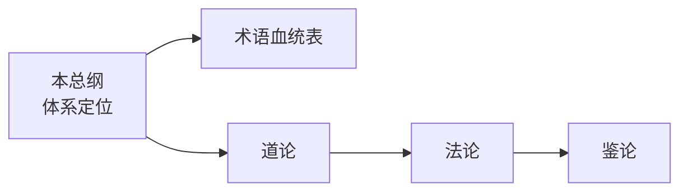

# 司衡哲学总纲

> 司衡（SiHankor）：基于道家思想的代码工程治理体系。以四道为根本原则，以收敛五法为方法论指南，以鉴为反推检验之衡器，承认治理自身也不完备。

## 一、体系定位

### 1.1 司衡是什么

司衡是基于道家思想的代码工程治理体系。其内核是一套可检验的设计原则：以四道为根本原则，以收敛五法为方法论指南，以鉴为反推检验之衡器。治理不是外加于代码工程的统治者，而是代码工程自己长出来的收敛机制。

司衡区别于一切"声称自己完备"的治理框架的根本特征在于：它承认治理自身也受道的约束。一个承认自己可能出错的治理引擎，比一个声称自己永远正确的治理引擎更值得信任。

### 1.2 司衡不是什么

司衡不是被发现的自然定律。四道不是宇宙本体论，而是代码工程的工程必要性：在经验约束下被建构、经反推检验确立的有效框架。道的约束力来自验证与外部锚定，而非先验本体论声称。

正因如此，司衡不声称自己掌握了不可修正的终极真理。道的发现是渐进的、可错的：被确立的道仍可能在后续反推中被校准。

### 1.3 认识论立场

司衡的认识论立场是融贯论为主，外部锚定为辅。

融贯论为主：体系内部概念相互支撑。四道之间构成闭合因果循环，每一道都可被反推检验、设定可证伪条件。概念间的相互支撑使体系自洽，但融贯本身不足以保证体系不沦为自指修辞。

外部锚定为辅：道一、道三、道四分别锚定到外部科学定律（详见第四节）。外部锚定使体系的权威不全来自内部融贯，部分来自体系之外已被确立的科学成果。这是司衡与旧体系的根本区别：旧体系所有权威都是自我确立的，新体系显式声明外部锚定。

### 1.4 鉴的认识论地位

鉴是认识论之衡器，负责反推检验与可证伪性判定。但必须诚实声明：鉴不是"被发现的真理工具"，而是在经验约束下被建构的反推检验框架，其有效性有待外部验证。

鉴的区分力已在内部检验中初步显现：五维天道 21 条子主张经鉴检验，**0** 条完好幸存。但内部成功不等于外部验证。在外部独立验证完成之前，鉴的地位是 constructed-framework（建构框架），不是经验已证实的工具。

## 二、术语血统

> 本节简要引原文追溯七个核心术语的道家源出。详细考证见[《司衡术语血统表》](./SiHankor-Terminology-Lineage.sih.md)。

司衡七个核心术语均为道家血统：五个直接引《道德经》《庄子》原文（自然、知止、损补、顺因、鉴），两个为道家义理延伸概念（顺势、有度）。无一儒法家源头，无一自造。此前"60% 儒法家、20% 道家、20% 自造"的误判经严格考证不成立。

### 2.1 自然

《道德经》第25章"道法自然"、第64章"以辅万物之自然而不敢为"。"自然"非今义之"大自然"，乃"自-然"：自己如此、自发如是。司衡取"自发发散"义，对应代码工程中无规约时的默认发散趋势。与原义关系：延伸。

### 2.2 知止

《道德经》第32章"知止所以不殆"、第44章"知止不殆"；《庄子》庚桑楚"知止乎其所不能知，至矣"。原义为知边界而不殆。司衡取"治理力度应有边界"义。与原义关系：保留。《道德经》《庄子》使用"知止"均先于儒家《大学》。

### 2.3 损补

《道德经》第77章"天之道，损有余而补不足"。原义为天道减损有余以补充不足。司衡取"规则增减应平衡"义，化为规则层面的去冗补缺。与原义关系：保留，原义几乎平移。

### 2.4 顺因

《庄子》养生主"依乎天理，批大郤，导大窾，因其固然"。原义为因势利导，顺物之自然结构而行。司衡取"顺"字之顺循义，从物之固然结构延伸为事之因果次序：意图先于规范，规范先于实现。与原义关系：延伸。

### 2.5 顺势

道家延伸概念，文本根于《道德经》第8章"上善若水。水善利万物而不争"。"顺势"作为固定词组不见于先秦原典，乃道家义理延伸。司衡将"循规律行事"之通则限定为治理节奏：早期宽松以护探索，后期严格以护稳定。与原义关系：限定。

### 2.6 有度

道家延伸概念，根于《道德经》第48章"为学日益，为道日损，损之又损，以至于无为"。"有度"作为固定词组不见于原典，乃道家义理延伸。"为道日损"显化"度"之收敛义，"为之有度"与"无为"一脉相承。与原义关系：延伸。

### 2.7 鉴

《道德经》第10章"涤除玄鉴，能无疵乎"、第54章"以身观身，以家观家"。"鉴"即镜，老子认识论核心概念。司衡取"映照反观"义，延伸为反推检验与可证伪性的工程内涵：鉴是衡得以成立的保障。与原义关系：延伸。

## 三、认识论标签制度

> 体系内每条原则、指南和主张必须携带以下标签之一，标注其认识论地位。后续所有文档必须使用本标签制度。

| 标签 | 含义 | 示例 |
| ---- | ---- | ---- |
| external-anchor | 锚定到外部科学定律 | 道一锚定热力学第二定律 |
| empirical-hypothesis | 可证伪的经验假设 | 道一 |
| tautology | 逻辑必然 | 道二 |
| design-corollary | 从其他原则推导 | 道三 |
| constructed-framework | 在经验约束下被建构的有效框架 | 鉴 |

标签使用规则：一条主张可携带多个标签，如道一同时为 empirical-hypothesis 与 external-anchor。标签决定主张的权威来源与可修正门槛：external-anchor 的权威来自体系之外，constructed-framework 的权威来自内部建构且有待外部验证。不允许无标签的主张进入原则层。

## 四、外部锚定声明

> 声明：东方哲学术语和西方科学术语描述同一现象时，两者都算锚定，不存在谁更"标准"的问题。道家用"自-然"描述发散，热力学用"熵增"描述发散，二者描述同一现象，互为锚定。

### 4.1 道一

道一：发散自-然，收敛必-为。标签：empirical-hypothesis + external-anchor。锚定：热力学第二定律。孤立系统熵增即发散自-然，局部熵减需要做功即收敛必-为。

### 4.2 道三

道三：代码自晦，意图必复。标签：external-anchor + design-corollary。锚定：Shannon 信息论。编码有损，故代码无法自明，意图恢复需要额外信息。

### 4.3 道四

道四：规约与实现必有间隙。标签：tautology + external-anchor。锚定：Godel 不完备性定理。足够强的形式系统无法自证一致，故规约无法穷尽全部语义。

### 4.4 道二

道二：意图先于代码。标签：tautology。代码按定义由有意图的主体产出，因果方向不可逆，无需外部锚定。

## 五、结构概览

### 5.1 四层结构

司衡的架构以经验观察为源，向上抽象为原则，向下推导为指南、机制与实现。观察是经验之源，四层架构为原则、指南、机制、实现。此结构将旧六层脉络（道法术几约形迹）压缩为四层，以观察取代元的构成性条件功能。

各层定位：

- **观察**：代码工程世界的经验观察。发散自-然的显现、意图先于代码的事实、代码自晦的现象。观察是道得以显现的发生场。
- **原则（四道）**：从观察抽象而出的工程必要性。道一发散自-然收敛必-为、道二意图先于代码、道三代码自晦意图必复、道四规约与实现必有间隙。四道各携带认识论标签与外部锚定声明。
- **指南（收敛五法）**：从道自然生出的方法论原则。顺因、有度、知止、损补、顺势。遵循五法则合道，违逆则违道。
- **机制**：指南的工程化展开。spec-coding 将意图显式化为可验证规范；三机（方圆机 iCT、消息机 iWW、明晰机 iCL）各司规、司驱、司判，各有主权。
- **实现**：可观测的产物。约（符约 SymBrief、文约 DocBrief）从博返约压缩信息；形迹（文档、代码、索引）为道之显化。

### 5.2 道家叙事为主，锚定声明为辅

体系的叙事语言是道家的。道、自然、知止、损补、顺因、顺势、有度、鉴：这些术语承载体系的核心义理，是主叙事。外部锚定声明（第四节）是补充：它声明道的部分主张在体系之外有对应物，但不取代道家叙事的主导地位。

旧体系曾因美学选择删除外部锚定，导致审阅者误诊为"没有外部锚点"。新总纲把外部锚定写回来，但以锚定声明的形式呈现，不引入西方科学术语作为主叙事语言。

### 5.3 文档间引用关系

核心文档：本总纲为体系定位入口，首次接触建立全貌。术语血统表考证七个核心术语的道家源出。道论系统阐述四道、推导记录与可证伪条件。法论阐述收敛五法、生命周期治理与文档目录治理。鉴论阐述反推九段式、诗与理区分与可证伪条件。

## 附录

### DEPS

- 260627-1000-sihankor-terminology-lineage
  - 术语血统表，本总纲第二节引用其考证
  - [司衡术语血统表](./SiHankor-Terminology-Lineage.sih.md)

### SEE-ALSO

- 240602-0900-on-sihankor
  - 旧总纲（已归档），本总纲的前身
  - [司衡论](../../../archive/philosophy-v1/On-SiHankor.sih.md)
- 260613-1728-arche-the-one-above-being
  - 元论（已归档），观察层吸收其构成性条件功能
  - [元](../../../archive/philosophy-v1/Arche-The-One-Above-Being.sih.md)
- 260626-2200-sihankor-reconstruction
  - 重建规格书，认识论标签制度的来源
  - [司衡体系重建规格书](../SiHankor-Reconstruction-Spec.md)
