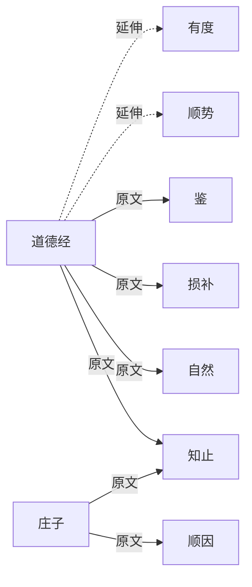

# 司衡术语血统表

> 术层参照文档。逐一引原文追溯司衡七个核心术语的道家源出，证明血统纯正。
> 法层术语定义见 glossary/zh.yml 与[《司衡法论》](./On-SiHankor-Canon.sih.md)。

## 一、背景与目的

此前司衡术语血统曾被误判为"60% 儒法家、20% 道家、20% 自造"。经严格考证，全部核心术语均为道家血统：直接引自《道德经》《庄子》原文，或为道家义理的延伸概念，无一自造、无一儒法家源头。

**本文以原文为证，逐一追溯七个核心术语的血统，并标注司衡用法与原义的关系（保留/延伸/限定）。**

### 1.1 判定原则

血统判定遵循三条规则：

- 引原文：必须有经典原文可引，不接受孤证或后人转述
- 辨源流：明确该概念在思想史上的首发经典，排除后世借用造成的血统混淆
- 定关系：标注司衡用法对原义的继承方式（保留/延伸/限定）

### 1.2 术语清单

七个核心术语：自然、知止、损补、顺因、顺势、有度、鉴。其中顺因、有度、知止、损补、顺势属"收敛五法"（见 glossary 法条），自然为道层发散之然，鉴为认识论之衡器。

## 二、术语血统详表

### 2.1 自然

| 维度 | 内容 |
| ---- | ---- |
| 来源经典（引原文） | 《道德经》"道法自然"；"以辅万物之自然而不敢为" |
| 原文出处 | 道德经第25章、第64章 |
| 原义 | 万物自发运行的状态，非外力强制之所然 |
| 司衡用法 | 代码工程的默认发散趋势 |
| 与原义关系 | 延伸：义核（自发、非强制）保留，延伸至代码工程 |

"自然"非今义之"大自然"，乃"自-然"：自己如此、自发如是。第25章"道法自然"以自然为道之所法；第64章"以辅万物之自然而不敢为"明确以自然为万物自发之运行。司衡取"自发发散"义，对应代码工程中无规约时的默认发散趋势。

### 2.2 知止

| 维度 | 内容 |
| ---- | ---- |
| 来源经典（引原文） | 《道德经》第32章"始制有名，名亦既有，夫亦将知止；知止所以不殆"；第44章"故知足不辱，知止不殆，可以长久"；《庄子》庚桑楚"知止乎其所不能知，至矣" |
| 原文出处 | 道德经第32章、第44章；《庄子》庚桑楚 |
| 原义 | 知道在哪里停止，知边界而不殆 |
| 司衡用法 | 治理力度应有边界 |
| 与原义关系 | 保留：义核（知边界而止）未变，仅领域迁移 |

血统归属要点：《道德经》（春秋末）、《庄子》（战国中）使用"知止"均先于儒家《大学》"知止而后有定"（一般认为成书于战国末至汉初）。故"知止"非儒家首创，血统归道家。第32章王弼本作"知止所以不殆"，他本作"知止可以不殆"，义同。

### 2.3 损补

| 维度 | 内容 |
| ---- | ---- |
| 来源经典（引原文） | 《道德经》第77章"天之道，损有余而补不足" |
| 原文出处 | 道德经第77章 |
| 原义 | 天道减损有余以补充不足，自然之均衡机制 |
| 司衡用法 | 规则增减应平衡 |
| 与原义关系 | 保留：原义几乎平移，损有余补不足直接对应规则增减 |

第77章以"天之道"立均衡之则："损有余而补不足"，与"人之道，损不足以奉有余"对举。司衡取其均衡调节义，化为规则层面的去冗补缺。

### 2.4 顺因

| 维度 | 内容 |
| ---- | ---- |
| 来源经典（引原文） | 《庄子》养生主"依乎天理，批大郤，导大窾，因其固然" |
| 原文出处 | 《庄子》养生主（庖丁解牛） |
| 原义 | 因势利导，顺物之自然结构而行 |
| 司衡用法 | 遵循因果方向 |
| 与原义关系 | 延伸：从"因其固然"（物之结构）延伸为"顺因果方向"（事之次序） |

庖丁解牛"因其固然"，因牛之天然腠理而运刀，无厚入有间。司衡取"因"字之顺循义，将其从物之固然结构延伸为事之因果次序：意图先于规范，规范先于实现，逆因果方向即为违道。

### 2.5 顺势

| 维度 | 内容 |
| ---- | ---- |
| 来源经典（引原文） | 道家延伸概念。文本根于《道德经》第8章"上善若水。水善利万物而不争" |
| 原文出处 | 道德经第8章（文本根） |
| 原义 | 主动认知并遵循事物发展的客观规律（道与自然）去行事 |
| 司衡用法 | 治理随项目演进 |
| 与原义关系 | 限定：通则性原义限定为治理节奏的具体应用 |

"顺势"作为固定词组不见于先秦原典，乃道家义理的延伸概念。其文本根在第8章"上善若水"：水顺势而下、利万物不争，是循客观规律行事的物化隐喻。司衡将"循规律行事"之通则限定为治理节奏：早期宽松以护探索，后期严格以护稳定。

### 2.6 有度

| 维度 | 内容 |
| ---- | ---- |
| 来源经典（引原文） | 道家延伸概念。根于《道德经》"无为"传统：第48章"为学日益，为道日损，损之又损，以至于无为"；与第44章"知止不殆"同源 |
| 原文出处 | 道德经第48章、第44章（义理同源） |
| 原义 | 道度一体，凡事皆有度；"为之有度"与"无为"一脉相承 |
| 司衡用法 | 恰到好处的治理原则 |
| 与原义关系 | 延伸：哲学原则延伸为治理原则 |

"有度"作为固定词组不见于原典，乃道家义理延伸。第48章"为道日损"显化"度"之收敛义：损之有度以至于无为，"为之有度"与"无为"一脉相承。与知止的关系：知止是行动指令（在哪里停止），有度是哲学原则（凡事皆有度），知止是有度在具体行动上的体现。

### 2.7 鉴

| 维度 | 内容 |
| ---- | ---- |
| 来源经典（引原文） | 《道德经》第10章"涤除玄鉴，能无疵乎"；第54章"以身观身，以家观家，以乡观乡，以邦观邦，以天下观天下" |
| 原文出处 | 道德经第10章、第54章 |
| 原义 | 反观、映照的认识论工具 |
| 司衡用法 | 反推检验、可证伪性的工程内涵 |
| 与原义关系 | 延伸：认识论之"映照"延伸为工程之"反推可证伪" |

"鉴"即镜，老子认识论核心概念。第10章"涤除玄鉴"以心为镜，涤除尘蔽以映照大道（"玄鉴"帛书本读法，他本作"玄览"，义通映照）；第54章"以身观身"以观为鉴，层层反观。司衡取"映照反观"义，延伸为反推检验与可证伪性的工程内涵：鉴是衡得以成立的保障。

## 三、血统总览

七个核心术语的血统源出关系如下图。实线"原文"表示术语概念直接见于原典原文，虚线"延伸"表示术语为道家义理的延伸概念。

血统归属一览：

| 术语 | 血统源头 | 关系 |
| ---- | ---- | ---- |
| 自然 | 道德经 | 延伸 |
| 知止 | 道德经、庄子 | 保留 |
| 损补 | 道德经 | 保留 |
| 顺因 | 庄子 | 延伸 |
| 顺势 | 道家（道德经为文本根） | 限定 |
| 有度 | 道家（道德经为义理根） | 延伸 |
| 鉴 | 道德经 | 延伸 |

结论：七个核心术语中，五个直接引《道德经》《庄子》原文（自然、知止、损补、顺因、鉴），两个为道家义理延伸概念（顺势、有度），均无儒法家源头、无自造。原误判"60% 儒法家、20% 道家、20% 自造"不成立，道家血统纯正。

## 附录

### SEE-ALSO

- 240610-1030-on-sihankor-canon
  - 法层术语定义，收敛五法授权源头
  - [司衡法论](./On-SiHankor-Canon.sih.md)
- 240602-1000-on-sihankor-assay
  - 鉴论，鉴之认识论展开
  - [司衡鉴论](./On-SiHankor-Assay.sih.md)
- glossary/zh.yml
  - 源语言权威术语定义
  - [术语表](../../../glossary/zh.yml)
