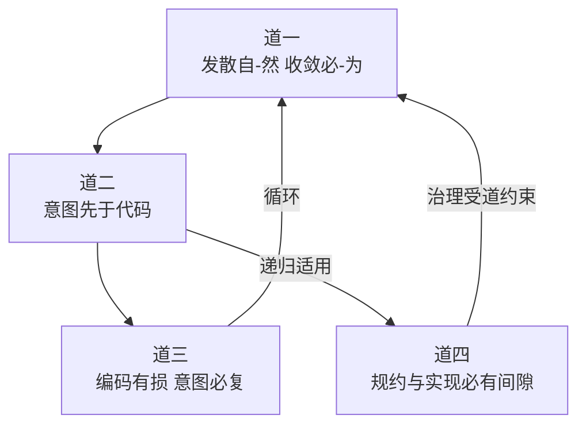

# 司衡道论

> 道者，代码工程之工程必要性也。四道非宇宙本体论，乃经验约束下被建构、经反推检验确立的有效原则。道之约束力来自验证与外部锚定，非先验声称。本文逐条阐述四道：陈述、认识论标签、锚定声明、适用边界、可证伪条件、推导关系。

## 导言

### 四道定位

四道是司衡体系的原则层，从代码工程世界的经验观察抽象而出。四道回答四个根本问题：

- 道一：为什么代码工程需要治理？发散自-然，收敛必-为
- 道二：代码从哪里来？意图先于代码，因果方向不可逆
- 道三：为什么维护代码如此困难？凡编码皆为意图之有损编码
- 道四：为什么治理者也会出错？规约与实现必有间隙

前三道形成生产与消费的闭合循环，道四将同一工程必要性递归应用于治理者自身。

### 本文结构

每条道包含六个组成部分。陈述：道用道家术语声称了什么。认识论标签：主张的权威来源与可修正门槛。锚定声明：与外部科学定律的对应关系。适用边界：在什么条件下成立或不成立。可证伪条件：什么证据能推翻这条道，并检查可触发性。推导关系：从哪条观察推导，推导到哪条指南。

### 认识论标签

本文使用以下标签，定义见[《司衡哲学总纲》第三节](./SiHankor-Philosophy.sih.md)：

| 标签 | 含义 |
| ---- | ---- |
| external-anchor | 锚定到外部科学定律 |
| empirical-hypothesis | 可证伪的经验假设 |
| tautology | 逻辑必然 |
| design-corollary | 从其他原则推导 |

一条主张可携带多个标签。标签决定主张的权威来源与可修正门槛：external-anchor 的权威来自体系之外，design-corollary 的权威来自上游原则的担保。

## 道一：发散自-然，收敛必-为

### 陈述

发散是代码工程在多认知源、无治理干预条件下的自-然趋势。发散自己如此发生，不需人推动：每个认知源的理解天然发散，每个方案的探索天然发散，设计空间无限。收敛不是默认方向，必-为：需要外部、系统、持续的治理力量介入。治理是收敛的构成性条件，无治理则无收敛。

**自-然**：自己如此，描述性，发散不需人推动即发生。**必-为**：必须人为，规范性，收敛须有人主动去做。两个概念的关键区分在于：自-然是描述性的"是"，必-为是规范性的"应该"。

发散在代码工程中以四种形态持续涌现：理解发散、方案发散、实现发散、演进发散。四种形态共享同一根源：多认知源在无治理干预下的独立运作。从理解到演进，发散的破坏力逐步扩大。

### 认识论标签

external-anchor。道一的权威来自体系之外已被确立的科学定律，其约束力不由司衡内部融贯单独担保。

### 锚定声明

锚定热力学第二定律。孤立系统熵增即发散自-然，开放系统局部熵减需要做功即收敛必-为。二者描述同一现象，互为锚定。

### 适用边界

成立条件：多认知源、长生存期、无治理干预的代码工程。认知源越多、生存期越长，发散越剧烈。

弱化条件：单人短期项目、固定模板的重复任务。此时发散压力极低，甚至可能产出方差为零。这不是反驳道一，而是道一的条件依赖性：自-然描述的是"自己发生"的机制，不承诺"在所有条件下等强度发生"。这一条件依赖性为顺势之法提供了道层根基：治理力度应随条件适配而非一成不变。

### 可证伪条件

条件：找到一种代码产出过程，在无协调约束条件下产出方差为零。

可触发性检查：此条件可触发。单人、单模型、固定模板的重复任务可能产出方差为零。当此条件在单认知源场景中被触发时，它揭示的是道一的适用边界，而非道一在多认知源场景中的失效。在多认知源场景中，此条件仍构成有效性检验的门槛：若发现多认知源、无协调约束条件下方差持续为零的案例，则道一被推翻。

截至目前，多认知源场景中无一被满足。

### 推导关系

上游：从"多认知源无治理干预下的发散现象"这一经验观察抽象而出。

下游：推导至四条指南。顺势：发散强度随条件变化，治理力度应适配。有度：收敛必须恰到好处，过犹不及。知止：不是所有发散都需要遏制。损补：发散不均匀，需定向治理。

## 道二：意图先于代码，因果方向不可逆

### 陈述

凡代码被写出之前，写者必先有意。即使最草率之抄录，背后亦有"我需此功能"之意。意图到代码的因果方向不可逆：不存在"先有代码后有意图"的工程场景。即使随机生成代码而后理解之，理解的瞬间意图已被赋予，而代码被产生时仍有一意："我想看看随机代码能做什么"。

道二确立的是因果方向：意图->代码。一个重要区分："意图应被显式化"是法层的规范性建议，不是道层本身。道二只说意图在因果上先于代码，不说意图必须写成文档。写成文档是法层的选择：一个合道的选择，但仍然是一个选择。

### 认识论标签

design-corollary。道二从道三推导，范围由"代码是有意图的产出"这一定义限定。若代码按定义由有意图的主体产出，则意图先于代码是定义的推论。

### 锚定声明

无直接外部锚定。与热力学时间箭头有结构相似性：因果方向不可逆，如同时间之矢不可反转。此相似性不构成锚定，仅为结构类比。

### 适用边界

成立条件：所有被定义为"有意图之产出"的代码。只要代码由有意图的主体产出，意图先于代码即成立。

不适用条件：若将"代码"重新定义为不含意图的自然产物，则道二不适用。但在代码工程领域，此重新定义无意义。

### 可证伪条件

不可证伪。道二是设计推论，其有效性由道三和定义担保，不由经验证据检验。

### 推导关系

上游：从道三推导。道三声称"凡编码皆为意图之有损编码"，这预设了意图的存在与在先。道二将这一预设显式化。

下游：推导至顺因。因果方向不可逆，意图先于代码，故治理应顺因果方向而行：意图先于规范，规范先于实现。逆因果方向的操作是违道的。

## 道三：凡编码皆为意图之有损编码

### 陈述

凡将意图编码为符号的过程，不可避免丢失意图之部分信息。代码作为符号系统，其含义天然非自明：此即自晦。故维护之前必先恢复意图：恢复是维护的因果前提，此即意图必复。

自晦不是代码质量问题，而是符号系统的客观属性。好的命名、清晰的结构能降低理解成本，但不能消除它：编码不可能无损。自晦的程度可以降低，但自晦本身不能消除，因为编码的本质是有损映射。

### 认识论标签

external-anchor。道三的权威来自体系之外已被确立的数学定理，其约束力不由司衡内部融贯单独担保。

### 锚定声明

锚定 Shannon 信息论（Shannon 1948）。编码过程必然丢失相对于原始意图的信息，故代码无法自明，意图恢复需要额外信息。

### 适用边界

成立条件：所有将意图编码为符号的过程。无论编码者技艺多高、工具多强，有损性不可避免。

不适用条件：无。道三是数学定理的工程映射，在定义域内无条件成立。

### 可证伪条件

不可证伪。道三是数学定理的工程映射，其有效性由数学证明担保，不由经验证据检验。发现"编码=意图"的无损编码方式等价于推翻数学定理本身。

### 推导关系

上游：从"代码无法自明意图"的经验观察抽象而出。维护者面对代码，意图不可见，必须主动恢复：这一现象被追溯至编码有损的符号系统属性。

下游：推导至顺因。维护前必须恢复意图，故治理应顺因果方向：先恢复意图，再维护代码，不可跳过意图恢复而直接操作代码。

## 道四：规约与实现必有间隙

### 陈述

道四含两个子主张。

**道四a**：任何有限规约无法穷尽全部语义意图。规约是意图的有损编码，实现对规约同样有损，形成"意图->规约->实现"之双重有损链。规约永无法完美捕获全部语义意图，实现永无法完美匹配规约。

**道四b**：治理与实践的间隙随时间增大，且增大速率与规则数量正相关。规则越多，未覆盖的语义越多，间隙扩张越快。

道四不否定治理的有效性，它否定的是治理的绝对正确性。一个承认自己可能出错的治理引擎，比一个声称自己永远正确的治理引擎更值得信任。

### 认识论标签

道四a：tautology。任何有限规约无法穷尽全部语义意图，这是逻辑必然：有限符号集无法完美表达无限语义空间。

道四b：empirical-hypothesis。治理与实践间隙随时间增大，且增大速率与规则数量正相关。这是可证伪的经验假设，需要纵向数据检验。

### 锚定声明

锚定 Godel 不完备性定理：足够强的形式系统无法自证一致，故规约无法穷尽全部语义。此锚定担保道四a，道四b的经验趋势在此数学基础上延伸。

### 适用边界

道四a成立条件：所有有限规约。无论规约多详尽，语义间隙随确认粒度缩小但不可归零。道四a不适用条件：无。重言式在定义域内无条件成立。

道四b成立条件：规则持续积累、缺乏定期修剪的治理系统。规则越多、生存期越长，间隙增大越显著。道四b弱化条件：新建立的治理系统（规则少、生存期短），或积极执行损补的治理系统（规则定期修剪、间隙定期修正）。此时间隙可能暂时稳定或缩小。

### 可证伪条件

道四a不可证伪。重言式不由经验证据检验。最强反例"够简单的规约可以完美"已被驳回：即使最简单的规约也有未覆盖语义（"name 用什么编码？是否允许空字符串？长度上限？"）。

道四b可证伪。条件：治理与实践间隙不随时间增大，即间隙保持恒定或缩小。

可触发性检查：此条件可触发，但需要长期数据。需通过纵向审计，在多个时间点测量治理与实践间隙，观察其变化趋势。若多个项目的纵向数据一致显示间隙不增大，则道四b被推翻。由于需要长期积累，此检验的触发周期较长，但条件本身在现实中可被满足。

### 推导关系

上游：从"治理自身亦为符号系统"的自我指涉观察推导。道二说"意图->代码"有损，道三说"编码有损"。道四将道二与道三递归应用于治理者自身：治理意图->治理规约->治理实现同样有损。

下游：推导至两条指南。知止：治理有盲区，不可声称完备。损补：间隙需持续修正，规则增减应平衡。

## 四道关系

### 整体结构

四道构成闭合因果循环加自我指涉。前三道形成生产与消费的闭合环，道四作为自我指涉轴，将同一工程必要性递归应用于治理自身。

### 生产与消费闭合环

前三道形成完整的因果循环。意图发散（道一）：多认知源产生不同意图。有损编码（道二）：意图被编码为代码，信息丢失。代码自晦（道三）：维护者面对代码，意图不可见，必须恢复。意图恢复后继续发散（道一）：恢复的意图与原始意图不同，产生新的发散。

此循环非恶性循环。治理在循环的每个节点上实施干预：减缓发散、降低有损程度、辅助意图恢复。

### 自我指涉轴

道四独立于循环之外，作用于循环的每一个环节。治理的收敛力本身也可能发散（对道一的递归），治理意图到治理规约同样有损（对道二的递归），治理规约也自晦（对道三的递归）。

### 四道的完整性

四道缺一不可。没有道一，无法解释为何需要治理。没有道二，无法解释代码从何而来。没有道三，无法解释维护为何困难。没有道四，无法解释治理者为何也会出错：治理者就会滑向声称自己永远正确。

## 附录

### DEPS

- 260627-1030-sihankor-philosophy
  - 哲学总纲，认识论标签制度与外部锚定声明的授权源头
  - [司衡哲学总纲](./SiHankor-Philosophy.sih.md)
- 260627-1000-sihankor-terminology-lineage
  - 术语血统表，核心术语的道家源出考证
  - [司衡术语血统表](./SiHankor-Terminology-Lineage.sih.md)

### SEE-ALSO

- 240602-0930-on-sihankor-tao
  - 旧道论（已归档），本文的前身
  - [司衡道论](../../../archive/philosophy-v1/On-SiHankor-Tao.sih.md)
- 240602-1000-on-sihankor-assay
  - 鉴论，道层主张的反推检验
  - [司衡鉴论](./On-SiHankor-Assay.sih.md)
